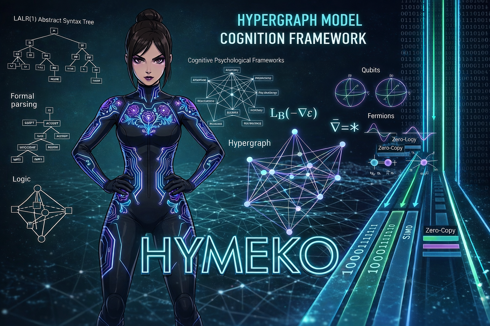

# Hypergraph Model Cognition Framework (HyMeKo) Framework


Hypergraph Model Cognition Framework is a high-performance Rust-based parsing and hypergraph framework for HyMeKo - a domain-specific language (DSL) designed for declarative hypergraph structure definition, manipulation, and analysis.


[](https://codecov.io/github/kyberszittya/hymeko_framework_rust)

## 📚 Table of Contents

- [Overview](#overview)
- [Architecture](#-architecture)
- [Hypergraph Support](#hypergraph-support)
- [Query-Driven Transforms](#-query-driven-transforms)
- [Features](#features)
- [Quick Start](#quick-start)
- [SOTA snapshot (link prediction)](docs/SOTA_RESULTS.md)
- [Handbook (mdBook source)](docs/book/src/SUMMARY.md)
- [Deploy handbook to GitHub Pages](docs/DEPLOY_GITHUB_PAGES.md)
- [Project Structure](#project-structure)
- [Parser Layout FAQ](#-parser-layout-faq)
- [Development](#development)
- [Building](#building)
- [Testing](#testing)
- [Benchmark Harnesses](#-benchmark-harnesses)
- [CI/CD Pipeline](#cicd-pipeline)
- [Changelog](#-changelog)
- [Contributing](#contributing)
- [License](#license)

## 🌟 Overview

Hymeko Framework is a comprehensive Rust-based framework for parsing, analyzing, and manipulating hypergraphs. Built with:

- **LALRPOP** - A LR(1) parser generator for Rust
- **Blake3** - Fast cryptographic hashing for node identification
- **Unicode Support** - Full Unicode lexing and parsing
- **Hypergraph IR** - Specialized intermediate representation for hypergraph structures

The framework provides a complete pipeline from lexical analysis through intermediate representation (IR) to final hypergraph output, with comprehensive testing and validation at each stage.

### Core Components

- **Lexer** (`src/lexer/`) - Tokenization with SIMD acceleration for hypergraph syntax
- **Parser** (`hymeko/parser/src/`) - Grammar-based parsing with LALRPOP for hypergraph definitions
- **Hypergraph IR** (`src/ir/`) - Specialized intermediate representation for hypergraph structures and transformations
- **Resolver** (`src/resolve.rs`) - Symbol resolution and node/edge validation in hypergraph context
- **Index** (`src/resolve.rs`) - Symbol and path indexing for efficient hypergraph lookup



## 🧱 Architecture

High-level control-plane and data-plane interactions are documented in [`architecture/README.md`](architecture/README.md), which renders the Mermaid diagrams from `architecture/overview.mermaid`. Use that page to keep the operational flows in sync with the rapidly evolving code.

## 🕸️ Hypergraph Support

Hymeko Framework provides native support for hypergraph structures:

### Hypergraph Concepts
- **Nodes** - Vertices in the hypergraph, identified by hierarchical paths
- **Hyperedges** - Edges connecting multiple nodes (not limited to pairs like traditional edges)
- **Hierarchical Organization** - Nested node structures with parent-child relationships
- **Sibling Relationships** - Multiple children organized as sibling chains
- **Path-based References** - Unique identification of nodes through dot-separated paths

### Hypergraph Operations
- **Node Creation & Manipulation** - Define and organize hypergraph nodes
- **Edge Definition** - Create hyperedges connecting arbitrary numbers of nodes
- **Hierarchical Queries** - Traverse parent-child and sibling relationships
- **Path Resolution** - Resolve node references through hierarchical paths
- **Structure Validation** - Ensure hypergraph integrity and consistency

## 🔁 Query-Driven Transforms

HyMeKo turns a compiled hypergraph into any text-based output — URDF,
SDF, MJCF, Graphviz DOT, a ROS 2 launch file, or a format you invent —
through a **query + template** pair. No Rust code, no recompile.

```
transforms/<name>/
├── queries.hymeko       what to find in the graph
└── template.<ext>       how to write the output
```

Run:

```bash
hymeko transform robot.hymeko -t urdf -o robot.urdf --name my_robot
```

Or from the REPL:

```
hymeko [robot]> tf urdf robot.urdf
hymeko [robot]> tdir                 # list available transforms
```

### Pipeline

```
  your.hymeko ─► compile ─► IR ─┐
                                │
    queries.hymeko ─► parse ─► Predicate tree
                                │                 │
                                └─► QueryEngine ──┴─► HashMap<label, matches>
                                                            │
    template.<ext>  ─► parse template ─► render ────────────┘
                                                            │
                                                            ▼
                                                       output string
```

Three well-separated layers keep the engine domain-neutral:

| Layer | Module | Knows about |
|-------|--------|-------------|
| 1 — Query engine | `hymeko_query::{engine, predicate, interpret}` | Hypergraph IR, predicates |
| 2 — Rewrite engine | `hymeko_query::rewrite::{template, match_context}` | Matching, field extraction, templates |
| 3 — Transform specs | `transforms/<name>/` (external files) | URDF / SDF / MJCF / DOT / … |

### Query file format

A query file is a HyMeKo description that groups pattern queries inside
a `context` block:

```
my_transform {}
context
{
    links:             link          {}
    @fixed_joints:     fixed_joint   {}
    @revolute_joints:  rev_joint     {}
    heavy_parts:       link { mass <gt> 5.0; }
}
```

- `<name>_transform {}` — required header (the parser needs a top-level
  description).
- `context { … }` — every child becomes one named query.
- The **leading identifier is the label** used from the template; it is
  not a name filter. `links: link {}` means "any node inheriting from
  `link`, labelled `links`".
- `@` prefix selects edges. Joints are edges in HyMeKo, so joint queries
  must use `@`.
- Nested blocks become containment constraints; `<gt>`, `<lt>`, `<gte>`,
  `<lte>`, `<eq>`, `<ne>` on a value become numeric comparisons.

### Template file format

A template is plain text (any extension, any target syntax) with
`{{tags}}` interpolated in. Five kinds of construct:

**1. Literal text** — anything outside `{{…}}` is emitted verbatim.

**2. Interpolation** — `{{expr}}` resolves against the current match:

| Tag | Yields |
|-----|--------|
| `{{name}}` | Matched decl's resolved name |
| `{{kind}}` | `node` / `edge` / `arc` |
| `{{depth}}` · `{{id}}` | Depth in decl tree · internal DeclId |
| `{{field:mass}}` | Child named `mass` — its value |
| `{{field:link_geometry.dimension}}` | Dotted path through children |
| `{{field:color}}` | Follows references (e.g. `color -> link_color`) |
| `{{bind:+:0}}` | First `+` arc-binding target (parent for joints) |
| `{{bind:-:0}}` | First `-` arc-binding target (child for joints) |
| `{{bind:-:all}}` | All `-` bindings, space-separated |
| `{{config:robot_name}}` | Value from config map (`--name`, etc.) |

Missing fields render as empty strings. List values (`[0.1, 0.2, 0.3]`)
render as `"0.1 0.2 0.3"`.

**3. Iteration** — `{{#each label}} … {{/each}}` loops over every match
of the named query. `label` must match a query label from the
`context` block.

```xml
{{#each links}}
  <link name="{{name}}"/>
{{/each}}
```

**4. Conditional** — `{{#if expr}} … {{/if}}` emits the block only when
the expression resolves to a non-empty string.

```xml
{{#if field:mass}}
  <inertial><mass value="{{field:mass}}"/></inertial>
{{/if}}
```

**5. Comment** — `{{#comment}} … {{/comment}}` is stripped from output.

### Worked example — the shipped URDF template

`transforms/urdf/queries.hymeko`:

```
urdf_transform {}
context
{
    links:             link          {}
    @fixed_joints:     fixed_joint   {}
    @revolute_joints:  rev_joint     {}
    @continuous_joints: conti_joint  {}
    @prismatic_joints: prismatic_joint {}
    frames:            frame         {}
}
```

`transforms/urdf/template.urdf.xml` (excerpt):

```xml
<?xml version="1.0" encoding="UTF-8"?>
<robot name="{{config:robot_name}}">
{{#each links}}
  <link name="{{name}}">
{{#if field:mass}}
    <inertial><mass value="{{field:mass}}"/></inertial>
{{/if}}
{{#if field:link_geometry}}
    <visual>
{{#if field:origin}}
      <origin xyz="{{field:origin}}" rpy="0 0 0"/>
{{/if}}
      <geometry><cylinder radius="0.05" length="0.1"/></geometry>
    </visual>
{{/if}}
  </link>
{{/each}}

{{#each revolute_joints}}
  <joint name="{{name}}" type="revolute">
    <parent link="{{bind:+:0}}"/>
    <child  link="{{bind:-:0}}"/>
    <axis xyz="0 0 1"/>
    <limit lower="-3.14" upper="3.14" effort="100" velocity="1.0"/>
  </joint>
{{/each}}
</robot>
```

Running
`hymeko transform data/robotics/robot_4wh.hymeko -t urdf --name robot4wh`
emits a valid URDF with every link and joint wired to its parent/child
via the signed arc bindings captured at query time.

### Programmatic use

```rust
use hymeko_query::rewrite::{execute_transform, TransformSpec};
use std::collections::HashMap;

let spec = TransformSpec {
    name: "urdf".into(),
    query_source:    std::fs::read_to_string("transforms/urdf/queries.hymeko")?,
    template_source: std::fs::read_to_string("transforms/urdf/template.urdf.xml")?,
};

let mut config = HashMap::new();
config.insert("robot_name".into(), "my_robot".into());

let urdf = execute_transform(&compiled.ir, &interner, &spec, &config)?;
```

### Shipped transforms

| Directory | Target | Extension |
|-----------|--------|-----------|
| `transforms/urdf/` | ROS/Gazebo URDF | `.urdf` / `.xml` |
| `transforms/sdf/` | Gazebo SDFormat 1.7 | `.sdf` / `.xml` |
| `transforms/mjcf/` | MuJoCo MJCF | `.xml` |
| `transforms/dot/` | Graphviz DOT (visualisation) | `.dot` |
| `transforms/ros2_launch/` | ROS 2 Python launch file | `.launch.py` |

### Further reading

- [`docs/guides/transforms.md`](docs/guides/transforms.md) — step-by-step
  guide for new users writing a first transform (query cheatsheet,
  template cookbook, common-mistakes table).
- [`docs/plans/04_graph_query/T11_rewrite_engine.md`](docs/plans/04_graph_query/T11_rewrite_engine.md) —
  architecture note: data flow, integration decisions, file map,
  capability / roadmap tables.

## ✨ Features

### Hypergraph Capabilities
- **Native hypergraph support** - First-class hypergraph data structures
- **Hierarchical node organization** - Multi-level node hierarchies with parent-child relationships
- **Sibling chain management** - Efficient representation of multiple children
- **Path-based node identification** - Unique paths like `Root.A.B` for node access
- **Multi-node hyperedges** - Edges connecting arbitrary numbers of nodes
- **Graph traversal** - Navigate hypergraph structures efficiently

### Parser Capabilities
- **Grammar-based parsing** with LALRPOP for hypergraph syntax
- **Hierarchical structure support** for nested node declarations
- **Field references** with path-based resolution in hypergraph context
- **Comment handling** including block and inline comments
- **Symbol resolution** and node validation

### Framework Features
- **SIMD lexing** for performance-critical paths
- **Comprehensive IR transformations** for hypergraph optimization
- **Symbol interning** for memory efficiency
- **Hash-based node identification** with Blake3
- **Extensive test coverage** including hypergraph-specific scenarios
- **Fano graph support** - Example complex hypergraph structure

### Quality Assurance
- **Multi-platform testing** (Linux, Windows, macOS)
- **Multi-version testing** (Rust stable & nightly)
- **Automated security audits** (daily)
- **Code coverage tracking**
- **Linting & formatting** checks

## 🚀 Quick Start

### Prerequisites

- **Rust 1.56+** - Download from [https://rustup.rs/](https://rustup.rs/)
- **Cargo** - Comes with Rust
- **Git** - For version control

### Installation

```bash
# Clone the repository
git clone https://github.com/hakiko/hymeko_framework.git
cd hymeko_framework

# Build the project
cargo build --release

# Run tests
cargo test --all

# Run the parser
./target/release/parser --help
```

### First Example

```bash
# Parse a minimal example
./target/release/parser hymeko/parser/data/minimal_examples/minimal_example.hymeko
```

### SOTA snapshot (link prediction)

Mean AUC bar charts (Bitcoin joint vs cycle, Phase‑8 panel, Slashdot `edge_cr` seeds) and citation tables live in **[`docs/SOTA_RESULTS.md`](docs/SOTA_RESULTS.md)**. Evidence rules: [`docs/RESULTS_DISCIPLINE.md`](docs/RESULTS_DISCIPLINE.md). Repo cold start: [`COLD_START.md`](COLD_START.md).

### Handbook (mdBook)

The same material (plus **abbreviations**, **mathematics**, and **artifact indexes**) is collected for humans and agents in the **mdBook** under `docs/book/` — see **`docs/book/src/SUMMARY.md`** part **Results & evidence**.

**Public site:** enable [GitHub Pages](docs/DEPLOY_GITHUB_PAGES.md) (workflow already builds `_site/`). After the first deploy, open the URL GitHub shows under **Settings → Pages**.

```bash
cargo install mdbook   # once, see https://github.com/rust-lang/mdBook
cd docs/book && mdbook build
```

Then open **`docs/book/book/index.html`** in a browser (or `mdbook serve` for live reload).

## 📁 Project Structure

```
hymeko_framework/
├── hymeko/
│   └── parser/                    # Main parser crate
│       ├── src/
│       │   ├── main.rs           # Entry point
│       │   ├── lib.rs            # Library root
│       │   ├── lexer/            # Tokenization
│       │   │   ├── mod.rs
│       │   │   ├── token.rs
│       │   │   ├── cursor.rs
│       │   │   ├── simd.rs
│       │   │   └── simple.rs
│       │   ├── ir/               # Intermediate representation
│       │   │   ├── mod.rs
│       │   │   ├── ir.rs
│       │   │   ├── lower.rs
│       │   │   ├── meta.rs
│       │   │   ├── hash.rs
│       │   │   └── time.rs
│       │   ├── common/           # Common utilities
│       │   │   ├── ids.rs
│       │   │   ├── pathkey.rs
│       │   │   └── mod.rs
│       │   ├── ast.rs            # Abstract syntax tree
│       │   ├── hymeko.lalrpop    # LALRPOP grammar
│       │   ├── intern_pass.rs    # Symbol interning
│       │   ├── interner.rs       # String interning
│       │   └── resolve.rs        # Symbol resolution
│       ├── tests/
│       │   ├── minimal_tests/    # Basic functionality tests
│       │   ├── intermediate_tests/ # IR transformation tests
│       │   └── typical_graphs/   # Graph structure tests
│       ├── data/
│       │   ├── minimal_examples/ # Test data files
│       │   └── typical_graphs/
│       ├── build.rs
│       └── Cargo.toml
├── src/
│   └── main.rs                   # Root package
├── Cargo.toml                    # Workspace manifest
├── Cargo.lock                    # Locked dependencies
└── .github/
    ├── workflows/               # CI/CD pipelines
    └── ISSUE_TEMPLATE/         # Issue templates
```

## 🧭 Parser Layout FAQ
- **Why not move `parser/` to the repository root?** Keeping the LALRPOP crate nested preserves the dedicated workspace members, so Cargo does not leak parser-only features into the top-level engine binary.
- **What about fixtures and build scripts?** The parser crate ships with large `.hymeko` fixtures plus a custom `build.rs`; colocating them keeps relative paths stable across OSes and allows CI to cache `parser/target/` artifacts independently.
- **Does Python tooling depend on this layout?** Yes—`PyHypergraphEngine` resolves parser modules by workspace-relative paths. Moving the crate would break both `ModuleStore` lookups and the Maturin wheels unless every consumer updated import paths simultaneously.

## 🛠️ Development

### Rust crate layout (workspace + `hymeko_kit`)

All `hymeko_*` crates share the **same Cargo workspace** (root `Cargo.toml`): one resolver, shared `target/`, and `[workspace.dependencies]` for common versions.

For binaries or experiments that want **one dependency** instead of many paths, use the optional umbrella crate **`hymeko_kit`**, which re-exports `hymeko` (from `hymeko_core`) and optionally `hymeko_clifford`, `hymeko_compute`, and `hymeko_graph` behind features `clifford`, `gpu`, and `graph` (meta-feature `full` enables all three). See `hymeko_kit/Cargo.toml` and `hymeko_kit/src/lib.rs`.

### Development Environment Setup

```bash
# Install Rust (if not already installed)
curl --proto '=https' --tlsv1.2 -sSf https://sh.rustup.rs | sh

# Clone repository
git clone https://github.com/hakiko/hymeko_framework.git
cd hymeko_framework

# Build in debug mode
cargo build

# Run tests
cargo test --all

# Format code
cargo fmt --all

# Lint code
cargo clippy --all --all-targets
```

### Python ([uv](https://docs.astral.sh/uv/))

The repository root is a **uv workspace** (`pyproject.toml`, `uv.lock`) that installs the `hymeko` and `signedkan-native` packages (Maturin) plus dev tools from `tools.yaml` major ranges.

```bash
# Install uv: https://docs.astral.sh/uv/getting-started/installation/

# Create `.venv/` and install workspace members + dev tools (no PyTorch by default)
uv sync --all-packages

# Optional: PyTorch + NumPy pinned to match `CORE.YAML` (large download)
uv sync --group ml --all-packages

# Optional: editable stub that depends on torch (install after `--group ml`)
uv pip install -e python/ehk_torch_stub
```

### Using Development Scripts

**On Windows (PowerShell):**
```powershell
.\dev.ps1 test      # Run tests
.\dev.ps1 fmt       # Format code
.\dev.ps1 lint      # Run linter
.\dev.ps1 check     # All checks
.\dev.ps1 build     # Build release
.\dev.ps1 help      # Show all commands
```

**On Unix/Linux/macOS (Bash):**
```bash
./dev.sh test       # Run tests
./dev.sh fmt        # Format code
./dev.sh lint       # Run linter
./dev.sh check      # All checks
./dev.sh build      # Build release
./dev.sh help       # Show all commands
```

**Using Make:**
```bash
make test           # Run tests
make fmt            # Format code
make lint           # Run linter
make check          # All checks
make build          # Build release
make help           # Show all commands
```

### Code Quality Standards

All code must meet these standards before merging:

1. **Formatting** - Must pass `cargo fmt --all -- --check`
2. **Linting** - Must pass `cargo clippy --all -- -D warnings`
3. **Testing** - Must pass `cargo test --all`

Run all checks with:
```bash
./dev.sh check      # Unix/macOS
.\dev.ps1 check     # Windows
make check          # Make
```

## 🔨 Building

### Debug Build
```bash
cargo build
# Output: target/debug/parser
```

### Release Build
```bash
cargo build --release
# Output: target/release/parser
```

### Build Documentation
```bash
cargo doc --no-deps --open
```

## 🧪 Testing

### Run All Tests
```bash
cargo test --all
```

### Run Specific Test
```bash
cargo test --lib test_name
```

### Run Tests with Output
```bash
cargo test --all -- --nocapture
```

### Run Tests in Watch Mode
```bash
./dev.sh test-watch
```

### Generate Coverage Report
```bash
./dev.sh coverage
# Output: tarpaulin-report.html
```

## Test Coverage

The project includes comprehensive tests across multiple levels with specific focus on hypergraph structures:

### Unit Tests
- Lexer token generation
- Parser AST construction
- IR transformations for hypergraphs
- Node and edge representation

### Integration Tests
- End-to-end hypergraph parsing
- File I/O operations
- Symbol resolution in hypergraph context
- Hierarchical node relationships

### Hypergraph-Specific Tests
- Hierarchical structure validation
- Sibling chain organization
- Path-based node access
- Parent-child relationship integrity
- Fano graph parsing and traversal
- Multi-node hyperedge handling
- Node and edge indexing

### Example Tests
- Minimal examples validation
- Hierarchical structures with nesting levels
- Field references and resolution
- Comments handling

## 📊 Benchmark Harnesses
- **Parser Grid Sweep:** `python/benches/parsing/grid_expansion_bench.py` sweeps nodes/edges/densities, measures parse plus expansion timings, and writes both summary and raw CSV exports for regression tracking.
  ```powershell
  python python/benches/parsing/grid_expansion_bench.py
  ```
- **COO Tensor Grid Sweep:** `python/benches/coo_tensor/coo_tensor_grid_eval.py` evaluates star and clique expansions end-to-end (parse → extraction → tensor materialization) and records NNZ counts alongside timestamped CSV telemetry.
  ```powershell
  python python/benches/coo_tensor/coo_tensor_grid_eval.py
  ```

## 🤖 CI/CD Pipeline

This project uses GitHub Actions for automated testing and releases. The CI/CD pipeline includes:

### Continuous Integration (CI)
**Triggered:** On every push and pull request

**Runs:**
- Tests on Linux, Windows, macOS
- Tests with Rust stable and nightly
- Code formatting check
- Linting with strict warnings
- Code coverage reporting
- Release build

### Release Workflow
**Triggered:** When a git tag is pushed (e.g., `v0.1.0`)

**Builds and uploads:**
- Linux x86_64 binary
- Windows x86_64 binary
- macOS x86_64 binary

### Security Audit
**Triggered:** Daily and on every push

**Checks:**
- Known CVEs in dependencies
- Security vulnerabilities
- Dependency audits

### Dependency Updates
**Triggered:** Every Monday

**Actions:**
- Updates dependencies
- Runs tests with new versions
- Creates PR if updates available

### Python Packaging Integration

- CI/CD now builds and tests Python packages using maturin.
- Python wheels are uploaded as artifacts and optionally published to PyPI.
- See `hymeko_py` crate and workflow YAML files for details.

### Monitoring Workflows

View all workflow runs at: https://github.com/hakiko/hymeko_framework/actions

For detailed CI/CD documentation, see [`README_CICD.md`](README_CICD.md).

## 📦 Creating a Release

To create a new release:

```bash
# 1. Update version in Cargo.toml files
# 2. Commit changes
git commit -am "chore: bump version to v0.2.0"

# 3. Create and push tag
git tag v0.2.0
git push origin main
git push origin v0.2.0

# GitHub Actions will automatically:
# - Build cross-platform binaries
# - Create a GitHub Release
# - Upload binary artifacts
```

## 📖 Documentation

### Quick References
- **[DEVELOPMENT.md](DEVELOPMENT.md)** - Development workflow guide
- **[README_CICD.md](README_CICD.md)** - CI/CD pipeline documentation
- **[CI_CD_DOCUMENTATION.md](CI_CD_DOCUMENTATION.md)** - Detailed CI/CD info
- **[CI_CD_DOCUMENTATION_INDEX.md](CI_CD_DOCUMENTATION_INDEX.md)** - Documentation index

### Code Documentation
```bash
# Generate and view documentation
cargo doc --no-deps --open
```

## 📝 Changelog
- Root summary lives in [`CHANGELOG.md`](CHANGELOG.md); it mirrors and links to every dated log.
- Consolidated index: see [`docs/changelog/README.md`](docs/changelog/README.md) for the full timeline and links to every dated log.
- **2026-03-06 – Tensor Grid Telemetry & PathID Notes:** COO tensor grid benchmarks, parser layout guidance, captured PathKey/DeclNode hygiene, and Maturin troubleshooting notes. Read [`changelog_20260306.md`](docs/changelog/changelog_20260306.md).
- **2026-03-05 – Serialization & Dataset Push:** Portable CBOR snapshots via `CborPayload`, serde coverage across IR structures, deterministic CSR coalescing, and new math notes plus benchmark fixtures. Read the full entry in [`changelog_20260305.md`](docs/changelog/changelog_20260305.md).
- **2026-03-02 – Cybernetic State Compiler Foundations:** Zero-copy PyO3 bridge, dual-frequency telemetry loop, Hyper-KA formalization, and the publication roadmap. Details in [`changelog_20260302.md`](docs/changelog/changelog_20260302.md).

## 🤝 Contributing

Contributions are welcome! Please follow these guidelines:

### Before Submitting a PR

1. **Format your code:**
   ```bash
   cargo fmt --all
   ```

2. **Run linter:**
   ```bash
   cargo clippy --all --all-targets -- -D warnings
   ```

3. **Run all tests:**
   ```bash
   cargo test --all
   ```

4. **Use development script:**
   ```bash
   ./dev.sh check    # Unix/macOS
   .\dev.ps1 check   # Windows
   make check        # Make
   ```

### Submitting Changes

1. **Fork the repository**
2. **Create a feature branch:**
   ```bash
   git checkout -b feature/my-feature
   ```
3. **Make your changes and commit:**
   ```bash
   git commit -am "feat: add my feature"
   ```
4. **Push to your fork:**
   ```bash
   git push origin feature/my-feature
   ```
5. **Create a Pull Request** with a clear description

### Code Style

- Follow Rust conventions (enforced by rustfmt)
- Write clear, descriptive commit messages
- Add tests for new functionality
- Update documentation as needed
- Keep PRs focused on a single feature/fix

## 🐛 Troubleshooting

### Build Issues

**LALRPOP Parser Generation Errors:**
```bash
cargo clean
cargo build
```

**Dependency Version Conflicts:**
```bash
cargo update
cargo test
```

### Test Failures

**Run with backtrace:**
```bash
RUST_BACKTRACE=1 cargo test --all
```

**Run specific test with output:**
```bash
cargo test --lib test_name -- --nocapture
```

### Performance Issues

**Profile release build:**
```bash
cargo build --release
time ./target/release/parser <input-file>
```

## 📋 Project Status

- **Current Version:** 0.1.0
- **Rust Edition:** 2024
- **License:** [Add your license]
- **Status:** Active Development

## 🔗 Dependencies

### Build Dependencies
- **lalrpop** (>=0.22.2) - LR(1) parser generator

### Runtime Dependencies
- **lalrpop-util** (>=0.22.2) - LR(1) parser runtime (with lexer, unicode features)
- **blake3** (>=1) - Fast cryptographic hashing

## 📞 Support

- **Issue Tracker:** https://github.com/hakiko/hymeko_framework/issues
- **Documentation:** See `/docs` directory
- **CI/CD Help:** See [README_CICD.md](README_CICD.md)

## 🎓 Learning Resources

- [Rust Book](https://doc.rust-lang.org/book/)
- [Cargo Documentation](https://doc.rust-lang.org/cargo/)
- [LALRPOP Documentation](https://lalrpop.github.io/lalrpop/)
- [GitHub Actions Documentation](https://docs.github.com/actions)

## 📝 License

This project is licensed under [Add License Information] - see LICENSE file for details.

## ✨ Acknowledgments

Built with modern Rust tools:
- **Rust** - Systems programming language
- **Cargo** - Rust package manager
- **LALRPOP** - LR(1) parser generator
- **GitHub Actions** - CI/CD platform

---

**Status:** ✅ Ready for Production

**Last Updated:** March 05, 2026

**Maintainers:** Hakiko Development Team

For more information, see [CI_CD_DOCUMENTATION_INDEX.md](CI_CD_DOCUMENTATION_INDEX.md) for a complete documentation index.

