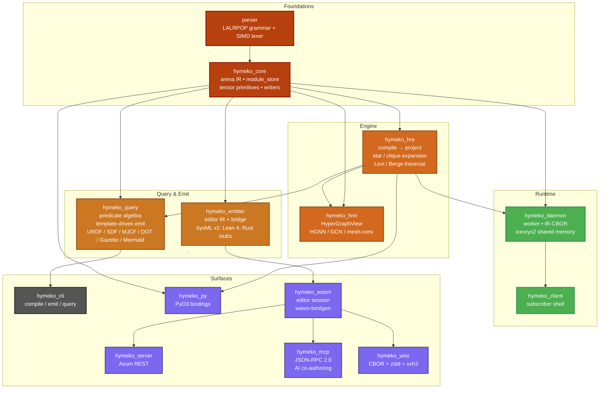

# HyMeKo — A Canonical Hypergraph IR for Multi-Target Code Generation


**HyMeKo** is a research framework that treats multi-target code generation
as a problem over a canonical *signed typed hypergraph intermediate
representation*. One `.hymeko` source denotes one structure $H$; every
target format — URDF, SDF, MJCF, DOT, Gazebo world, Mermaid, SysML v2, …
— is a template-driven projection of the same $H$. Cross-format
invariants that would otherwise require a graph of pair-wise converters
are enforced by construction.

> *On real robot fixtures, the full source-to-six-formats pipeline
> completes in **under one millisecond per robot**.*
> — see the evaluation in the accompanying paper.


[](https://codecov.io/github/kyberszittya/hymeko_framework_rust)

---

## The pipeline

Three operations over the canonical IR $H = (V, E, I, \tau, \sigma, \alpha)$:

| operation | type | what it does |
|-----------|------|--------------|
| `compile` | $\Sigma^{*} \rightharpoonup \mathcal{H}$ | surface source → canonical hypergraph IR (with Blake3 hash) |
| `project` | $\mathcal{H} \to \mathbb{R}^{\|E\|\times n\times n}$ | star / clique expansion into sparse tensor |
| `emit`    | $\mathcal{H} \to \Sigma_f^{*}$ | target-format text via template-driven dispatcher |

Three algebraic properties follow from the design and lift to every emitter:

1. **Alias invariance.** Two sources denoting the same $H$ emit byte-identical output, for every format.
2. **Content-addressability.** `h(compile(s))` is stable under any surface rewrite that preserves denotation.
3. **Projection-emission commutativity.** `project` and `emit` are independent functions of $H$; a six-format workflow costs ~1.4× one-format, not 6×.

## Workspace overview



## Quick start

### Build and test

```bash
cargo build --release --workspace
cargo test --release --workspace
```

### Emit every format for a robot

```bash
# From a .hymeko source:
cargo run --release -p hymeko_cli -- emit \
    --format urdf  data/robotics/anthropomorphic_arm.hymeko
cargo run --release -p hymeko_cli -- emit \
    --format sdf   data/robotics/anthropomorphic_arm.hymeko
# ... and mjcf, dot, gazebo, mermaid
```

### Generate a directly-launchable Gazebo bundle

```bash
cargo test --release -p hymeko_query \
    --tests generate_gz_sim_launch_bundle_for_moveo \
    -- --nocapture
# → generated/gazebo_launch/moveo/ contains:
#     moveo.urdf
#     moveo.world.sdf   (with gz-sim plugin triple)
#     gz_sim.launch.py  (ros_gz_sim / ros_gz_bridge wired)
#     README.md
```

Then, with a local `gz sim` + `ros_gz` install:

```bash
cd generated/gazebo_launch/moveo/
ros2 launch gz_sim.launch.py
```

### Run the end-to-end workflow benchmark

```bash
cargo test --release -p hymeko_query --tests \
    bench_end_to_end_workflow \
    -- --nocapture --test-threads=1
# → target/benchmarks/workflow_benchmark.csv
```

Typical result on an AVX2 host:

| fixture                         | compile | URDF | SDF  | Gazebo | emit total |
|---------------------------------|--------:|-----:|-----:|-------:|-----------:|
| `mini_arm`                      | 0.40    | 0.02 | 0.02 | 0.11   | 0.17       |
| `anthropomorphic_arm`           | 0.55    | 0.04 | 0.03 | 0.11   | 0.22       |
| `robot_4wh`                     | 0.54    | 0.04 | 0.03 | 0.11   | 0.21       |

All times in milliseconds, mean of 5 runs. The full six-format emission completes below 0.77 ms per robot.

## A tiny HyMeKo source

```hymeko
import "meta_kinematics.hymeko";

robot_moveo : kinematic { }
{
    base_link : link <mass>25.0</mass> { ... }
    l1        : link <mass>1.8</mass>  { ... }
    j0        : revolute {
        axis   -> unit_z;
        origin [[0.0, 0.0, 0.05], [0.0, 0.0, 0.0]];
    }
    @j_fix : fixed        (+ world, - base_link);
    @j0    : revolute_arc (+ base_link, - l1);
}
```

## Repository layout

```
hymeko_framework_rust/
├── parser/                 # LALRPOP grammar + SIMD lexer
├── hymeko_core/            # arena IR, canonical hash, module store, tensors
├── hymeko_hre/             # compile → project pipeline, star/clique expansion, visitors
├── hymeko_hnn/             # hypergraph neural ops (HGNN, clique GCN, mesh-conv)
├── hymeko_query/           # predicate algebra, template emitters (URDF, SDF, …)
├── hymeko_emitter/         # editor IR + bridge + SysML v2 / Lean 4 / Rust stubs
├── hymeko_daemon/          # runtime daemon with iceoryx2 shared-memory gates
├── hymeko_cli/             # CLI entry points
├── hymeko_py/              # PyO3 Python bindings
├── hymeko_wasm/            # WebAssembly editor session
├── hymeko_server/          # Axum REST
├── hymeko_mcp/             # JSON-RPC 2.0 Model Context Protocol server
├── hymeko_wire/            # CBOR + zstd + xxh3 gossip envelope
├── data/robotics/          # .hymeko fixtures (mini_arm, anthropomorphic_arm, robot_4wh, …)
├── transforms/             # per-format templates (urdf/, sdf/, gazebo/, mermaid/, …)
├── architecture/           # Mermaid diagrams of the runtime and control planes
├── docs/                   # plans, changelogs, examples, STATE.md
└── paper/smc2026/          # IEEE SMC 2026 paper LaTeX + benchmark CSV
```

## Paper

The framework is described in detail in:

> **Template-Driven Multi-Target Code Generation from a Canonical Hypergraph IR**
> *Submitted to IEEE SMC 2026*
>
> Source + figures + benchmark CSV: [`paper/smc2026/`](paper/smc2026/)
> Build: `cd paper/smc2026 && make`

The paper frames the framework as a general architectural pattern for multi-target code generation (applicable to systems engineering, EDA, scientific workflows, proof-carrying artefacts), and uses robotic description generation as a case study.

## Documentation

- [`docs/STATE.md`](docs/STATE.md) — point-in-time workspace snapshot (test counts, integrated features, backlog)
- [`docs/changelog/`](docs/changelog/) — dated changelogs
- [`docs/plans/`](docs/plans/) — planning artefacts (HRE extraction, WASM editor, query engine)
- [`docs/examples/`](docs/examples/) — worked examples (visualizations, SysML v2 ground truth, query variables)
- [`architecture/`](architecture/) — Mermaid diagrams of the workspace, runtime layers, and HRE rewriting engine
- [`scripts/`](scripts/) — demo shell scripts (workspace state, alias parity, HRE extraction, visualizations)

## Contributing

Contributions welcome. Please see [`DEVELOPMENT.md`](DEVELOPMENT.md) for the development workflow and [`docs/STATE.md`](docs/STATE.md) for current priorities.

## License

Dual-licensed under MIT OR Apache-2.0 (see individual crate `Cargo.toml` files).
