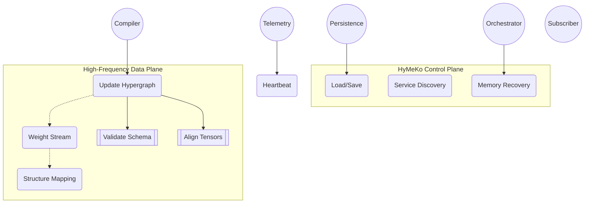
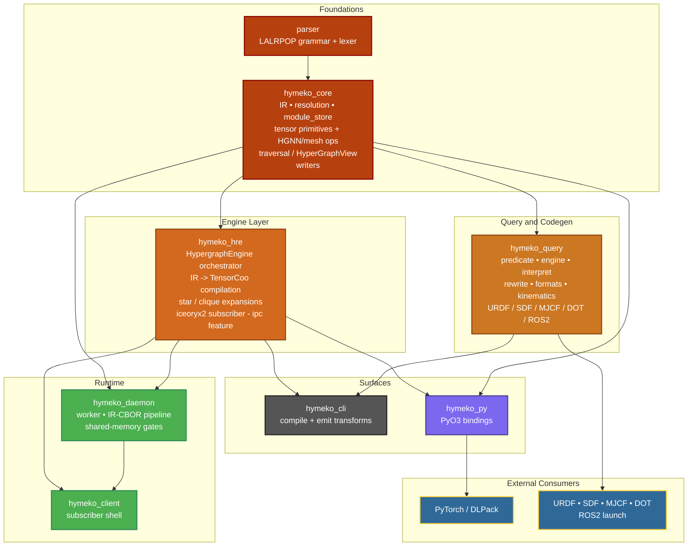
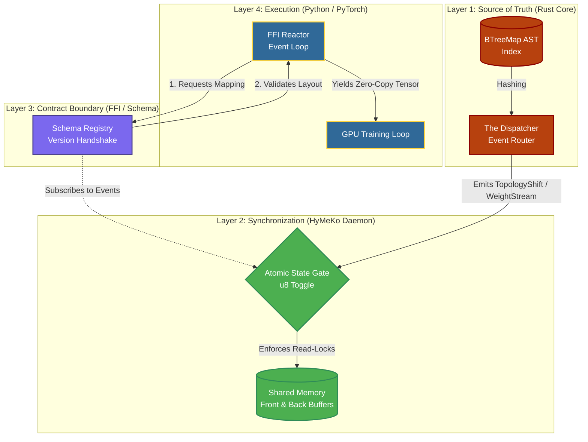
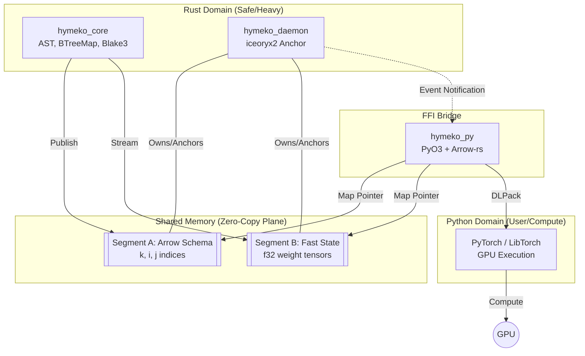
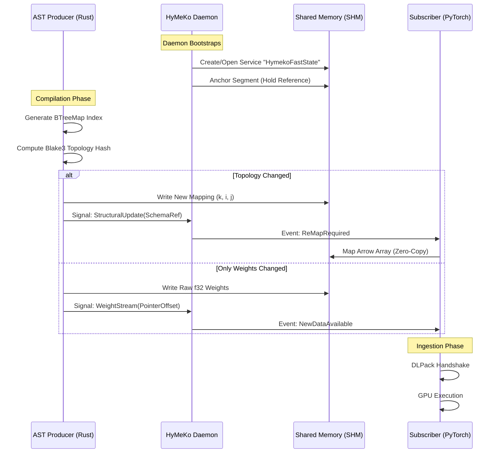
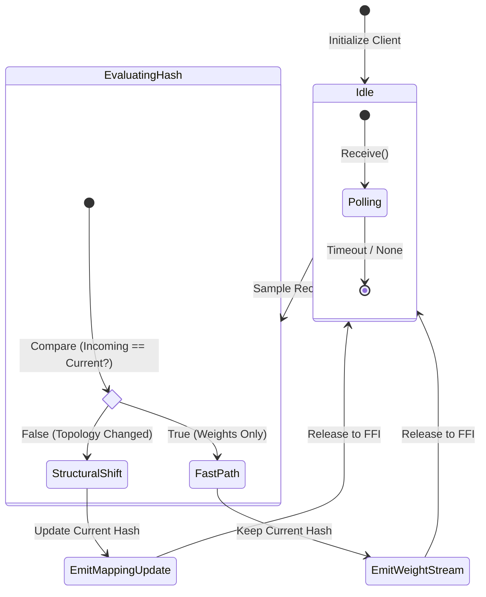
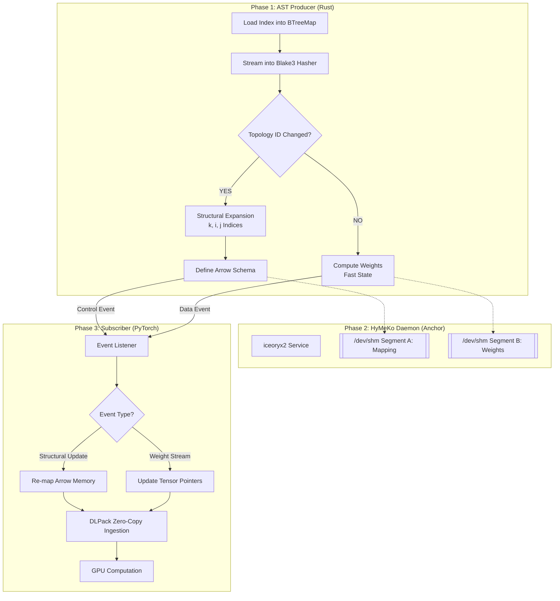

# Hymeko Architecture Diagrams

This index documents every architecture diagram that lives under `architecture/`, pairing the rendered Mermaid views (GitHub-friendly) with their canonical SysML2 definitions. Use it as the single reference point for how the compiler, daemon, and subscribers coordinate.

## Contents

- [How to View the Diagrams](#how-to-view-the-diagrams)
- [Diagram Catalog](#diagram-catalog)
  - [System Overview](#system-overview)
  - [Crate Dependency Overview](#crate-dependency-overview)
  - [Layered Architecture View](#layered-architecture-view)
  - [Core Components](#core-components)
  - [Communication Sequence](#communication-sequence)
  - [Memory-State Transitions](#memory-state-transitions)
  - [Processing Flow](#processing-flow)
  - [Daemon Use Cases](#daemon-use-cases)

## How to View the Diagrams

| Format | Recommended Viewer | Notes |
| --- | --- | --- |
| Mermaid (`*.mermaid`) | GitHub Markdown, VS Code Mermaid preview, JetBrains Mermaid plug-in | Rendered inline below so you can track changes without external tools. |
| SysML (`*.sysml`) | [OMG SysML v2 Playground](https://sysml-v2.github.io/playground.html), Eclipse Papyrus, Modelix | Copy the snippets below (or open the files) into your SysML tool of choice to inspect ports, flows, and includes. |

## Diagram Catalog

### System Overview

High-level control-plane vs. data-plane responsibilities. Source: `architecture/overview.mermaid`



> No SysML companion yet—add one here when we capture the same relationships in a formal model.

### Crate Dependency Overview

Workspace-level view of the Rust crates and how they depend on each other after the `hymeko_hre` extraction (2026-04-18). Source: `architecture/overview_crates.mermaid`.



See `docs/plans/05_hre_extraction/plan.md` for the extraction rationale and why the split is engine-only rather than also pulling `traversal/`.

### Layered Architecture View

Source: `architecture/layers.mermaid`



> SysML companion for this layered view is not added yet; if needed, create `architecture/layers.sysml` and link it here.

### Core Components

Files:
- Mermaid: `architecture/components/components.mermaid`
- SysML: `architecture/components/components.sysml`

**Mermaid rendering**



**SysML source** (`components.sysml`)

```sysml
package HymekoArchitecture {
    part def HymekoSystem {
        part compiler : CoreEngine;
        part daemon : ServiceAnchor;
        part pythonBridge : FFIBridge;

        part sharedMemoryPool {
            part topologySegment : ArrowMemory;
            part weightSegment : RawTensorMemory;
        }

        connection c1 connect compiler.outPort to topologySegment.inPort;
        connection c2 connect daemon.anchorPort to sharedMemoryPool.mgmtPort;
        connection c3 connect pythonBridge.mapPort to sharedMemoryPool.outPort;
    }
}
```

### Communication Sequence

Files:
- Mermaid: `architecture/communication/communication.mermaid`
- SysML: `architecture/communication/communication.sysml`

**Mermaid rendering**



**SysML source** (`communication.sysml`)

```sysml
package HymekoCommunication {
    item def WeightSignal {
        attribute timestamp : ScalarValues::DateTime;
        attribute offset : ScalarValues::Integer;
    }

    item def MappingSignal {
        attribute topologyHash : ScalarValues::String;
        attribute schemaRef : ArrowSchema;
    }

    flow def TensorStream {
        end : CoreEngine;
        end : FFIBridge;
        item : WeightSignal;
    }

    interface def SharedMemoryInterface {
        flow tensorFlow : TensorStream;
        doc /* High-frequency zero-copy data exchange */
    }
}
```

### Memory-State Transitions

File: `architecture/communication/memory_communication/memory_communication.mermaid`



> A SysML state machine for this flow has not been authored yet—add `memory_communication.sysml` alongside the Mermaid file if you need a formal model.

### Processing Flow

Files:
- Mermaid: `architecture/flow/flow.mermaid`
- SysML: `architecture/flow/flow.sysml`

**Mermaid rendering**



**SysML source** (`flow.sysml`)

```sysml
package HymekoProcess {
    action def 'Process Hypergraph' {
        first start;
        then action 'Load Index';
        then action 'Compute Blake3 Hash';
        then action 'Check Topology ID';
        then decide 'Topology Changed?';
            if true then 'Perform Expansion';
            if false then 'Update Weights Only';
        then action 'Perform Expansion';
        then action 'Update Weights Only';
        then action 'Host Memory Segment';
        then action 'Map via DLPack';
    }
}
```

### Daemon Use Cases

Files:
- Mermaid: `architecture/daemon/use_case.mermaid`
- SysML: `architecture/daemon/use_cases.sysml`

**Mermaid rendering**



```mermaid
graph TB
    subgraph Actors
        C[Compiler]
        O[Orchestrator]
        P[Persistence]
        T[Telemetry]
        S[System/Subscriber]
    end

    subgraph "HymekoDaemon (Subject)"
        subgraph "Data Lifecycle"
            UC_Load(Load Hypergraph)
            UC_Save(Save Hypergraph)
            UC_Update(Update Hypergraph)
            UC_Validate(Validate Schema)
            UC_Align(Enforce Tensor Alignment)
            UC_Persist(Persist Hypergraph)
        end

        subgraph "Zero-Copy Data Plane"
            UC_Stream(Publish Hypergraph Stream)
            UC_Map(Publish Hypergraph Mapping)
            UC_Struct(Handle Structural Change)
            UC_SubStream(Subscribe to Stream)
            UC_SubMap(Subscribe to Mapping)
        end

        subgraph "Health & Orchestration"
            UC_Recover(Recover Shared Memory)
            UC_Heart(Heartbeat Health Check)
            UC_Disc(Discover Service Instance)
            UC_Ack(Acknowledge Mapping)
        end
    end

    C --> UC_Load
    C --> UC_Update
    P --> UC_Save
    P --> UC_Persist
    O --> UC_Recover
    T --> UC_Heart
    S --> UC_Validate
    S --> UC_SubStream
    S --> UC_SubMap

    UC_Update -- "<<include>>" --> UC_Validate
    UC_Update -- "<<include>>" --> UC_Align
    UC_Map -- "<<include>>" --> UC_Struct
    UC_Stream -. "<<extend>>" .-> UC_Map
```

**SysML source** (`use_cases.sysml` excerpt)

```sysml
package UseCases {
    part hymekoDaemon;
    part system;
    part orchestrator;
    part compiler;
    part telemetry;
    part persistence;

    use case def 'Update Hypergraph' {
        subject hymekoDaemon;
        actor :>> compiler;
        include use case 'validate' : 'Validate Hypergraph Schema';
        include use case 'align' : 'Enforce Tensor Alignment';
    }

    use case def 'Publish Hypergraph Mapping' {
        subject hymekoDaemon;
        actor :>> hymekoDaemon;
        include use case 'onStructuralChange' : 'Handle Structural Change';
    }

    use case def 'Recover Shared Memory' {
        subject hymekoDaemon;
        actor :>> orchestrator;
    }
}
```

---

Need another diagram documented? Drop it into `architecture/`, add a Mermaid/SysML pair, and extend this README so everyone knows where to find it.
