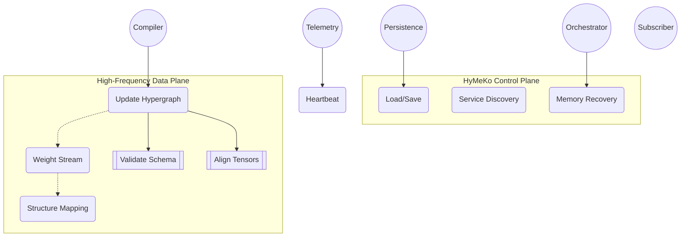

# Hymeko Architecture Overview

This document collects the rendered Mermaid diagrams that describe the control-plane and data-plane flows for Hymeko.

> Source diagram: [`overview.mermaid`](overview.mermaid)

## Viewing Tips

- GitHub renders Mermaid automatically. For local previews use VS Code or JetBrains Mermaid preview plugins.
- Keep the source `.mermaid` files alongside these markdown renderings so diagram diffs stay readable.

