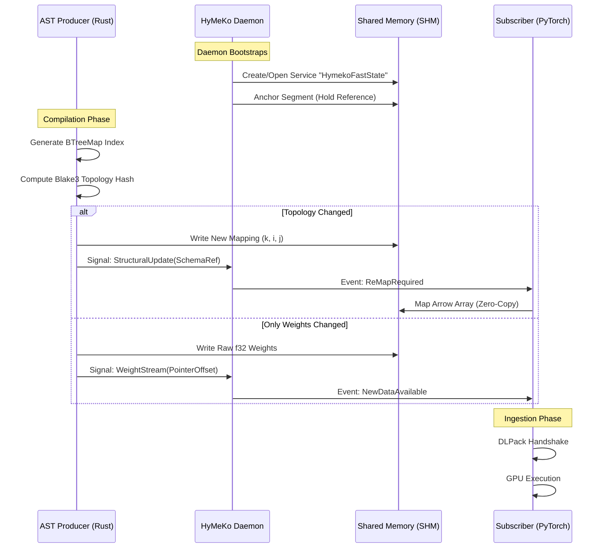

# Communication Diagrams

These diagrams describe how expansion data moves from the Rust compiler, through the daemon, into shared memory, and finally into the PyTorch subscriber.

## Sequence Diagram (Mermaid)

Source: `communication.mermaid`



## SysML Interface Model

Source: `communication.sysml`

```sysml
package HymekoCommunication {
    item def WeightSignal {
        attribute timestamp : ScalarValues::DateTime;
        attribute offset : ScalarValues::Integer;
    }

    item def MappingSignal {
        attribute topologyHash : ScalarValues::String;
        attribute schemaRef : ArrowSchema;
    }

    flow def TensorStream {
        end : CoreEngine;
        end : FFIBridge;
        item : WeightSignal;
    }

    interface def SharedMemoryInterface {
        flow tensorFlow : TensorStream;
        doc /* High-frequency zero-copy data exchange */
    }
}
```

### Memory-State Subdiagram

For the state machine governing zero-copy handling, see `memory_communication/README.md` inside this folder.

