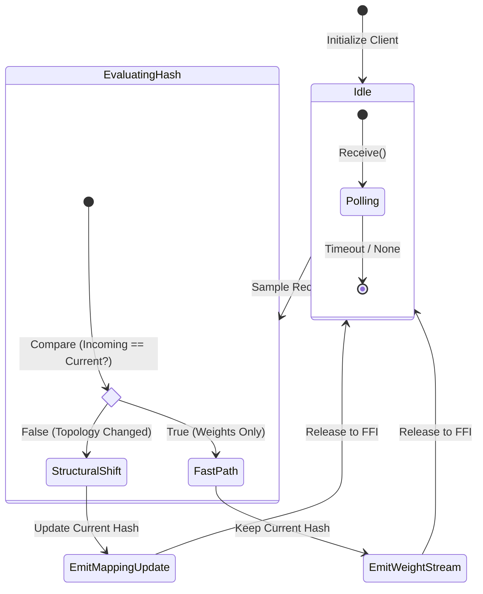

# Memory Communication State Machine

This subdiagram tracks how the subscriber reacts to shared-memory samples by comparing topology hashes and deciding whether to remap schemas or just ingest weights.

## Mermaid State Machine

Source: `memory_communication.mermaid`

> SysML version: _not yet modeled_. When you need a formal statechart, add `memory_communication.sysml` alongside the Mermaid file and mirror the transitions above.

