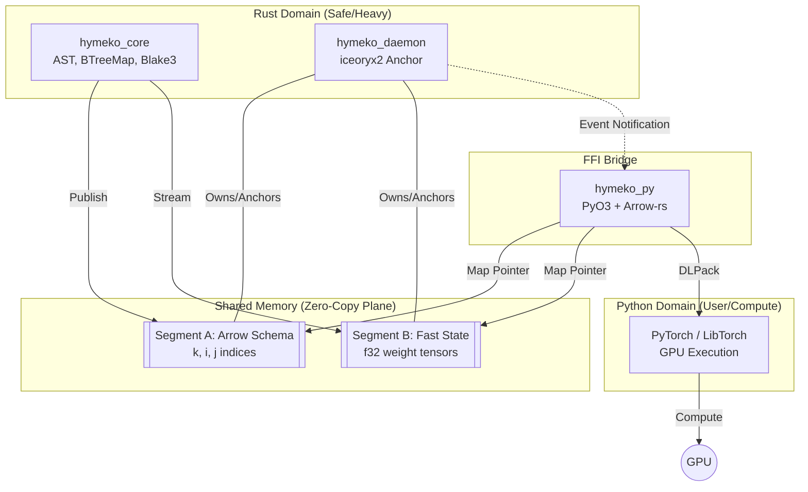

# Components Diagram

This folder captures how the Rust engine, daemon, shared-memory segments, and Python bridge fit together.

## Mermaid View

Source: `components.mermaid`



## SysML Definition

Source: `components.sysml`

```sysml
package HymekoArchitecture {
    part def HymekoSystem {
        part compiler : CoreEngine;
        part daemon : ServiceAnchor;
        part pythonBridge : FFIBridge;

        part sharedMemoryPool {
            part topologySegment : ArrowMemory;
            part weightSegment : RawTensorMemory;
        }

        connection c1 connect compiler.outPort to topologySegment.inPort;
        connection c2 connect daemon.anchorPort to sharedMemoryPool.mgmtPort;
        connection c3 connect pythonBridge.mapPort to sharedMemoryPool.outPort;
    }
}
```

Use the Mermaid view for quick reviews inside GitHub, and load the SysML snippet into your modeling tool when you need formal semantics (ports, parts, connections).

