# Daemon Use Cases

This directory documents how the Hymeko daemon interacts with compilers, orchestrators, subscribers, telemetry, and persistence layers.

## Mermaid Use-Case Map

Source: `use_case.mermaid`

```mermaid
graph TB
    subgraph Actors
        C[Compiler]
        O[Orchestrator]
        P[Persistence]
        T[Telemetry]
        S[System/Subscriber]
    end

    subgraph "HymekoDaemon (Subject)"
        subgraph "Data Lifecycle"
            UC_Load(Load Hypergraph)
            UC_Save(Save Hypergraph)
            UC_Update(Update Hypergraph)
            UC_Validate(Validate Schema)
            UC_Align(Enforce Tensor Alignment)
            UC_Persist(Persist Hypergraph)
        end

        subgraph "Zero-Copy Data Plane"
            UC_Stream(Publish Hypergraph Stream)
            UC_Map(Publish Hypergraph Mapping)
            UC_Struct(Handle Structural Change)
            UC_SubStream(Subscribe to Stream)
            UC_SubMap(Subscribe to Mapping)
        end

        subgraph "Health & Orchestration"
            UC_Recover(Recover Shared Memory)
            UC_Heart(Heartbeat Health Check)
            UC_Disc(Discover Service Instance)
            UC_Ack(Acknowledge Mapping)
        end
    end

    C --> UC_Load
    C --> UC_Update
    P --> UC_Save
    P --> UC_Persist
    O --> UC_Recover
    T --> UC_Heart
    S --> UC_Validate
    S --> UC_SubStream
    S --> UC_SubMap

    UC_Update -- "<<include>>" --> UC_Validate
    UC_Update -- "<<include>>" --> UC_Align
    UC_Map -- "<<include>>" --> UC_Struct
    UC_Stream -. "<<extend>>" .-> UC_Map
```



## SysML Use-Case Definitions

Source: `use_cases.sysml`

```sysml
package UseCases {
    part hymekoDaemon;
    part system;
    part orchestrator;
    part compiler;
    part telemetry;
    part persistence;

    use case def 'Update Hypergraph' {
        subject hymekoDaemon;
        actor :>> compiler;
        include use case 'validate' : 'Validate Hypergraph Schema';
        include use case 'align' : 'Enforce Tensor Alignment';
    }

    use case def 'Publish Hypergraph Mapping' {
        subject hymekoDaemon;
        actor :>> hymekoDaemon;
        include use case 'onStructuralChange' : 'Handle Structural Change';
    }

    use case def 'Recover Shared Memory' {
        subject hymekoDaemon;
        actor :>> orchestrator;
    }
}
```

Use these models to reason about responsibility boundaries before diving into implementation details.

