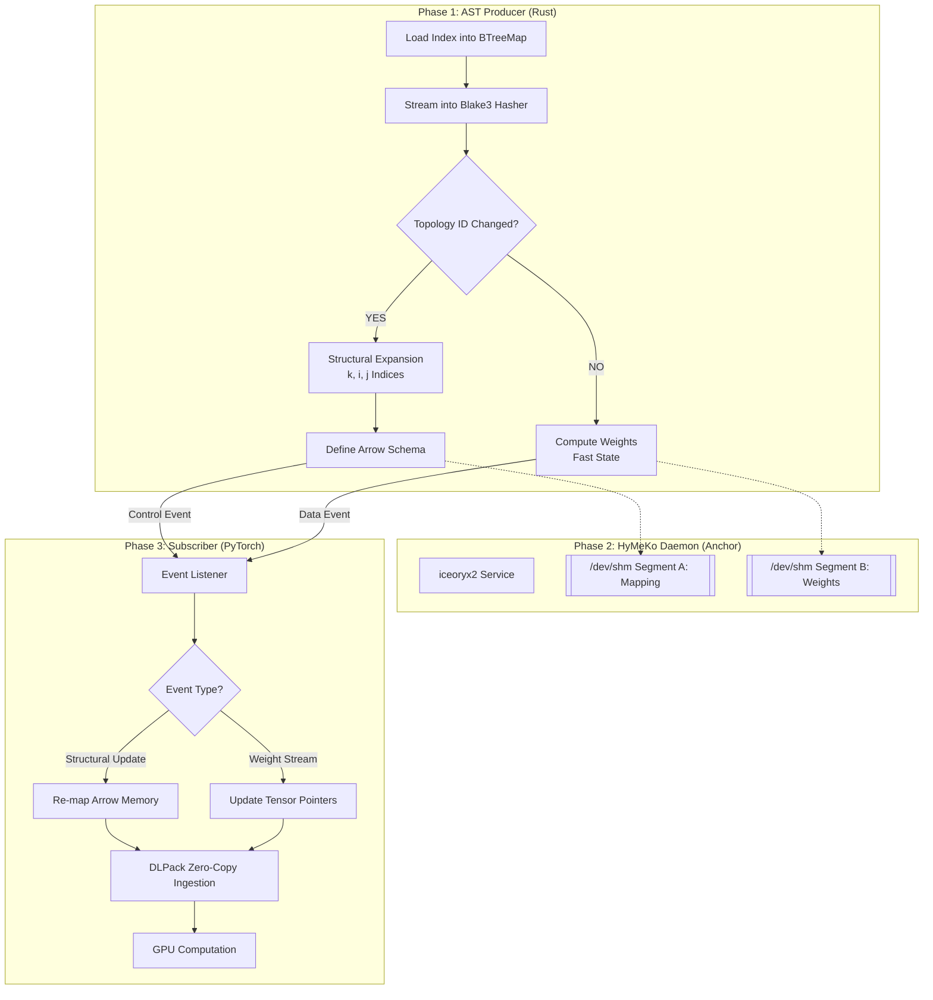

# Processing Flow

The flow diagrams in this folder show how star/clique expansions move from the Rust compiler into shared memory and onward to PyTorch.

## Mermaid Flowchart

Source: `flow.mermaid`



## SysML Activity

Source: `flow.sysml`

```sysml
package HymekoProcess {
    action def 'Process Hypergraph' {
        first start;
        then action 'Load Index';
        then action 'Compute Blake3 Hash';
        then action 'Check Topology ID';
        then decide 'Topology Changed?';
            if true then 'Perform Expansion';
            if false then 'Update Weights Only';
        then action 'Perform Expansion';
        then action 'Update Weights Only';
        then action 'Host Memory Segment';
        then action 'Map via DLPack';
    }
}
```

Use the SysML model when you need explicit control-flow semantics (e.g., for tooling that generates traces or validates pre/post conditions).

