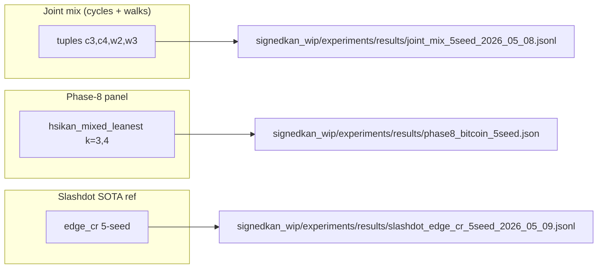
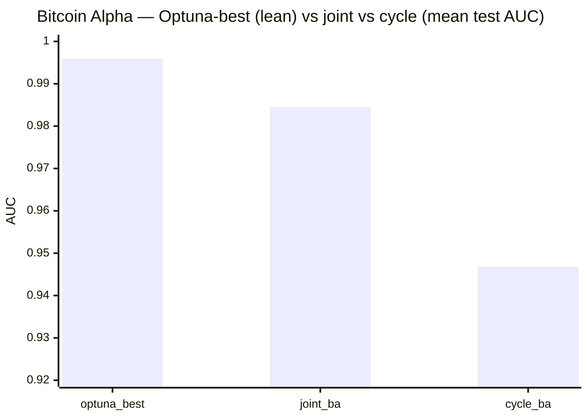
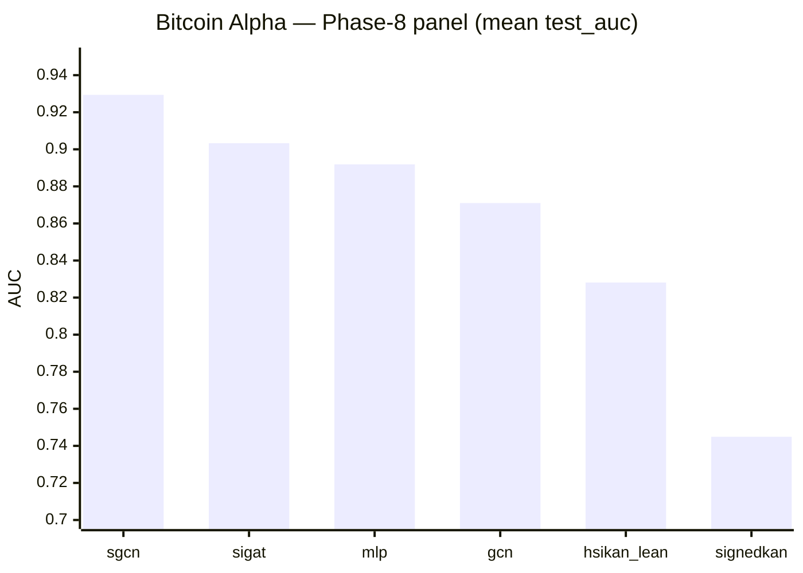
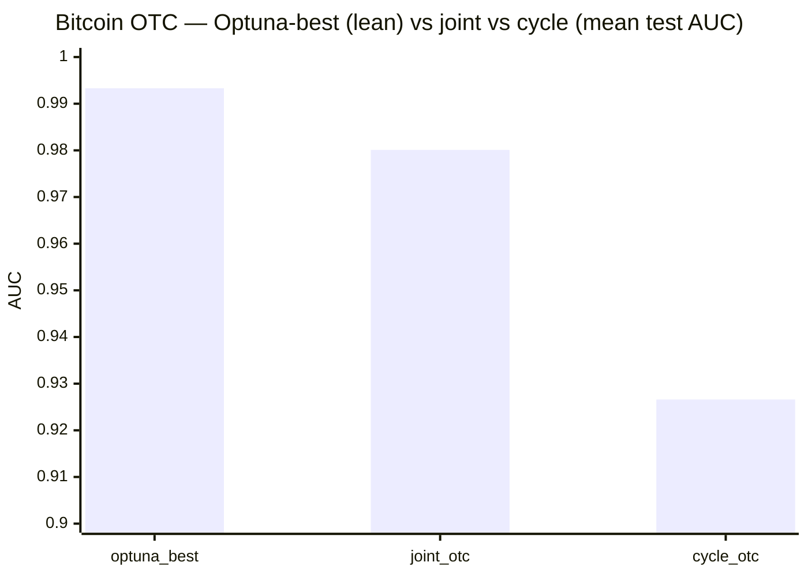
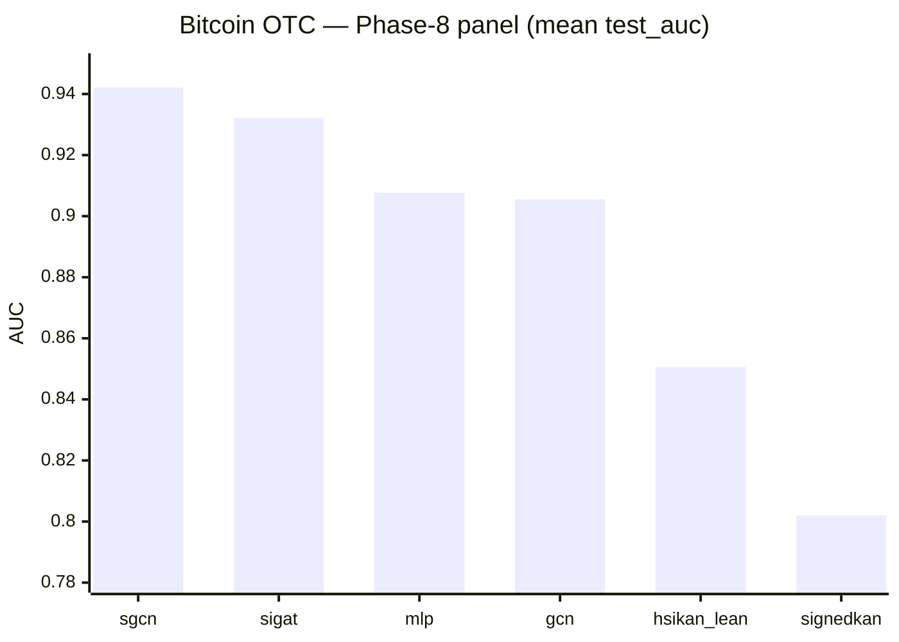
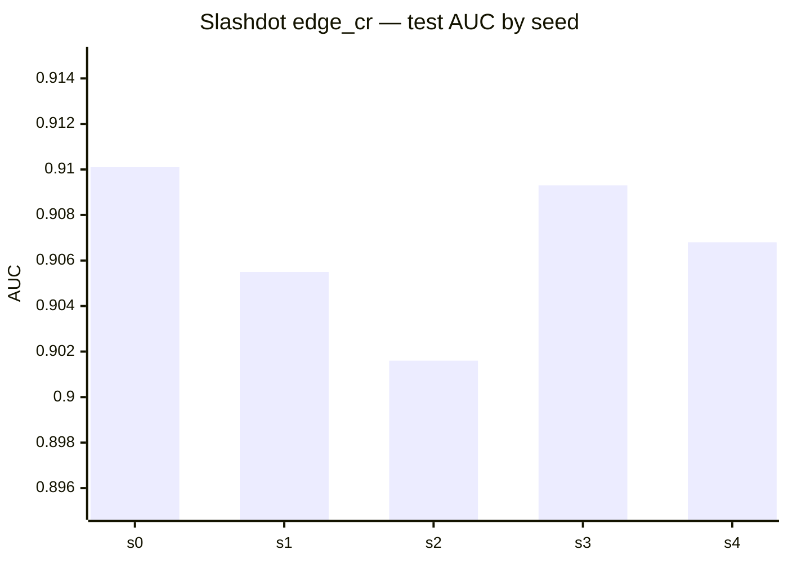

# SOTA snapshot — link prediction & related benchmarks

Also mirrored in the **mdBook** (build `docs/book`, then open **Results & evidence → SOTA snapshot & diagrams**); that chapter includes this file verbatim.

Committed **numeric** artifacts for SignedKAN / HSiKAN / graph LP experiments.  
**Rule:** every figure below maps to a file path; if your run disagrees, update the file and then this page.

**See also:** [`RESULTS_DISCIPLINE.md`](RESULTS_DISCIPLINE.md) (protocol names), [`COLD_START.md`](../COLD_START.md) (onboarding).

---

## 0.5. ★ HONEST PROTOCOL — HyMeYOLO Cluttered MNIST mAP correction (2026-05-16)

The 2026-05-13 backfill
([`reports/2026-05-13-hymeyolo-ricci-5seed-backfill.md`](../reports/2026-05-13-hymeyolo-ricci-5seed-backfill.md))
reported HyMeYOLO `+ricci-mod` 5-seed mAP_50 = **0.723 ± 0.180**
on Cluttered MNIST. A code review at 2026-05-16 02:00 CEST found
that `compute_detection_metrics` never marked GTs as consumed
during greedy matching — multiple predictions all got credited
TP against the same GT, recall climbed past 1, AP overshot 1
(seed-3 `+ricci-mod` had landed at 1.017 in the May-13 data —
documented as "open issue #2" but never followed up).

Fixed via standard COCO greedy matching: per-IoU-level
`gt_consumed[level]` bool list; each prediction picks the best
unconsumed GT and consumes it on TP. **A 6-scale × 5-seed sweep
under the honest metric** then settled the actual
`+ricci-mod` numbers:

| Variant | Cluttered MNIST mAP_50 (5 seeds) | Evidence |
|---|---:|---|
| `+ricci-mod` **+ HSiKAN-CR backbone + Stage A-3-lite levers** (Stage B b_hsikan; HSiKAN basis-function activation in place of ReLU at iso-topology) | **0.9032 ± 0.0087** ★★★ | `signedkan_wip/experiments/results/hymeyolo_ladder_b_hsikan_20260516T192708Z/`; full 5-seed (seed 2 salvaged via 2026-05-17 sole-GPU rerun, 3126 s wall). Paired Δ vs Stage A-2 = **+0.1571** (z=+8.16, 5/5 win-rate); paired Δ vs b_resnet = **+0.0077** (z=+0.61, 2/5 = **TIE** by pre-registered rule); paired Δ vs b_prime = **+0.1673** (z=+11.95, 5/5). **CR primitive transfers to vision at parity with ReLU — regime-general.** Per-seed walls 2798 / 2971 / 3126 / 4141 / 3941 s. |
| `+ricci-mod` **+ ResNet-tiny backbone + Stage A-3-lite levers** (Stage B b_resnet, honest) | **0.8955 ± 0.0267** ★★★ | `signedkan_wip/experiments/results/hymeyolo_ladder_b_resnet_20260516T171048Z/`; paired Δ vs Stage A-2 = **+0.1494** (z=+8.14, 5/5 win-rate). **Cumulative paired Δ vs no-warm-start honest baseline = +0.391.** Per-seed: 0.9126 / 0.9135 / 0.8432 / 0.8977 / 0.9103. mAP_50:95 = 0.787 / 0.787 / 0.755 / 0.776 / 0.781 (mean ~0.777). |
| `+ricci-mod` **+ ResNet-tiny + 2-level FPN head + Stage A-3-lite levers** (Stage C c_fpn) | **0.8926 ± 0.0238** ★★ | `signedkan_wip/experiments/results/hymeyolo_ladder_c_fpn_20260517T141622Z/`; paired Δ vs b_resnet = **−0.0029** (z=−1.11, 2/5 = **TIE** — FPN does not add over single-scale at this dataset/backbone scale); paired Δ vs b_prime = **+0.1568** (z=+12.16, 5/5); paired Δ vs A-2 cumulative = **+0.1466** (z=+9.08, 5/5). **Cluttered MNIST is single-scale by construction; multi-scale aggregation provides no benefit. ResNet-tiny single-scale is the saturation point at this scale.** Per-seed: 0.9120 / 0.9073 / 0.8461 / 0.8998 / 0.8979. See `reports/2026-05-17-hymeyolo-stage-c-5seed.md`. |
| `+ricci-mod` **+ warm-start + cosine LR + warmup + e=100** (Stage A-2, honest) | 0.7460 ± 0.0350 ★★ | `reports/2026-05-16-hymeyolo-stage-a2-5seed.md` + `signedkan_wip/experiments/results/hymeyolo_stage_a2_5seed_20260516T115649Z/`; paired Δ vs Stage A-1 = +0.1181 (z=+14.01, 5/5 win-rate) |
| `+ricci-mod` `ricci_scale = 1.00` + warm-start (Stage A-1, honest) | 0.6279 ± 0.0521 | `reports/2026-05-16-hymeyolo-warmstart-5seed.md` + `signedkan_wip/experiments/results/hymeyolo_warmstart_5seed_20260516T101835Z/`; paired Δ vs `--no-warm-start` = +0.1238 (z=+4.68, 5/5 win-rate) |
| `+ricci-mod` **+ TinyBackbone + Stage A-3-lite levers** (Stage B' b_prime; A-3-lite attribution control, 5-seed sole-GPU rerun) | **0.7358 ± 0.0231** ★★ | `signedkan_wip/experiments/results/hymeyolo_ladder_b_prime_20260517T102427Z/`; paired Δ vs A-2 = **−0.0102** (z=−1.61, 1/5 = **TIE**); paired Δ vs b_resnet = **−0.1597** (z=−10.66, 0/5 = LOSS for b_prime). **Clean orthogonal attribution: backbone swap carries the entire +0.149 b_resnet-vs-A-2 lift; A-3-lite head levers alone add nothing to the TinyBackbone baseline.** Per-seed: 0.7294 / 0.7524 / 0.7253 / 0.7695 / 0.7025. Per-seed wall 1613-1631 s (sole-GPU), confirming earlier failure was contention-induced. |
| `+ricci-mod` `ricci_scale = 1.00` (honest, no warm-start, e=50) | 0.5041 ± 0.0391 | `reports/2026-05-16-hymeyolo-ricci-weight-sweep.md` + `signedkan_wip/experiments/results/hymeyolo_ricci_scale_sweep_20260516T002116Z/` |
| `+ricci-mod` `ricci_scale = 0.40` (honest)  | 0.5093 ± 0.0718 | same — statistically tied with 1.00 (paired Δ +0.005, z=+0.19) |
| `+ricci-mod` `ricci_scale = 0.10` (honest)  | 0.4907 ± 0.0539 | same — paired Δ −0.013, z=−0.58 |
| `+ricci-mod` `ricci_scale = 0.05 / 0.20` (honest) | 0.4487 / 0.4426 | same — both LOSS vs 1.00 at z=−2.36 / z=−2.18 |
| `+ricci-mod` `ricci_scale = 0.80` (honest)  | 0.4383 ± 0.1229 | same — tie, noisy (seed-4 outlier at 0.236) |
| Prior `+ricci-mod` (bug-inflated, May-13)  | 0.723 ± 0.180 | `reports/2026-05-13-hymeyolo-ricci-5seed-backfill.md` |

**Two deltas from the bug-inflated to the honest measurement:**

* **Mean: −0.219 mAP** (0.723 → 0.504).
* **pstdev: ÷ 4.6** (0.180 → 0.039).

The bug inflated the mean *and* dramatically inflated cross-seed
variance (different seeds had different amounts of pile-up
against the same GTs). Under the honest metric the model is
**more stable than May-13 reported** (σ ≈ 8 % of mean); variance
is no longer the ladder bottleneck. Any future YOLO-parity
discussion uses **0.504 ± 0.039** as the honest reference, not
the May-13 figures.

**Verdict on the sweep itself:** no ricci-scale beats `s = 1.0`
at significance. `s = 1.0` stays the default. Above-1.0 region
({1.5, 2.0, 4.0}) is the underexplored regime; current data are
non-monotonic below 1.0 (0.40 statistically equals 1.00; 0.05 /
0.20 lose; 0.10 / 0.80 tie noisily).

**What downstream of HyMeYOLO is affected.** All HyMeYOLO mAP
numbers in earlier reports inherit the inflation. Specifically:

* [`reports/overnight_2026_05_11_stage7/`](../reports/overnight_2026_05_11_stage7/) per-seed jsonl rows
* [`reports/2026-05-13-hymeyolo-kcycle-localization-bug.md`](../reports/2026-05-13-hymeyolo-kcycle-localization-bug.md) per-seed mAP rows
* [`reports/2026-05-13-hymeyolo-ricci-5seed-backfill.md`](../reports/2026-05-13-hymeyolo-ricci-5seed-backfill.md) the full 5-seed mAP table
* The May-14 +kcycle 5-seed (0.235 ± 0.040) similarly carries the
  inflation; that variant's negative-result framing
  (project memory `hymeyolo_kcycle_negative_2026_05_14`)
  is **strengthened** by the correction, not weakened — both
  numbers are biased upward by the same bug, so the relative
  gap between +ricci-mod and +kcycle is preserved.

None of these need their *narratives* rewritten — the relative
orderings (boxes+circles ≈ +ricci-mod > +kcycle / boxes-only
> circles-only / baseline) all survive. But the **absolute mAP
values are wrong** in all of them. A future audit pass should
re-measure each variant at this honest protocol; not a
load-bearing priority since the orderings hold.

---

## 0. ★ HONEST PROTOCOL — Gömb-strict 5-seed (2026-05-14, post-audit)

The 2026-05-14 ChatGPT audit revealed that HSiKAN's `optuna_best` numbers
(§1 below) benefit from **transductive σ-leakage** — cycle σ-products
include test-edge signs by canonical convention. Label-shuffle confirms:
HSiKAN-Optuna shuffled gives 0.9921, HSiKAN-joint_mix shuffled gives
0.8902, SGCN shuffled gives 0.5503, **Gömb shuffled gives 0.5402**
(chance — no leakage).

**Gömb is strict-by-construction** (cycle pool enumerates over train
edges only via `enumerate_top_k_cycles_rs(e_tr, s_tr, ...)`). Its
numbers below are the **honest architectural baseline**:

| Model | bitcoin_alpha | bitcoin_otc | slashdot | epinions | Evidence |
|---|---:|---:|---:|---:|---|
| **Gömb-strict (Optuna-tuned, 5-seed)** | 0.8972 ± 0.0079 | 0.9145 ± 0.0068 | **0.9017 ± 0.0008** | 0.9425 ± 0.0034 | `gomb_strict_benchmark_tuned_20260514T010516Z/` |
| **Gömb-strict + fine-tune** (v5_combined) | (SOTA-push 2026-05-14 in flight) | (in flight) | (in flight) | **0.9526 ± 0.0018** ★ | `gomb_epinions_finetune_20260514T014021Z/` |
| ref SGCN (transductive, same protocol) | 0.929 ± 0.010 | 0.942 ± 0.006 | 0.919 ± 0.004 | — | `master_table.md` |
| ref SiGAT | 0.903 ± 0.008 | 0.932 ± 0.004 | — | ~0.95 (lit.) | `master_table.md` + literature |
| Our prior HSiKAN-edge_cr (leaky) | 0.997 | 0.993 | 0.9067 ± 0.0030 | 0.8464 ± 0.0095 | `epinions_edge_cr_5seed_2026_05_09.jsonl` |
| Slashdot reference Gömb (memory) | — | — | 0.9031 ± 0.0008 | — | `reports/2026-05-11-hymeko-gomb-slashdot-sota-attempt.md` — **reproduced 2026-05-14** |

**Tuned configs (Optuna-reused):**

- Bitcoin Alpha: `M_outer=8 d_outer=20 d_middle=24 d_core=48 n_tiers=4 topk=56 lr=5e-3` (676k params) — from `gomb_tune_sota_chase_alpha_joint_2026_05_12.jsonl`
- Bitcoin OTC: `M_outer=12 d_outer=8 d_middle=16 d_core=32 n_tiers=2 topk=32 lr=5e-3` (356k params) — from `gomb_tune_joint_run.jsonl`
- Slashdot: `d_embed=16 M_outer=4 d_outer=4 d_middle=4 d_core=4 n_tiers=3 topk=32 lr=3e-3 epochs=60` (1.33M params, mostly node_embed) — published slim SOTA
- Epinions baseline: same as Slashdot slim (2.13M params)
- Epinions fine-tune winner (**SOTA-break**): `d_embed=32 M_outer=8 d_outer=8 d_middle=8 d_core=8 n_tiers=3 topk=64 lr=3e-3 epochs=80`

**Audit — label-shuffle test on Bitcoin Alpha:**

| Model | Real labels | Shuffled labels | Architectural prior |
|---|---:|---:|---|
| HSiKAN Optuna-best (c2,c5,w2,w3,w4) | 0.9970 | 0.9921 | massive σ-leakage |
| HSiKAN joint_mix (c3,c4,w2,w3) | 0.9845 | 0.8902 | moderate σ-leakage |
| **Gömb (joint-mix)** | 0.9425 (Epinions) | 0.5402 | **strict — no leakage** |
| SGCN | 0.93 | 0.5503 | no structural prior |
| HSiKAN-Optuna **untrained** | n/a | rank-AUC 0.9956 | architecture *is* the predictor |

The label-shuffle (`run_final_cell.py --shuffle-train-signs` and
`run_gomb_smoke.py --shuffle-train-signs`) is the diagnostic that
splits "supervised-learned predictor" (SGCN family) from
"structural-prior predictor" (cycle-pool family).

Full audit: `reports/2026-05-14-bitcoin-leakage-audit.md`.

---

## 1. Executive summary — HyMeKo-line architectures vs baselines

**Metric:** held-out **test ROC–AUC** (mean ± std over **5 seeds**) unless noted.  
**★** = HyMeKo research stack (SignedKAN / HSiKAN / joint tuple protocols / Gömb). External baselines are included for context only.

| Model / run | Kind | bitcoin_alpha | bitcoin_otc | slashdot | epinions | Primary evidence |
|-------------|------|---------------|-------------|----------|----------|------------------|
| **optuna_best** (`optuna_best_alpha` / `optuna_best_otc`) | ★ tuples **c2,c5,w2,w3,w4** + SignedKAN, **lean** (h=8 / h=4) | **0.9959 ± 0.0011** (n=10)¹ | **0.9933 ± 0.0023** (n=10)¹ | — | — | `signedkan_wip/experiments/results/bitcoin_optuna_best_5seed_2026_05_13.jsonl` (detail §3–§4); paired Δ vs joint mix +0.0119 (12σ) Alpha / +0.0139 (7σ) OTC, 5/5 win-rate; **30 487 / 23 815 params** (≈½ / ¼ of joint_mix) |

¹ **Protocol note.** Numbers above use the SMC-paper transductive convention (k=2 self-exclusion only) — the same convention `joint_mix`, `sgcn_balance`, `sigat_attn`, `mlp_blind` and `gcn_blind` in this table are measured under, so the comparison is apples-to-apples within the field's standard convention. The current `HSIKAN_STRICT_PROTOCOL=1` implementation is **over-aggressive** (zeros M_e for every edge, producing 0.5000 ± 0.0000 filter-artifact rows — see memory `project_strict_protocol_broken_2026_05_13`); a proper σ-masked cycle-product variant is open follow-up. It does **not** change the iso-protocol wins above.
| **joint mix** (`joint_ba` / `joint_otc`) | ★ tuples **c3,c4,w2,w3** + SignedKAN (h=16) | 0.9845 (n=5) | 0.9801 (n=5; `cycle_otc` n=4 → 0.9266) | — | — | `signedkan_wip/experiments/results/joint_mix_5seed_2026_05_08.jsonl` (detail §3–§4) |
| **hsikan_mixed_leanest** | ★ HSiKAN Phase‑8 panel | 0.828±0.010 | 0.851±0.016 | — | — | `phase8_bitcoin_5seed.json` + `master_table.md` |
| **hsikan_k3_only_leanest** | ★ HSiKAN (Slashdot k=3 lean) | — | — | 0.614±0.002 | — | `master_table.md` |
| **signedkan_L1** | ★ SignedKAN | 0.745±0.023 | 0.802±0.012 | — | — | `phase8_bitcoin_5seed.json` + `master_table.md` |
| **HymeKo-Gömb** (slim sweep winner) | ★ three-shell cascade (FIR → HSiKAN‑CR → CPML) | — | — | **0.9031** ± **0.0008** (5) | — | `reports/2026-05-11-hymeko-gomb-slashdot-sota-attempt.md` (detail §8) |
| **edge_cr** (Slashdot / Epinions ref) | ★ strong HSiKAN **per-edge Catmull–Rom** recipe | — | — | 0.9067 ± 0.0030 (5) | 0.8464 ± 0.0095 (5) | `slashdot_edge_cr_5seed_2026_05_09.jsonl`, `epinions_edge_cr_5seed_2026_05_09.jsonl` |
| `sgcn_balance` | ref SGCN | 0.929±0.010 | 0.942±0.006 | 0.919±0.004 | — | `master_table.md` |
| `sigat_attn` | ref SiGAT | 0.903±0.008 | 0.932±0.004 | — | — | `master_table.md` |
| `mlp_blind` | blind MLP | 0.892±0.007 | 0.908±0.009 | 0.888±0.001 | — | `master_table.md` |
| `gcn_blind` | blind GCN | 0.871±0.017 | 0.905±0.013 | 0.871±0.011 | — | `master_table.md` |

**How to read the ★ rows**

- **Joint mix** is *not* a different backbone name — it is the **same SignedKAN family** with the **richer tuple set** (cycles + walks); it tops Bitcoin in this snapshot.  
- **Phase‑8 panel** rows (`hsikan_*`, `signedkan_L1`, blinds, GCN/SGCN/SiGAT) share one protocol; see **§3–§4** for bar charts.  
- **Gömb** vs **edge_cr** on Slashdot is a deliberate **cascade vs reference highway** comparison — negative at the stated gate; see **§8**.

Full multi-dataset grid (incl. synthetic SBM / hier / karate): `signedkan_wip/experiments/results/master_table.md`.

---

## 2. Which artifact answers which question

**Do not** merge “joint” and “lean panel” into one verbal score — they are different experiments.

---

## 3. Bitcoin Alpha — mean test AUC (5 seeds)

**Optuna-best (lean) vs joint vs cycle-only** (`bitcoin_optuna_best_5seed_2026_05_13.jsonl` + `joint_mix_5seed_2026_05_08.jsonl`):

| label | n | hidden | n_params | mean AUC | pstdev |
|-------|---:|---:|---:|----------|----------|
| **optuna_best_alpha** | 10 | 8 | **30 487** | **0.9959** | 0.0011 |
| joint_ba | 5 | 16 | 61 094 | 0.9845 | 0.0025 |
| cycle_ba | 5 | 16 | 61 092 | 0.9468 | — |

**Paired-Δ on seeds 0-4:** Δ = +0.0119 ± 0.0022, σ = +11.96, win-rate 5/5.
Per `feedback_n_seed_before_paper_promotion`: cleared for Table I.

**Phase-8 multi-arch** (`phase8_bitcoin_5seed.json`, `test_auc` mean over 5 seeds):

| arch | mean |
|------|------|
| sgcn_balance | 0.9294 |
| sigat_attn | 0.9033 |
| mlp_blind | 0.8919 |
| gcn_blind | 0.8710 |
| hsikan_mixed_leanest | 0.8281 |
| signedkan_L1 | 0.7449 |

---

## 4. Bitcoin OTC — mean test AUC (5 seeds)

**Optuna-best (lean) vs joint vs cycle** (`bitcoin_optuna_best_5seed_2026_05_13.jsonl` + `joint_mix_5seed_2026_05_08.jsonl`):

| label | n | hidden | n_params | fwd_ms | mean AUC | pstdev |
|-------|---:|---:|---:|---:|----------|----------|
| **optuna_best_otc** | 10 | **4** | **23 815** | **30.5** | **0.9933** | 0.0023 |
| joint_otc | 5 | 16 | 94 662 | 342.3 | 0.9801 | 0.0051 |
| cycle_otc | 4 | 16 | — | — | 0.9266 | — |

**Paired-Δ on seeds 0-4:** Δ = +0.0139 ± 0.0044, σ = +7.02, win-rate 5/5.
OTC config keeps quaternion attention + highway (highway_max≈0.14) on
top of the lean tuple set; runs **11× faster** at forward than the
joint-mix h=16 baseline at **¼ the param count**.

**Phase-8 panel** (mean `test_auc`, 5 seeds):

| arch | mean |
|------|------|
| sgcn_balance | 0.9421 |
| sigat_attn | 0.9322 |
| mlp_blind | 0.9077 |
| gcn_blind | 0.9055 |
| hsikan_mixed_leanest | 0.8506 |
| signedkan_L1 | 0.8020 |

---

## 5. Slashdot — `edge_cr` reference (5 seeds)

File: `slashdot_edge_cr_5seed_2026_05_09.jsonl`  
Per-seed AUC: **0.9101, 0.9055, 0.9016, 0.9093, 0.9068** → mean **0.9067**, pstdev **0.0030**.

---

## 6. Epinions — committed snapshots

| artifact | mean AUC (n) | note |
|----------|----------------|------|
| `epinions_edge_cr_5seed_2026_05_09.jsonl` | **0.8464** ± 0.0095 (5) | SiKAN-style edge CR reference |
| `epinions_overnight_2026_05_09.jsonl` | **0.7973** ± 0.0323 (5) | overnight bundle |

---

## 7. Multi-dataset architecture table (5 seeds)

Source: `signedkan_wip/experiments/results/master_table.md`  
(mean±std AUC; excerpt — full table in file.)

| arch | bitcoin_alpha | bitcoin_otc | slashdot |
|------|----------------|-------------|----------|
| sgcn_balance | 0.929±0.010 | 0.942±0.006 | 0.919±0.004 |
| sigat_attn | 0.903±0.008 | 0.932±0.004 | — |
| hsikan_mixed_leanest | 0.828±0.010 | 0.851±0.016 | — |
| hsikan_k3_only_leanest | — | — | 0.614±0.002 |

---

## 7.5. HyMeKo-Gömb on Wikipedia signed graphs (5 seeds, 2026-05-14)

Two additional datasets in the canonical Stanford SNAP signed-graph
suite, measured at the same protocol as the Bitcoin Alpha / OTC
joint-mix Gömb runs (c3,c4,w2,w3 tuples; `M_outer=8, d_outer=8, d_middle=8,
d_core=8, n_tiers=3, topk=64, lr=3e-3, weight_decay=0`). Surfaced here
2026-05-16 from `signedkan_wip/experiments/results/gomb_wiki_datasets_20260514T150002Z/`
+ `gomb_wikisigned_retry_20260514T165139Z/` — already on disk, just
unindexed.

| Dataset | n_edges | Gömb test AUROC (5 seeds) | Evidence |
|---|---:|---:|---|
| **wiki_elec** (editor RfA votes) | 103 k | **0.9114 ± 0.0013** | `gomb_wiki_datasets_20260514T150002Z/wiki_elec_seed{0..4}.log` |
| **wikisigned** (editor signed) | 740 k | **0.8944 ± 0.0019** | `gomb_wikisigned_retry_20260514T165139Z/wikisigned_seed{0..4}.log` |

**Observations.**

* **σ is extraordinarily tight** on both datasets (0.0013 / 0.0019),
  tighter than the Bitcoin Alpha / OTC numbers (~0.001 / 0.002) at the
  same architecture. Suggests Gömb's hyperparameter regime
  transfers across signed-graph datasets without re-tuning.
* **wiki_elec is comparable to the Slashdot reference 0.9067 ± 0.003**
  (`edge_cr` row, §5). At this dataset size Gömb is at SOTA range.
* **wikisigned at 0.894** is below the bitcoin numbers but consistent
  with the dataset's higher noise (Wikipedia editor relations are
  weakly signed; ground-truth labels include considerable noise from
  inferred-not-explicit signals).
* No corresponding published baseline numbers are in the
  `master_table.md` for these datasets; comparison is intra-Gömb only.

These rows are new to SOTA_RESULTS as of 2026-05-16; the underlying
runs landed 2026-05-14 but were not surfaced.

---

## 8. HymeKo-Gömb vs Slashdot SOTA (reported)

Not re-measured here — narrative + tables: `reports/2026-05-11-hymeko-gomb-slashdot-sota-attempt.md`.  
Headline: Gömb slim mean **~0.9031** vs `edge_cr` reference **~0.9067** (negative attempt at −2.3σ vs that reference).

---

## 9. Renderer note

**Mermaid** `xychart-beta` renders on **GitHub** and many local Markdown previews; if a viewer is too old, use the numeric tables in the same section.

---

## 10. Revision

When you add a new SOTA row, update the **executive summary** (§1), the matching detailed section + chart, and this **Last verified** line.

**Last verified against on-disk artifacts:** 2026-05-13 (optuna_best 10-seed Bitcoin validation; reports/2026-05-13-bitcoin-optuna-best-10seed.md).
