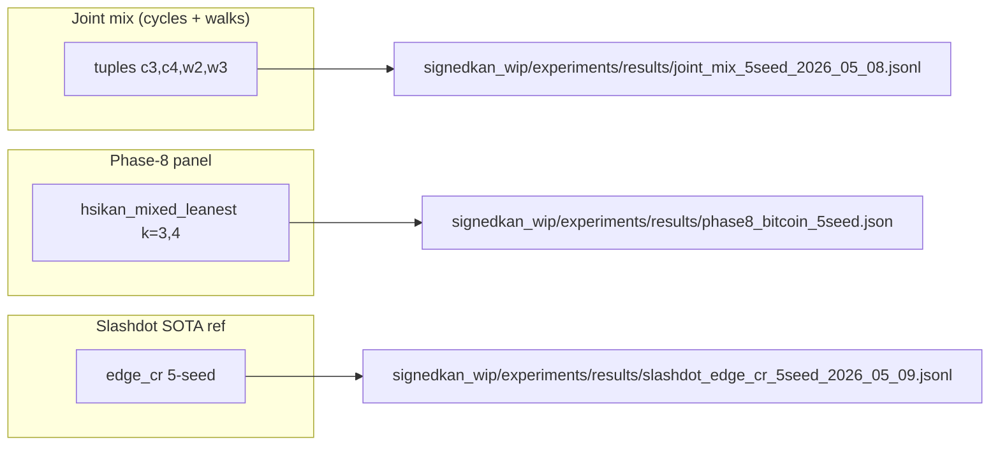
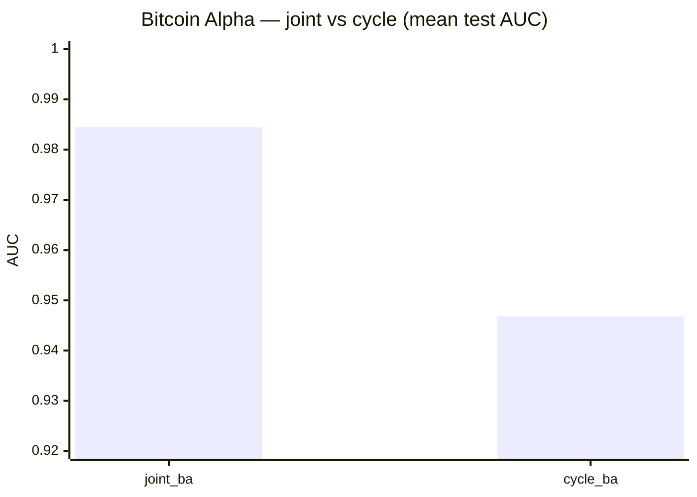
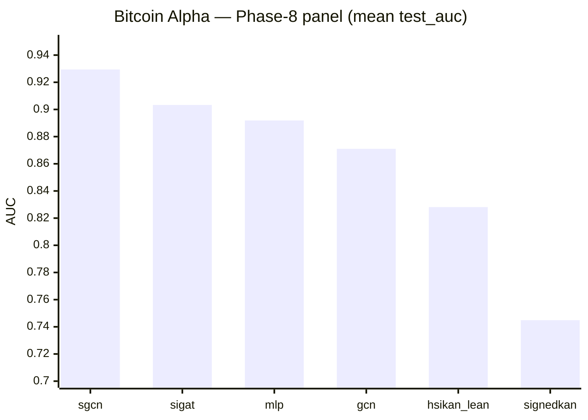
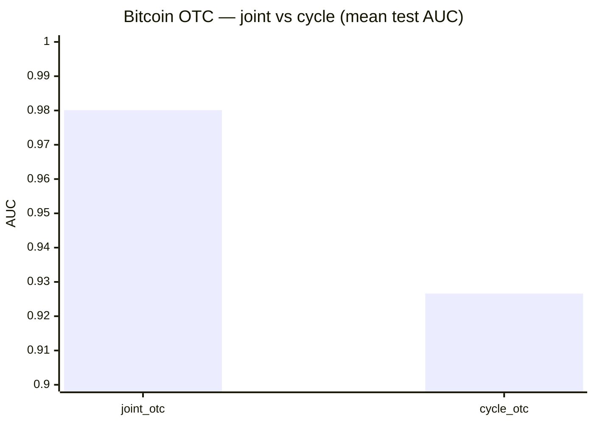
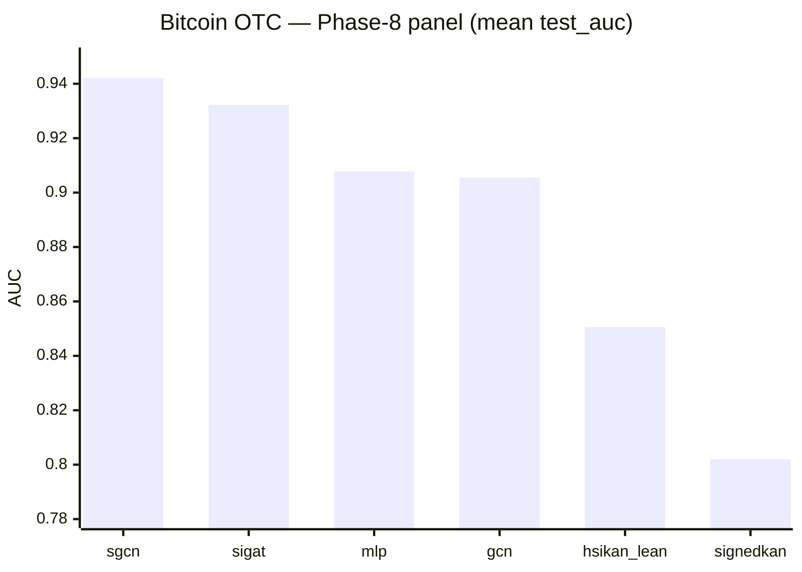
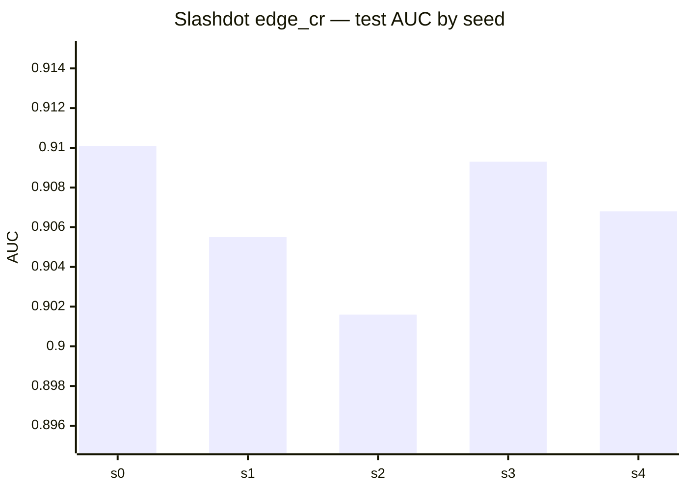

# SOTA snapshot — link prediction & related benchmarks

Also mirrored in the **mdBook** (build `docs/book`, then open **Results & evidence → SOTA snapshot & diagrams**); that chapter includes this file verbatim.

Committed **numeric** artifacts for SignedKAN / HSiKAN / graph LP experiments.  
**Rule:** every figure below maps to a file path; if your run disagrees, update the file and then this page.

**See also:** [`RESULTS_DISCIPLINE.md`](RESULTS_DISCIPLINE.md) (protocol names), [`COLD_START.md`](../COLD_START.md) (onboarding).

---

## 1. Which artifact answers which question

**Do not** merge “joint” and “lean panel” into one verbal score — they are different experiments.

---

## 2. Bitcoin Alpha — mean test AUC (5 seeds)

**Joint vs cycle-only** (`run_label`, `joint_mix_5seed_2026_05_08.jsonl`):

| label | mean AUC |
|-------|----------|
| joint_ba | **0.9845** |
| cycle_ba | 0.9468 |

**Phase-8 multi-arch** (`phase8_bitcoin_5seed.json`, `test_auc` mean over 5 seeds):

| arch | mean |
|------|------|
| sgcn_balance | 0.9294 |
| sigat_attn | 0.9033 |
| mlp_blind | 0.8919 |
| gcn_blind | 0.8710 |
| hsikan_mixed_leanest | 0.8281 |
| signedkan_L1 | 0.7449 |

---

## 3. Bitcoin OTC — mean test AUC (5 seeds)

**Joint vs cycle** (same JSONL; `cycle_otc` has **4** rows in the committed file — one seed missing):

| label | n | mean AUC |
|-------|---:|----------|
| joint_otc | 5 | **0.9801** |
| cycle_otc | 4 | 0.9266 |

**Phase-8 panel** (mean `test_auc`, 5 seeds):

| arch | mean |
|------|------|
| sgcn_balance | 0.9421 |
| sigat_attn | 0.9322 |
| mlp_blind | 0.9077 |
| gcn_blind | 0.9055 |
| hsikan_mixed_leanest | 0.8506 |
| signedkan_L1 | 0.8020 |

---

## 4. Slashdot — `edge_cr` reference (5 seeds)

File: `slashdot_edge_cr_5seed_2026_05_09.jsonl`  
Per-seed AUC: **0.9101, 0.9055, 0.9016, 0.9093, 0.9068** → mean **0.9067**, pstdev **0.0030**.

---

## 5. Epinions — committed snapshots

| artifact | mean AUC (n) | note |
|----------|----------------|------|
| `epinions_edge_cr_5seed_2026_05_09.jsonl` | **0.8464** ± 0.0095 (5) | SiKAN-style edge CR reference |
| `epinions_overnight_2026_05_09.jsonl` | **0.7973** ± 0.0323 (5) | overnight bundle |

---

## 6. Multi-dataset architecture table (5 seeds)

Source: `signedkan_wip/experiments/results/master_table.md`  
(mean±std AUC; excerpt — full table in file.)

| arch | bitcoin_alpha | bitcoin_otc | slashdot |
|------|----------------|-------------|----------|
| sgcn_balance | 0.929±0.010 | 0.942±0.006 | 0.919±0.004 |
| sigat_attn | 0.903±0.008 | 0.932±0.004 | — |
| hsikan_mixed_leanest | 0.828±0.010 | 0.851±0.016 | — |
| hsikan_k3_only_leanest | — | — | 0.614±0.002 |

---

## 7. HymeKo-Gömb vs Slashdot SOTA (reported)

Not re-measured here — narrative + tables: `reports/2026-05-11-hymeko-gomb-slashdot-sota-attempt.md`.  
Headline: Gömb slim mean **~0.9031** vs `edge_cr` reference **~0.9067** (negative attempt at −2.3σ vs that reference).

---

## 8. Renderer note

**Mermaid** `xychart-beta` renders on **GitHub** and many local Markdown previews; if a viewer is too old, use the numeric tables in the same section.

---

## 9. Revision

When you add a new SOTA row, bump the table + chart and update the **Last verified** line at the bottom of this file.

**Last verified against on-disk artifacts:** 2026-05-12 (workspace snapshot).
