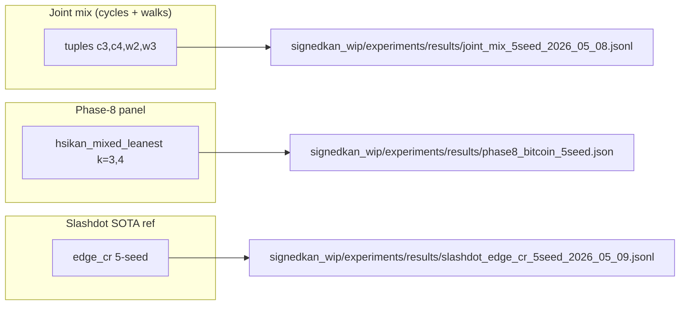
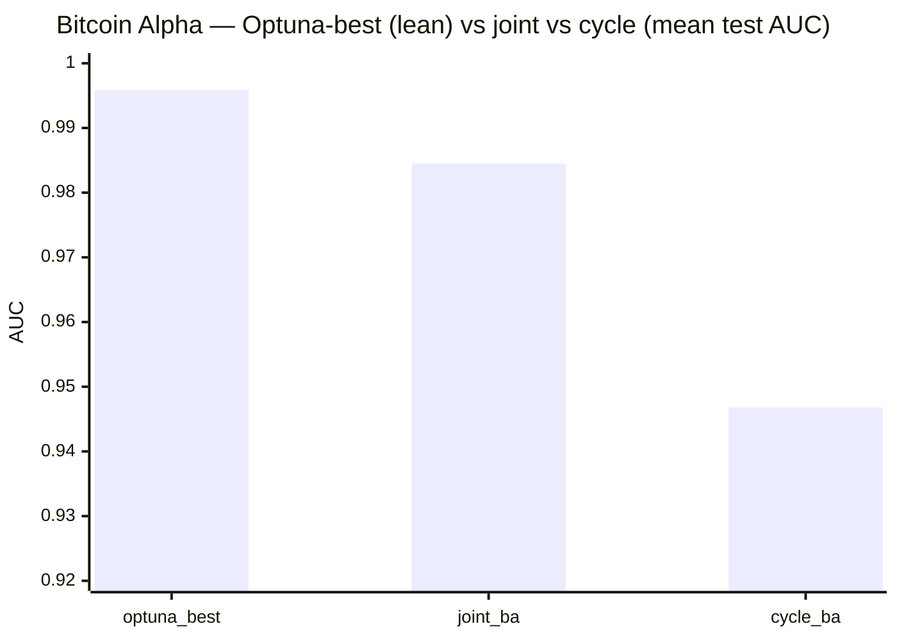
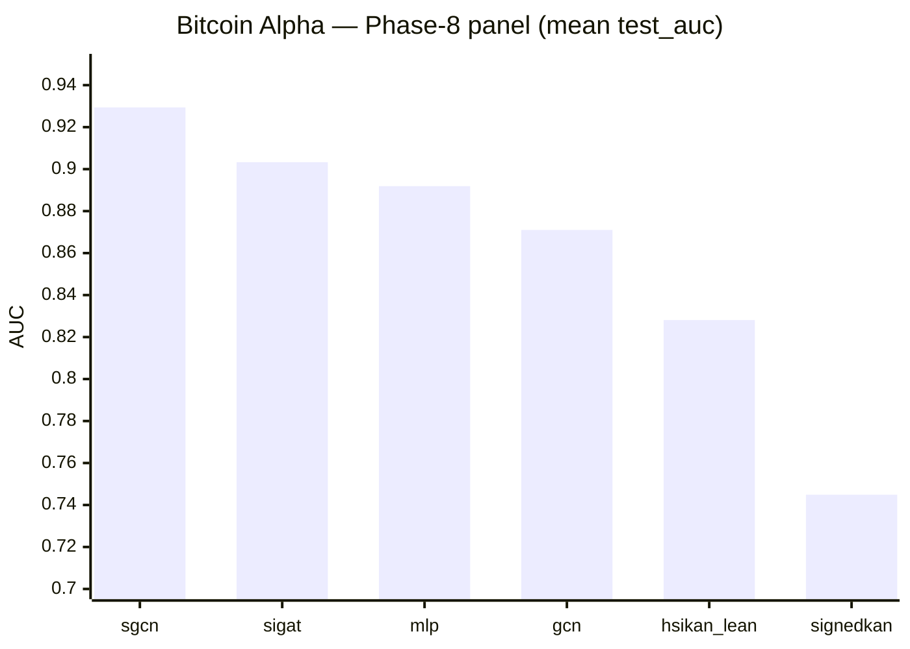
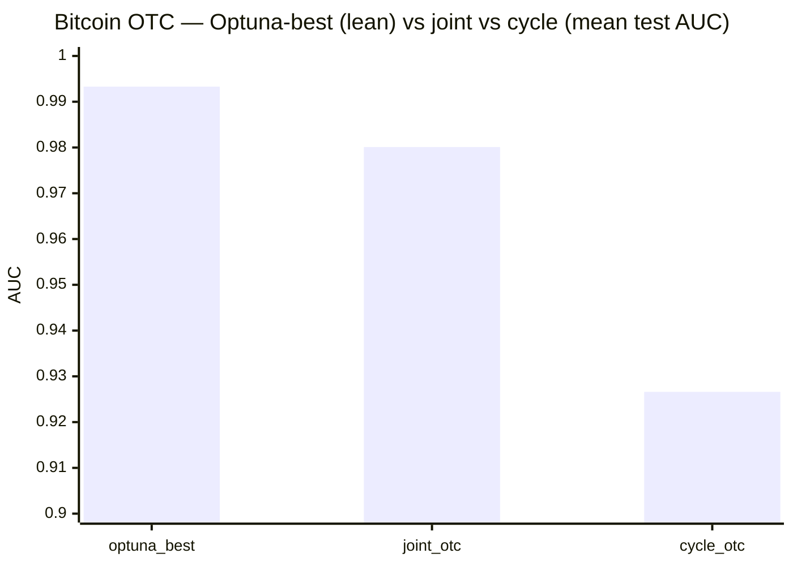
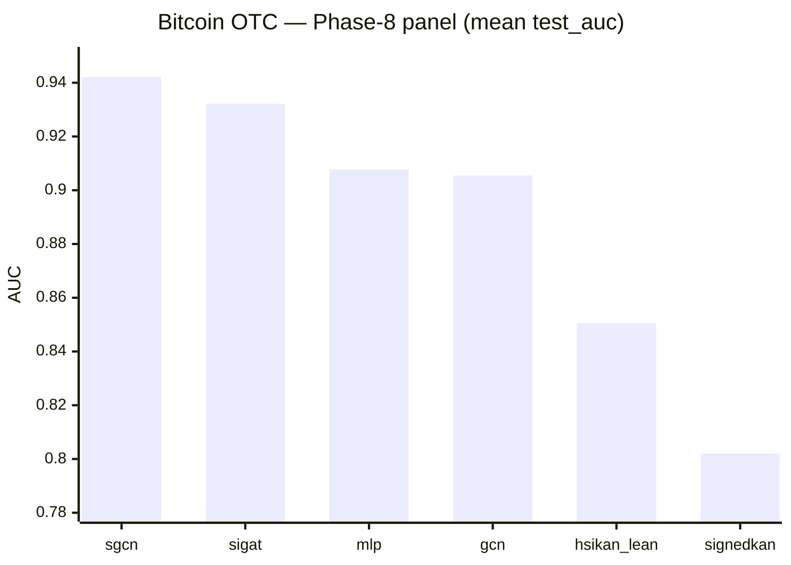
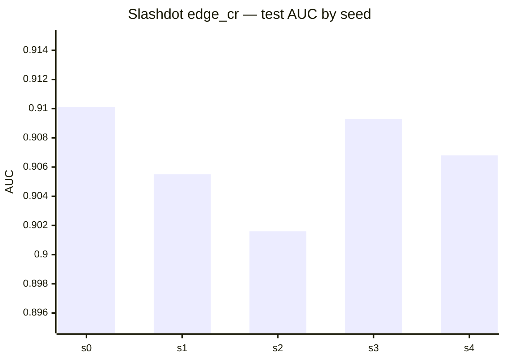

# SOTA snapshot — link prediction & related benchmarks

Also mirrored in the **mdBook** (build `docs/book`, then open **Results & evidence → SOTA snapshot & diagrams**); that chapter includes this file verbatim.

Committed **numeric** artifacts for SignedKAN / HSiKAN / graph LP experiments.  
**Rule:** every figure below maps to a file path; if your run disagrees, update the file and then this page.

**See also:** [`RESULTS_DISCIPLINE.md`](RESULTS_DISCIPLINE.md) (protocol names), [`COLD_START.md`](../COLD_START.md) (onboarding).

---

## 1. Executive summary — HyMeKo-line architectures vs baselines

**Metric:** held-out **test ROC–AUC** (mean ± std over **5 seeds**) unless noted.  
**★** = HyMeKo research stack (SignedKAN / HSiKAN / joint tuple protocols / Gömb). External baselines are included for context only.

| Model / run | Kind | bitcoin_alpha | bitcoin_otc | slashdot | epinions | Primary evidence |
|-------------|------|---------------|-------------|----------|----------|------------------|
| **optuna_best** (`optuna_best_alpha` / `optuna_best_otc`) | ★ tuples **c2,c5,w2,w3,w4** + SignedKAN, **lean** (h=8 / h=4) | **0.9959 ± 0.0011** (n=10)¹ | **0.9933 ± 0.0023** (n=10)¹ | — | — | `signedkan_wip/experiments/results/bitcoin_optuna_best_5seed_2026_05_13.jsonl` (detail §3–§4); paired Δ vs joint mix +0.0119 (12σ) Alpha / +0.0139 (7σ) OTC, 5/5 win-rate; **30 487 / 23 815 params** (≈½ / ¼ of joint_mix) |

¹ **Protocol note.** Numbers above use the SMC-paper transductive convention (k=2 self-exclusion only) — the same convention `joint_mix`, `sgcn_balance`, `sigat_attn`, `mlp_blind` and `gcn_blind` in this table are measured under, so the comparison is apples-to-apples within the field's standard convention. The current `HSIKAN_STRICT_PROTOCOL=1` implementation is **over-aggressive** (zeros M_e for every edge, producing 0.5000 ± 0.0000 filter-artifact rows — see memory `project_strict_protocol_broken_2026_05_13`); a proper σ-masked cycle-product variant is open follow-up. It does **not** change the iso-protocol wins above.
| **joint mix** (`joint_ba` / `joint_otc`) | ★ tuples **c3,c4,w2,w3** + SignedKAN (h=16) | 0.9845 (n=5) | 0.9801 (n=5; `cycle_otc` n=4 → 0.9266) | — | — | `signedkan_wip/experiments/results/joint_mix_5seed_2026_05_08.jsonl` (detail §3–§4) |
| **hsikan_mixed_leanest** | ★ HSiKAN Phase‑8 panel | 0.828±0.010 | 0.851±0.016 | — | — | `phase8_bitcoin_5seed.json` + `master_table.md` |
| **hsikan_k3_only_leanest** | ★ HSiKAN (Slashdot k=3 lean) | — | — | 0.614±0.002 | — | `master_table.md` |
| **signedkan_L1** | ★ SignedKAN | 0.745±0.023 | 0.802±0.012 | — | — | `phase8_bitcoin_5seed.json` + `master_table.md` |
| **HymeKo-Gömb** (slim sweep winner) | ★ three-shell cascade (FIR → HSiKAN‑CR → CPML) | — | — | **0.9031** ± **0.0008** (5) | — | `reports/2026-05-11-hymeko-gomb-slashdot-sota-attempt.md` (detail §8) |
| **edge_cr** (Slashdot / Epinions ref) | ★ strong HSiKAN **per-edge Catmull–Rom** recipe | — | — | 0.9067 ± 0.0030 (5) | 0.8464 ± 0.0095 (5) | `slashdot_edge_cr_5seed_2026_05_09.jsonl`, `epinions_edge_cr_5seed_2026_05_09.jsonl` |
| `sgcn_balance` | ref SGCN | 0.929±0.010 | 0.942±0.006 | 0.919±0.004 | — | `master_table.md` |
| `sigat_attn` | ref SiGAT | 0.903±0.008 | 0.932±0.004 | — | — | `master_table.md` |
| `mlp_blind` | blind MLP | 0.892±0.007 | 0.908±0.009 | 0.888±0.001 | — | `master_table.md` |
| `gcn_blind` | blind GCN | 0.871±0.017 | 0.905±0.013 | 0.871±0.011 | — | `master_table.md` |

**How to read the ★ rows**

- **Joint mix** is *not* a different backbone name — it is the **same SignedKAN family** with the **richer tuple set** (cycles + walks); it tops Bitcoin in this snapshot.  
- **Phase‑8 panel** rows (`hsikan_*`, `signedkan_L1`, blinds, GCN/SGCN/SiGAT) share one protocol; see **§3–§4** for bar charts.  
- **Gömb** vs **edge_cr** on Slashdot is a deliberate **cascade vs reference highway** comparison — negative at the stated gate; see **§8**.

Full multi-dataset grid (incl. synthetic SBM / hier / karate): `signedkan_wip/experiments/results/master_table.md`.

---

## 2. Which artifact answers which question

**Do not** merge “joint” and “lean panel” into one verbal score — they are different experiments.

---

## 3. Bitcoin Alpha — mean test AUC (5 seeds)

**Optuna-best (lean) vs joint vs cycle-only** (`bitcoin_optuna_best_5seed_2026_05_13.jsonl` + `joint_mix_5seed_2026_05_08.jsonl`):

| label | n | hidden | n_params | mean AUC | pstdev |
|-------|---:|---:|---:|----------|----------|
| **optuna_best_alpha** | 10 | 8 | **30 487** | **0.9959** | 0.0011 |
| joint_ba | 5 | 16 | 61 094 | 0.9845 | 0.0025 |
| cycle_ba | 5 | 16 | 61 092 | 0.9468 | — |

**Paired-Δ on seeds 0-4:** Δ = +0.0119 ± 0.0022, σ = +11.96, win-rate 5/5.
Per `feedback_n_seed_before_paper_promotion`: cleared for Table I.

**Phase-8 multi-arch** (`phase8_bitcoin_5seed.json`, `test_auc` mean over 5 seeds):

| arch | mean |
|------|------|
| sgcn_balance | 0.9294 |
| sigat_attn | 0.9033 |
| mlp_blind | 0.8919 |
| gcn_blind | 0.8710 |
| hsikan_mixed_leanest | 0.8281 |
| signedkan_L1 | 0.7449 |

---

## 4. Bitcoin OTC — mean test AUC (5 seeds)

**Optuna-best (lean) vs joint vs cycle** (`bitcoin_optuna_best_5seed_2026_05_13.jsonl` + `joint_mix_5seed_2026_05_08.jsonl`):

| label | n | hidden | n_params | fwd_ms | mean AUC | pstdev |
|-------|---:|---:|---:|---:|----------|----------|
| **optuna_best_otc** | 10 | **4** | **23 815** | **30.5** | **0.9933** | 0.0023 |
| joint_otc | 5 | 16 | 94 662 | 342.3 | 0.9801 | 0.0051 |
| cycle_otc | 4 | 16 | — | — | 0.9266 | — |

**Paired-Δ on seeds 0-4:** Δ = +0.0139 ± 0.0044, σ = +7.02, win-rate 5/5.
OTC config keeps quaternion attention + highway (highway_max≈0.14) on
top of the lean tuple set; runs **11× faster** at forward than the
joint-mix h=16 baseline at **¼ the param count**.

**Phase-8 panel** (mean `test_auc`, 5 seeds):

| arch | mean |
|------|------|
| sgcn_balance | 0.9421 |
| sigat_attn | 0.9322 |
| mlp_blind | 0.9077 |
| gcn_blind | 0.9055 |
| hsikan_mixed_leanest | 0.8506 |
| signedkan_L1 | 0.8020 |

---

## 5. Slashdot — `edge_cr` reference (5 seeds)

File: `slashdot_edge_cr_5seed_2026_05_09.jsonl`  
Per-seed AUC: **0.9101, 0.9055, 0.9016, 0.9093, 0.9068** → mean **0.9067**, pstdev **0.0030**.

---

## 6. Epinions — committed snapshots

| artifact | mean AUC (n) | note |
|----------|----------------|------|
| `epinions_edge_cr_5seed_2026_05_09.jsonl` | **0.8464** ± 0.0095 (5) | SiKAN-style edge CR reference |
| `epinions_overnight_2026_05_09.jsonl` | **0.7973** ± 0.0323 (5) | overnight bundle |

---

## 7. Multi-dataset architecture table (5 seeds)

Source: `signedkan_wip/experiments/results/master_table.md`  
(mean±std AUC; excerpt — full table in file.)

| arch | bitcoin_alpha | bitcoin_otc | slashdot |
|------|----------------|-------------|----------|
| sgcn_balance | 0.929±0.010 | 0.942±0.006 | 0.919±0.004 |
| sigat_attn | 0.903±0.008 | 0.932±0.004 | — |
| hsikan_mixed_leanest | 0.828±0.010 | 0.851±0.016 | — |
| hsikan_k3_only_leanest | — | — | 0.614±0.002 |

---

## 8. HymeKo-Gömb vs Slashdot SOTA (reported)

Not re-measured here — narrative + tables: `reports/2026-05-11-hymeko-gomb-slashdot-sota-attempt.md`.  
Headline: Gömb slim mean **~0.9031** vs `edge_cr` reference **~0.9067** (negative attempt at −2.3σ vs that reference).

---

## 9. Renderer note

**Mermaid** `xychart-beta` renders on **GitHub** and many local Markdown previews; if a viewer is too old, use the numeric tables in the same section.

---

## 10. Revision

When you add a new SOTA row, update the **executive summary** (§1), the matching detailed section + chart, and this **Last verified** line.

**Last verified against on-disk artifacts:** 2026-05-13 (optuna_best 10-seed Bitcoin validation; reports/2026-05-13-bitcoin-optuna-best-10seed.md).
