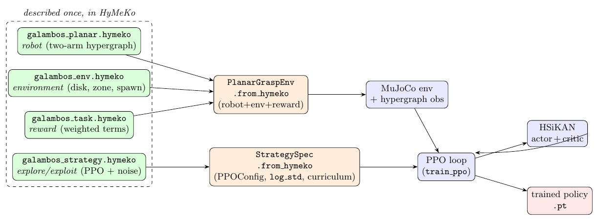
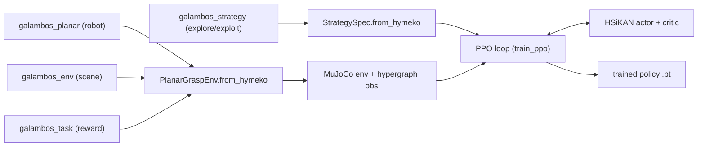
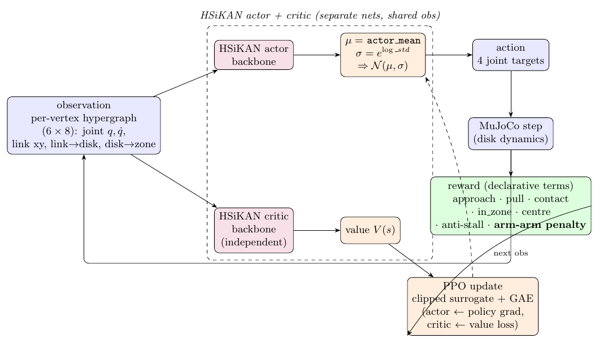
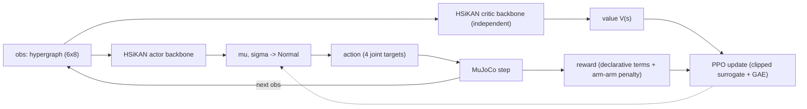

# The Galambos RL setup — architecture

*2026-06-20. Diagrams: [Diagrams/rl_pipeline.pdf](Diagrams/rl_pipeline.pdf),
[Diagrams/rl_agent.pdf](Diagrams/rl_agent.pdf) (TikZ sources alongside; PNGs rendered).*

Two views: the **data pipeline** (everything described once in HyMeKo, composed into a
running MDP) and the **agent / MDP loop** (HSiKAN actor + critic over the hypergraph).

## 1. Data pipeline — everything as data

Four `.hymeko` sources, each describing one concern once:

| source | concern | read by |
|---|---|---|
| `galambos_planar.hymeko` | robot (two-arm kinematic hypergraph) | emitted to MJCF |
| `galambos_env.hymeko` | environment (disk radius, zone, spawn, workspace, success) | `EnvSpec.from_hymeko` |
| `galambos_task.hymeko` | reward (weighted declarative terms) | `RewardSpec.from_hymeko` |
| `galambos_strategy.hymeko` | explore/exploit (PPO config, action noise, curriculum) | `StrategySpec.from_hymeko` |

`PlanarGraspEnv.from_hymeko(robot=, env=, task=)` composes the first three into the running
env; `StrategySpec.from_hymeko` drives the PPO loop and the policy's action-noise scale.
Tuning the task or the exploration tactic is an edit to a `.hymeko`, not the Python.

## 2. Agent / MDP loop — HSiKAN actor + critic

- **State** — per-vertex hypergraph features `(6, 8)`: each link's joint `(q, q̇)`, world
  `(x, y)`, vector to the disk *centre*, and the broadcast disk→zone vector.
- **Policy** — `build_policy("hsikan", …)` builds **two independent `HSiKANBackbone` networks**
  (actor and critic) over the kinematic hypergraph — *not* a shared trunk, so the value loss
  updates only the critic and the policy gradient only the actor. The actor head emits
  `μ = actor_mean`, `σ = exp(log_std)` → `𝒩(μ, σ)`; `log_std` (the exploration tactic) comes
  from the strategy `.hymeko`.
- **Action** — 4 joint position targets, clipped to the actuator range.
- **Transition / reward** — MuJoCo steps the disk; the reward is the declarative term sum
  (approach · pull · contact · in_zone · centre · anti-stall · **arm–arm penalty**).
- **Update** — PPO clipped surrogate + GAE (with the truncation bootstrap), actor ← policy
  gradient, critic ← value loss.

## Honest status (2026-06-20)

The setup works but is not yet a strong result: 100-seed held-out evaluation of the best
checkpoint gives a **25 % goal rate** (95 % Wilson CI 17.5–34.3 %) on the hard task — the
earlier 5/8 was an 8-seed lucky sample. No deaths; failures are timeouts (over-pushing).
The arm–arm collision penalty (this revision) and an explore→exploit noise schedule are the
current levers.
