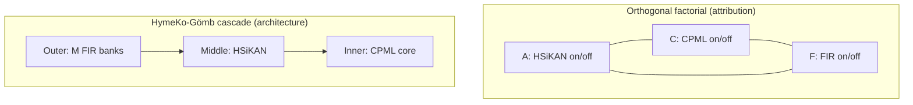

# HymeKo-Gömb and “orthogonal” — three precise meanings

The word **orthogonal** shows up in several places around **HymeKo-Gömb** and the wider SignedKAN / CPML codebase. They are **not** the same concept. This page disambiguates them and points to the authoritative plans.

---

## 1. Cheat sheet

| Meaning | Domain | One-line definition | Where it is formalised |
|--------|--------|---------------------|-------------------------|
| **A. Factorial axes** | Experimental design | Three toggles \(A,C,F \in \{0,1\}\) for **HSiKAN**, **CPML topology**, **Clifford-FIR** — statistically *independent factors* in a \(2^3\) grid. | `docs/plans/2026-05-11-hsikan-cpml-fir-orthogonal/plan.tex` |
| **B. Gömb cascade** | Architecture | **Not** factorial: FIR → HSiKAN → CPML in a **fixed order**; all three **on**, different **radii** (roles), one forward path. | `docs/plans/2026-05-11-hymeko-gomb-sphere/plan.tex` |
| **C. Outer-bank diversity** | Optimisation / risk | Optional encouragement that the \(M\) parallel Clifford-FIR **banks** do not collapse to the same filter — e.g. **orthogonality regularisation** on bank coefficients. | Same sphere plan, §Risk anticipation |

---

## 2. Orthogonal **factorial** (HSiKAN × CPML × FIR)

For **attribution** (“which primitive carries the lift?”), the repo uses an **orthogonal-dimension factorial**: each of three architectural ingredients is an **axis** that can be on or off **independently** of the others.

Let \(A\) = HSiKAN active, \(C\) = CPML (tier-stratified topology) active, \(F\) = Clifford-FIR active. Test loss (e.g. mean AUC) \(L(D,A,C,F)\) on design points \((A,C,F) \in \{0,1\}^3\) is decomposed into main effects and interactions (full \(2^3\) model with embedding floor \(\mu_D\)):

\[
L(D,A,C,F)
=
\mu_D
+ \alpha A + \gamma C + \varphi F
+ \alpha\gamma\, AC + \alpha\varphi\, AF + \gamma\varphi\, CF
+ \alpha\gamma\varphi\, ACF
+ \varepsilon .
\]

**Operational meaning:** “orthogonal” = **statistical independence of factors** in the experiment — *not* “perpendicular vectors in \(\mathbb{R}^d\)” unless you deliberately add that regulariser (meaning C below overlaps only by analogy).

**Code / harness:** factorial runners (e.g. `signedkan_wip/src/run_cpml_factorial.py`) and the plan directory **`docs/plans/2026-05-11-hsikan-cpml-fir-orthogonal/`**.

**Related CPML knob:** inside a **single** CPML stack, `aggregator_kind` makes **HSiKAN vs MLP** an axis **orthogonal to** “flat vs tiered topology” — a **2×2** design at the CPML layer (`signedkan_wip/src/cpml.py`, `CPMLConfig` docstring).

---

## 3. HymeKo-Gömb — **contrast** with the factorial (cascade, not orthogonal axes)

**HymeKo-Gömb** (*gömb* = sphere) is defined in opposition to toggling axes independently:

> In contrast to the **orthogonal-factorial design** (where HSiKAN, CPML, Clifford-FIR are **independently toggled** axes), HymeKo-Gömb is a **cascade**: **all three are mandatory** but each operates at a **distinct radius** through the computation.

So in Gömb:

- **Outer shell (volume):** \(M\) parallel Clifford-FIR **banks** on the same cycle pool → concat (or routed) volume of features.  
- **Middle shell:** **one** HSiKAN (Catmull–Rom) pass on `[embed ∥ outer]`.  
- **Inner core:** **one** CPML pass (default stub: MLP tiers) on `[embed ∥ outer ∥ middle]`.

Forward path (see `signedkan_wip/src/hymeko_gomb/cascade.py`):

\[
X \;\to\; H_{\mathrm{outer}} \;\to\; H_{\mathrm{middle}} \;\to\; H_{\mathrm{core}} \;\to\; \text{edge head}.
\]

**Takeaway:** Gömb is **not** “the orthogonal definition of the architecture” in the factorial sense — it is the **deliberately non-orthogonal arrangement** (fixed pipeline) chosen when you believe **all three roles** must co-exist in a **hierarchy**, not be ablated independently.

Validation in the plan compares Gömb against (among others) the **best factorial cell** — “cascade must exceed orthogonal-best” is an explicit gate in `plan.tex` §Validation.

---

## 4. Sphere figure: three axes and three shells

The **gömb** (sphere) metaphor: **shells** are **concentric cascade radii** (outer FIR → middle HSiKAN → inner CPML). We can still assign the three **drawn axes** to something rigorous from §2.

### 4.1 Orthogonal directions = factorial main-effect contrasts

In a **balanced** full \(2^3\) factorial with \(\pm 1\) coding on each factor, the design columns for

- \(A\) — HSiKAN on/off,  
- \(C\) — CPML (tiered topology) on/off,  
- \(F\) — Clifford-FIR on/off  

are **pairwise orthogonal**. Let \(c_A, c_C, c_F \in \{-1,+1\}^8\) be those columns (one entry per treatment cell). Then \(c_A^\top c_C = c_A^\top c_F = c_C^\top c_F = 0\). After normalisation,

\[
u_A = \frac{c_A}{\|c_A\|},\quad
u_C = \frac{c_C}{\|c_C\|},\quad
u_F = \frac{c_F}{\|c_F\|},
\]

we obtain an **orthonormal triple** \(\{u_A, u_C, u_F\}\) spanning the **three-dimensional main-effect subspace** of the factorial model in §2 (orthogonal to the grand mean and to interaction columns in the full model).

**Interpretation:** \(u_F, u_A, u_C\) are **attribution directions** in experiment space — *which* primitive moves the loss when toggled independently. They are **not** the same object as the **forward cascade** \(X \to H_{\mathrm{outer}} \to H_{\mathrm{middle}} \to H_{\mathrm{core}}\); the figure **pairs** the cascade (shells) with the factorial orthogonal triple (axes) as a **mnemonic**, not as a literal state-space chart of Gömb.

### 4.2 Figure (axes = \(u_F, u_A, u_C\); shells = cascade)

The **blue** axis is \(u_F\) (**F**IR / Clifford), the **purple** axis is \(u_A\) (**A** / HSiKAN), the **red** axis is \(u_C\) (**C** / CPML topology). Shell colours match the cascade roles (outer / middle / inner).

<figure class="gomb-sphere-diagram">

<svg xmlns="http://www.w3.org/2000/svg" viewBox="0 0 440 400" role="img" aria-labelledby="gombTitle gombDesc">
  <title id="gombTitle">HymeKo-Gömb: sphere with factorial contrast axes u_F, u_A, u_C and three cascade shells</title>
  <desc id="gombDesc">Axes show orthogonal main-effect directions for FIR, HSiKAN, and CPML in a balanced 2-cubed factorial; concentric shells show the Gömb cascade order.</desc>
  <defs>
    <radialGradient id="sphereShade" cx="38%" cy="35%" r="65%">
      <stop offset="0%" stop-color="#eceff1"/>
      <stop offset="45%" stop-color="#b0bec5"/>
      <stop offset="100%" stop-color="#78909c"/>
    </radialGradient>
    <filter id="softShadow" x="-20%" y="-20%" width="140%" height="140%">
      <feDropShadow dx="0" dy="4" stdDeviation="6" flood-opacity="0.25"/>
    </filter>
  </defs>
  <!-- equator ellipse (back half, subtle) -->
  <ellipse cx="220" cy="218" rx="128" ry="46" fill="none" stroke="#90a4ae" stroke-width="1.2" stroke-dasharray="4 5" opacity="0.55"/>
  <!-- outer shell (FIR volume) -->
  <circle cx="220" cy="200" r="132" fill="none" stroke="#1565c0" stroke-width="3" stroke-dasharray="10 7" opacity="0.85"/>
  <!-- middle shell (HSiKAN) -->
  <circle cx="220" cy="200" r="98" fill="none" stroke="#2e7d32" stroke-width="4" opacity="0.9"/>
  <!-- inner core (CPML) -->
  <circle cx="220" cy="200" r="64" fill="url(#sphereShade)" stroke="#4a148c" stroke-width="2.5" filter="url(#softShadow)"/>
  <!-- meridian arc (front) -->
  <ellipse cx="220" cy="200" rx="132" ry="48" fill="none" stroke="#546e7a" stroke-width="1.5" opacity="0.5"/>
  <!-- u_C (CPML main-effect contrast) — vertical -->
  <line x1="220" y1="200" x2="220" y2="52" stroke="#c62828" stroke-width="2.5" stroke-linecap="round"/>
  <polygon points="220,44 215,58 225,58" fill="#c62828"/>
  <text x="228" y="62" font-size="14" font-family="Georgia,serif" fill="#c62828" font-style="italic">u</text>
  <text x="236" y="66" font-size="11" font-family="system-ui,sans-serif" fill="#c62828">C</text>
  <text x="242" y="76" font-size="10" font-family="system-ui,sans-serif" fill="#37474f">CPML</text>
  <!-- u_F (FIR main-effect contrast) — blue arm -->
  <line x1="220" y1="200" x2="333.2" y2="265" stroke="#1565c0" stroke-width="2.5" stroke-linecap="round"/>
  <polygon points="339,268 325,262 328,254" fill="#1565c0"/>
  <text x="318" y="252" font-size="14" font-family="Georgia,serif" fill="#1565c0" font-style="italic">u</text>
  <text x="326" y="256" font-size="11" font-family="system-ui,sans-serif" fill="#1565c0">F</text>
  <text x="332" y="268" font-size="10" font-family="system-ui,sans-serif" fill="#37474f">FIR</text>
  <!-- u_A (HSiKAN main-effect contrast) — purple arm -->
  <line x1="220" y1="200" x2="106.8" y2="265" stroke="#6a1b9a" stroke-width="2.5" stroke-linecap="round"/>
  <polygon points="101,268 112,254 115,262" fill="#6a1b9a"/>
  <text x="118" y="252" font-size="14" font-family="Georgia,serif" fill="#6a1b9a" font-style="italic">u</text>
  <text x="126" y="256" font-size="11" font-family="system-ui,sans-serif" fill="#6a1b9a">A</text>
  <text x="100" y="268" font-size="10" font-family="system-ui,sans-serif" fill="#37474f">HSiKAN</text>
  <!-- center -->
  <circle cx="220" cy="200" r="4" fill="#263238"/>
  <!-- shell labels -->
  <text x="358" y="118" font-size="12" font-family="system-ui,sans-serif" fill="#1565c0" font-weight="600">Outer · Clifford-FIR</text>
  <text x="358" y="134" font-size="11" font-family="system-ui,sans-serif" fill="#37474f">volume · M banks</text>
  <text x="332" y="168" font-size="12" font-family="system-ui,sans-serif" fill="#2e7d32" font-weight="600">Middle · HSiKAN</text>
  <text x="332" y="184" font-size="11" font-family="system-ui,sans-serif" fill="#37474f">Catmull–Rom shell</text>
  <text x="268" y="212" font-size="12" font-family="system-ui,sans-serif" fill="#4a148c" font-weight="600">Inner · CPML</text>
  <text x="268" y="228" font-size="11" font-family="system-ui,sans-serif" fill="#37474f">tiered core</text>
</svg>

<figcaption>
<strong>Axes</strong> \(u_F, u_A, u_C\): unit **main-effect contrast vectors** for the balanced \(2^3\) factorial (§2); \(u_F^\top u_A = u_F^\top u_C = u_A^\top u_C = 0\). 
<strong>Shells</strong> (outward → inward): the **Gömb cascade** \(H_{\mathrm{outer}}\to H_{\mathrm{middle}}\to H_{\mathrm{core}}\) — not a trajectory in \((u_F,u_A,u_C)\)-space; the triple is a **design-theoretic** orthogonal basis tied to \((F,A,C)\).
</figcaption>
</figure>

---

## 5. Outer-shell **bank** orthogonality (optional regularisation)

A **different** use of “orthogonal” appears in **risk mitigation** for the outer FIR **volume**:

> If \(M\) FIR banks converge to **similar coefficients**, the outer shell adds no diversity over a single Clifford-FIR layer. **Mitigation:** encourage diversity via **orthogonality regularisation** on the bank coefficients, or diverse initialisation (varied seeds per bank).

Here “orthogonal” is closer to the **linear-algebraic** idea: coefficient vectors (or their spans) across banks should stay **separated** — a **training prior**, not the factorial \(2^3\) design.

Implementation today relies primarily on **staggered initialisation** of \((a^{(m)}, b^{(m)})\) across banks (`OuterFIRShell` in `signedkan_wip/src/hymeko_gomb/shells.py`); explicit **\(\langle w^{(m)}, w^{(m')}\rangle = 0\)** penalties are a plan-level option, not a hard-coded invariant.

---

## 6. Diagram: factorial vs Gömb

---

## 7. Further reading

| Document | Role |
|----------|------|
| `docs/plans/2026-05-11-hymeko-gomb-sphere/plan.tex` | Full Gömb math (outer / middle / inner), validation gate vs `edge_cr` and factorial best. |
| `docs/plans/2026-05-11-hsikan-cpml-fir-orthogonal/plan.tex` | Full \(2^3\) factorial definition and effect decomposition. |
| `reports/2026-05-11-hymeko-gomb-sphere.md` | Feasibility + smoke results. |
| `reports/2026-05-11-hymeko-gomb-slashdot-sota-attempt.md` | Slashdot SOTA comparison (negative at stated gate). |

---

**Contract:** if a sentence says “Gömb is orthogonal”, ask **which orthogonal** — factorial axes (A), cascade *non*-factorial design (B), or bank-vector regularisation (C). Mixing them is how false summaries creep in.
