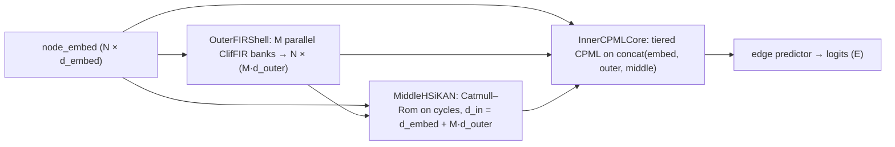

# Neural network variants & layer geometry (signedkan_wip)

This page is a **field guide** to the main **PyTorch** architectures in `signedkan_wip/src/`: how tensors flow, which modules stack, and how experiment names map to code. For **equations** and citations see [HSiKAN architecture](./hsikan.md); for **Gömb vs factorial “orthogonal”** see [HymeKo-Gömb: “orthogonal” meanings](./gomb-orthogonal.md).

---

## 0. Roadmap: which class for which benchmark row?

| Experiment label / family | Primary `nn.Module` | Entry points |
|---------------------------|---------------------|----------------|
| `signedkan_L1`, Phase‑8 SignedKAN | `MixedAritySignedKAN` with **cycle-only** tuple specs | `run_final_cell.py` → `cell_signed_graph` |
| `hsikan_*`, `joint_ba` / `joint_otc` (tuples **c3,c4,w2,w3**) | `MixedAritySignedKAN` with **mixed cycles + walks** | same + `HSIKAN_MIXED_TUPLES` env |
| `sgcn_balance` | `SGCN` | `run_final_cell.py` |
| `sigat_attn` | `SiGAT` | `run_final_cell.py` |
| `mlp_blind`, `gcn_blind` | small MLP / 2‑layer GCN + edge head | `run_final_cell.py` (Phase‑8 panel) |
| CPML stack (factorial / smoke) | `CPML` (`cpml.py`) | `run_cpml_factorial.py`, `run_cpml_smoke.py` |
| HymeKo‑Gömb | `HymeKoGomb`, `MixedArityGomb`, ablations | `run_gomb_smoke.py`, `hymeko_gomb/cascade.py` |

**Shared training kernel** for most signed‑graph rows: `cell_signed_graph` in `signedkan_wip/src/run_final_cell.py` (loads graph → builds per‑tuple sparse incidence → trains → reports test AUC).

---

## 1. `SignedKANLayer` — one hypergraph “layer” over arity *k*

**File:** `signedkan_wip/src/signedkan.py`

**Role:** Map vertex embeddings and a fixed set of signed **k‑tuples** (triangles, 4‑cycles, or walk‑vertices as tuples) into **tuple embeddings**, then (outside this class) into **edge logits** via sparse incidence \(M_e\).

**Internals (conceptual):**

- **Vertex branch:** per‑vertex features pass through **sign‑split spline banks** (Catmull–Rom / B‑spline / Kochanek–Bartels per config).
- **Edge branch:** same idea on tuple‑side pooled features.
- **Balance / Option‑C:** contributions from `+` / `−` signed sub‑aggregates are combined per the configured signed‑incidence option.

**Config:** `SignedKANConfig` — `hidden_dim`, `grid`, `k`, `spline_kind`, residual / highway flags.

---

## 2. `MultiLayerSignedKAN` — depth on the **vertex** manifold

**File:** `signedkan_wip/src/signedkan.py` (`MultiLayerSignedKAN`, `MultiLayerSignedKANConfig`)

**Stacking pattern (per layer \(\ell\)):**

1. **Tuple forward:** `SignedKANLayer` produces tuple embeddings \(h_t^{(\ell)}\) from current vertex embeddings \(h_v^{(\ell-1)}\).
2. **Vertex scatter:** triad / tuple features scatter‑mean (or sum, per `pool_mode`) back to vertices → residual update \(h_v^{(\ell)}\).
3. **Repeat** for `n_layers` (either **distinct** `SignedKANLayer` instances or **one shared** layer reapplied — `share_weights`).

**On top of the stack:**

- **Jumping Knowledge:** `jk_mode` ∈ `{last, sum, concat}` — how layer outputs feed the final tuple representation before edge pooling.
- **Node embedding:** `nn.Embedding(n_nodes, hidden_dim)` is owned here.

**Typical Phase‑8 recipe:** `n_layers=2`, `hidden_dim=16`, `jk_mode="concat"`, highway / inner‑skip as in `MultiLayerSignedKANConfig` defaults used by `run_phase8_sota_chase` / `cell_signed_graph`.

---

## 3. `MixedAritySignedKAN` — one spline stack, many **tuple slots**

**Package:** `signedkan_wip/src/mixed_arity_signedkan/` (`model.py`, `config.py`, `encoding_*.py`, `attention.py`)

**Idea:** Reuse **one** `MultiLayerSignedKAN` (`cfg.base`) for **every** tuple specification (e.g. c3, c4, w2, w3). Each slot has the **same** spline weights (`share_weights=True` is **required**); what differs per slot is the **enumerated tuple set** and its sparse \(M_e^{(slot)}\).

**Learned fusion:**

- **Global α:** `arity_logits` → softmax → blend slot-wise edge embeddings before the classifier.
- **Optional `per_edge_gate`:** small MLP on endpoint features → softmax over slots **per edge**.
- **Optional `attention_m_e`:** dot or quaternion attention from query edges into cycle features (disables cycle batching when both are on — see `run_final_cell` warnings).

**Encoding paths:**

- **`encoding_full.py`:** full graph forward (all tuples at once).
- **`encoding_batched.py`:** chunked forward when `cycle_batch_size` is set (bounds peak activation memory).

**Tuple modes** (parsed in `cell_signed_graph` from `RuntimeConfig` / env):

| Mode | Env / config | Tuple specs |
|------|----------------|---------------|
| Cycles only | default `HSIKAN_ARITIES` / per‑dataset | `("cycle", k, None)` for each k |
| Walks only | `HSIKAN_WALK_LENS` | `("walk", L+1, L)` |
| Joint mix | `HSIKAN_MIXED_TUPLES=c3,c4,w2,w3` | cycles + walks interleaved as independent slots |

---

## 4. Baselines (same edge head protocol)

### 4.1 SGCN (`baselines/sgcn_model.py`)

**Structure:** alternate **balanced** / **unbalanced** message passing on **positive** vs **negative** adjacency; each layer updates two channels \(h^B, h^U\). **Readout:** `z_v = [h^B_v ; h^U_v]`, then MLP on `[z_u ; z_v]` for link sign.

### 4.2 SiGAT (`baselines/sigat_model.py`)

**Structure:** same positive/negative **neighbour buckets** as SGCN, but aggregation is **multi‑head attention** from the centre node to motif‑typed neighbours; concatenate with self; edge MLP as SGCN.

**Note:** In‑protocol reimplementation for apples‑to‑apples BCE training — not the full 38‑motif directed reference of Huang et al.

---

## 5. CPML — **tiers as routes** (default) vs **inward pyramid** (legacy)

**File:** `signedkan_wip/src/cpml.py` — `CPMLConfig.topology ∈ {route, pyramid}`, `tier_organization ∈ {structural, capsule_soft}` (`capsule_soft` **route only**).

**Tier assignment:** vertices binned by **degree percentiles** (`TierSpec.cuts`) → `tier_of[v] ∈ {0,…,L−1}`. Under **`structural`** routing, tier **ℓ** uses only cycles that **touch** at least one vertex in tier ℓ — **tier is a routing predicate on cycles**.

**Per tier (`structural`):** each `Agg_ℓ` (MLP stub, **SignedKAN** / spline `SignedKANTierAggregator`, or **Clifford‑FIR**) maps **corner features** of cycles in tier ℓ’s pool to per‑cycle vectors, then **scatter‑mean** to \(H_\ell\). Under **`capsule_soft`**, every tier’s `Agg_ℓ` sees **all** cycles, weighted by a learned softmax over tiers (§5.2).

### 5.1 `topology="route"` (**default**)

- Every tier reads corner features from the **same base** \(X^{(0)}\) (`node_features`).
- Outputs \(H_0,\ldots,H_{L-1}\) are **concatenated once** with \(X^{(0)}\) → final width \(d_{\mathrm{in}} + L\,d_{\mathrm{layer}}\) for the edge head.
- **Interpretation:** **Highway‑like** carry of \(X^{(0)}\); **Capsule‑like** *structural* routing (hard \(0/1\) cycle→tier from incidence); **KAN‑like** corner nonlinearities when `aggregator_kind="hsikan"`. Full maths + citations: **[CPML routes: Highway · Capsule · KAN](./cpml-routing-highway-capsule-kan.md)**.

### 5.2 `tier_organization` — structural vs capsule-soft

- **`structural` (default):** tier ℓ uses only cycles touching tier ℓ (same predicate as above).
- **`capsule_soft`:** **route topology only** — an MLP softmax assigns each cycle a weight vector over all \(L\) tiers; every tier’s aggregator sees **all** cycles, scaled by that weight, then scatter-mean. `GombConfig.cpml_tier_organization` / `CPMLConfig.tier_organization`.

### 5.3 `topology="pyramid"` (legacy)

- Tier ℓ’s aggregator sees the **widening** concat of all previous route outputs (original concentric‑pyramid funnel).
- Same final width as route mode; **more parameters** in upper‑tier MLPs and typically **higher activation memory**.

**HSiKAN vs MLP inside CPML:** `CPMLConfig.aggregator_kind` switches the per‑tier block between a stub MLP and a **Catmull–Rom / spline** aggregator — a **2×2** style factorial (aggregator × flat/tiered) at the CPML layer in smoke scripts; see `run_cpml_factorial.py` and `docs/plans/2026-05-11-cpml-xhc-architectures/`.

**Gömb:** `GombConfig.cpml_topology` and **`cpml_tier_organization`** thread into every `InnerCPMLCore`. CLI:  
`python -m signedkan_wip.src.run_gomb_smoke --cpml-topology route|pyramid --cpml-tier-organization structural|capsule_soft`  
(`capsule_soft` requires `route`.)

---

## 6. HymeKo‑Gömb — three shells, fixed cascade order

**Files:** `signedkan_wip/src/hymeko_gomb/cascade.py`, `shells.py`

**Full model `HymeKoGomb`:**

**Tensor concatenation rules:**

- After outer: `x_for_middle = cat(embed, x_outer)`.
- After middle: `x_for_core = cat(embed, x_outer, x_middle)`.
- **Single‑arity `HymeKoGomb`:** one cycle arity from the Rust enumerator (`run_gomb_smoke.py` default).
- **`JointMixGomb` + `--joint-mix`:** four tuple slots **c3, c4, w2, w3** (cycles + length‑2/3 walks) with learned **α** over **edge logits** — same joint recipe as HSiKAN `joint_ba`, separate `nn.Module` stack.

**Ablations (separate classes, no forward‑time flags):**

| Class | Dropped shell |
|-------|----------------|
| `GombNoOuter` | Outer FIR |
| `GombNoMiddle` | Middle HSiKAN |
| `GombNoInner` | Inner CPML → shallow MLP edge head |

**`MixedArityGomb`:** one full **(outer, middle, inner)** stack **per** cycle arity in `cycle_ks`; **learned softmax αₖ** fuses per‑arity **edge logits** (not the same object as `MixedAritySignedKAN`’s tuple‑slot α).

---

## 7. How this connects to the results table

- **Phase‑8 panel** rows compare **the same `MixedAritySignedKAN` plumbing** under different tuple sets and baselines — see [SOTA snapshot & diagrams](../results/sota-snapshot.md).
- **`joint_ba`** is **not** a different `nn.Module` name — it is **MixedAritySignedKAN** with `HSIKAN_MIXED_TUPLES=c3,c4,w2,w3` (see `run_overnight_joint_mix_2026_05_08.sh`).
- **Gömb** rows come from **`run_gomb_smoke.py`**; **`JointMixGomb`** matches the **c3,c4,w2,w3** tuple protocol for apples‑to‑apples comparisons with **`joint_ba`** HSiKAN (different module family, same pools when configured).

---

## 8. Further reading

| Topic | Where |
|-------|--------|
| Build HSiKAN from `.hymeko` | [Quickstart: Build an HSiKAN architecture](../quickstart/08-hsikan-architecture.md) |
| HyMeKo training walker | [HyMeKo-driven training](./hymeko-driven.md) |
| Abbreviations (`edge_cr`, tuple notation) | [Abbreviations & symbols](../results/abbreviations.md) |
| CPML × XHC plan | `docs/plans/2026-05-11-cpml-xhc-architectures/plan.tex` |
| Gömb sphere plan | `docs/plans/2026-05-11-hymeko-gomb-sphere/plan.tex` |
| CPML route = Highway+Capsule+KAN lens | [CPML routes: Highway · Capsule · KAN](./cpml-routing-highway-capsule-kan.md) |
