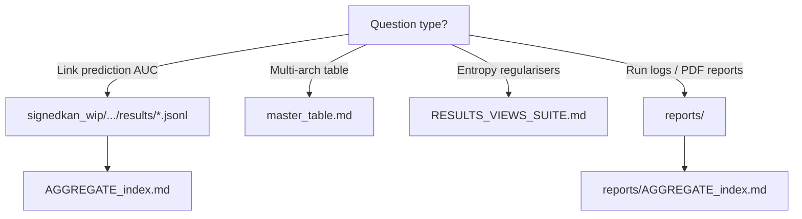

# Artifact index (experiment & report trees)

Large inventories are **not** duplicated here — open the generated indexes in the repo.

## SignedKAN / HSiKAN experiment results

**Path:** `signedkan_wip/experiments/results/`  
**Index:** `signedkan_wip/experiments/results/AGGREGATE_index.md`

Snapshot facts (see index for exact counts):

- **~150** files: mostly `.json` / `.jsonl`, plus `master_table.md`, `positivity_summary.md`, subdirs `phase3_sweep/`, `ablation/`.
- Largest stream in the snapshot: **`phase8_overnight_grid.jsonl`** (hundreds of lines).

## Orchestration & narrative reports

**Path:** `reports/`  
**Index:** `reports/AGGREGATE_index.md`

Contains overnight **`.json` + `.err` pairs**, LaTeX/PDF briefs, and dated **`reports/*.md`** task reports.

## Thesis IV entropy suite (separate programme)

**Path:** `RESULTS_VIEWS_SUITE.md` (repository root, **not** under `signedkan_wip/`).

111 paired regulariser experiments — **do not conflate** with link-prediction JSONLs above.

## Diagram: where to look first

## Agents: maintenance rule

When you add a **new top-level result file**, append a one-line entry to the appropriate **`AGGREGATE_index.md`** (or extend the auto-regeneration instructions there). When headline metrics change, update **`docs/SOTA_RESULTS.md`** and **`docs/RESULTS_DISCIPLINE.md`**.
