# Bitcoin Optuna vs SOTA snapshot

This page tracks the **current Optuna maxima** for HymeKo-Gomb on Bitcoin and
compares them to committed SOTA-reference rows.

> Protocol note: the Gomb Optuna values below are **single-trial best values**
> from search logs; reference rows are **5-seed means** from the SOTA snapshot.
> Treat this as a progress view, not a final apples-to-apples leaderboard.

## Values

| Dataset | Gomb Optuna best (single trial) | Joint mix (5-seed mean) | SGCN balance (5-seed mean) | SiGAT attn (5-seed mean) |
|---|---:|---:|---:|---:|
| bitcoin_alpha | **0.9972** | 0.9845 | 0.9294 | 0.9033 |
| bitcoin_otc | **0.9957** | 0.9801 | 0.9421 | 0.9322 |

## Quick chart

```mermaid
xychart-beta
    title "Bitcoin AUC snapshot (Optuna best vs reference means)"
    x-axis ["alpha", "otc"]
    y-axis "AUC" 0.88 --> 1.00
    bar [0.9972, 0.9957]
    bar [0.9845, 0.9801]
    bar [0.9294, 0.9421]
    bar [0.9033, 0.9322]
```

## Sources

- Optuna Alpha best (0.9972, trial 23): `signedkan_wip/experiments/results/optuna_alpha_slashdot_20260513T010509Z.log`
- Optuna OTC progression: `signedkan_wip/experiments/results/follow_optuna_20260513T003359Z.log`
- SOTA reference table: `docs/SOTA_RESULTS.md`
