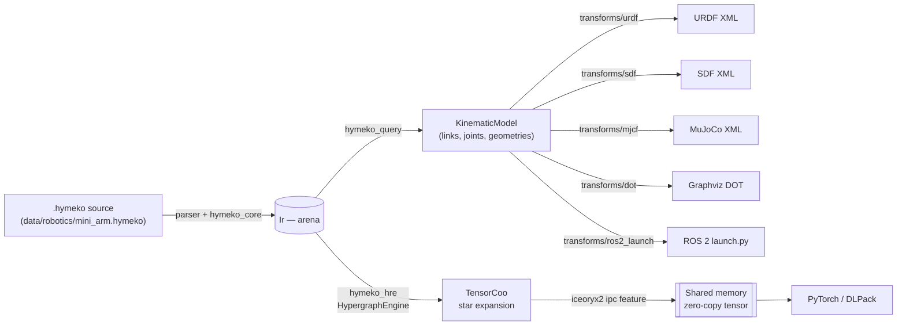
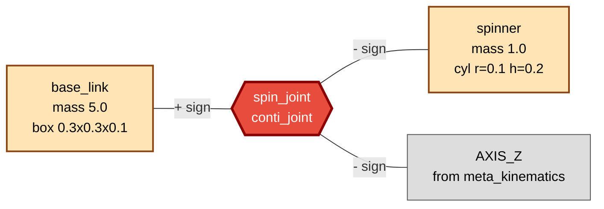
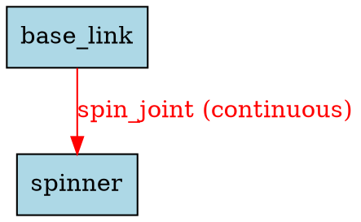
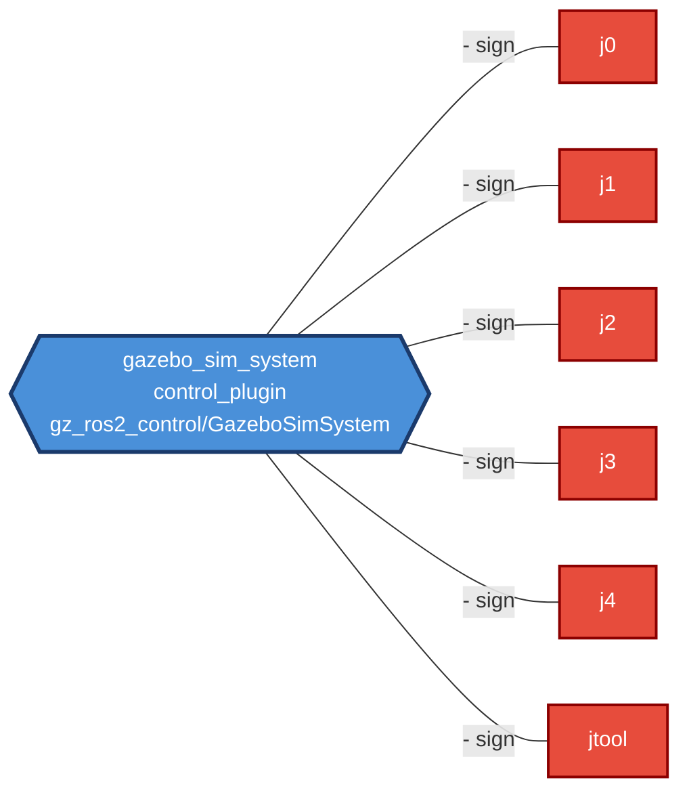

# Example Visualizations

Visual renderings of the shipped robotics fixtures (`mini_arm.hymeko`, `anthropomorphic_arm.hymeko`) across the existing transform ecosystem. These are the ground-truth images the future `hymeko_wasm` editor canvas (see `docs/plans/06_wasm_editor/outline.md`) must reproduce.

## Pipeline at a glance



All transforms are driven by `hymeko_query::rewrite` against the IR plus the template files under `transforms/<format>/`.

---

## Example 1 — `mini_arm.hymeko` as a signed hypergraph (Mermaid)

The `.hymeko` source declares two links (`base_link`, `spinner`) and one continuous joint (`spin_joint`) that wires `+base_link` to `-spinner` around the Z axis. In the IR this is one hyperedge incident on three nodes with signs `{+, -, -}`.



The shape encodes the incidence: the diamond is the hyperedge, the three rectangles are the incident atoms. Sign polarity on each arc determines which quadrant of the COO tensor receives the weight (see `hymeko_hre/src/engine/hypergraphengine_impl.rs` `compile_from_ir`).

## Example 2 — `mini_arm` as a Graphviz DOT (URDF-style tree)

Emitted by `cargo run -p hymeko_cli -- emit --format dot data/robotics/mini_arm.hymeko` (template: `transforms/dot/template.dot`).



## Example 3 — `mini_arm` → URDF XML

Emitted by the same CLI with `--format urdf`:

```xml
<?xml version="1.0" encoding="UTF-8"?>
<robot name="mini_arm">
  <link name="base_link">
    <inertial><mass value="5.0"/></inertial>
    <visual>
      <origin xyz="0.0 0.0 0.05" rpy="0 0 0"/>
      <geometry><cylinder radius="0.05" length="0.1"/></geometry>
    </visual>
    <collision>
      <geometry><cylinder radius="0.05" length="0.1"/></geometry>
    </collision>
  </link>
  <link name="spinner">
    <inertial><mass value="1.0"/></inertial>
    <visual>
      <origin xyz="0.0 0.0 0.1" rpy="0 0 0"/>
      <geometry><cylinder radius="0.05" length="0.1"/></geometry>
    </visual>
    <collision>
      <geometry><cylinder radius="0.05" length="0.1"/></geometry>
    </collision>
  </link>

  <joint name="spin_joint" type="continuous">
    <parent link="base_link"/>
    <child link="spinner"/>
    <axis xyz="0 0 1"/>
  </joint>
</robot>
```

> The current URDF template hardcodes cylinder geometry; box dimensions from `mini_arm.base_link` are collapsed to a placeholder radius. Tracked in `docs/plans/04_graph_query/T06_T07_urdf_sdf.md` — geometry dispatch is Paper 2 follow-up work.

## Example 4 — `anthropomorphic_arm` joint topology (Mermaid)

The 6-DoF arm has one fixed joint plus six revolute joints chained `world → base_link → link_0 → link_1 → link_2 → link_3 → link_4 → tool`:

```mermaid
graph LR
    classDef world fill:#AAA,stroke:#333,stroke-width:2px,color:#000;
    classDef link fill:#FFE4B5,stroke:#8B4513,stroke-width:2px,color:#000;
    classDef fixed fill:#888,stroke:#333,stroke-width:2px,color:#fff;
    classDef rev fill:#E74C3C,stroke:#8B0000,stroke-width:2px,color:#fff;

    W[world]:::world
    B[base_link<br/>mass 25.0]:::link
    L0[link_0]:::link
    L1[link_1]:::link
    L2[link_2]:::link
    L3[link_3]:::link
    L4[link_4]:::link
    T[tool]:::link

    W -->|j_fix<br/>fixed| B
    B -->|j0<br/>rev • Z| L0
    L0 -->|j1<br/>rev • X<br/>90° twist| L1
    L1 -->|j2<br/>rev • Z| L2
    L2 -->|j3<br/>rev • X| L3
    L3 -->|j4<br/>rev • Y| L4
    L4 -->|jtool<br/>rev • Z| T
```



Note the signed-incidence structure survives the transform: each joint's `(+parent, -child, -axis)` tuple is what drives the URDF `<parent>`/`<child>` tags and the `<axis xyz>` attribute.

## Example 5 — Hypergraph with control plugins (Mermaid, hyperedge view)

The `anthropomorphic_arm` also declares a `gazebo_sim_system` control plugin that wires *all six* joints into one hyperedge. This is where the hyperedge abstraction earns its keep — you cannot express this cleanly in URDF:



A classical graph would need six separate edges or a synthetic "controller" node; the hypergraph keeps the 1→6 fan-out as a single entity.

## Example 6 — Shared-memory tensor view (what `hymeko_hre` feeds to PyTorch)

With `--features ipc`, `HypergraphEngine::write_star_expansion_into_raw` packs the star expansion into an `iceoryx2` sample as `[header | k | i | j | values]` quads. For `mini_arm` the shape is:

| Dim | Value | Meaning |
|---|---|---|
| `num_slices` | 1 | 1 hyperedge |
| `dim_i` | 5 | \|V\|+\|E\| = 2 links + 1 joint + 2 axis placeholders |
| `dim_j` | 5 | same |
| `nnz` | 6 | 3 signed incidences × 2 (neutral symmetry slots) |

Consumers see the full sparse tensor via DLPack zero-copy.

## How to reproduce

```bash
# URDF, SDF, MJCF, DOT emission for any fixture
cargo run -p hymeko_cli -- emit --format urdf data/robotics/mini_arm.hymeko
cargo run -p hymeko_cli -- emit --format dot  data/robotics/anthropomorphic_arm.hymeko
cargo run -p hymeko_cli -- emit --all        data/robotics/mini_arm.hymeko -o out/

# Render the DOT to SVG (requires graphviz)
cargo run -p hymeko_cli -- emit --format dot data/robotics/mini_arm.hymeko | dot -Tsvg > mini_arm.svg

# Star/clique expansion tensor (Python)
python python/examples/use_hymeko_engine.py data/robotics/mini_arm.hymeko
```

The Mermaid renders in this document are authored by hand from the `.hymeko` source; a proper `emit_mermaid` transform is scoped into Plan 06 as part of the WASM editor's canvas preview.
