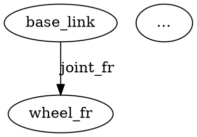

# Writing Graph Transforms

A *transform* turns a compiled HyMeKo description into any text-based
target format — URDF, SDF, MJCF, DOT, a ROS 2 launch file, or something
you invent today. A transform is **two plain files** on disk:

```
transforms/<name>/
├── queries.hymeko       what to find in the graph
└── template.<ext>       how to write the output
```

No Rust. No recompile. Drop the directory, run the CLI.

---

## Quick start

Generate a URDF from a robot description:

```bash
hymeko transform data/robotics/robot_4wh.hymeko -t urdf \
       --name robot4wh -o robot.urdf
```

Same thing inside the REPL:

```
hymeko> load data/robotics/robot_4wh.hymeko
hymeko [robot_4wh]> name robot4wh
hymeko [robot_4wh]> tf urdf robot.urdf
```

List available transforms:

```
hymeko [robot]> tdir
```

---

## How the pipeline flows

```
  your.hymeko ─► compile ─► IR ─┐
                                │
transforms/<name>/queries.hymeko ─► parse ─► Predicate tree
                                │                 │
                                └─► QueryEngine ──┴─► HashMap<label, matches>
                                                            │
transforms/<name>/template.<ext> ─► parse template ─► render ┘
                                                            │
                                                            ▼
                                                       output string
```

The engine never knows about URDF. URDF conventions live entirely in
your two files.

---

## Step 1 — Write `queries.hymeko`

A query file has exactly one shape:

```
<transform_name> {}
context
{
    label1: base_type {}
    label2: another_base {}
    @label3: edge_base {}
}
```

- `<transform_name> {}` is the required header (the HyMeKo parser needs
  a top-level description).
- `context { … }` groups the actual queries. Every child becomes one
  named query in the result batch.
- The **leading identifier is the label** you reference from the
  template — it is *not* a name filter. `links: link {}` means "any
  node inheriting from `link`, stored under label `links`".
- Use `@` for edges. `@fixed_joints: fixed_joint {}` matches edges
  inheriting from `fixed_joint`. Without `@` you are querying nodes,
  and joints won't be found.

### Query syntax cheatsheet

| Query | Meaning |
|-------|---------|
| `links: link {}` | Nodes inheriting from `link`, labelled `links` |
| `_ : joint {}` | Any decl inheriting from `joint` (no label) |
| `@revolute_joints: rev_joint {}` | Edges inheriting from `rev_joint` |
| `heavy: link { mass <gt> 5.0; }` | Links with `mass > 5.0` |
| `box_links: link { link_geometry: box {} }` | Links whose geometry is a box |

Comparison tags you can use on a value: `<gt>`, `<lt>`, `<gte>`,
`<lte>`, `<eq>`, `<ne>`.

---

## Step 2 — Write `template.<ext>`

The template is your target format with `{{tags}}` mixed in. The
extension is free — pick whatever makes your editor happy
(`template.urdf.xml`, `template.dot`, `template.launch.py`).

### Tag reference

**Interpolation (inside an `{{#each}}` block):**

| Tag | Yields |
|-----|--------|
| `{{name}}` | Matched declaration's resolved name |
| `{{kind}}` | `node` / `edge` / `arc` |
| `{{depth}}` | Depth in the declaration tree |
| `{{id}}` | Internal `DeclId` (debugging) |

**Field access (walks the IR from the match):**

| Tag | Yields |
|-----|--------|
| `{{field:mass}}` | Value of a child named `mass` |
| `{{field:link_geometry.dimension}}` | Dotted path traversal |
| `{{field:color}}` | Follows references — if `color -> link_color`, returns `link_color`'s value |

A missing field renders as an empty string. A list value
(`[0.1, 0.2, 0.3]`) renders space-separated: `"0.1 0.2 0.3"`.

**Arc bindings (for matched edges):**

Given `@j0: rev_joint { (+ parent_link, - child_link, - AXIS_Z); }`:

| Tag | Yields |
|-----|--------|
| `{{bind:+:0}}` | First `+` binding target → `parent_link` |
| `{{bind:-:0}}` | First `-` binding target → `child_link` |
| `{{bind:-:1}}` | Second `-` binding → `AXIS_Z` |
| `{{bind:-:all}}` | All `-` bindings joined by space |
| `{{bind:~:0}}` | First neutral binding |

**Anywhere:**

| Tag | Yields |
|-----|--------|
| `{{config:robot_name}}` | Value from config map (CLI `--name`, or programmatic) |
| `{{config:author}}` | …any key you inject |

### Control flow

```
{{#each links}}
  <link name="{{name}}"/>
{{/each}}
```

```
{{#if field:mass}}
  <mass value="{{field:mass}}"/>
{{/if}}
```

```
{{#comment}}
  Stripped from output. Use for template-internal notes.
{{/comment}}
```

---

## Step 3 — Run it

```bash
# One-shot CLI
hymeko transform robot.hymeko -t my_transform -o out.ext --name my_robot

# REPL
hymeko [robot]> tf my_transform out.ext
hymeko [robot]> tf my_transform        # prints to stdout

# Point at a non-default directory
hymeko transform robot.hymeko -t my_transform --transforms-dir ./custom_tf/
```

---

## Worked example — a trivial DOT graph

`transforms/my_dot/queries.hymeko`:

```
my_dot_transform {}
context
{
    links: link {}
    @revolute_joints: rev_joint {}
}
```

`transforms/my_dot/template.dot`:

```dot
digraph "{{config:robot_name}}" {
{{#each links}}
  "{{name}}";
{{/each}}
{{#each revolute_joints}}
  "{{bind:+:0}}" -> "{{bind:-:0}}" [label="{{name}}"];
{{/each}}
}
```

Run:

```
hymeko transform data/robotics/robot_4wh.hymeko -t my_dot --name demo
```

Output:



---

## Recipes

### Switching on geometry type

There is no `{{#switch}}`. Use separate query labels:

```
box_links:      link { link_geometry: box {} }
cylinder_links: link { link_geometry: cylinder {} }
sphere_links:   link { link_geometry: sphere {} }
```

```xml
{{#each box_links}}      <geom type="box"      size="{{field:link_geometry.dimension}}"/>{{/each}}
{{#each cylinder_links}} <geom type="cylinder" size="{{field:link_geometry.dimension}}"/>{{/each}}
{{#each sphere_links}}   <geom type="sphere"   size="{{field:link_geometry.dimension}}"/>{{/each}}
```

### Optional sections

```xml
{{#if field:mass}}
  <inertial><mass value="{{field:mass}}"/></inertial>
{{/if}}
```

### Non-XML outputs

Nothing is XML-specific. Targeting Python:

```python
def generate_launch_description():
    ld = LaunchDescription()
{{#each revolute_joints}}
    ld.add_action(Node(executable='spawner',
                       arguments=['{{name}}_controller']))
{{/each}}
    return ld
```

---

## Programmatic use

```rust
use hymeko_query::rewrite::{execute_transform, TransformSpec};
use std::collections::HashMap;

let spec = TransformSpec {
    name: "urdf".into(),
    query_source: std::fs::read_to_string("transforms/urdf/queries.hymeko")?,
    template_source: std::fs::read_to_string("transforms/urdf/template.urdf.xml")?,
};

let mut config = HashMap::new();
config.insert("robot_name".into(), "my_robot".into());

let urdf = execute_transform(&compiled.ir, &interner, &spec, &config)?;
```

You can inject any config keys and read them with `{{config:<key>}}`.

---

## Common mistakes

| Symptom | Cause | Fix |
|---------|-------|-----|
| Zero matches for joints | Joint query lacks `@` | Use `@fixed_joints: fixed_joint {}` |
| Every query returns zero | Missing `context { … }` wrapper | Wrap queries in `context { }` |
| Name filter unintentionally applied | Used `links: link {}` expecting label-only | That *is* label-only — if you see this, check you read `transforms/<name>/` and not a hand-written query file loaded via `qfile` (which uses strict mode) |
| Empty fields | Field name typo or path doesn't exist | Use `{{#if field:X}}` to probe; `query` / `qfile` to inspect matches |
| Parse error | Template has `{{` with no closing `}}`, or an `{{#each}}` without `{{/each}}` | Blocks must be balanced |

---

## Where the pieces live

- Engine: `hymeko_query::rewrite::{template, match_context}`
- Entry point: `rewrite::execute_transform()`
- CLI: `hymeko transform …` and REPL `tf` / `tdir`
- Shipped transforms: `transforms/{urdf, sdf, mjcf, dot, ros2_launch}/`
- Full architecture note: `docs/plans/04_graph_query/T11_rewrite_engine.md`
