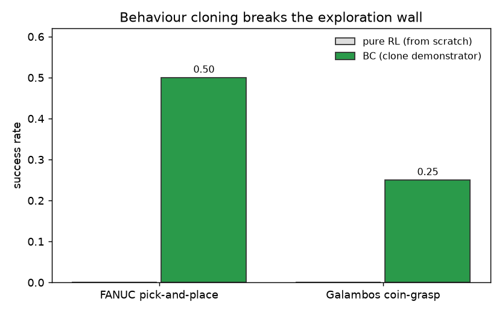
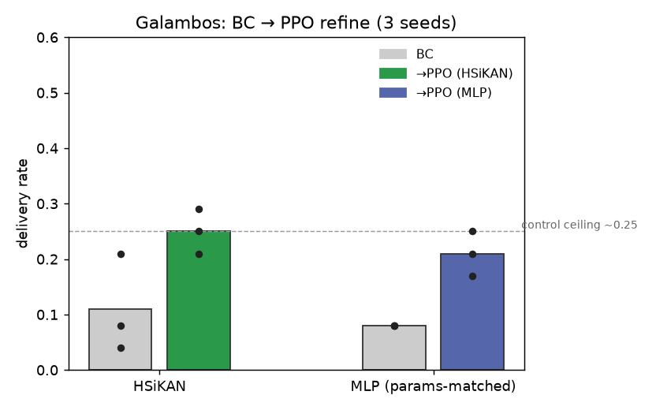
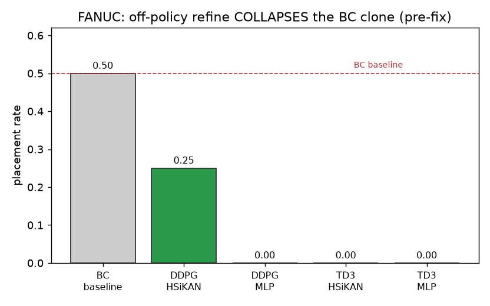
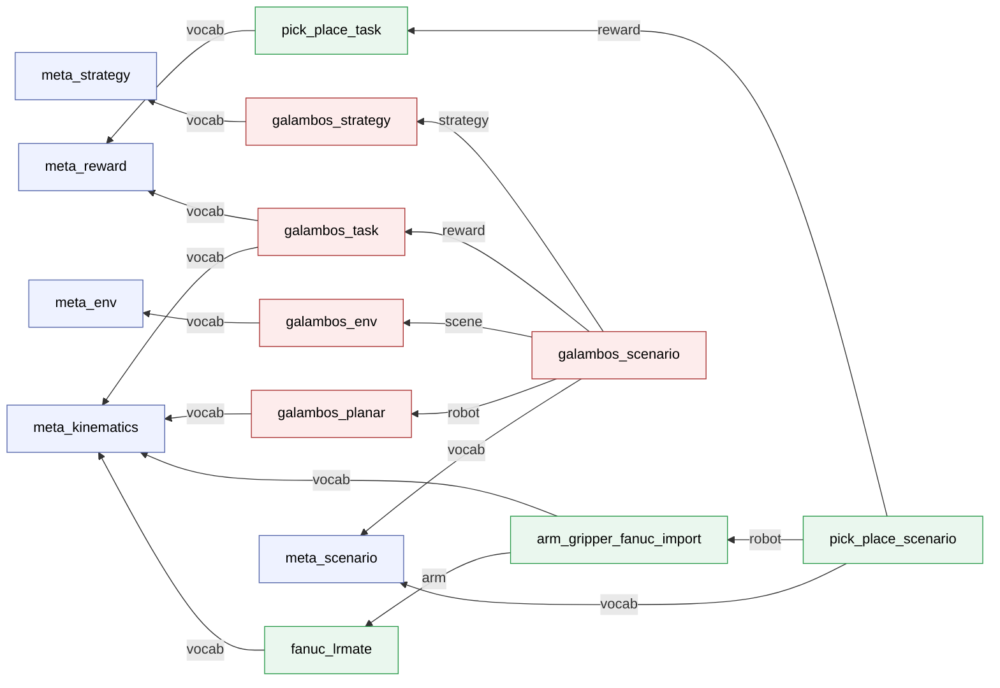
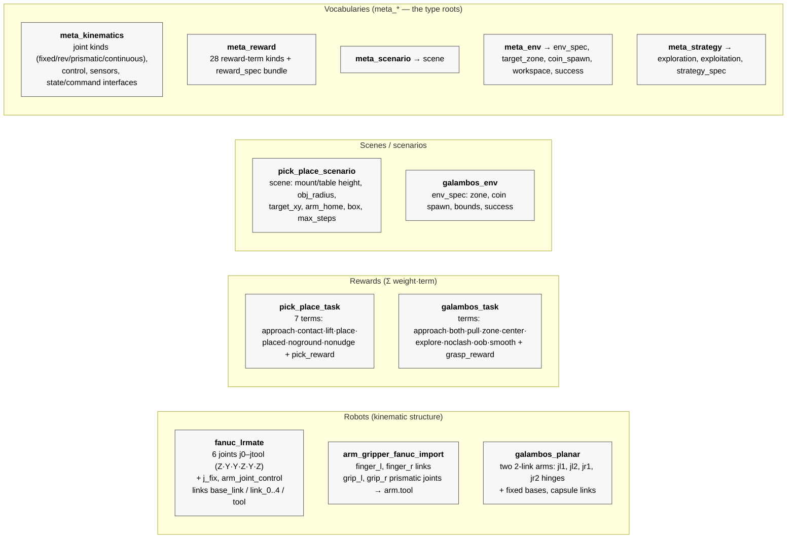
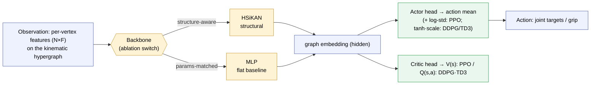
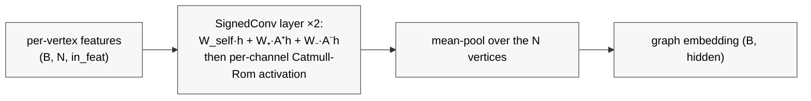

# HyMeKo manipulation models

Curated copies of the `.hymeko` models for the two manipulation tasks (canonical sources live in
`data/robotics/`). A HyMeKo model is **composed** from small modular files: a *vocabulary* (`meta_*`) declares the
types, and concrete models instantiate them and `@"…"`-import each other. One model thus carries the robot
structure, the observation, the reward, and the scenario that assembles them.

> **Item-by-item detail for every file** (each declaration, with values) is in **[`FILES.md`](FILES.md)**.
> Consolidated experiment results are in **[`results/RESULTS.md`](results/RESULTS.md)**.

## Demos — per-policy comparison (Galambos)
The **same scenario seed** rendered for each policy. The filename encodes `<policy>_seed_<n>_<outcome>`, so
`goal` vs `timeout` shows at a glance which policy delivered. The scripted **demonstrator** is the BC training
source; `hsikan_bc` / `mlp_bc` are the cloned policies (top-down view, wall-clock stamp baked in).

*Seed 10 — demonstrator and HSiKAN-BC deliver; MLP-BC times out:*

| demonstrator ✓ | hsikan_bc ✓ | mlp_bc ✗ |
|:--:|:--:|:--:|
|  |  |  |

*Seed 0 — demonstrator and MLP-BC deliver; HSiKAN-BC times out (BC is ~tied and low; neither learned policy is
robust — the Galambos control ceiling):*

| demonstrator ✓ | hsikan_bc ✗ | mlp_bc ✓ |
|:--:|:--:|:--:|
|  |  |  |

All rendered GIFs live in [`results/gifs/`](results/gifs/).

## Plots — results at a glance


*Pure RL never delivers on either task; behaviour cloning the demonstrator breaks the exploration wall —
FANUC ≈ 0.50, Galambos ≈ 0.25.*



*Galambos: HSiKAN ≈ params-matched MLP (within the 3-seed spread, shown as dots); PPO refines BC modestly up to
the ~0.25 control ceiling.*



*FANUC: off-policy refine (DDPG/TD3) collapses the BC clone to 0. The `warm_start` bridge in `ddpg.py` held on the
easier Galambos task but **not** on FANUC — refine still went to 0.0 in all four cells (2026-06-24). Leading cause
is gross under-budgeting (`refine=12000` ≈ 19 episodes of a 620-step task; off-policy wants 10⁵–10⁶); a TD3+BC
actor anchor is the other candidate. See the numerical table below. (Plots regenerate via
`python -m hymeko_rl.plot_manipulation_results`.)*

### Numerical values (the data behind the plots)

**Galambos** — delivery rate, difficulty 0.3, 3 seeds:

| backbone | BC (per seed) | → PPO (per seed) | PPO median | → TD3 (pre-fix) |
|---|---|---|---|---|
| HSiKAN | 0.04, 0.08, 0.21 | 0.21, 0.25, 0.29 | **0.25** | 0.083 → 0.125 |
| MLP (params-matched) | 0.08 | 0.17, 0.21, 0.25 | **0.21** | 0.292 → 0.083 |

**FANUC** — placement rate (`n=8` held-out eval; the small `n` makes the BC column noisy):

| stage | HSiKAN | MLP |
|---|---|---|
| pure RL (from scratch) | 0.00 | 0.00 |
| **BC** (DDPG-cell / TD3-cell evals) | 0.12 / 0.38 | 0.75 / 0.75 |
| BC → DDPG (warm-start, refine 12k) | **0.00** | **0.00** |
| BC → TD3 (warm-start, refine 12k) | **0.00** | **0.00** |

> **Negative result (2026-06-24).** The `warm_start` bridge preserved the clone on the easier Galambos task
> (0.083 → 0.083) but **not** on FANUC: off-policy refine collapsed the BC clone to 0.0 in all four cells. The
> clone *is* correctly carried into the off-policy actor (verified — `behaviour_clone` and `train_offpolicy` act on
> the same module), so this is **not** a wiring bug. **Leading cause: gross under-budgeting** — `refine=12000` steps
> on a 620-step episode is only ~19 episodes, far below off-policy norms (10⁵–10⁶), so the critic never becomes
> meaningful and the actor updates against a garbage Q. Open fixes: (a) ≥10⁵ refine steps, (b) a TD3+BC actor anchor
> (`λ·MSE(actor, demo)`) so refine cannot destroy the clone. The working lever today stays **BC / BC→PPO**.

**Per-policy GIF outcomes** (the 6 common Galambos seeds rendered above; ✓ = delivered, ✗ = timeout):

| seed | demonstrator | hsikan_bc | mlp_bc |
|---|:--:|:--:|:--:|
| 0  | ✓ | ✗ | ✓ |
| 1  | – | ✗ | ✗ |
| 2  | – | ✗ | ✗ |
| 9  | ✓ | ✗ | ✗ |
| 10 | ✓ | ✓ | ✗ |
| 14 | ✓ | ✓ | ✗ |
| **delivered** | 4/4 shown | **2/6** | **1/6** |

(BC here is the weaker 0.083-class clone used for the GIFs; the stronger BC→PPO run reaches the ~0.25 median
above. Full tables + provenance in [`results/RESULTS.md`](results/RESULTS.md).)

## Vocabularies (`meta_*` — the type roots)
| file | declares |
| --- | --- |
| `meta_kinematics.hymeko` | links, joints, geometry, axes (the robot's signed kinematic hypergraph) |
| `meta_reward.hymeko` | reward terms + a `reward_spec` bundle (Σ weight·term) |
| `meta_observation.hymeko` | observation channels |
| `meta_scenario.hymeko` | a *scenario* = scene geometry + robot + reward references |
| `meta_env.hymeko` | environment scene parameters (zone, spawn region, workspace) |
| `meta_task.hymeko` | task / behaviour vocabulary |
| `meta_strategy.hymeko` | exploration / exploitation (RL strategy) terms |

## FANUC top-down pick-and-place (the working learned-control task)
| file | role | imports |
| --- | --- | --- |
| `fanuc_lrmate.hymeko` | FANUC LR Mate-config 6-DOF arm (Z-Y-Y-Z-Y-Z joints, slim collision links) | meta_kinematics |
| `arm_gripper_fanuc_import.hymeko` | attaches a parallel-jaw gripper to `arm.tool` (no duplication) | fanuc_lrmate, meta_kinematics |
| `pick_place_task.hymeko` | the 7-term pick-and-place reward | meta_reward, meta_kinematics |
| `pick_place_scenario.hymeko` | the whole scenario: scene + robot + reward in one model | meta_scenario, arm_gripper_fanuc_import, pick_place_task |

**Composition** (what `pick_place_scenario.hymeko` is made of):
```
pick_place_scenario
├─ meta_scenario
├─ arm_gripper_fanuc_import
│  ├─ meta_kinematics
│  └─ fanuc_lrmate ─ meta_kinematics
└─ pick_place_task
   ├─ meta_reward
   └─ meta_kinematics
```

## Galambos two-arm planar coin-grasp (the hard control case)
| file | role | imports |
| --- | --- | --- |
| `galambos_planar.hymeko` | two 2-link planar arms (Z-hinges, sweep the table) | meta_kinematics |
| `galambos_env.hymeko` | scene: target zone, coin spawn region, workspace bounds | meta_env |
| `galambos_task.hymeko` | reward (approach, two-finger contact, in-zone, …) | meta_kinematics, meta_reward |
| `galambos_strategy.hymeko` | the RL strategy (entropy bonus, action noise, curriculum) | meta_strategy |

## Diagram 1 — import relationships (what composes what)
Each task has one top-level **scenario** that composes its robot + scene + reward (+ strategy).

*Edge labels: a top-level **scenario** composes a **robot** + **scene** + **reward** (+ **strategy**); every model
imports the **vocab**(ulary) it instantiates; `arm_gripper_fanuc_import` extends the **arm** with a gripper.*

## Diagram 2 — elements each description declares


## Diagram 3 — RL policy architecture (where HSiKAN and MLP plug in)
The **backbone is the ablation axis**: the same algorithm and the same actor/critic heads run on either the
structural **HSiKAN** or a params-matched **MLP**, which isolates *"does the structural prior help?"* from the
choice of RL algorithm.

**HSiKAN** is used when the policy should reason over the robot's *structure* — it reads the per-vertex features
on the kinematic hypergraph plus the signed parent↔child adjacency. **MLP** is the baseline: it flattens the same
features (ignoring structure), sized to the same parameter count, so any gap is attributable to structure.

## Diagram 4 — HSiKAN backbone internals

`A⁺` = down-chain adjacency (parent→child), `A⁻` = up-chain (child→parent); `W_self / W₊ / W₋` are shared across
all vertices. The per-channel **Catmull-Rom** spline is the KAN component — learnable activations, but *per
channel* rather than per edge, which is what makes HSiKAN frugal (≈ the parameter count of a small MLP).

### How each algorithm uses the backbone
| algorithm | actor head | critic | role in the pipeline |
|---|---|---|---|
| **BC** | action mean (cloned, MSE to expert) | — | break the exploration wall (supervised) |
| **PPO** | Gaussian (mean + log-std) | `V(s)` | on-policy refine |
| **DDPG** | deterministic (`tanh·action_scale`) | 1 Q-critic | off-policy (sample-efficient) |
| **TD3** | deterministic | twin Q + delayed actor + target smoothing | off-policy, robust DDPG |
| **SAC** | squashed-Gaussian (entropy-regularized) | twin Q + auto-tuned temperature | off-policy, max-entropy (strongest explorer) |

The actor/critic *heads* are shared across HSiKAN and MLP — only the backbone changes. BC clones the demonstrator;
PPO/DDPG/TD3/SAC then refine from that warm start (a BC warm-start needs the off-policy `warm_start` bridge in
`ddpg.py`, or the clone collapses). The unified `{task × algo × backbone}` sweep lives in
`hymeko_rl/offpolicy_eval.py` (tasks: cartpole, galambos, galambos_taskgraph, arm6dof, quadruped, fanuc).

### Architectures added 2026-06-25
Three policy/critic structures were built on top of the same HSiKAN backbone (modules in `hymeko_rl/`, design
docs under `docs/plans/`); each is the params-matched MLP's structural counterpart, tested against it.

- **Rate-asymmetric dual loop** (`dual_rate.py`, `DualRateController`): a *fast reflex* (MLP, every step,
  ~6400 Hz) fused with a *slow deliberation* (HSiKAN, every `N` steps, ~420 Hz, its output held between
  deliberations) — `action = head(reflex ⊕ held-context)`. Motivated by the measured ~15× CPU-latency gap (the
  structural reasoning genuinely costs more), it mirrors the biological reflex/deliberation split. See
  `docs/plans/2026-06-24-kato-collab-dual-discriminator/` (+ `architecture.pdf`).
- **Collaborative CTDE** (`collaborative.py`, `CollaborativeGalambos` + `CTDEActorCritic`): the two-arm task as a
  cooperative multi-agent problem — one agent per arm, a *shared* HSiKAN backbone feeding *per-arm* action heads
  (decentralized actors) + a *centralized* critic, with a shared team reward. The action split is derived from
  the actuator names, so it scales to `k` arms (the k-scaling plan,
  `docs/plans/2026-06-25-coin-toss-k-scaling/`).
- **Structural critic** (`structural_critic.py`, `StructuralCritic`): the critic decomposes `V(s)` over the
  hypergraph's signed **cycles and walks** (enumerated once via the Rust `hymeko` binding), per-motif a
  sign-weighted gather → per-motif value → pooled `V` — structural credit assignment, and an interpretable
  per-motif signature. With `task_graph` the grasp/goal hyperedges add the arm–coin–zone cycle the critic reasons
  over. See `docs/plans/2026-06-25-structural-critic/`.

**Honest status (2026-06-25):** on the 6-vertex two-arm *chain*, the structural prior does **not** beat the
params-matched MLP — ties, and under BC the `task_graph` augmentation *hurt* HSiKAN (0.111→0.042 delivery) while
helping the MLP (`results/`). Working hypothesis: structure pays off in proportion to **topological complexity**,
so the discriminating test is the **branching quadruped** (14 vertices), not the planar chain — pending.

## Inspecting a model's composition
```
python -m hymeko_rl.hymeko_compose data/robotics/pick_place_scenario.hymeko          # import tree + bill of materials
python -m hymeko_rl.hymeko_compose data/robotics/pick_place_scenario.hymeko --dot composition.dot  # composition as a hypergraph (DOT)
```

## Running a learned policy in simulation
A policy is trained (behaviour cloning ± PPO/DDPG/TD3) and saved as a checkpoint (`.pt`) — see
`checkpoints/{galambos,fanuc}/`. To watch it act, render an episode to an animated GIF (offscreen MuJoCo, with a
timestamp baked in):

```
# Galambos — render a trained policy on chosen seeds (top-down view)
python -m hymeko_rl.render_planar_gifs --checkpoint checkpoints/galambos/<policy>.pt --run <name> --seeds 1000 1003 1005

# Galambos — render the scripted demonstrator's SUCCESSFUL deliveries (no checkpoint needed)
python -m hymeko_rl.render_planar_gifs --demonstrator --difficulty 0.3
```
GIFs are written under `reports/gifs/<run>/`. The FANUC learned-policy renderer (films a trained policy instead
of the scripted IK expert) is in progress; the scripted FANUC pick renders today via
`python -m hymeko_rl.render_pick_place`.

**Under the hood**, a sim run is: build the env from the `.hymeko` (the robot is emitted to MJCF and stepped in
MuJoCo), load the policy weights, and at each step feed the observation (per-vertex features on the kinematic
hypergraph) to the policy's deterministic action. To *evaluate* without rendering, use the success metrics
(`hymeko_rl.galambos_bc.eval_delivery`, `hymeko_rl.gripper_pick_bc.eval_success`).

## Full HyMeKo source
The complete text of every model below (click to expand). These are the same files as the canonical `data/robotics/*.hymeko`.

### Scenarios (top-level tests)

<details><summary><b>pick_place_scenario.hymeko</b></summary>

```
// pick_place_scenario.hymeko — the FANUC top-down pick-and-place as ONE declarative scenario.
//
// Replaces the Python-hand-configured `fanuc_pick_env(...)` cfg dict: the scene geometry lives here, the
// robot (arm+gripper composite) and the reward are pulled in by @"…" import. ScenarioSpec.from_hymeko reads
// this and builds the identical PickPlaceEnv (a parity test guards "identical"). Numbers mirror the verified
// reliable config in hymeko_rl/render_pick_place.py. Validates via `hymeko inspect`.

pick_place_scenario_description {
    @"meta_scenario.hymeko";
    @"arm_gripper_fanuc_import.hymeko";   // the robot: FANUC LR Mate-config arm + parallel-jaw gripper
    @"pick_place_task.hymeko";            // the reward: the 7-term pick-and-place reward_spec
    using scenario as scn;
}

pick_place_scenario: scn
{
    @scene: scn.scene {
        mount_height 0.12;                // pedestal height (== table_top: base→box geometry as floor-grasp)
        table_top 0.12;                   // table surface height
        box_mass 0.15;
        lift_thresh 0.035;                // "lifted clear" threshold (m)
        place_radius 0.075;               // success radius around the target (m)
        max_steps 620;
        obj_radius [0.28, 0.40];          // object spawn annulus (collision-free top-down reach)
        target_xy [0.34, 0.0];            // place target on the table
        arm_home [0.0, 1.0, 0.8, 0.0, 0.8, 0.0];   // bent, non-singular ready posture
    }
}
```

</details>

<details><summary><b>galambos_scenario.hymeko</b></summary>

```
// galambos_scenario.hymeko — the Galambos two-arm planar coin-grasp as ONE declarative scenario (a test).
//
// Composes the four Galambos pieces into a single scenario, mirroring pick_place_scenario for the FANUC arm:
//   - galambos_planar    : the robot (two 2-link planar arms)
//   - galambos_env       : the scene (target zone, coin spawn region, workspace bounds, success)
//   - galambos_task      : the reward (approach, two-finger contact, in-zone, ...)
//   - galambos_strategy  : the RL strategy (exploration / exploitation)
// One model thus names the whole MDP for the task. Validates via `hymeko inspect` once the engine resolves
// transitive imports (see memory project-engine-transitive-imports); the Python bridge reads it today.

galambos_scenario_description {
    @"meta_scenario.hymeko";
    @"galambos_planar.hymeko";      // robot
    @"galambos_env.hymeko";         // scene
    @"galambos_task.hymeko";        // reward
    @"galambos_strategy.hymeko";    // RL strategy
    using scenario as scn;
}

galambos_scenario: scn
{
    @scene: scn.scene {
        max_steps 160;              // episode horizon; the rest of the scene lives in galambos_env
    }
}
```

</details>

### Vocabularies (meta_*)

<details><summary><b>meta_kinematics.hymeko</b></summary>

```
meta_kinematics
{

}
kinematics {
    units {
        length "m";
        angle "degree";
        mass "kg";
        time "s";
    }
    elements {
        meta_element {}
        link: + <isa> meta_element {}
        frame: + <isa> meta_element {}
        control: + <isa> meta_element {}
        sensor: + <isa> meta_element {}
        @control_definition {}
        @joint {
            @control {}
        }
    }

    sensors {
        joint_state_broadcaster {type "joint_state_broadcaster/JointStateBroadcaster";}
        rgb_camera: elements.sensor {
            type "camera";
        }
        laser_scanner: elements.sensor {
            type "gpu_lidar";
        }
        @sensor_connection {}
    }
    controllers {
        meta_controller {
            @state_interface {}
            @command_interface {}
        }
        joint_trajectory_controller: + <isa> meta_controller {
            type "joint_trajectory_controller/JointTrajectoryController";
        }
        diff_drive_controller: + <isa> meta_controller {
            type "diff_drive_controller/DiffDriveController";
        }
        force_torque_sensor_controller: + <isa> meta_controller {
            type "force_torque_sensor_controller/ForceTorqueSensorController";
        }
        forward_position_controller: + <isa> meta_controller {
            type "forward_position_controller/ForwardPositionController";
        }
        forward_velocity_controller: + <isa> meta_controller {
            type "forward_velocity_controller/ForwardVelocityController";
        }
    }
    @control_plugin {}
    @sim_plugin {}

    control_attributes {
        position;
        velocity;
        effort;
    }
    joint_rev_limit {
        lower -180.0;
        upper 180.0;
        effort 50.0;
        velocity 1.0;
    }
    joint_prismatic_limit [0.0, 0.5];
    @fixed_joint: + <isa> elements.joint {}
    @rev_joint: + <isa> elements.joint {
        limit -> joint_rev_limit;
    }
    @conti_joint: + <isa> elements.joint {
    }
    @prismatic_joint: + <isa> elements.joint {
        limit -> joint_prismatic_limit;
    }
    geometry {
        box {}
        cylinder {}
        sphere {}
    }

    axes {
        axis_definition {}
        AXIS_X: + <isa> axis_definition {ax [1.0, 0.0, 0.0];}
        AXIS_Y: + <isa> axis_definition {ax [0.0, 1.0, 0.0];}
        AXIS_Z: + <isa> axis_definition {ax [0.0, 0.0, 1.0];}
        AXIS_M_Z: + <isa> axis_definition {ax [0.0, 0.0, -1.0];}
    }
}```

</details>

<details><summary><b>meta_reward.hymeko</b></summary>

```
// meta_reward.hymeko — declarative reward terms for RL over the kinematic hypergraph.
//
// Companion to meta_observation.hymeko (observation channels) and meta_task.hymeko
// (behaviour). A reward_spec is a *weighted bundle of terms*; the env evaluates the
// scalar reward as Σ weight·term(state). Each term references kinematic vertices
// (effector, target frame) from the same compiled IR as the robot — one IR carries the
// structure, the observation, AND the reward.
//
// Mirrors meta_observation's shape: a small type root + a `terms` namespace of kinds,
// each `<isa>` the term root. The weight is NOT a node default — a `reward_spec` supplies
// each term's weight as an ARC weight on the inclusion reference: `(+ term <weight>)` (the
// signed-incidence arc carries the contribution). Validates via `hymeko inspect`.

meta_reward {}

reward {
    // === Type roots ===
    @reward_term {}    // a single weighted reward signal over the state
    @reward_spec {}    // a bundle of terms = the scalar reward

    // === Reward terms ===
    // `weight` is the default contribution; a profile instance may override it.
    terms {
        // Dense shaping: -weight·‖pos(effector) - pos(target)‖.
        // Hyperedge: (+ effector, - target).
        @reach_distance: + <isa> reward.reward_term {}

        // Sparse success: +weight when the effector is within the goal tolerance.
        @success_bonus:  + <isa> reward.reward_term {}

        // Control-effort penalty: -weight·‖action‖².
        @action_cost:    + <isa> reward.reward_term {}

        // === Safety / configuration penalties (default off; a task profile sets the weight) ===
        // Death penalty when a robot geom contacts the ground (the env also terminates the episode).
        @ground_penalty:         + <isa> reward.reward_term {}

        // Death penalty when two non-adjacent robot links collide (env terminates the episode).
        @self_collision_penalty: + <isa> reward.reward_term {}

        // Soft penalty -weight·(1 - joint_margin)² as any joint approaches its range limit.
        @joint_limit_penalty:    + <isa> reward.reward_term {}

        // Soft penalty when a link dips below the ground plane (folding into the floor/base).
        @below_ground_penalty:   + <isa> reward.reward_term {}

        // === Planar grasping (Galambos) ===
        // Dense approach: -weight·½(‖nearest_left_link - disk‖ + ‖nearest_right_link - disk‖).
        // Bridges 'arms near the coin' → 'two-finger contact' (the gradient the sparse
        // both_contact cliff cannot supply on its own).
        @grasp_approach: + <isa> reward.reward_term {}

        // +weight when both fingers touch the disk (encourages a two-sided grasp).
        @both_contact: + <isa> reward.reward_term {}

        // +weight (sparse success) when the disk rests inside the target zone.
        @in_zone:      + <isa> reward.reward_term {}

        // Overshoot brake: -weight·‖disk velocity‖ while the disk is near the zone, so the policy
        // decelerates it into the zone instead of pushing it through.
        @settle:       + <isa> reward.reward_term {}

        // Anti-stall: -weight·max(0, v_min - arm joint speed) — penalises an idle arm so the policy
        // keeps exploring instead of freezing.
        @arm_motion:   + <isa> reward.reward_term {}

        // Centring bonus: +weight·(1 - dist/zone_half) inside the zone — grades precision toward the
        // exact zone centre (denser than the binary in_zone success).
        @center_bonus: + <isa> reward.reward_term {}

        // Arm-arm collision: -weight while the two arms touch each other (keep the fingers from
        // crashing together instead of cooperating).
        @arm_collision: + <isa> reward.reward_term {}

        // Out-of-bounds: -weight when the disk is knocked off the table (death) — discourages
        // ballistic over-pushing.
        @out_of_bounds: + <isa> reward.reward_term {}

        // ── Generic "fast and smooth goal-reaching" terms (any actuated robot) ──
        // Progress: +weight·(prev_dist - dist) — dense forward signal toward the goal (the locomotion
        // driver; telescopes to total distance closed). Stronger for learning a gait than flat -distance.
        @goal_progress:       + <isa> reward.reward_term {}

        // Time pressure: -weight every step — reach the goal in fewer steps. Pairs with a distance term
        // (reach_distance / goal_progress) so the objective is minimum-time, not just minimum-distance.
        @time_penalty:        + <isa> reward.reward_term {}

        // Joint-velocity smoothness: -weight·Σ q̇² over the actuated joints — no thrashing.
        @joint_velocity:      + <isa> reward.reward_term {}

        // Joint-acceleration smoothness (jerk): -weight·Σ q̈² over the actuated joints — smooth, not snappy.
        @joint_acceleration:  + <isa> reward.reward_term {}

        // ── pick-and-place terms (read the env's PickMetrics; 0 on a non-pick env) ──
        // Dense approach: -‖tool - object‖ (the tool descends toward the object to grasp it).
        @pick_approach:        + <isa> reward.reward_term {}
        // Two-finger contact: +(left + right) ∈ {0,1,2} — encourages closing both fingers on the object.
        @pick_contact:         + <isa> reward.reward_term {}
        // Lift shaping: +min(lifted, lift_thresh) — rewards raising the object clear of the surface.
        @pick_lift:            + <isa> reward.reward_term {}
        // Transport: -‖object - target‖ once the object is off the surface (carry it to the place zone).
        @pick_place_distance:  + <isa> reward.reward_term {}
        // Sparse success: +weight when the object is lifted AND within the place radius of the target.
        @pick_place_bonus:     + <isa> reward.reward_term {}
        // Approach-collision penalty: -weight when the arm/gripper hits a surface while NOT over the object.
        @pick_approach_penalty: + <isa> reward.reward_term {}
        // Pre-grasp disturbance: -weight·‖object displacement‖ BEFORE the object is ever grasped (no nudging).
        @pick_disturbance:      + <isa> reward.reward_term {}
    }
}
```

</details>

<details><summary><b>meta_observation.hymeko</b></summary>

```
// meta_observation.hymeko — HymeKo observation / state-space vocabulary.
// Companion to meta_kinematics.hymeko (links, joints, sensors) and
// meta_task.hymeko (actions, conditions, coordination).
//
// An observation `.hymeko` references kinematic vertices (joints, links,
// frames, end effectors) from the SAME compiled IR that describes the
// robot, so one IR carries BOTH the structure AND the agent's
// observation / state space. Its star-expansion is the per-vertex
// feature tensor the policy reads — i.e. the declarative form of
// hymeko_rl/env/arm_reach_env.py::node_features().
//
// Proposal / rationale: reports/2026-06-18-hymeko-rl-observation-proposal.md.
// Status: vocabulary parses via the engine; an example
// (arm_reach_observation.hymeko) validates via the CLI. The
// star-expansion -> torch obs-tensor bridge is hymeko_rl.HypergraphState.

meta_observation {}

observation {
    // === Type hierarchy roots ===
    meta_channel {}
    @feature: + <isa> meta_channel {}   // a per-vertex feature channel
    @global:  + <isa> meta_channel {}   // a broadcast (task-level) feature channel
    @space {}                           // an observation space = a bundle of channels

    // === Per-vertex feature channels ===
    // Each channel reads a kinematic quantity onto its incident vertices.
    // Hyperedge: (+ vertex_set) — the kinematic vertices the channel covers.
    // `dim` is the per-vertex width; the assembled obs tensor has
    // (N_vertices, Σ dim) columns.
    features {
        @joint_position: + <isa> observation.feature { dim 1; }   // qpos
        @joint_velocity: + <isa> observation.feature { dim 1; }   // qvel
        @joint_effort:   + <isa> observation.feature { dim 1; }   // applied torque/force
        @link_pose:      + <isa> observation.feature { dim 3; }   // Cartesian position
        @link_twist:     + <isa> observation.feature { dim 6; }   // linear + angular velocity
    }

    // === Global (task) feature channels — broadcast to every vertex ===
    globals {
        // Target Cartesian position. Hyperedge: (+ target_frame).
        @target_position: + <isa> observation.global { dim 3; }

        // End-effector error = target - current. Hyperedge: (+ effector, - target_frame).
        @ee_error:        + <isa> observation.global { dim 3; }

        // A named goal / command scalar (e.g. a gait or velocity command).
        // Hyperedge: (+ frame).
        @command:         + <isa> observation.global { dim 1; }
    }

    // === Observation space assembly ===
    // The state space = a named bundle of channels over the kinematic
    // hypergraph. Compiling it star-expands the channels onto the
    // kinematic vertices, yielding the (N_vertices, Σ dim) obs tensor.
    // Hyperedge: (+ channel_1, + channel_2, ...).
    @observation_space: + <isa> observation.space {}
}
```

</details>

<details><summary><b>meta_task.hymeko</b></summary>

```
// meta_task.hymeko — HymeKo task / behavior-tree / coordination
// vocabulary. Companion to meta_kinematics.hymeko (links, joints,
// controllers, sensors) and meta_topic.hymeko (pub-sub, nodes).
//
// A task `.hymeko` references kinematic vertices (joints, end
// effectors, grippers, frames) from the same compiled IR that
// describes the robot, so one IR carries BOTH the structure AND
// the behavior. See docs/notes/2026-05-16-hymeko-tasks-design.md
// for the full design rationale.
//
// Status as of 2026-05-16: vocabulary parses + an example
// (data/robotics/sim/dual_fanuc/handover_task.hymeko) validates.
// BehaviorTree.CPP / PDDL / ROS 2 emitters are open follow-ups —
// each a single template directory under transforms/, sized like
// transforms/sdf/.

meta_task {}

task {
    // === Type hierarchy roots ===
    meta_node {}
    @action: + <isa> meta_node {}
    @composite: + <isa> meta_node {}
    @condition: + <isa> meta_node {}
    @coordination_primitive: + <isa> meta_node {}
    @scene_element {}

    // === Actions ===
    // Atomic primitives. The hyperedge connects an "actor"
    // vertex (an end effector, a joint set, a gripper) to a
    // "target" (a pose, a configuration, an object).
    actions {
        // Cartesian-space goal. Hyperedge: (+ effector, - target_pose).
        @move_to: + <isa> task.action {}

        // Joint-space goal. Hyperedge: (+ joint_set, - target_config).
        @joint_move: + <isa> task.action {}

        // Gripper actions. close optionally takes the object being grasped.
        @grip_open:  + <isa> task.action {}
        @grip_close: + <isa> task.action {}

        // Temporal padding. Hyperedge: (+ duration).
        @wait: + <isa> task.action {
            duration_s 0.0;
        }

        // Force-control primitive.
        // Hyperedge: (+ effector, - force_vector).
        @apply_force: + <isa> task.action {}

        // "Do nothing, succeed" — useful as a fallback default.
        @noop: + <isa> task.action {}
    }

    // === Control-flow composites ===
    // Behavior-tree backbone. Each composite holds an ordered
    // list of children via a hyperedge with the children as +/-
    // vertices in declaration order.
    composites {
        // Run children in order; abort on first failure.
        @sequence: + <isa> task.composite {}

        // Run children concurrently; success policy via field.
        // policy ∈ {"all", "any", "any_else_abort"}.
        @parallel: + <isa> task.composite {
            policy "all";
        }

        // Try children in order until one succeeds.
        @fallback: + <isa> task.composite {}

        // While the condition-child holds, run the body-child.
        @loop: + <isa> task.composite {
            max_iterations 100;
        }

        // Decorator: invert child's success/failure.
        @invert: + <isa> task.composite {}

        // Conventional top-level task handle. The first
        // @entry-typed instance in a task description is the
        // emitter's entry point; its hyperedge typically binds
        // (+ body_composite, - agent_1, - agent_2, ...) so the
        // emitter can scope BT.CPP / ROS 2 action plumbing
        // per-agent.
        @entry: + <isa> task.composite {}
    }

    // === Conditions ===
    // Predicates over world state. Pinning an action to a
    // precondition creates a guarded edge.
    conditions {
        // pre/post: hyperedge (+ action, - predicate).
        @precondition:  + <isa> task.condition {}
        @postcondition: + <isa> task.condition {}

        // Spatial: an effector is at a pose within tolerance.
        // Hyperedge: (+ effector, - pose).
        @at_pose: + <isa> task.condition {
            tolerance_m   0.005;
            tolerance_rad 0.01;
        }

        // Possession: a gripper currently holds an object.
        // Hyperedge: (+ gripper, - object).
        @holding: + <isa> task.condition {}

        // Joint at a target configuration (within tolerance).
        @at_config: + <isa> task.condition {
            tolerance_rad 0.01;
        }

        // Negation decorator on a child condition.
        @not_condition: + <isa> task.condition {}
    }

    // === Coordination primitives ===
    // The reason this design exists — multi-agent tasks.
    coordination {
        // Barrier: BOTH points must be reached before either
        // proceeds. Hyperedge: (+ point_a, + point_b).
        @synchronize: + <isa> task.coordination_primitive {}

        // Sequential object transfer between two grippers.
        // Hyperedge: (+ from_gripper, - to_gripper, + object).
        // Expands at compile time to a 3-step subtree:
        //   1. to_gripper.grip_close on object
        //   2. synchronize (both gripping)
        //   3. from_gripper.grip_open
        @handover: + <isa> task.coordination_primitive {}

        // Mutex on a shared resource (a workspace cell, a tool
        // changer, a shared end-of-arm tool). One agent holds
        // the lock at a time.
        @lock:    + <isa> task.coordination_primitive {}
        @release: + <isa> task.coordination_primitive {}
    }

    // === Scene elements ===
    // Lightweight world objects that aren't part of the robot's
    // kinematic description but the task needs to reference.
    scene {
        // A named pose (re-uses frame from meta_kinematics).
        // Hyperedge: (+ frame).
        @scene_object: + <isa> task.scene_element {
            mass_kg 0.1;
        }

        // "Where to grip this object" — a pose attached to a
        // scene object. Hyperedge: (+ scene_object, + frame).
        @pickup_pose: + <isa> task.scene_element {}

        // "Where to release this object onto" — same idea.
        @place_pose: + <isa> task.scene_element {}
    }

    // === Termination conditions (episode-ending predicates over the safety state) ===
    // A termination_spec bundles conditions; the episode ends ("death") if ANY holds. This lets
    // the .hymeko model — beside the reward — declare what counts as failure, instead of the env
    // hard-coding it. The env binds each kind to a predicate over its live SafetyState.
    @termination_spec {}    // a bundle of conditions = the death predicate
    termination {
        // A robot link / effector contacts the ground plane.
        @ground_contact: + <isa> task.condition {}
        // Two non-adjacent robot links collide.
        @self_collision: + <isa> task.condition {}
    }

}
```

</details>

<details><summary><b>meta_env.hymeko</b></summary>

```
// meta_env.hymeko — declarative environment (scene/task geometry) vocabulary.
//
// Companion to meta_reward / meta_observation / meta_task. Where those declare the reward,
// observation, and behaviour halves of an agent description, this declares the ENVIRONMENT:
// the target zone, the object spawn region, the workspace bounds, and the success criterion.
// A concrete scene (e.g. galambos_env.hymeko) instantiates these as field-carrying config
// terms bundled in an `env_spec`; the env reads them via PlanarGraspEnv.from_hymeko so the
// whole MDP (robot + environment + reward) comes from .hymeko.
//
// Each config term carries scalar fields only (no arcs) — the same shape as a reward term's
// `weight`, so the existing narrow reader (env/_profile.read_bundle) parses it.

meta_env {}

env {
    // A single environment-config term (carries scalar fields).
    @param {}
    // A bundle of config terms = the environment.
    @env_spec {}

    params {
        // Target zone: `half` (radius), `rx_lo/rx_hi/ry_lo/ry_hi` (randomization box, in both-arm
        // reach), `randomize` (>0.5 = re-placed each episode).
        @target_zone: + <isa> env.param {}

        // Object spawn: `rx_lo/rx_hi/ry_lo/ry_hi` (reachable table box) + `clearance` (min gap from
        // the zone). The object may spawn outside the between-arms band.
        @coin_spawn:  + <isa> env.param {}

        // Workspace / out-of-bounds: `x_bound`, `y_min`, `y_max` (object knocked past = death).
        @workspace:   + <isa> env.param {}

        // Success: `steps` consecutive in-zone steps to terminate as a goal.
        @success:     + <isa> env.param {}

        // The manipulated object: `radius` of the disk (a small disk, not a coin).
        @disk:        + <isa> env.param {}
    }
}
```

</details>

<details><summary><b>meta_strategy.hymeko</b></summary>

```
// meta_strategy.hymeko — declarative RL training STRATEGY vocabulary (explore / exploit).
//
// Completes the "MDP + algorithm as data" picture: meta_kinematics (robot), meta_env (scene),
// meta_reward (reward), and now meta_strategy — the PPO algorithm's exploration and exploitation
// knobs. A concrete strategy (e.g. galambos_strategy.hymeko) instantiates these as field-carrying
// config terms bundled in a `strategy_spec`; the trainer reads them via
// hymeko_rl/strategy_spec.py::StrategySpec.from_hymeko. Each term carries scalar fields only.

meta_strategy {}

strategy {
    @param {}
    @strategy_spec {}

    params {
        // Exploration tactic: `ent_coef` (entropy bonus), `log_std_init` (initial action-noise
        // scale; std = exp(log_std_init)), `curriculum_iters` (anneal start-state difficulty 0->1).
        @exploration:  + <isa> strategy.param {}

        // Exploitation: `gamma`, `lam` (GAE), `clip` (PPO ratio clip), `lr`, `update_epochs`,
        // `value_warmup`, `n_steps` (rollout length), `n_iters` (training iterations).
        @exploitation: + <isa> strategy.param {}
    }
}
```

</details>

<details><summary><b>meta_scenario.hymeko</b></summary>

```
// meta_scenario.hymeko — declarative RL *scenario* description.
//
// Companion to meta_kinematics (structure), meta_observation (obs channels), meta_reward (reward), and
// meta_task (behaviour). A scenario WIRES those into a runnable environment: it carries the scene geometry
// (mount/table heights, object spawn annulus, target, box) and references — via @"…" imports — the robot
// (a kinematics composite) and the reward profile. One IR thus describes structure + observation + reward +
// the scenario that assembles them. (Task automaton + HTL spec references are added with the FSM line.)
//
// A scenario is a single `scene` instance whose body is the scene-parameter bundle, read by
// hymeko_rl.env.scenario.ScenarioSpec.from_hymeko. Validates via `hymeko inspect`.

meta_scenario {}

scenario {
    @scene {}   // a scene-parameter bundle that builds an RL environment
}
```

</details>

### Robots

<details><summary><b>fanuc_lrmate.hymeko</b></summary>

```
// fanuc_lrmate.hymeko — a 6R arm with the FANUC LR Mate 200iD joint-rotation configuration.
//
// Axis sequence (the FANUC DH joint-rotation config):  j0=Z  j1=Y  j2=Y  j3=Z  j4=Y  jtool=Z
//   - j0 (Z)         : base yaw
//   - j1, j2 (Y, Y)  : shoulder + elbow pitch about a COMMON horizontal axis  -> planar reach, no twist
//   - j3,j4,jtool (Z,Y,Z): a SPHERICAL wrist (roll-pitch-roll, near-intersecting axes)
//
// Why this robot: the previous anthropomorphic_arm (Z, X+90°, X, Z, X, Z, fat r=0.075 links) could only
// point its tool straight down by folding onto itself -> self-collision (measured: link_0↔link_3, link_3↔tool;
// no collision-free top-down grasp at any radius — reports/2026-06-22-pick-place-phase0.md). The FANUC config
// orients the tool with the compact wrist instead of the arm, and the links are SLIM cylinders (r≈0.03–0.045,
// vs 0.075) so non-adjacent links no longer false-collide. Joint names / tool body match the env + the gripper
// import, so PickPlaceEnv(robot=...) and arm_gripper_fanuc_import.hymeko reuse it unchanged.
//
// Dimensions are LR Mate 200iD-scale (reach ~0.7 m). Validates via `hymeko emit -f mjcf`.

fanuc_lrmate_description {
  @"meta_kinematics.hymeko";
}

robot: meta_kinematics.kinematics.elements, meta_kinematics.kinematics.geometry, meta_kinematics.kinematics.axes
{
    world: meta_kinematics.kinematics.elements.frame {}

    base_color [0.15, 0.15, 0.18, 1.0];
    arm_color  [1.0, 0.84, 0.0, 1.0];        // FANUC yellow
    wrist_color [0.2, 0.2, 0.22, 1.0];

    // === Links (slim cylinders: visual == collision) ===
    base_link: meta_kinematics.kinematics.elements.link {
        mass 8.0;
        link_geometry: meta_kinematics.kinematics.geometry.cylinder { dimension [0.07, 0.10]; }
        visual -> link_geometry; collision -> link_geometry; color -> robot.base_color; origin [0.0, 0.0, 0.05];
    }
    link_0: meta_kinematics.kinematics.elements.link {       // J1 yaw column
        mass 3.0;
        link_geometry: meta_kinematics.kinematics.geometry.cylinder { dimension [0.05, 0.10]; }
        visual -> link_geometry; collision -> link_geometry; color -> robot.arm_color; origin [0.0, 0.0, 0.05];
    }
    link_1: meta_kinematics.kinematics.elements.link {       // upper arm
        mass 2.5;
        link_geometry: meta_kinematics.kinematics.geometry.cylinder { dimension [0.045, 0.33]; }
        visual -> link_geometry; collision -> link_geometry; color -> robot.arm_color; origin [0.0, 0.0, 0.165];
    }
    link_2: meta_kinematics.kinematics.elements.link {       // forearm
        mass 2.0;
        link_geometry: meta_kinematics.kinematics.geometry.cylinder { dimension [0.038, 0.32]; }
        visual -> link_geometry; collision -> link_geometry; color -> robot.arm_color; origin [0.0, 0.0, 0.16];
    }
    link_3: meta_kinematics.kinematics.elements.link {       // wrist roll housing
        mass 0.6;
        link_geometry: meta_kinematics.kinematics.geometry.cylinder { dimension [0.035, 0.04]; }
        visual -> link_geometry; collision -> link_geometry; color -> robot.wrist_color; origin [0.0, 0.0, 0.02];
    }
    link_4: meta_kinematics.kinematics.elements.link {       // wrist pitch body
        mass 0.4;
        link_geometry: meta_kinematics.kinematics.geometry.cylinder { dimension [0.032, 0.04]; }
        visual -> link_geometry; collision -> link_geometry; color -> robot.wrist_color; origin [0.0, 0.0, 0.02];
    }
    tool: meta_kinematics.kinematics.elements.link {         // flange / tool roll (gripper mounts here)
        mass 0.3;
        link_geometry: meta_kinematics.kinematics.geometry.box { dimension [0.06, 0.09, 0.05]; }
        visual -> link_geometry; collision -> link_geometry; color -> robot.wrist_color; origin [0.0, 0.0, 0.025];
    }

    @arm_joint_control {
        (+ meta_kinematics.kinematics.control_attributes.position,
         + meta_kinematics.kinematics.control_attributes.velocity,
         - meta_kinematics.kinematics.control_attributes.position,
         - meta_kinematics.kinematics.control_attributes.velocity,
         - meta_kinematics.kinematics.control_attributes.effort);
    }

    @j_fix: meta_kinematics.kinematics.fixed_joint {
        (+ world [[0.0, 0.0, 0.0], [0.0, 0.0, 0.0]], - base_link);
    }
    // J1 — base yaw (Z)
    @j0: meta_kinematics.kinematics.rev_joint {
        (+ base_link [[0.0, 0.0, 0.10], [0.0, 0.0, 0.0]], - link_0, - meta_kinematics.kinematics.axes.AXIS_Z);
        @control: arm_joint_control {}
    }
    // J2 — shoulder pitch (Y), offset forward
    @j1: meta_kinematics.kinematics.rev_joint {
        (+ link_0 [[0.04, 0.0, 0.10], [0.0, 0.0, 0.0]], - link_1, - meta_kinematics.kinematics.axes.AXIS_Y);
        @control: arm_joint_control {}
    }
    // J3 — elbow pitch (Y)
    @j2: meta_kinematics.kinematics.rev_joint {
        (+ link_1 [[0.0, 0.0, 0.33], [0.0, 0.0, 0.0]], - link_2, - meta_kinematics.kinematics.axes.AXIS_Y);
        @control: arm_joint_control {}
    }
    // J4 — wrist roll (Z, along forearm)
    @j3: meta_kinematics.kinematics.rev_joint {
        (+ link_2 [[0.0, 0.0, 0.32], [0.0, 0.0, 0.0]], - link_3, - meta_kinematics.kinematics.axes.AXIS_Z);
        @control: arm_joint_control {}
    }
    // J5 — wrist pitch (Y), near-coincident with J4 (compact spherical wrist)
    @j4: meta_kinematics.kinematics.rev_joint {
        (+ link_3 [[0.0, 0.0, 0.02], [0.0, 0.0, 0.0]], - link_4, - meta_kinematics.kinematics.axes.AXIS_Y);
        @control: arm_joint_control {}
    }
    // J6 — tool roll (Z)
    @jtool: meta_kinematics.kinematics.rev_joint {
        (+ link_4 [[0.0, 0.0, 0.04], [0.0, 0.0, 0.0]], - tool, - meta_kinematics.kinematics.axes.AXIS_Z);
        @control: arm_joint_control {}
    }
}
```

</details>

<details><summary><b>arm_gripper_fanuc_import.hymeko</b></summary>

```
// arm_gripper_fanuc_import.hymeko — the FANUC LR Mate-config arm + parallel-jaw gripper, NO duplication.
// Imports fanuc_lrmate.hymeko and attaches the gripper fingers to its `tool` link via cross-model kinematic
// composition (`arm.tool`), exactly as arm_gripper_import.hymeko does for the anthropomorphic arm.

arm_gripper_fanuc_description {
    @"meta_kinematics.hymeko";
    @"fanuc_lrmate.hymeko";
    using robot as arm;
}

arm_gripper: meta_kinematics.kinematics.elements, meta_kinematics.kinematics.geometry, meta_kinematics.kinematics.axes, arm
{
    finger_color [0.85, 0.45, 0.20, 1.0];

    finger_l: meta_kinematics.kinematics.elements.link {
        mass 0.1;
        link_geometry: meta_kinematics.kinematics.geometry.box { dimension [0.012, 0.036, 0.06]; }
        visual -> link_geometry; collision -> link_geometry; color -> arm_gripper.finger_color; origin [0.0, 0.0, 0.03];
    }
    finger_r: meta_kinematics.kinematics.elements.link {
        mass 0.1;
        link_geometry: meta_kinematics.kinematics.geometry.box { dimension [0.012, 0.036, 0.06]; }
        visual -> link_geometry; collision -> link_geometry; color -> arm_gripper.finger_color; origin [0.0, 0.0, 0.03];
    }

    @grip_l: meta_kinematics.kinematics.prismatic_joint {
        (+ arm.tool [[-0.035, 0.0, 0.06], [0.0, 0.0, 0.0]], - finger_l, - meta_kinematics.kinematics.axes.AXIS_X);
    }
    @grip_r: meta_kinematics.kinematics.prismatic_joint {
        (+ arm.tool [[0.035, 0.0, 0.06], [0.0, 0.0, 0.0]], - finger_r, - meta_kinematics.kinematics.axes.AXIS_X);
    }
}
```

</details>

<details><summary><b>galambos_planar.hymeko</b></summary>

```
// galambos_planar.hymeko — Galambos planar two-finger grasper, TOP-DOWN table, described in HyMeKo.
//
// Two connected 2-link planar arms (thumb + index) lie flat on a table and sweep in the XY plane
// (every revolute axis is Z). Each link is a BOX rod whose geometry `origin` offsets it to span from
// its joint to the next joint — a *connected* arm (this needs the emitter to honor the geometry
// origin as the geom pos; fixed in hymeko_formats 2026-06-20). Bases at x = ±0.14, each yawed +90°
// so the arm reaches forward (+Y) into a workspace whose centre is well inside reach. The disk +
// zone are scene objects the env injects ON the table (the coin is PLACED in reach, not dropped).

galambos_planar_description {
  @"meta_kinematics.hymeko";
}

galambos_planar: meta_kinematics.kinematics.elements, meta_kinematics.kinematics.geometry, meta_kinematics.kinematics.axes
{
    world: meta_kinematics.kinematics.elements.frame {}

    link_color [0.2, 0.5, 0.9, 1.0];

    // === Bases (small mounts on the table) ===
    base_left: meta_kinematics.kinematics.elements.link {
        mass 0.4;
        link_geometry: meta_kinematics.kinematics.geometry.box { dimension [0.044, 0.044, 0.024]; }
        visual -> link_geometry;
        collision -> link_geometry;
        color -> galambos_planar.link_color;
        origin [0.0, 0.0, 0.0];
    }
    base_right: meta_kinematics.kinematics.elements.link {
        mass 0.4;
        link_geometry: meta_kinematics.kinematics.geometry.box { dimension [0.044, 0.044, 0.024]; }
        visual -> link_geometry;
        collision -> link_geometry;
        color -> galambos_planar.link_color;
        origin [0.0, 0.0, 0.0];
    }

    // === Left finger: proximal (L1=0.16) + distal (L2=0.14) rods. Box `origin` = link mid-point,
    //     so each rod spans [0, L] from its joint to the next (connected). ===
    upper_left: meta_kinematics.kinematics.elements.link {
        mass 0.25;
        link_geometry: meta_kinematics.kinematics.geometry.box { dimension [0.16, 0.024, 0.024]; }
        visual -> link_geometry;
        collision -> link_geometry;
        color -> galambos_planar.link_color;
        origin [0.08, 0.0, 0.0];
    }
    lower_left: meta_kinematics.kinematics.elements.link {
        mass 0.2;
        link_geometry: meta_kinematics.kinematics.geometry.box { dimension [0.14, 0.02, 0.02]; }
        visual -> link_geometry;
        collision -> link_geometry;
        color -> galambos_planar.link_color;
        origin [0.07, 0.0, 0.0];
    }

    // === Right finger (same shape) ===
    upper_right: meta_kinematics.kinematics.elements.link {
        mass 0.25;
        link_geometry: meta_kinematics.kinematics.geometry.box { dimension [0.16, 0.024, 0.024]; }
        visual -> link_geometry;
        collision -> link_geometry;
        color -> galambos_planar.link_color;
        origin [0.08, 0.0, 0.0];
    }
    lower_right: meta_kinematics.kinematics.elements.link {
        mass 0.2;
        link_geometry: meta_kinematics.kinematics.geometry.box { dimension [0.14, 0.02, 0.02]; }
        visual -> link_geometry;
        collision -> link_geometry;
        color -> galambos_planar.link_color;
        origin [0.07, 0.0, 0.0];
    }

    // === Fixed joints: world -> bases. Yaw +90° (arm reaches +Y); z lifts it onto the table. ===
    // Bases at x = ±0.18 (a wider stance than the original ±0.14 — an added reach difficulty;
    // still inside both-arm reach for a central zone: (0,0.19) is 0.26 m < 0.30 m reach from each).
    @fix_left: meta_kinematics.kinematics.fixed_joint {
        (+ world [[-0.18, -0.02, 0.04], [0.0, 0.0, 90.0]], - base_left);
    }
    @fix_right: meta_kinematics.kinematics.fixed_joint {
        (+ world [[0.18, -0.02, 0.04], [0.0, 0.0, 90.0]], - base_right);
    }

    // === Revolute joints (all AXIS_Z → planar XY sweep). jl2/jr2 sit at the end of the upper rod. ===
    @jl1: meta_kinematics.kinematics.rev_joint {
        (+ base_left [[0.0, 0.0, 0.0], [0.0, 0.0, 0.0]], - upper_left,
         - meta_kinematics.kinematics.axes.AXIS_Z);
    }
    @jl2: meta_kinematics.kinematics.rev_joint {
        (+ upper_left [[0.16, 0.0, 0.0], [0.0, 0.0, 0.0]], - lower_left,
         - meta_kinematics.kinematics.axes.AXIS_Z);
    }
    @jr1: meta_kinematics.kinematics.rev_joint {
        (+ base_right [[0.0, 0.0, 0.0], [0.0, 0.0, 0.0]], - upper_right,
         - meta_kinematics.kinematics.axes.AXIS_Z);
    }
    @jr2: meta_kinematics.kinematics.rev_joint {
        (+ upper_right [[0.16, 0.0, 0.0], [0.0, 0.0, 0.0]], - lower_right,
         - meta_kinematics.kinematics.axes.AXIS_Z);
    }
}
```

</details>

### Rewards

<details><summary><b>pick_place_task.hymeko</b></summary>

```
// pick_place_task.hymeko — the FANUC pick-and-place reward, declaratively (Phase 2).
//
// The whole manipulation reward as a weighted bundle of terms (Σ weight·term), read by
// PickPlaceEnv via RewardSpec.from_hymeko — the same machinery that makes the reach MDP declarative.
// Weights reproduce the env's former procedural reward exactly (a parity test guards this):
//   approach (-‖tool-object‖) ·1  + contact (left+right) ·0.5  + lift (min(lifted,thresh)) ·5
//   + place (-‖object-target‖ when lifted) ·1  + place_bonus (reached) ·20  - approach_penalty ·2
// Validates via `hymeko inspect`.

pick_place_task_description {
    @"meta_reward.hymeko";
    using reward.terms as rew;
    using reward       as r;
}

pick_place_task: rew, r
{
    @approach:  rew.pick_approach {}          // descend toward the object
    @contact:   rew.pick_contact {}           // close both fingers on it
    @lift:      rew.pick_lift {}              // raise it clear of the surface
    @place:     rew.pick_place_distance {}    // carry it to the target
    @placed:    rew.pick_place_bonus {}      // sparse success
    @noground:  rew.pick_approach_penalty {}  // don't crash a surface on approach
    @nonudge:   rew.pick_disturbance {}       // don't disturb the object before grasping it

    // Weights on the reward_spec inclusion arcs `(+ term <weight>)` — parity with the env's procedural reward.
    @pick_reward: r.reward_spec {
        (+ approach 1.0, + contact 0.5, + lift 5.0, + place 1.0, + placed 20.0, + noground 2.0, + nonudge 3.0);
    }
}
```

</details>

<details><summary><b>galambos_task.hymeko</b></summary>

```
// galambos_task.hymeko — the planar two-finger grasping reward, declaratively.
//
// Two planar arms pull a disk into a target zone. The reward (Σ weight·term):
//   - grasp_approach : dense, both arms' nearest-link proximity to the coin (bridges near->contact)
//   - reach_distance : dense -‖disk - zone‖ (the env passes disk_to_zone as the distance)
//   - both_contact   : +0.5 when both fingers touch the disk (encourages a two-sided grasp)
//   - in_zone        : +10 sparse success when the disk rests in the zone
//   - center_bonus   : graded +closeness to the exact zone centre (precision)
//   - arm_motion     : anti-stall — penalises an idle arm (exploration)
// `action_cost` was REMOVED: it rewarded stationarity and induced the freeze-then-timeout failure.
// Pure PPO learns against this (no scripted expert). Validates via `hymeko inspect`.

galambos_task_description {
    @"meta_kinematics.hymeko";
    @"meta_reward.hymeko";
    using kinematics.elements as el;
    using reward.terms        as rew;
    using reward              as r;
}

galambos_task: el, rew, r
{
    disk:        el.frame {}
    target_zone: el.frame {}

    // Dense shaping, two stages of the causal chain:
    //   approach : bring both arms TO the coin (bridges 'near' -> 'contact')
    //   pull     : once moving, drag the coin toward the zone
    @approach: rew.grasp_approach {}                // CLOSENESS emphasized — weight (4.0) on the bundle arc
    @pull:     rew.reach_distance { (+ disk, - target_zone); }

    // Two-sided grasp bonus + sparse success.
    @both: rew.both_contact {}                      // CONTACT emphasized — weight (3.0) on the bundle arc
    @zone: rew.in_zone      {}

    // Precision (graded toward the exact centre) + anti-stall (keep the arm exploring, no freezing).
    @center:  rew.center_bonus {}
    @explore: rew.arm_motion   {}

    // Penalise the two arms colliding with each other (cooperate, don't crash together).
    @noclash: rew.arm_collision {}

    // Penalise knocking the disk off the table (death) — stop ballistic over-pushing.
    @oob: rew.out_of_bounds {}

    // Fast + smooth: pay per step (reach the zone quickly), and penalise thrashing the joints fast
    // (q̇²) and jerkily (q̈²) — so the grasp is brisk but not violent.
    @timecost: rew.time_penalty       {}
    @smoothv:  rew.joint_velocity     {}
    @smootha:  rew.joint_acceleration {}

    // NOTE: `settle` (overshoot-brake) was tried (near- and in-zone gatings) and measured WORSE
    // (4/8 vs 5/8 on the easy task); kept as opt-in vocabulary only. `action_cost` was dropped here
    // because it rewarded stationarity (the freeze-then-timeout failure).
    // The weights live HERE — on the reward_spec's inclusion arcs `(+ term <weight>)`, not on the terms.
    @grasp_reward: r.reward_spec {
        (+ approach 4.0, + pull 1.0, + both 3.0, + zone 10.0, + center 5.0, + explore 0.5,
         + noclash 1.0, + oob 5.0, + timecost 0.10, + smoothv 0.005, + smootha 0.01);
    }
}
```

</details>

### Scenes and strategies

<details><summary><b>galambos_env.hymeko</b></summary>

```
// galambos_env.hymeko — the Galambos planar-grasp ENVIRONMENT, declaratively.
//
// The scene/task geometry that used to be hardcoded in planar_grasp_env.py: a small target zone
// re-placed each episode within both-arm reach, an object spawn region over the reachable table
// (the object may start OUTSIDE the between-arms band), the workspace bounds, and the success
// criterion. Read by PlanarGraspEnv.from_hymeko(robot=, env=, task=). Validates via `hymeko inspect`.

galambos_env_description {
    @"meta_env.hymeko";
    using env.params as p;
    using env        as e;
}

galambos_env: p, e
{
    // Small zone (half 0.04), randomized each episode in a box inside both-arm reach.
    @zone:   p.target_zone { half 0.04; rx_lo -0.05; rx_hi 0.05; ry_lo 0.10; ry_hi 0.18; randomize 1.0; }

    // Coin spawn: the full reachable table (can be outside the |x|<=0.11 arm band), >= clearance from the zone.
    @spawn:  p.coin_spawn  { rx_lo -0.20; rx_hi 0.20; ry_lo 0.05; ry_hi 0.23; clearance 0.03; }

    // Workspace: coin knocked past these = death.
    @bounds: p.workspace   { x_bound 0.40; y_min -0.08; y_max 0.45; }

    // Success: 5 consecutive in-zone steps.
    @succ:   p.success     { steps 5.0; }

    // The disk (small — it is a disk, not a coin): radius 0.02 m.
    @dsk:    p.disk        { radius 0.02; }

    @env_spec: e.env_spec {
        (+ zone, + spawn, + bounds, + succ, + dsk);
    }
}
```

</details>

<details><summary><b>galambos_strategy.hymeko</b></summary>

```
// galambos_strategy.hymeko — the PPO explore/exploit strategy for the Galambos task, declaratively.
//
// Read by hymeko_rl/train_planar_grasp.py via StrategySpec.from_hymeko. Tuning the exploration tactic
// (entropy bonus, action-noise scale, curriculum) is now an edit to THIS file, not the Python.
// Validates via `hymeko inspect`.

galambos_strategy_description {
    @"meta_strategy.hymeko";
    using strategy.params as p;
    using strategy        as s;
}

galambos_strategy: p, s
{
    // Exploration: a wider action-noise scale + entropy bonus + a reach-out curriculum, so the
    // policy explores far disks instead of freezing on the ones it cannot immediately reach.
    @explore: p.exploration {
        ent_coef 0.01;
        log_std_init -0.5;
        curriculum_iters 200.0;
    }

    // Exploitation: standard PPO/GAE.
    @exploit: p.exploitation {
        gamma 0.99;
        lam 0.95;
        clip 0.2;
        lr 0.0003;
        update_epochs 8.0;
        value_warmup 0.0;
        n_steps 512.0;
        n_iters 300.0;
    }

    @strategy_spec: s.strategy_spec {
        (+ explore, + exploit);
    }
}
```

</details>

