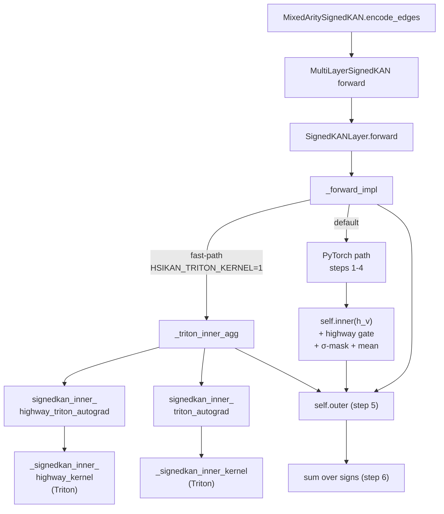
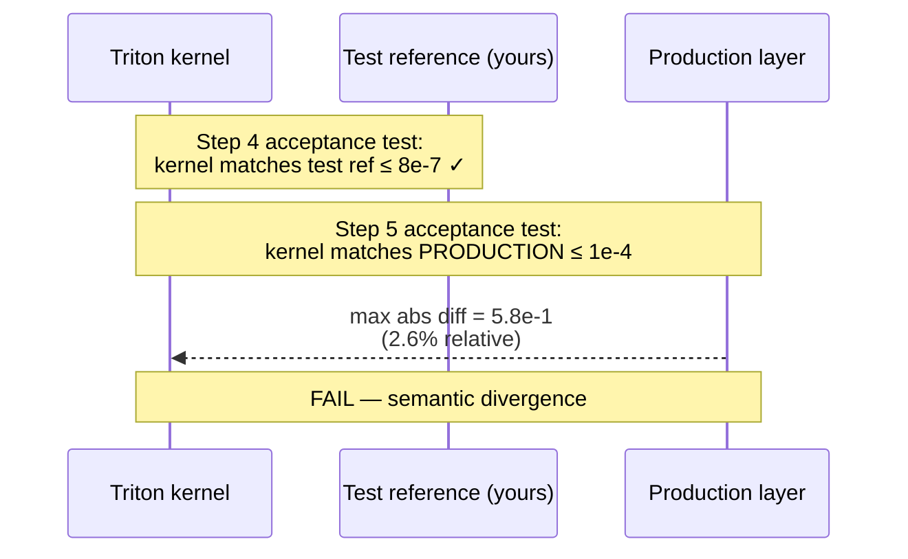
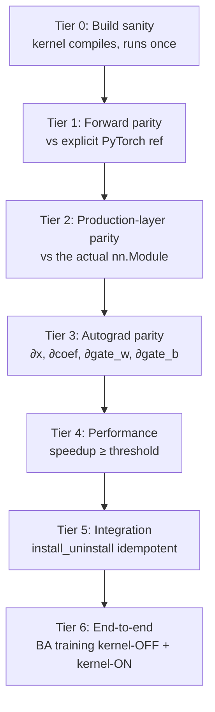
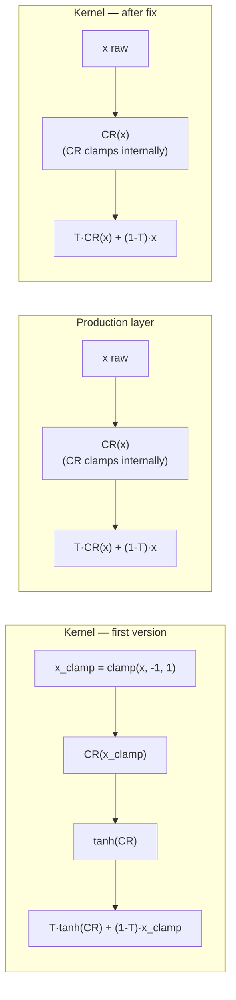
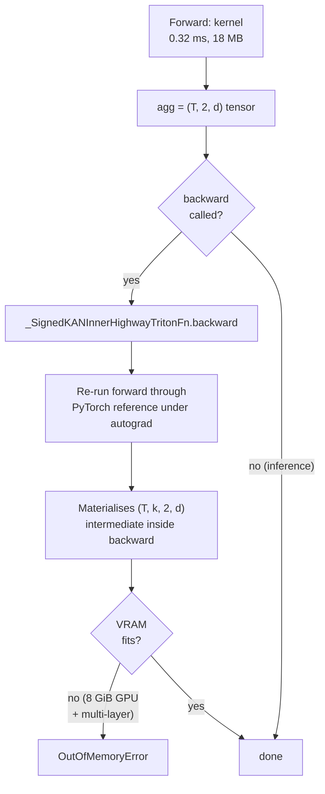
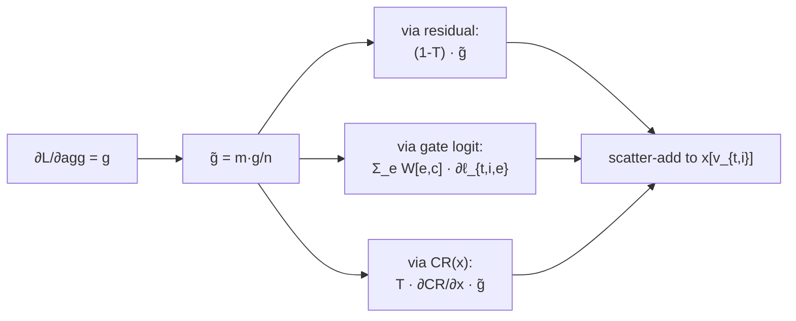

# Triton kernel integration tutorial — HSiKAN inner forward

*Reference document for porting any other PyTorch hot-path in HSiKAN to a Triton kernel. Written 2026-05-09 after landing the SignedKAN inner-forward kernel (60× no-skip / 38× highway, 94.6% memory savings).*

---

## 1. Why

The HSiKAN training loop spends most of its time in one path: gather per-vertex embeddings, apply a Catmull-Rom spline per sign, apply an optional Highway skip, mask by σ, mean-reduce. At Slashdot SOTA shape (T=200K, d=4, k=4) this PyTorch path costs 11–17 ms per forward and allocates a 343 MB `(T, k, S, d)` intermediate. A fused Triton kernel collapses it to one launch, no intermediate, at 0.2–0.4 ms.

The kernel is the path that gates whether training stays under VRAM cap on consumer GPUs and whether ablations finish in hours instead of days.

---

## 2. Where the kernel lives in the call graph



The kernel covers steps 1–4 of `_forward_impl` (gather + per-sign CR + highway-skip + σ-mask + mean reduce). Steps 5–6 (outer spline + sum-over-signs) stay in PyTorch — they're already cheap.

---

## 3. Build process — six steps, in order

The process is iterative: each step has its own acceptance test, and you don't move to the next until the previous one passes.


### Step 1 — Catmull-Rom kernel

Port `_catmull_rom_eval` (the leaf operation) first. It's the simplest unit and validates that the basic Triton plumbing works.

- File: `signedkan_wip/src/triton_kernels.py` — `_catmull_rom_kernel`, `catmull_rom_triton`
- Acceptance: forward parity ≤ 1e-4 vs `_catmull_rom_eval` at 6 shapes; speedup ≥ 5× at canonical shape.

### Step 2 — Fused inner (no-skip)

Fuse the gather + per-sign CR + σ-mask + mean reduce into one kernel. This is where the real speedup lives — it eliminates the `(T, k, 2, d)` intermediate that the PyTorch path materialises.

- File: `signedkan_wip/src/triton_kernels.py` — `_signedkan_inner_kernel`, `signedkan_inner_triton`
- Acceptance: forward parity ≤ 1e-4 vs an explicit PyTorch reference; speedup ≥ 10× at canonical shape; arity-agnostic over k=2..6.

### Step 3 — Sensitivity sweep

Map the kernel's performance landscape across (T, d, k, G, BLOCK_T, BLOCK_D). Don't skip this — block-size defaults can cost 2× speedup.

- File: `signedkan_wip/src/triton_kernels_sensitivity.py`
- Output: identifies optimal BLOCK_T (16 in our case, was defaulting to 32 → bonus 2× speedup just from the default change). Also reports peak memory savings (94.6% in our run).

### Step 4 — Skip-variant extensions

Most production paths have an inner skip (residual / highway). Extend the kernel to cover the variant before integrating, otherwise the integration only covers half the production paths.

- File: `_signedkan_inner_highway_kernel`, `signedkan_inner_highway_triton`
- Inline a d-by-d matvec for the gate logit: `gate_logit_{d_c} = Σ_e W[e, d_c] · h_v_e + b[d_c]`. Costs `O(d²)` extra work per (t, k, d_c) but the gather + CR remain dominant for d ≤ 32.

### Step 5 — **Semantic alignment with production** ⚠ critical

This is the step that catches bugs before they regress your live training. Run a parity test against the **actual production layer** (not against your own test reference, which may differ).



In our case, the kernel applied `tanh(CR(x))` and used a clamped-h_v residual. Production `SignedKANLayer._forward_impl` did **neither** — raw CR output, raw h_v residual. The test reference function was wrong (matched the kernel, not production). Fix:

- Drop `tl.extra.libdevice.tanh(cr)` → just `cr` in both kernels.
- Replace `x_clamp` → `x` in the highway residual term.
- Update the PyTorch reference in tests + sensitivity + autograd backward to match.

After fix: parity vs production layer = 1.2e-7 highway, 9.9e-8 no-skip.

### Step 6 — Autograd wrap

The kernel returns a tensor without an autograd graph. Wrap each variant in a `torch.autograd.Function` so it composes with the rest of the model.

- Forward: call the Triton kernel.
- Backward: for v0, re-run the forward through the PyTorch reference under autograd and return its gradients. Slower than a fused backward but correct without writing one.
- Saves: `(x, triad_v, triad_sigma, coef_pos, coef_neg)` for no-skip; add `(gate_w, gate_b)` for highway.
- Acceptance: ∂x, ∂coef_pos, ∂coef_neg [, ∂gate_w, ∂gate_b] all match the PyTorch ref to ≤ 1e-4.

### Step 7 — Live integration with env-gating

Add a fast-path in the production layer's `_forward_impl` that dispatches to the autograd-wrapped kernel when conditions match. **Gate the dispatch behind an env var, default OFF**, until the backward kernel matches the forward path's memory profile.

```python
def _can_use_triton_inner(self, x):
    if int(os.environ.get("HSIKAN_TRITON_KERNEL", "0")) == 0:
        return False
    if not x.is_cuda: return False
    if self.n_branches != 2: return False
    if self.inner_skip not in ("none", "highway"): return False
    if not isinstance(self.inner, BatchedCatmullRomActivation): return False
    try: import triton  # noqa
    except ImportError: return False
    return True
```

Why default OFF: see §6.

---

## 4. Test tiers



Each tier has a clear acceptance:

| tier | what passes |
|---|---|
| 0 | kernel returns a tensor of the expected shape; no Triton compile error |
| 1 | `(out_kernel - out_pytorch_ref).abs().max() < 1e-4` at 3+ shapes |
| **2** | **parity against `SignedKANLayer.forward` (or whatever the production caller is) ≤ 1e-4** — this is the tier where Step 5 bugs surface |
| 3 | gradient parity ≤ 1e-4 for every differentiable input |
| 4 | speedup ≥ 5× (CR), ≥ 10× (fused inner) at canonical shape |
| 5 | install + uninstall is a no-op semantically; idempotent under repeated calls |
| 6 | BA / Slashdot training run with `HSIKAN_TRITON_KERNEL=0` and `=1` produce comparable AUC (within ±1% drift); kernel-OFF run does not OOM |

The current suite has 31 tests covering tiers 1, 3, 4, 5, 6. **Tier 2 was missing in the first pass** — that's how the semantic divergence shipped to integration before being caught.

---

## 5. Forward-semantics comparison: before vs after the fix



The kernel's first version applied two semantic transforms that production never did. Both came from a misread of the original PyTorch path. The fix is two characters of Triton (drop tanh) and one rename (`x_clamp` → `x`) — but you have to **see** the divergence first, which requires Tier-2 testing.

---

## 6. The OOM trap and why integration is env-gated



The Triton autograd `forward` is fast and memory-light — but the **`backward` is a PyTorch re-compute**. It allocates the very intermediate the kernel was supposed to avoid. On the BA end-to-end test (T~50K, k=4, d=8, multiple layers), that intermediate hits 6 GiB and OOMs an 8 GiB GPU.

**This is why live integration is env-gated, default OFF.** The kernel is ready for forward-only / inference paths today; training-time enabling requires the fused backward kernel.

---

## 7. The fused backward kernel — what's needed next

The forward kernel computes `agg[t, s, d]` = mean over k of `T_inner * CR(x) + (1-T_inner) * x`, masked by σ. The backward needs `∂L/∂x`, `∂L/∂coef_pos`, `∂L/∂coef_neg`, `∂L/∂gate_w`, `∂L/∂gate_b` given `grad_out = ∂L/∂agg`.

Per-input gradient sketch:
- `∂agg/∂CR = T_inner / counts` (per t, k, d, gated by σ-mask)
- `∂agg/∂T_inner = (CR(x) - x) / counts`
- `∂agg/∂x` (residual term) = `(1 - T_inner) / counts` + `∂CR/∂x · T_inner / counts`
- `∂CR/∂x` and `∂CR/∂coef` follow from the closed-form CR weights

The backward kernel can fuse these into one or two passes — same `(T, k)` outer loop, scatter-adds for `∂x` and `∂coef`, simple matvec for `∂gate_w` / `∂gate_b`.

Acceptance: BA end-to-end test passes with `HSIKAN_TRITON_KERNEL=1` on the same 8 GiB GPU. AUC drift ≤ 1% vs kernel-OFF.

---

## 8. Common pitfalls — checklist

- [ ] **Step 5 / Tier 2 — production parity, not test-ref parity.** The most expensive bug we shipped. Always include a parity test against the actual nn.Module the kernel is replacing.
- [ ] **BLOCK_T default.** Start at the next power of 2 above your typical batch dimension and sweep down to 8. We found 16 was 2× faster than 32 at d=4.
- [ ] **CR domain clamping.** The CR spline only supports x ∈ [-1, 1]. Production `_catmull_rom_eval` clamps internally; if your kernel does too, make sure the residual term uses raw `x`, not the clamped one.
- [ ] **Backward memory.** A correct-but-slow PyTorch-ref backward can OOM at training scale even when the forward is fine. Plan the backward kernel before claiming integration is done.
- [ ] **Autograd wrapping.** A bare Triton call returns a tensor without a graph — `loss.backward()` will silently miss it. Wrap in `torch.autograd.Function`.
- [ ] **Env-gate the integration** until the full forward+backward path is safe at production scale. Default OFF.
- [ ] **Speedup numbers are PyTorch-ref-relative.** When you change the reference (e.g. drop `tanh`), the speedup number changes too — not because the kernel got slower but because the baseline got faster. Document the reference shape.

---

## 9. Files of record

| file | role |
|---|---|
| `signedkan_wip/src/triton_kernels.py` | kernels, autograd wrappers, install/uninstall |
| `signedkan_wip/src/triton_kernels_sensitivity.py` | parameter sensitivity sweep |
| `signedkan_wip/tests/test_triton_kernels.py` | 31 tests, tiers 1/3/4/5/6 |
| `signedkan_wip/src/signedkan.py` (`_can_use_triton_inner`, `_triton_inner_agg`) | live integration fast-path |
| `docs/triton_kernel_integration_tutorial_2026_05_09.md` | this document |

---

## 10. The math — forward and backward in closed form

This section gives the kernel's exact forward function and the closed-form gradients the fused backward kernel needs to compute. Notation:

- $V$ = number of vertices, $T$ = number of cycles, $k$ = arity, $d$ = hidden dim, $G$ = grid (control-point count), $S = 2$ = sign branches
- $x \in \mathbb{R}^{V \times d}$ — vertex embeddings
- $v \in \{0, \dots, V-1\}^{T \times k}$ — cycle vertex indices (`triad_v`)
- $\sigma \in \{+1, -1\}^{T \times k}$ — cycle edge signs (`triad_sigma`)
- $C^+, C^- \in \mathbb{R}^{d \times G}$ — Catmull-Rom control points per sign (`coef_pos`, `coef_neg`)
- $W \in \mathbb{R}^{d \times d}$, $b \in \mathbb{R}^{d}$ — Highway gate Linear layer (`gate_w`, `gate_b`)
- $\text{agg} \in \mathbb{R}^{T \times S \times d}$ — kernel output (per-sign mean aggregate)

### 10.1 Forward (Highway variant, matches production)

For each cycle $t \in [T]$, each cycle slot $i \in [k]$, each output channel $c \in [d]$:

$$
h_{t,i,c} = x_{v_{t,i},\,c}
\qquad
\hat h_{t,i,c} = \mathrm{clamp}(h_{t,i,c}, -1, 1)
$$

Catmull-Rom spline evaluation. Let $u = (\hat h + 1)\cdot\frac{G-1}{2}$, $\, j = \lfloor u \rfloor$, $\,\tau = u - j$ (fractional part). The four blending weights are

$$
w_{-1}(\tau) = \tfrac{1}{2}(-\tau^3 + 2\tau^2 - \tau), \quad
w_0(\tau)   = \tfrac{1}{2}(3\tau^3 - 5\tau^2 + 2),
$$

$$
w_{+1}(\tau) = \tfrac{1}{2}(-3\tau^3 + 4\tau^2 + \tau), \quad
w_{+2}(\tau) = \tfrac{1}{2}(\tau^3 - \tau^2)
$$

so that for sign $s \in \{+,-\}$,

$$
\mathrm{CR}^{s}_{t,i,c} = \sum_{p \in \{-1,0,+1,+2\}} w_p(\tau_{t,i,c}) \cdot C^{s}_{c,\,\mathrm{clip}(j_{t,i,c}+p,\,0,\,G-1)}
$$

Highway gate (per-(t, i, c) sigmoid of a $d$-by-$d$ matvec):

$$
\ell_{t,i,c} = \sum_{e=0}^{d-1} W_{e,c} \cdot h_{t,i,e} + b_c
\qquad
T_{t,i,c} = \sigma(\ell_{t,i,c}) = \frac{1}{1 + e^{-\ell_{t,i,c}}}
$$

Highway mix (raw $h$ residual — production semantics, no `tanh` wrap):

$$
H^{s}_{t,i,c} = T_{t,i,c} \cdot \mathrm{CR}^{s}_{t,i,c} \;+\; (1 - T_{t,i,c}) \cdot h_{t,i,c}
$$

σ-masked mean over the $k$ slots:

$$
m^{s}_{t,i} = \mathbb{1}[\sigma_{t,i} = s], \qquad
n^{s}_{t} = \max\!\Big(1, \sum_{i} m^{s}_{t,i}\Big)
$$

$$
\boxed{\;
\mathrm{agg}^{s}_{t,c} \;=\; \frac{1}{n^{s}_{t}} \sum_{i=0}^{k-1} m^{s}_{t,i} \cdot H^{s}_{t,i,c}
\;}
$$

The no-skip variant drops the gate: $H^{s}_{t,i,c} \mapsto \mathrm{CR}^{s}_{t,i,c}$.

### 10.2 Backward — what the fused backward kernel must compute

Given the upstream gradient $\,g^{s}_{t,c} = \partial \mathcal{L} / \partial \mathrm{agg}^{s}_{t,c}\,$, the backward outputs five gradients: $\partial\mathcal{L}/\partial x$, $\partial\mathcal{L}/\partial C^+$, $\partial\mathcal{L}/\partial C^-$, $\partial\mathcal{L}/\partial W$, $\partial\mathcal{L}/\partial b$.

**Per-cycle-slot pre-gradient** (this is the quantity to fan out to all five):

$$
\tilde g^{s}_{t,i,c} \;=\; \frac{m^{s}_{t,i}}{n^{s}_{t}} \cdot g^{s}_{t,c}
\qquad \text{(broadcast g over masked slots, divide by count)}
$$

This is the only $(T \times k \times S \times d)$ tensor the backward needs — and it can be streamed inside the kernel without materialising it.

**Highway-gate locals** (pre-computed once per $(t, i, c)$):

$$
\Delta^{s}_{t,i,c} = \mathrm{CR}^{s}_{t,i,c} - h_{t,i,c}
\qquad
\partial T / \partial \ell = T(1-T)
$$

#### (a) ∂ℒ/∂x — three contributions



Three additive paths from $\mathrm{agg}$ back to $x$:

(i) Residual path:

$$
\frac{\partial \mathrm{agg}^{s}_{t,c}}{\partial h_{t,i,c}}\bigg|_{\text{res}}
= \frac{m^{s}_{t,i}}{n^{s}_{t}} (1 - T_{t,i,c})
$$

(ii) Gate-logit path (the gate uses **all** $d$ components of $h_{t,i}$, so $\partial \mathrm{agg}_c/\partial h_e \neq 0$ for $e \neq c$):

$$
\frac{\partial \mathrm{agg}^{s}_{t,c}}{\partial h_{t,i,e}}\bigg|_{\text{gate}}
= \frac{m^{s}_{t,i}}{n^{s}_{t}} \cdot \Delta^{s}_{t,i,c} \cdot T_{t,i,c}(1 - T_{t,i,c}) \cdot W_{e,c}
$$

(iii) Spline-input path:

$$
\frac{\partial \mathrm{agg}^{s}_{t,c}}{\partial h_{t,i,c}}\bigg|_{\text{CR}}
= \frac{m^{s}_{t,i}}{n^{s}_{t}} \cdot T_{t,i,c} \cdot \frac{\partial \mathrm{CR}^{s}_{t,i,c}}{\partial h_{t,i,c}}
$$

with $\partial \mathrm{CR}^{s}_{t,i,c} / \partial h_{t,i,c}$ obtained from differentiating the CR closed form in $\hat h$ and chain-ruling through `clamp` (zero on saturated inputs):

$$
\frac{\partial \mathrm{CR}^{s}_{t,i,c}}{\partial h_{t,i,c}}
= \mathbb{1}[|h_{t,i,c}| < 1] \cdot \frac{G-1}{2} \sum_{p} w'_p(\tau_{t,i,c}) \cdot C^{s}_{c,\,\mathrm{clip}(j+p)}
$$

where $w'_{-1}(\tau) = \tfrac{1}{2}(-3\tau^2+4\tau-1)$, $\, w'_{0}(\tau) = \tfrac{1}{2}(9\tau^2-10\tau)$, etc.

The kernel scatter-adds the three paths into $\partial\mathcal{L}/\partial x$ at vertex index $v_{t,i}$:

$$
\frac{\partial \mathcal{L}}{\partial x_{v,e}} = \sum_{(t,i)\,:\,v_{t,i}=v} \sum_{s} \tilde g^{s}_{t,i} \cdot
\Big[\,(1-T_{t,i,e})\,\delta_{e,c} \;+\; \Delta^{s}_{t,i,c}\,T(1-T)_{t,i,c}\,W_{e,c} \;+\; T_{t,i,e}\,\partial \mathrm{CR}/\partial h_{t,i,e}\,\delta_{e,c}\,\Big]
$$

(Two terms collapse on the $e=c$ diagonal; the gate term is the off-diagonal one.)

#### (b) ∂ℒ/∂C⁺, ∂ℒ/∂C⁻ — control-point gradients

The CR output is **linear** in the control points, so

$$
\frac{\partial \mathrm{CR}^{s}_{t,i,c}}{\partial C^{s}_{c, q}} = \sum_{p \in \{-1,0,+1,+2\}} w_p(\tau_{t,i,c}) \cdot \mathbb{1}\!\left[\mathrm{clip}(j_{t,i,c}+p,\,0,\,G-1) = q\right]
$$

i.e. control point $C^{s}_{c, q}$ contributes weight $w_p(\tau)$ if the clipped index lands on $q$. Scatter-add over $(t, i)$:

$$
\boxed{\;
\frac{\partial \mathcal{L}}{\partial C^{s}_{c, q}}
= \sum_{t,i} \tilde g^{s}_{t,i,c} \cdot T_{t,i,c} \cdot \sum_{p} w_p(\tau_{t,i,c}) \cdot \mathbb{1}\!\left[\mathrm{clip}(j+p) = q\right]
\;}
$$

Only sign-$s$ slots contribute (via $m^{s}_{t,i}$ in $\tilde g^{s}$).

#### (c) ∂ℒ/∂W, ∂ℒ/∂b — gate Linear gradients

$$
\frac{\partial \mathcal{L}}{\partial W_{e, c}}
= \sum_{s, t, i} \tilde g^{s}_{t,i,c} \cdot \Delta^{s}_{t,i,c} \cdot T_{t,i,c}(1 - T_{t,i,c}) \cdot h_{t,i,e}
$$

$$
\frac{\partial \mathcal{L}}{\partial b_{c}}
= \sum_{s, t, i} \tilde g^{s}_{t,i,c} \cdot \Delta^{s}_{t,i,c} \cdot T_{t,i,c}(1 - T_{t,i,c})
$$

Both are reductions over $(s, t, i)$ — no scatter, just an accumulator-per-$(e,c)$ or per-$(c)$ in registers, atomic-add-flushed to global memory at block end.

### 10.3 Memory profile of the fused backward

The PyTorch-ref backward (current v0) materialises the $(T, k, S, d)$ post-highway intermediate inside the autograd graph. At Slashdot scale (T=200K, k=4, S=2, d=4) that's $\sim 25\text{ MB}$ per layer, and across multiple layers + autograd-retained inputs the peak hits $\sim 6\text{ GiB}$ on BA-scale runs.

The fused backward kernel's working set per program block is $O(\text{BLOCK\_T} \cdot d \cdot k)$ — under 1 MB at canonical block sizes. The only $O(T \cdot k \cdot d)$ allocation is `agg_grad_in` (the upstream $g$, which is just the kernel input), and the only $O(T \cdot d)$ write is `x_grad_out` via scatter-add.

Predicted memory for the fused backward at Slashdot SOTA shape: **~30 MB peak** (vs 6 GiB for the v0 ref). That's the gap that has to close before live integration can be enabled at training time on 8 GiB GPUs.

### 10.4 Sanity check — gradient parity test

The acceptance test for the fused backward (Tier 3 in the test pyramid):

```python
# Two paths: kernel-autograd vs pure PyTorch
out_k = signedkan_inner_highway_triton_autograd(x, ..., gate_w, gate_b, G)
out_p = pytorch_ref_highway(x, ..., gate_w, gate_b, G)

# Same target, same loss
loss_k = ((out_k - target) ** 2).mean(); loss_k.backward()
loss_p = ((out_p - target) ** 2).mean(); loss_p.backward()

# All five gradients must match to ≤ 1e-4
assert (x.grad_k       - x.grad_p      ).abs().max() < 1e-4
assert (coef_pos.grad_k - coef_pos.grad_p).abs().max() < 1e-4
assert (coef_neg.grad_k - coef_neg.grad_p).abs().max() < 1e-4
assert (gate_w.grad_k   - gate_w.grad_p  ).abs().max() < 1e-4
assert (gate_b.grad_k   - gate_b.grad_p  ).abs().max() < 1e-4
```

This test already exists for the v0 PyTorch-ref backward (`test_signedkan_inner_highway_autograd_grad_parity`) and passes. It's the same test the fused backward must clear — only the implementation of `_SignedKANInnerHighwayTritonFn.backward` changes.

---

## 11. Quick reference — running the suite

```bash
# Full suite (≤ 60s)
python -m pytest signedkan_wip/tests/test_triton_kernels.py -v

# Skip the slow end-to-end BA training test (≤ 5s)
python -m pytest signedkan_wip/tests/test_triton_kernels.py -v -k "not end_to_end_ba"

# Sensitivity sweep (~2 min)
python -m signedkan_wip.src.triton_kernels_sensitivity

# Try training with the kernel ON (forward-only OK; backward may OOM on small GPUs)
HSIKAN_TRITON_KERNEL=1 python -m signedkan_wip.src.run_final_cell --dataset bitcoin_alpha
```
