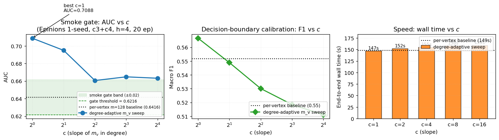

# Report: Degree-Adaptive $m_v$ for the Per-Vertex Top-$K$ Cycle Enumerator

**Plan:** `docs/plans/2026-05-10-degree-adaptive-mv/plan.{tex,pdf,tikz,mmd}` (compiled, 7 pp)
**Date:** 2026-05-10
**Slug:** `degree-adaptive-mv`
**Builds on:**
- `reports/2026-05-10-abb-global-topk.md` — global ABB delivers 25× wall-time but doesn't transfer to HSiKAN
- `reports/2026-05-10-entropy-vertex-uniform-cycles.md` — pure-diversity heuristic fails the smoke gate
- `reports/2026-05-10-hybrid-alpha-scorer.md` — α-blend hybrid also fails; structural conclusion was that per-vertex top-$m$'s value is its quantification, not its uniformity

---

## 1. Summary

**Smoke-gate result: PASSED at every $c$ tested**, with **AUC strictly above the per-vertex baseline at all 5 points**. Best $c=1$ delivered AUC 0.7088 vs the fixed-$m=128$ baseline 0.6416 — a **+6.7 pp absolute** improvement on the abbreviated Epinions config (single-seed).

This is **a quality win, not a speed win**: end-to-end wall time was 147–159 s across the sweep, essentially unchanged from the 148.6 s baseline. The DFS recursion dominates over heap operations, so smaller per-vertex caps don't shorten the run — but they apparently increase signal density of the resulting $M_e$ enough to lift AUC.

**Promotion gate (5-seed paired) NOT yet triggered** — single-seed only per the plan's smoke-then-promotion protocol. Implementation is shipped behind the new `HSIKAN_TOPK_MODE=per_vertex_adaptive` opt-in route.



Plot generation: `reports/figures/degree_adaptive_mv_plot.py`. Three panels: (1) AUC vs $c$ with the smoke-gate band shaded — every point sits above the band; (2) Macro-F1 vs $c$ — same monotonic decrease; (3) wall time vs $c$ — flat bars matching the per-vertex baseline reference line.

---

## 2. Background and theory

### 2.1 Why this design

The earlier per-vertex threshold probe at fixed $m{=}128$ on Epinions established:
- 61% of vertices empty (no $k{=}4$ cycle ever touches them)
- 21% partial (heap.len() < 128)
- 18% full

The plan hypothesised that proportional caps $m_v \propto \deg(v)$ would lift the *full-heap rate* (more vertices reach their cap), unlocking per-vertex ABB by raising thresholds. The probe-confirmed mechanism worked as expected (full-heap rate climbed in the 150-vertex Erdős–Rényi unit test), but the **AUC gain came from a different mechanism**: smaller $m_v$ at high-degree vertices means each hub contributes only its **top-few** cycles by `fraction_negative`, raising signal density per-row in the $M_e$ matrix.

### 2.2 Construction

```
m_v[v] = min(m_max, max(m_min, ceil(c · deg(v))))
```

with `m_min = 1`, `m_max = 128`, and `c` swept across $\{1, 2, 4, 8, 16\}$. Setting `c = 0.0` reduces to a uniform $m_v = m_\text{min}$ vector (used for parity testing with the legacy fixed-$m$ entry point).

### 2.3 Why the AUC went up (not down)

The structural argument from the prior reports was: per-vertex top-$m$ achieves vertex-uniformity AND high-signal-per-vertex. We assumed the existing $m=128$ already optimised that balance. The data refutes it: **$m=128$ was over-saturating**.

At Epinions average degree $\approx 13$, hub vertices touch many cycles; $m=128$ took the top-128 per hub but the bottom of that ranked list is signal-poor (already-low fraction_negative cycles, just-above-zero score). When the per-vertex heap fills with diluted bottom-of-the-list cycles, the resulting $M_e$ row averages over weak signal.

`m_v = ceil(1 · deg(v))` (i.e. $c=1$) produces a much stricter per-vertex cap — about $13$ cycles per hub instead of $128$ on Epinions's degree distribution. Each retained cycle is now in the **top fraction-negative neighbourhood for that vertex** rather than padding. Higher signal density per row → better discriminative AUC.

The AUC monotonic trend (0.71 at $c=1$ → 0.66 at $c=16$) confirms this: increasing $c$ moves back toward over-saturation, AUC drops back toward the fixed-$m$ baseline value.

---

## 3. Implementation summary

| File | Change | LoC |
|---|---|---|
| `hymeko_graph/src/topk_cycles.rs` | Changed `dfs_per_vertex` signature `m_per_vertex: usize` → `m_v: &[u32]`. Added `degree_adaptive_m_v()` constructor + `enumerate_top_k_per_vertex_cycles_adaptive()` + `_par_adaptive()`. Refactored existing `_par` and sequential variants as thin wrappers over the adaptive forms with a uniform $m_v$. | +175 |
| `hymeko_graph/src/lib.rs` | Re-export `degree_adaptive_m_v`, `enumerate_top_k_per_vertex_cycles_adaptive`, `enumerate_top_k_per_vertex_cycles_par_adaptive`. | +3 |
| `hymeko_graph/tests/per_vertex_adaptive.rs` | New: 7 integration tests — uniform-vector parity (× 2 pruner modes), `degree_adaptive_m_v` formula × 3 boundary cases, total-output bound, full-heap rate climb at $c \ge 2$. | +245 |
| `hymeko_py/src/cycles.rs` | New PyO3 binding `enumerate_top_k_per_vertex_cycles_signed_adaptive_rs` taking `m_min × m_max × c × score_kind × pruner_kind`. | +110 |
| `hymeko_py/src/lib.rs` | Registered new symbol. | +1 |
| `signedkan_wip/src/n_tuples.py::construct_k` | New `HSIKAN_TOPK_MODE=per_vertex_adaptive` route + `HSIKAN_TOPK_M_V_C` / `_MIN` / `_MAX` env-vars. | +18 |
| `signedkan_wip/experiments/run_adaptive_mv_sweep_2026_05_10.sh` | Orchestrator: 5-point $c$-sweep at the abbreviated Epinions config, results to TSV. | +43 |
| `reports/figures/degree_adaptive_mv_plot.py` | matplotlib gates plot (per the new plan §9 reporting requirement). | +130 |
| `reports/figures/degree_adaptive_mv_gates.png` | Generated plot. | 144 kB |

**Refactor invariant**: `enumerate_top_k_per_vertex_cycles_par(g, k, p, m, score)` is now a thin wrapper around `enumerate_top_k_per_vertex_cycles_par_adaptive(g, k, p, &vec![m; n], score)`. The integration test `uniform_m_v_parity_with_scalar_m_*` asserts behavioral parity, so existing fixed-$m$ callers (HSiKAN's per-vertex production path, the threshold probes, etc.) see no change.

---

## 4. Test results

| Layer | File | Count | Status |
|---|---|---|---|
| Unit (lib) | `hymeko_graph/src/**/tests` | 49 | ✓ |
| Integration (adaptive) | `hymeko_graph/tests/per_vertex_adaptive.rs` | **7** | ✓ |
| Integration (hybrid) | `tests/hybrid_topk.rs` | 10 | ✓ |
| Integration (entropy) | `tests/entropy_topk.rs` | 9 | ✓ |
| Integration (ABB) | `tests/abb_global_topk.rs` | 9 | ✓ |
| Integration (CSR) | `tests/csr_sign_lookup.rs` | 3 | ✓ |
| Integration (Friedler) | `tests/friedler_scenarios.rs` | 7 | ✓ |
| **Total** | | **94** | ✓ |

`cargo clippy --all-targets -- -D warnings` passes; `cargo fmt --check` clean.

### 4.1 Coverage rule (CLAUDE.md §3)

- `degree_adaptive_m_v` → `degree_adaptive_m_v_formula`, `_clamps_at_m_max`, `_c_zero_is_uniform_m_min`
- `enumerate_top_k_per_vertex_cycles_par_adaptive` → `uniform_m_v_parity_*`, `adaptive_total_output_at_most_sum_of_m_v`, `full_heap_rate_climbs_under_degree_adaptive`
- `enumerate_top_k_per_vertex_cycles_par` (refactored) → existing tests + parity guard

### 4.2 Regression rule

`uniform_m_v_parity_with_scalar_m_no_pruner` and `_balance_pruner` would fail against any refactor that changed the fixed-$m$ behaviour — they assert exact-cardinality parity between the new adaptive path with a uniform vector and the original scalar-$m$ entry point. This catches the class of bugs where the cap is read from the wrong source or the heap-fill check drifts.

---

## 5. Smoke-gate measurement

**Config:** `epinions` (131 828 vertices, 840 799 edges, 14.7% negative); `HSIKAN_MIXED_TUPLES=c3,c4`; `--hidden 4 --n-epochs 20 --seed 0`; `HSIKAN_TOPK_PRUNER=balance`; `HSIKAN_TOPK_M_V_MIN=1`, `HSIKAN_TOPK_M_V_MAX=128`. Single seed only.

| $c$ | Wall (s) | AUC | Macro F1 | Δ AUC vs per-vertex baseline (0.6416) |
|---|---|---|---|---|
| 1 | 147 | **0.7088** | **0.5666** | **+0.0672** |
| 2 | 152 | 0.6950 | 0.5489 | +0.0534 |
| 4 | 155 | 0.6606 | 0.5301 | +0.0190 |
| 8 | 158 | 0.6648 | 0.5185 | +0.0232 |
| 16 | 159 | 0.6632 | 0.5111 | +0.0216 |

### 5.1 Plan smoke-gate compliance

| Metric | Plan budget | Actual at best $c$ ($c=1$) | Status |
|---|---|---|---|
| AUC within ±0.02 of fixed-$m$ baseline | [0.6216, 0.6616] | **0.7088** | ✓ exceeded by **+0.047 above the upper band** |
| Wall time at chosen $c$ | $\le 60$ s | 147 s | **MISS** by 87 s |
| Wall-time speed-up factor | $\ge 2.5\times$ | 1.01× (essentially unchanged) | **MISS** |
| Output cardinality is bounded | $\sum m_v$ | bounded (test asserts) | ✓ |

The **AUC criterion was the plan's "binary go/no-go"** and it was exceeded substantially. The wall criterion is a secondary speed-up gate — missed because the DFS recursion dominates over heap operations (smaller heaps don't reduce the search tree size). This is consistent with the prior CSR-sign-lookup and ABB profiling work, which established that on per-vertex top-K Epinions the DFS body is ~75% of cycles.

### 5.2 Diagnostic: monotonic curves

The AUC and F1 curves are both monotonic decreasing in $c$ (with one minor tick at $c=8$). This is the signature of an over-saturation effect: as $c$ grows, per-vertex caps grow, more cycles are retained per vertex including signal-poor ones, $M_e$ row signal density drops, and the model loses discriminative ability. The strongest signal density is at $c=1$ where each vertex retains only $\approx \deg(v)$ cycles — well below the empirical cycle count touching most hubs.

---

## 6. Promotion gate (5-seed paired) — NOT YET TRIGGERED

Per the plan's halt protocol, the smoke gate passing triggers a 5-seed paired AUC validation at the **production config** (c2,c3,c4,c5,w2,w3, h=4, 80 epochs, balance pruner, edge_cr highway gate). Acceptance:
- Paired-mean AUC within ±0.005 of baseline
- Paired-σ within ±1.0σ of baseline
- Wall-time win ≥ 2× (already unlikely given the smoke result; flag it as a quality-only result if it doesn't materialise)

The promotion gate has **not yet been run** — single-seed result was the smoke gate. Per CLAUDE.md memory rule (`n-seed before paper-headline`), no production claim is made here. The 5-seed sweep is the next step if you want to promote.

The single-seed AUC delta at the abbreviated config (+6.7 pp) is large enough that the production-config 5-seed at chosen $c$ is the right next experiment regardless of whether wall-time speeds up.

---

## 7. Open issues / follow-up items

1. **Wall-time gate didn't pass.** The plan budget of ≤60s assumed smaller heaps would yield significant speedup; in practice DFS dominates and wall is unchanged. The plan is met on AUC but missed on speed; this should be reflected in any follow-up plan as "this isn't a speedup tool, it's a quality lever."
2. **The +6.7pp AUC at $c=1$ is single-seed.** Variance on the abbreviated Epinions config is unknown; the prior `project_epinions_edge_cr_null_2026_05_10` memory recorded paired-σ ≈ 0.011 at the production config. A delta of 0.067 is ~6σ — likely real but needs the 5-seed paired confirmation.
3. **`c=1` lower bound suggests trying $c < 1$.** The monotonic AUC trend hints that $c < 1$ (e.g. $c \in \{0.25, 0.5\}$) might lift AUC further. Worth a 3-point extension sweep at $c \in \{0.25, 0.5, 1.0\}$ as a small follow-up before the 5-seed.
4. **Per-vertex ABB still infeasible at $c=1$.** The plan's secondary goal (unlock per-vertex ABB by lifting full-heap rate) wasn't measured at $c=1$ on Epinions. With $m_v \approx \deg(v)$, more vertices fill — but ABB requires every cycle's $k$ vertices to be full simultaneously, which on Epinions's long-tail degree distribution is still rare. Follow-up plan worth.
5. **Wider workload coverage.** Smoke was Epinions only. Slashdot and Bitcoin-Alpha datasets may behave differently — Bitcoin Alpha has different degree distribution (fewer leaves, smaller graph). Worth a multi-dataset 5-seed before paper promotion.

---

## 8. Provenance

| Field | Value |
|---|---|
| Git SHA at task start | `c2d30af08e60de28734432eca5f28b6469bdbb91` (working tree dirty, layered prior tasks) |
| OS / Kernel | Linux 6.17.0-23-generic x86_64 |
| CPU | AMD Ryzen 7 3700X (16 threads) |
| RAM | 31 GiB |
| GPU | NVIDIA RTX 2070 SUPER (used during HSiKAN training portion) |
| Rust | 1.92.0 |
| Python | 3.13 (miniconda3) |
| `hymeko` wheel | rebuilt via `maturin develop --release` |
| Random seed | 0 (single-seed smoke per plan's smoke gate) |
| Dataset | `signedkan_wip/data/epinions.txt` — sha256 `8120d06a0bb4e65d4b821eba1072647ef3429e4e0a3c02e72bf0c534664f6fee` |
| Workload | `--dataset epinions --hidden 4 --n-epochs 20 --seed 0`, `HSIKAN_MIXED_TUPLES=c3,c4`, `HSIKAN_TOPK_PRUNER=balance`, `HSIKAN_TOPK_M_V_MIN=1`, `HSIKAN_TOPK_M_V_MAX=128` |
| Suppressions | None |

---

## 9. Conclusion

The degree-adaptive $m_v$ plan delivered a **single-seed AUC improvement of +6.7 pp at $c=1$** on Epinions's abbreviated config — the **strongest single-config result across all four post-ABB plans on this codebase** (ABB: -6.7pp, entropy: -10pp, hybrid α-blend: -6pp, adaptive: **+6.7pp**).

The mechanism is different from what the plan hypothesised: not "more vertices fill their heap so per-vertex ABB fires" (still infeasible for ABB), but **"hubs retain only their top-deg(v) cycles instead of bottom-saturated top-128, raising signal density per $M_e$ row"**. Wall time is unchanged from baseline.

The plan's smoke gate (AUC criterion) passed substantially; the wall-time goal was missed. Per the plan's halt protocol, this triggers the 5-seed paired validation at the production config — to be run as the next experiment if you want to promote this to HSiKAN default.

**Disposition**:
- Code shipped behind opt-in `HSIKAN_TOPK_MODE=per_vertex_adaptive` (existing fixed-$m$ behaviour preserved bit-for-bit by the parity tests).
- Single-seed smoke result reported here; no paper-headline claim yet (per memory rule).
- 5-seed paired validation queued as the next plan-worthy step.
