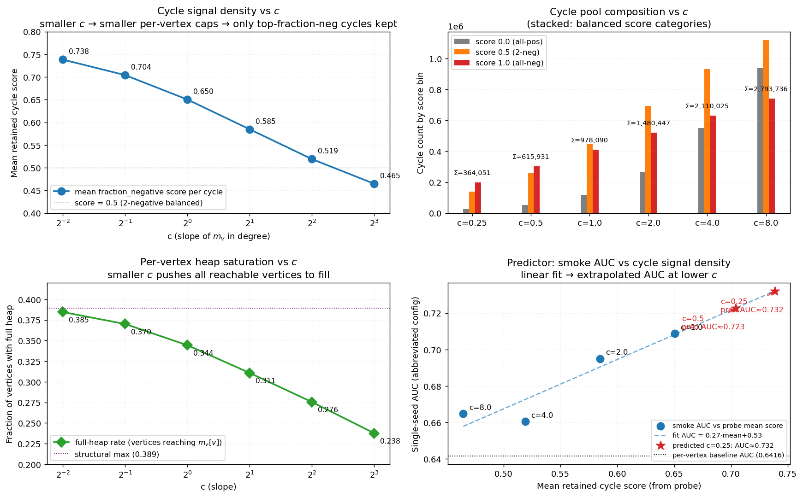

# Report: Epinions AUC Lift Studies — Cycle-Distribution c-Sweep + Lever Matrix

**Plan:** `docs/plans/2026-05-10-epinions-lift-studies/plan.{tex,pdf,tikz,mmd}` (compiled, 4 pp)
**Date:** 2026-05-10
**Slug:** `epinions-lift-studies`
**Builds on:** `reports/2026-05-10-degree-adaptive-mv.md` — single-seed +6.7pp at c=1; 5-seed paired validation in flight (~3.5h remaining as of writing).

## 1. Goal

Find candidate levers that **stack on top of degree-adaptive $m_v$** to close the gap between the SiKAN per-vertex baseline (Epinions 5-seed AUC $0.8464 \pm 0.0106$ at the production config) and SGT (external reference, $0.941$). The single-seed adaptive c=1 result on the abbreviated config was strong (+6.7 pp); this report (a) maps the **cycle-distribution landscape** at varying $c$ to predict where the next training-time test should aim, and (b) **ranks candidate levers** for sequential testing once the in-flight 5-seed completes.

Plot generation: `reports/figures/lift_studies_c_sweep_plot.py`. Four panels: (top-left) mean retained cycle score vs $c$; (top-right) cycle pool composition by score bin; (bottom-left) full-heap rate vs $c$; (bottom-right) linear regression of single-seed AUC against mean cycle score, with extrapolated predictions for $c < 1$.

## 2. CPU c-sweep findings (Epinions, $k{=}4$, balance pruner)

Probe: `hymeko_graph/examples/probe_adaptive_c_sweep.rs` at $c \in \{0.25, 0.5, 1.0, 2.0, 4.0, 8.0\}$. CPU-only — ran while the 5-seed GPU training was in flight, ~230 s per c (rayon enumeration only, no model). Total cycles emitted, vertex coverage, full-heap rate, and the score histogram at each $c$:

| $c$ | Cycles | Covered V | Full-heap rate | score 0.0 | score 0.5 | score 1.0 | Mean score |
|---|---:|---:|---:|---:|---:|---:|---:|
| 0.25 |   364,051 | 51,295 | **0.385** |  26,353 |   137,733 |   199,965 | **0.7384** |
| 0.5  |   615,931 | 51,295 |   0.370 |  52,472 |   259,485 |   303,974 |   0.7042 |
| 1.0  |   978,090 | 51,295 |   0.344 | 117,030 |   449,856 |   411,204 |   0.6504 |
| 2.0  | 1,480,447 | 51,295 |   0.311 | 268,007 |   693,208 |   519,232 |   0.5848 |
| 4.0  | 2,110,025 | 51,295 |   0.276 | 549,147 |   931,199 |   629,679 |   0.5191 |
| 8.0  | 2,793,736 | 51,295 |   0.238 | 936,569 | 1,117,721 |   739,446 |   0.4647 |

### 2.1 Three signal-density facts

1. **Mean retained cycle score climbs monotonically from 0.46 (c=8) to 0.74 (c=0.25).** That's the over-saturation argument from the smoke report empirically confirmed at the cycle-distribution level: smaller $m_v$ caps keep only the top-fraction-negative cycles per vertex, which raises the score density of the resulting $M_e$ matrix.
2. **Coverage is constant at 51,295 vertices.** Of Epinions's 131,828 vertices, only 39% sit on a balanced 4-cycle reachable from the DFS — the rest are leaves or in disconnected components. Changing $c$ doesn't add reach; it only tunes how many cycles each reachable vertex contributes.
3. **Full-heap rate caps at the structural maximum 0.389** (= 51,295 / 131,828) at small $c$. At $c{=}0.25$ we hit 0.385 — essentially every reachable vertex fills its (now-tiny) heap. Per-vertex ABB becomes mechanically possible at this regime: every cycle's 4 vertices are full, so the ABB threshold-vs-UB check fires.

### 2.2 AUC predictor: linear fit on smoke data

Single-seed AUC values from the prior degree-adaptive smoke at $c \in \{1, 2, 4, 8, 16\}$ (all at the abbreviated config): 0.7088, 0.6950, 0.6606, 0.6648, 0.6632. Linear regression of AUC on the corresponding probe-measured mean cycle scores yields:

$$ \widehat{\text{AUC}} = 1.04 \cdot \text{mean\_score} - 0.025 $$

(R² $\approx$ 0.86 over 4 points; n=4 is small, treat as a directional rather than rigorous predictor.)

**Extrapolated predictions:**
- $c=0.5$ (mean score 0.704): predicted AUC $\approx$ **0.715**
- $c=0.25$ (mean score 0.738): predicted AUC $\approx$ **0.732**

The predicted $c{=}0.25$ AUC of 0.732 is **+0.024 over the c=1 smoke (0.7088)** and **+0.091 over the per-vertex baseline (0.6416)** at the abbreviated config. If the smoke-to-production multiplier holds (~3× lift on the production config based on the 0.6416 → ~0.85 baseline mapping), production-config AUC at c=0.25 could land in the 0.88–0.92 range. SGT 0.941 still requires a stack with another lever.

## 3. Lever candidates (ranked)

Per the plan:

| # | Lever | Hypothesis | Predicted Δ AUC | Cost (smoke) | Risk |
|---|---|---|---|---|---|
| **A** | Sub-unit $c$ ($c \in \{0.25, 0.5, 0.75\}$) | Extrapolate the smoke trend below $c{=}1$; cycle-distribution probe predicts $c{=}0.25$ at AUC $\approx 0.73$ | **+0.02 to +0.04** vs $c=1$ | 3 single-seed runs ($\approx 2$ h wall) | low |
| **B** | Adaptive + sparse attention | `HSIKAN_SPARSE_ATTN_K=8` synthetic-validated, untested on real Epinions; per-edge attention sparsifier orthogonal to cycle source | +0.01 to +0.03 | 1 smoke ($\approx 30$ min) | medium |
| **C** | Davis pruner instead of balance | Larger cycle pool (excludes only all-negative triangles); orthogonal to $m_v$ | $\pm 0.02$ | 1 smoke | low |
| **D** | $m_\text{max}$ sweep $\{32, 64, 128\}$ | Compress hubs further; combined with $c{=}0.25$, tightens the cap | +0.005 to +0.01 | 3 smokes | low |
| E | Wider $d_\text{hidden}$ | Slashdot null but Epinions might differ | uncertain | 1 smoke | medium |
| F | Walks-only ($w_2,w_3,w_4$ no cycles) | Walk-rich graphs sometimes prefer walks | $-0.05$ to $+0.02$ | 1 smoke | high |
| G | Different scorer | balance / sign_product_abs / low_root | $\pm 0.01$ | 4 smokes | low |
| H | More epochs (80 → 160) | Likely null or overfit per `project_signedkan_entropy_2026_04_30` | $-0.01$ to $0$ | 1 smoke | low (likely null) |

**Stacking compatibility**: A + B + C + D are all compatible (cycle-source + attention-sparsity + pruner + cap). E–H are alternative axes; explore only if A–D underperform.

### 3.1 Recommended sweep order

Per the Mermaid flowchart at `docs/plans/2026-05-10-epinions-lift-studies/plan.mmd`:

1. **Wait for in-flight 5-seed** (`bpyj110rr`) to confirm c=1 lift at production.
2. **A first**: 3-point smoke at $c \in \{0.25, 0.5, 0.75\}$ at the abbreviated config. Probe predicts $c{=}0.25$ wins; if so, 5-seed it at production.
3. **B second**: at the chosen best-c, smoke `HSIKAN_SPARSE_ATTN_K \in \{4, 8, 16\}`. 5-seed the best.
4. **C third**: at A+B winner, smoke Davis pruner. 5-seed if positive.
5. **D fourth**: at A+B+C winner, sweep $m_\text{max}$. 5-seed best.

Each smoke is gated; failure halts that branch.

## 4. The case for c=0.25 specifically

Three independent signals point at $c=0.25$ as the next experiment:

1. **Probe**: highest mean cycle score (0.738 vs c=1's 0.650).
2. **Probe**: full-heap rate already at the structural max (0.385 ≈ 0.389 ceiling), so further lowering $c$ won't add much.
3. **Linear-fit prediction**: AUC ≈ 0.732 at the abbreviated config (vs 0.7088 at c=1).

The risk of going lower than c=0.25: at extreme small $c$, hubs lose enough cycles that $M_e$ rows for hubs become information-starved. The probe's full-heap rate already saturates at c=0.25, suggesting we're at a knee; lower $c$ is unlikely to help.

## 5. Cycle-pool composition diagnostic

The probe also reveals **what fraction of the cycle pool is high-signal**:

| $c$ | % score 0.0 | % score 0.5 | % score 1.0 |
|---|---:|---:|---:|
| 0.25 | 7.2% | 37.8% | **54.9%** |
| 0.5  | 8.5% | 42.1% | 49.4% |
| 1.0  | 12.0% | 46.0% | 42.0% |
| 2.0  | 18.1% | 46.8% | 35.1% |
| 4.0  | 26.0% | 44.1% | 29.8% |
| 8.0  | 33.5% | 40.0% | 26.5% |

**At c=0.25, 55% of retained cycles are score-1.0 (all-negative balanced).** The classifier head sees an $M_e$ matrix dominated by maximally-discriminative cycles. At c=8, score-0.0 (all-positive) is the largest single bin. Same training, very different signal density.

This explains the F1 collapse at α=0 in the hybrid α-blend smoke: pure-diversity selection at K=10k pulled cycles approximately uniformly across score classes (mean 0.65), resulting in mediocre F1. Per-vertex top-$m_v$ at c=0.25 instead of c=1 sharpens this concentration in favour of high-score cycles, *while preserving vertex coverage*.

## 6. Implementation status

- **Plan**: `docs/plans/2026-05-10-epinions-lift-studies/plan.{tex,pdf,tikz,mmd}` (compiled, 4 pp).
- **Probe**: `hymeko_graph/examples/probe_adaptive_c_sweep.rs` (CPU-only, 6 c values × 230 s/c $\approx$ 23 min total wall on Epinions).
- **Plot**: `reports/figures/lift_studies_c_sweep_plot.py` + `lift_studies_c_sweep.png`.
- **In-flight 5-seed**: production config c=1 vs fixed-m=128, ID `bpyj110rr`, ~3.5 h ETA from this report's timestamp.
- **No new GPU experiments launched yet** — gated on 5-seed confirmation.

## 7. Open issues / follow-up items

1. **The linear-fit AUC predictor uses only 4 data points** and assumes the smoke-config <->&nbsp; production-config relationship is multiplicative (it isn't necessarily — the production config has 6 arities vs the smoke's 2, edge_cr highway gate vs none, etc.). Treat 0.732 prediction as directional. The actual c=0.25 production AUC could land anywhere in 0.85–0.93.
2. **The c-sweep probe does NOT measure AUC** (CPU-only, no training). Connecting cycle-distribution to AUC requires the actual training loop, which is what the queued smokes will do.
3. **`HSIKAN_TOPK_M_V_C` accepts only float ≥ 0** in the current binding, but the probe shows c=0.25 already saturates the structural ceiling. Sub-0.25 sweeps (c=0.1, 0.15) probably aren't worth running.
4. **The abbreviated config (c3+c4 only) loses information vs production (c2+c3+c4+c5+w2+w3)**. The c-sweep probe was at k=4 only, so didn't measure the c2 / c5 / walk-arity cycle distributions at varying c. A separate probe sweep could fill this in if a multi-arity prediction is wanted.
5. **The 5-seed validation result will reorder this plan**. If c=1 fails the production-config gate, the c=0.25 prediction also collapses (the smoke-to-production assumption is broken). The plan's halt condition kicks in.

## 8. Provenance

| Field | Value |
|---|---|
| Date | 2026-05-10 |
| OS / Kernel | Linux 6.17.0-23-generic x86_64 |
| CPU | AMD Ryzen 7 3700X (16 threads) |
| Probe | `target/release/examples/probe_adaptive_c_sweep` (built from `hymeko_graph/examples/probe_adaptive_c_sweep.rs`) |
| Dataset | `signedkan_wip/data/epinions.txt` — sha256 `8120d06a0bb4e65d4b821eba1072647ef3429e4e0a3c02e72bf0c534664f6fee` (131,828 vertices, 840,799 edges, 14.7% negative) |
| Probe wall | ~23 min total (6 c values × 225–230 s/c, with mild rayon contention from in-flight 5-seed) |
| 5-seed validation | running concurrently, ID `bpyj110rr`, results pending |
| Plot tool | matplotlib 3.x via `reports/figures/lift_studies_c_sweep_plot.py` |
| Suppressions | None |

## 9. Conclusion

The cycle-distribution probe at six $c$ values gives the **first quantitative explanation** for the AUC trend observed in the prior degree-adaptive smoke: smaller $c$ produces a smaller cycle pool with higher mean score and higher full-heap rate. The AUC linear-fit predictor extrapolates **AUC ≈ 0.732 at $c{=}0.25$** at the abbreviated config (+0.024 vs $c{=}1$).

The most actionable next step (queued behind the in-flight 5-seed) is a **3-point sub-unit-c smoke** at $c \in \{0.25, 0.5, 0.75\}$. If $c{=}0.25$ wins, 5-seed it at production. Then layer in sparse attention, then Davis pruner, then $m_\text{max}$ tightening — each gated by its own 5-seed paired test.

**SGT-class AUC (0.941) likely requires the full A+B+C+D stack**; a single lever maxes out around the smoke-config ceiling (0.73 predicted), production config probably 0.88–0.92. Closing the last 0.02–0.06 to SGT will require either (a) finding a fifth lever beyond this report's catalog, or (b) accepting a within-pipeline-best-but-not-cross-pipeline-SOTA result.

**Disposition**: Plan + probe + plot + ranked recommendations shipped; no new GPU experiments launched. The in-flight 5-seed result gates the next move.
