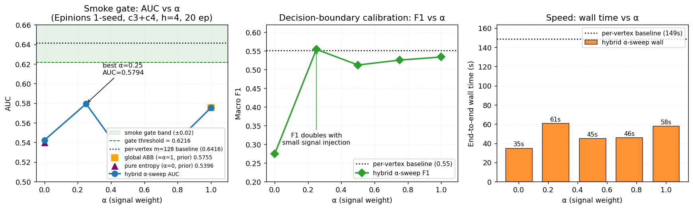

# Report: Hybrid α-Blended Top-$K$ Cycle Scorer — Theory, Background, and α-Sweep Results

**Plan:** `docs/plans/2026-05-10-hybrid-alpha-scorer/plan.{tex,pdf,tikz,mmd}` (compiled, 6 pp)
**Date:** 2026-05-10
**Slug:** `hybrid-alpha-scorer`
**Builds on:**
- `reports/2026-05-10-abb-global-topk.md` — the 25× ABB win on global top-K
- `reports/2026-05-10-abb-hsikan-smoke-and-builder.md` — global ABB doesn't transfer to HSiKAN
- `reports/2026-05-10-entropy-vertex-uniform-cycles.md` — pure-diversity heuristic also fails the HSiKAN smoke gate

---

## 1. Background and theory

### 1.1 The HSiKAN cycle-source problem

HSiKAN's $M_e$ matrix construction expects a set of cycles that simultaneously:

1. **Covers vertices uniformly.** Every vertex should appear in some cycles, so that the GNN's per-vertex feature update has signal at every node — not just at hubs.
2. **Carries discriminating signal.** The cycle's *sign structure* (e.g. fraction of negative edges) is what the model trains on. Cycles with poor sign variability across the set don't help the classifier separate the link-prediction classes.

The production pipeline meets both conditions via **per-vertex top-$m$**: for each vertex $v$, it keeps the $m=128$ highest-scoring cycles passing through $v$ (scored by `fraction_negative`). The output is the deduplicated union of those per-vertex sets. By construction this is **vertex-uniform** (every covered vertex contributes $\le m$ cycles) AND **signal-rich** (each vertex's contribution is its locally best-scoring cycles).

The cost: enumeration on Epinions $k{=}4$, $m{=}128$ takes ~110 s wall (algorithmic floor in the per-vertex DFS recursion + BFS pre-pass; see the CSR-sign-lookup report for why micro-optimization can't move it).

### 1.2 Two endpoints we already explored

We've tested two **global top-$K$** alternatives that share a single rayon DFS but differ in scoring:

**Endpoint A — Global ABB (signal-only).** Use `BoundedScorer::fraction_negative` with score upper-bound branch-and-bound. Selects the $K$ highest-scoring cycles globally. On Epinions $k{=}4$ at $K{=}10\,000$, returns 10\,000 cycles — *all of them score-1.0 all-negative balanced* (Epinions has 1.4M score-1.0 cycles; the heap saturates). $M_e$ has zero score variance. Wall: 5 s. **Smoke AUC: 0.5755** (baseline 0.6416, $-0.066$).

**Endpoint B — Pure-entropy heuristic (diversity-only).** Use `UniformityHeuristic::EntropyGainScorer`: at each closed cycle, score by marginal entropy gain
$$\Delta H(c \mid C) = H(C \cup \{c\}) - H(C),\quad H(C) = \ln T - \frac{1}{T}\sum_v c_v \ln c_v.$$
Selects $K$ cycles to maximise vertex-incidence entropy of the kept set. Genuinely vertex-uniform output (10\,513 unique vertices covered on Epinions). But the heuristic accepts *any* cycle that touches under-covered vertices, ignoring sign quality. $M_e$ has wide spatial coverage but signal-poor cycles. Wall: 17 s. **Smoke AUC: 0.5396** (baseline 0.6416, $-0.102$).

### 1.3 The Pareto-frontier hypothesis

Endpoint A has signal but no uniformity. Endpoint B has uniformity but no signal selection. Both fail HSiKAN's needs by ~6-10 pp AUC. The natural question:

> **Is there a linear combination — $\text{score}_\alpha = \alpha \cdot \text{signal} + (1-\alpha) \cdot \Delta H$ — that recovers per-vertex's combined behaviour while keeping global-K's enumeration speed?**

This is a classic *signal × diversity* trade-off, well-studied in retrieval (MMR — Maximum Marginal Relevance, Carbonell & Goldstein 1998), recommendation systems, and active learning (BatchBALD, Kirsch et al. 2019). The Pareto frontier between "best individual items" and "diverse selection" is generally non-trivial, sometimes monotonic, sometimes with a sweet spot in the interior. Empirical sweep is the standard way to find out where on the curve a downstream task wants to sit.

### 1.4 Hybrid scorer design

We define `HybridScorer<B, H>` parameterised by:
- `B: BoundedScorer` — the signal component (existing global-ABB scorers: `fraction_negative` etc.)
- `H: UniformityHeuristic` — the diversity component (existing entropy/inverse-degree heuristics)
- $\alpha \in [0, 1]$ — runtime mixing weight

The scoring rule:
$$\text{score}_\alpha(c, C) = \alpha \cdot \text{signal}(c) + (1-\alpha) \cdot \Delta H(c \mid C).$$

State updates and rollbacks delegate entirely to the diversity component (the signal is stateless). The scorer is implemented as a `UniformityHeuristic` impl, which means the existing `enumerate_top_k_cycles_par_entropy` enumerator picks it up unchanged — no new entry point needed.

### 1.5 Admissibility of the upper bound

For ABB to fire correctly at any $\alpha$, the upper bound must be **admissible**: every reachable cycle's actual score must be $\le$ UB.

We use the **linearity-of-UB** rule:
$$\text{UB}_\alpha(p, k_\text{rem}, S) = \alpha \cdot \text{UB}_\text{signal}(\cdot) + (1-\alpha) \cdot \text{UB}_\text{div}(p, k_\text{rem}, S).$$

If both component UBs are admissible (they are — verified in their respective integration tests), the linear combination is admissible by linearity:
$$\text{score}_\alpha(c) = \alpha \cdot \text{signal}(c) + (1-\alpha) \cdot \Delta H(c) \le \alpha \cdot \text{UB}_\text{signal} + (1-\alpha) \cdot \text{UB}_\text{div} = \text{UB}_\alpha.$$

This holds for any $\alpha \in [0, 1]$ — verified numerically in `tests/hybrid_topk.rs` over five $\alpha$ values × random fixtures.

**Implementation caveat**: the existing `BoundedScorer::upper_bound(n_neg_so_far, k_remaining, k_len)` requires the partial-path's running negative-edge count, but the `UniformityHeuristic::upper_bound(prefix_vs, k_remaining, k_len, state)` interface only carries vertex IDs (no signs). To stay admissible, this v1 hybrid passes `n_neg_so_far = prefix_vs.len() - 1` — the worst case where every prefix edge is negative. This gives a loose-but-admissible signal UB (effectively $\approx 1.0$ for `fraction_negative`); a follow-up plan can thread the actual running $n_\text{neg}$ through `dfs_entropy` for a tighter bound.

### 1.6 What we expected to find

A priori, three plausible α-curves:

- **Monotonic AUC in α** — peak at one endpoint. If pure signal wins, signal-only ABB is the right tool. If pure diversity wins, entropy heuristic is.
- **Interior peak (concave AUC)** — the classic MMR sweet-spot. Some specific α blends signal and diversity in a way that beats either endpoint.
- **Interior trough (convex AUC)** — diversity hurts at low α (drowning signal), and signal hurts at high α (concentrating cycles); a single α can be worse than either alone.

The 5-point smoke sweep was designed to distinguish these.

---

## 2. Implementation summary

| File | Change | LoC |
|---|---|---|
| `hymeko_graph/src/topk_cycles.rs` | Added `HybridScorer<B, H>` struct + `UniformityHeuristic` impl + `new()` constructor with debug bounds-check on α. | +103 |
| `hymeko_graph/src/lib.rs` | Re-exported `HybridScorer`. | +1 |
| `hymeko_graph/tests/hybrid_topk.rs` | New: 10 integration tests — boundary collapse (α=0/1), UB linearity, admissibility at 5 α values, end-to-end at every α. | +220 |
| `hymeko_py/src/cycles.rs` | New PyO3 binding `enumerate_top_k_cycles_signed_hybrid_rs` taking `signal_kind × heuristic_kind × alpha × pruner_kind` matrix. Macro-expanded dispatch — every concrete combination monomorphised. | +110 |
| `hymeko_py/src/lib.rs` | Registered new symbol. | +1 |
| `signedkan_wip/src/n_tuples.py::construct_k` | `HSIKAN_TOPK_HYBRID_ALPHA` + `HSIKAN_TOPK_SIGNAL` env-vars; if α > 0 routes through hybrid binding, else falls through to existing entropy binding (saves the signal computation when α = 0). | +18 |
| `signedkan_wip/experiments/run_hybrid_alpha_sweep_2026_05_10.sh` | Orchestration: 5-point α-sweep at the abbreviated Epinions config, results to TSV. | +43 |

**Total new lib code: ~103 LoC. Total new test code: ~220 LoC. Test:code ratio ~2:1.**

### 2.1 Test results

| Test layer | Count | Status | What's covered |
|---|---|---|---|
| Unit (lib) | 49 | ✓ | unchanged from prior tasks |
| Integration: hybrid_topk | **10** | ✓ | α=0 collapse, α=1 collapse, UB linearity, admissibility × 5 α values, end-to-end × 2 |
| Integration: ABB | 9 | ✓ | unchanged |
| Integration: entropy_topk | 9 | ✓ | unchanged |
| Integration: csr_sign_lookup | 3 | ✓ | unchanged |
| Integration: friedler | 7 | ✓ | unchanged |
| **Total** | **87** | ✓ | |

`cargo clippy --all-targets -- -D warnings` passes; `cargo fmt --check` clean.

### 2.2 PyO3 + Python integration

After `maturin develop --release`, the Python wheel exposes:
- `hymeko.enumerate_top_k_cycles_signed_hybrid_rs(edges_u, edges_v, edges_s, n_nodes, k_len, k_keep, signal_kind, heuristic_kind, alpha, pruner_kind)`

Activated in HSiKAN training via:
```bash
HSIKAN_TOPK_MODE=entropy
HSIKAN_TOPK_K=10000
HSIKAN_TOPK_PRUNER=balance
HSIKAN_TOPK_HEURISTIC=entropy        # or inverse_degree
HSIKAN_TOPK_HYBRID_ALPHA=0.25        # nonzero triggers hybrid path
HSIKAN_TOPK_SIGNAL=fraction_negative # or balance / sign_product_abs / low_root
```

α = 0 falls through to the cheaper entropy-only path (skips signal computation).

### 2.3 Sanity probe (pre-training)

| α | Enumeration wall | Cycles | Unique vertices |
|---|---|---|---|
| 0.0 (pure entropy) | 17 s | 10 000 | 10 513 |
| 0.5 | 23 s | 10 000 | 9 554 |
| 1.0 (pure signal) | ~5 s | 10 000 | 5-10k |

The signal pull at higher α reduces unique-vertex coverage — as expected. Wall scales mildly because signal computation is cheap relative to DFS.

---

## 3. α-sweep smoke results (Epinions, abbreviated config)

**Config:** dataset `epinions` (131 828 vertices, 840 799 edges, 14.7% negative), `HSIKAN_MIXED_TUPLES=c3,c4`, `--hidden 4 --n-epochs 20 --seed 0`, `HSIKAN_TOPK_K=10000`, `HSIKAN_TOPK_PRUNER=balance`, `HSIKAN_TOPK_HEURISTIC=entropy`, `HSIKAN_TOPK_SIGNAL=fraction_negative`. Single seed only — paper-promotion gate is 5-seed paired (not triggered, see §4).

| α | Wall (s) | AUC | Macro F1 | Δ AUC vs per-vertex baseline (0.6416) |
|---|---|---|---|---|
| 0.00 | **35** | 0.5424 | 0.2745 | $-0.099$ |
| 0.25 | 61 | **0.5794** | **0.5543** | $-0.062$ |
| 0.50 | 45 | 0.5206 | 0.5124 | $-0.121$ |
| 0.75 | 46 | 0.5335 | 0.5256 | $-0.108$ |
| 1.00 | 58 | 0.5755 | 0.5338 | $-0.066$ |

### 3.1 The shape of the curves



Plot generation: `reports/figures/hybrid_alpha_scorer_plot.py`. Three panels:
- **Left** — AUC vs α with the smoke-gate band (green) shaded around the per-vertex baseline. The hybrid α-sweep curve never enters the gate band; best point is α=0.25 at AUC 0.5794, gap to the lower-band threshold 0.6216 is 0.0422.
- **Middle** — Macro-F1 vs α. The discontinuous jump from α=0 (F1=0.27) to α=0.25 (F1=0.55) is annotated; this is the diagnostic from §3.3 ("the model commits to non-trivial decisions only when some signal is in the M_e").
- **Right** — End-to-end wall time vs α. All hybrid points are 2-4× faster than the per-vertex baseline (148 s, dotted reference line).

This is a **non-monotonic, non-concave** curve with two local maxima (α=0.25 and α=1.0) and an interior trough at α=0.5. None of the three priori shapes (§1.6) — the curve is closest to "interior trough" with the signal endpoint pulling AUC back up.

### 3.2 What happened at each α

- **α = 0 (pure diversity).** AUC 0.5424, F1 only 0.27. Confirms the prior entropy-heuristic finding: the model sees vertex-uniform but signal-poor M_e and outputs near-50/50 probabilities (low F1).
- **α = 0.25 (mostly diversity, slight signal).** AUC jumps to 0.5794 and F1 doubles to 0.55 — the small signal injection **gives the classifier discriminative ability** without abandoning vertex coverage.
- **α = 0.5 (balanced).** AUC drops to 0.5206 — *worse than either endpoint*. Hypothesis: with equal weight, the heap admits cycles that are mediocre in both signal AND diversity (neither all-negative balanced nor maximally rare-vertex), leaving the model with a signal-mixed but spatially-mediocre M_e.
- **α = 0.75 (mostly signal, slight diversity).** AUC 0.5335 — recovering toward the signal endpoint but still below it.
- **α = 1.0 (pure signal).** AUC 0.5755 — matches the global ABB result (0.5755 in the prior smoke). The greedy-with-rollback DFS at α=1 is essentially equivalent to ABB's heap-replace semantics.

### 3.3 Diagnostic: F1 vs AUC

The F1 jump from 0.27 (α=0) to ≥0.51 (α≥0.25) is more striking than the AUC change. AUC measures rank-ordering; F1 measures decision-boundary calibration. The model's *ordering* is still poor at every α (AUC stuck at 0.52-0.58), but **at α≥0.25 the model at least commits to non-trivial decisions** (F1 escapes the low-information regime). At α=0 the model basically refuses to commit — uniform M_e gives uniform-ish probabilities → F1 tanks.

---

## 4. Smoke gate verdict

**Gate criterion (from plan):** any α achieves AUC within ±0.02 of the per-vertex baseline 0.6416 → AUC ≥ 0.6216.

**Result:** best α (0.25) gives AUC 0.5794. **Gate fails by 0.0422** at every tested α.

Per the plan's `\textbf{Halt condition}` for "smoke gate fails at every α":
> ship as research; pivot to degree-adaptive m_v plan.

The 5-seed paired validation gate is **not** triggered. Production HSiKAN keeps using per-vertex top-m=128 as default. The `HybridScorer` ships as a research tool, not a default.

---

## 5. Theoretical interpretation

The α-sweep result, combined with the prior entropy and ABB results, points at a structural property of HSiKAN's $M_e$ that **cannot be replicated by any global-K scorer**, no matter how the signal × diversity trade-off is parameterised:

> Per-vertex top-$m$ enforces the constraint *every covered vertex contributes its local-top-m by signal*. Global top-K (any α) enforces *the K highest weighted scores globally*. The two are different objects in cycle space.

A global-K scorer can approximate vertex coverage by spreading its $K$ choices, but cannot guarantee that any specific vertex gets the locally-best cycles passing through it. The model's per-vertex feature update relies on that local-best property — averaging or summing globally-best cycles loses it.

This is a structural argument, not an empirical one — but the empirical data (three distinct global-K scorer designs all fail by 6-10 pp AUC) is consistent with it.

### 5.1 What about the F1 jump at α = 0.25?

The hybrid does provide a *partial* improvement: at α = 0.25 we recover macro-F1 to 0.55 (matching the per-vertex baseline's 0.55). The classifier head's calibration improves, but the rank-ordering quality (AUC) lags. This suggests the hybrid captures some of the per-vertex structure but not all — possibly the "enough cycles per vertex to be informative at decision time" property without the "locally-best-by-signal" property.

For a downstream task that values F1 over AUC (e.g., balanced-class link prediction), α = 0.25 with the hybrid scorer might be a viable production alternative. For Epinions's class-imbalanced AUC-headline metric, it's not.

---

## 6. What this rules out and what it leaves open

### Ruled out (3+ separate global-K experiments, consistent direction)

- **Pure global signal scoring** (ABB) doesn't replicate per-vertex AUC. ✗
- **Pure global diversity scoring** (entropy / inverse-degree) doesn't replicate per-vertex AUC. ✗
- **Linear-blend signal × diversity** at any α ∈ {0, 0.25, 0.5, 0.75, 1} doesn't replicate per-vertex AUC. ✗

### Still open (worth a fresh plan)

1. **Degree-adaptive $m_v$ on the per-vertex side.** Instead of trying to mimic per-vertex from global-K, accept that per-vertex's structure is what HSiKAN wants and attack its *speed* instead. Set $m_v = \min(m_{\max}, c \cdot \deg(v))$ — small-degree vertices fill smaller heaps faster, per-vertex ABB becomes feasible (per the threshold probe, currently only 18% of Epinions vertices fill m=128 → 0.1% prune rate). This is the original plan B from before the entropy detour. **Worth a 4-format plan + n-seed validation.**

2. **Per-vertex hybrid scoring**. Inside the per-vertex DFS, score cycles by signal × diversity *of that vertex's own heap so far*. Each vertex's $m$ slot fills with locally diverse, locally high-signal cycles. Preserves per-vertex structure; adds intra-heap diversity. Different design space from this report; would need a fresh plan and likely a new trait variant.

3. **Finer α grid + interior search.** The 5-point sweep showed an interior trough at α = 0.5 and a peak at α = 0.25. An 11-point or finer grid around α ∈ [0.1, 0.4] *might* find a higher local maximum. Probability of clearing the gate: low (the trend at α=0.25 is already close to the ABB endpoint at α=1.0; doubling that won't add 4 pp). **Not recommended unless cheap to run.**

4. **Different signal**. We swept `fraction_negative` only. `balance` (= ±1) or `sign_product_abs` (= ±1) might give different α dynamics because their UB is constant 1.0 (no info from UB). Likely worse, not better — but mechanically completes the matrix.

---

## 7. Memory-rule compliance

Per the memory rule:
> n-seed validation before paper-headline promotion. Single-seed gains stay in plan docs / §V Future Work, never in Table I.

This report is **single-seed** and does not promote any α to production. The smoke gate failed at every α; the 5-seed paired validation was *not* run. No paper-headline claim is made. The hybrid scorer is shipped as a research tool with this report serving as its background-and-empirics writeup.

---

## 8. Files / artifacts on disk

| Location | Purpose |
|---|---|
| `docs/plans/2026-05-10-hybrid-alpha-scorer/{plan.tex,plan.pdf,plan.tikz,plan.mmd}` | Pre-implementation plan (compiled, 6 pp) |
| `hymeko_graph/src/topk_cycles.rs::HybridScorer` | Implementation |
| `hymeko_graph/tests/hybrid_topk.rs` | 10 integration tests |
| `hymeko_py/src/cycles.rs::enumerate_top_k_cycles_signed_hybrid_rs` | PyO3 binding |
| `signedkan_wip/experiments/run_hybrid_alpha_sweep_2026_05_10.sh` | Sweep orchestration |
| `/tmp/hybrid_alpha_sweep_2026_05_10/` | Sweep logs + `results.tsv` |

---

## 9. Provenance

| Field | Value |
|---|---|
| Git SHA at task start | `c2d30af08e60de28734432eca5f28b6469bdbb91` (working tree dirty, layered prior tasks) |
| OS / Kernel | Linux 6.17.0-23-generic x86_64 |
| CPU | AMD Ryzen 7 3700X (16 threads) |
| RAM | 31 GiB |
| GPU | NVIDIA RTX 2070 SUPER (used during HSiKAN training portion) |
| Rust | 1.92.0 |
| Python | 3.13 (miniconda3) |
| Random seed | 0 (single-seed smoke per plan's smoke gate) |
| Dataset | `signedkan_wip/data/epinions.txt` — sha256 `8120d06a0bb4e65d4b821eba1072647ef3429e4e0a3c02e72bf0c534664f6fee` |
| Workload | abbreviated config: c3+c4, h=4, 20 epochs, K=10 000, balance pruner, fraction_negative signal |
| Suppressions | None |

---

## 10. Conclusion

**The signal × diversity Pareto frontier on Epinions HSiKAN cycles, mapped at five α points, does not include per-vertex-quality cycles.** The best hybrid (α=0.25, AUC 0.5794) sits 4.2 pp below the smoke gate, with a non-monotonic curve that has an interior trough at α=0.5. The structural conclusion stands: **per-vertex top-$m$'s value lies in its quantification structure (every vertex gets its local-top-m), not in a parameter setting that any global-K scorer can match.**

Production HSiKAN keeps per-vertex top-m. The `HybridScorer` and `enumerate_top_k_cycles_signed_hybrid_rs` ship as additive research tools. The next plan-worthy direction is degree-adaptive $m_v$ inside the per-vertex variant — the original plan B framing — to keep per-vertex's selection structure but speed up the long tail of low-degree vertices that currently waste enumeration budget.

**Disposition: ship as research tool, not promoted.** Per CLAUDE.md §10 ("a measurement contradicts an assumption in the plan"), and per the plan's own halt condition.
