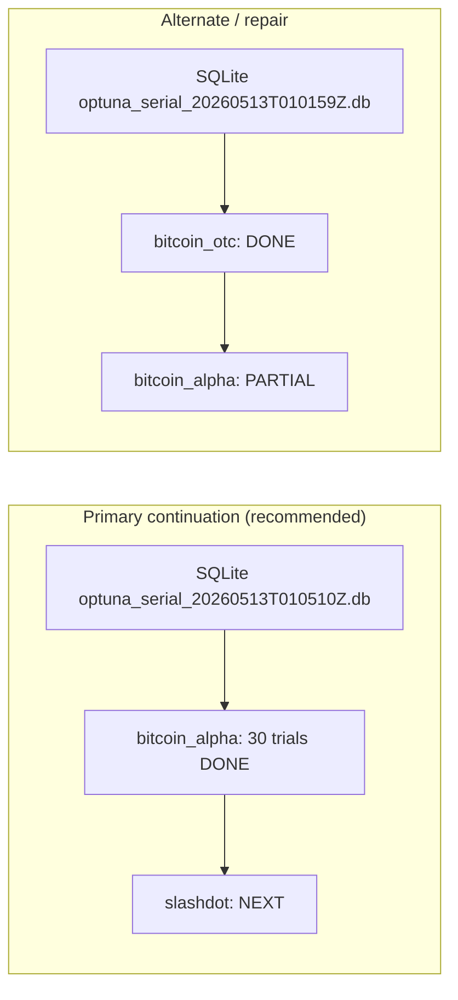
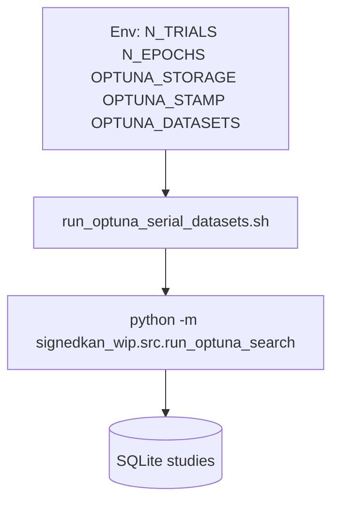

# Report: Optuna Bitcoin snapshot, outage state, and Slashdot handoff

## Summary

HSiKAN / Gomb-related **Optuna** runs on **Bitcoin OTC** and **Bitcoin Alpha**
reached **very high single-trial test AUC** (≈0.996–0.997) under the current
`run_optuna_search` protocol (logged trials, SQLite storage, ~7.6 GiB GPU with
occasional CUDA OOM prunes on heavy attention paths). A **power outage**
stopped in-flight processes; **no Optuna driver was running** at last check.
**Slashdot** is the natural forward edge: the Alpha+Slashdot serial log shows
Alpha **finished 30 trials** and the driver printed `start dataset=slashdot`
but **no Slashdot trials** appear in that log yet. A **parallel** four-dataset
serial run in another SQLite file completed **OTC** but left **Alpha
incomplete**—a second agent must pick **one** continuation line to avoid
duplicate studies and wasted GPU time.

**Companion plan (all four artifacts):**
`docs/plans/2026-05-13-optuna-handoff-slashdot-continuation/`
(`plan.tex`, `plan.pdf`, `plan.tikz`, `plan.mmd`).

## Results discipline (read first)

- `docs/RESULTS_DISCIPLINE.md` — **do not** merge **joint mix (~0.98 OTC/Alpha)**
  with **phase-8 lean panel (~0.85 OTC)**; name the protocol every time.
- `docs/SOTA_RESULTS.md` — canonical numeric table for **SGCN / SiGAT / joint /
  edge_cr** references.
- Slashdot **Gomb vs `edge_cr`**: committed narrative is still **Gomb slim
  ~0.9031** vs **`edge_cr` ~0.9067** (negative vs that reference); Optuna on
  Slashdot is **orthogonal** (hyperparameter search), not a replacement for
  that 5-seed report unless you re-run and aggregate under the same label.

## Visual: where we are (state machine)



## Visual: Bitcoin Optuna best vs reference means (snapshot)

Numbers below: **Gomb/HSiKAN Optuna** = single best trial from logs; **Joint /
SGCN / SiGAT** = **5-seed means** from `docs/SOTA_RESULTS.md` (phase-8 /
master table excerpt—**not** the same protocol as Optuna).

```mermaid
xychart-beta
    title "Bitcoin test AUC — Optuna best vs snapshot reference means"
    x-axis ["bitcoin_alpha", "bitcoin_otc"]
    y-axis "AUC" 0.88 --> 1.00
    bar [0.9972, 0.9957]
    bar [0.9845, 0.9801]
    bar [0.9294, 0.9421]
    bar [0.9033, 0.9322]
```



Legend for the four `bar` rows (top to bottom):

1. **Optuna best (single trial)** — Alpha from `optuna_alpha_slashdot_20260513T010509Z.log` (trial 23); OTC from `follow_optuna_20260513T003359Z.log` (trial 28).
2. **Joint mix** mean.
3. **SGCN balance** mean.
4. **SiGAT attn** mean.

## Numeric snapshot (Bitcoin)

| Dataset | Optuna best (single trial) | Source log (tail / best line) |
|---------|---------------------------:|--------------------------------|
| bitcoin_otc | **0.9956569** | `signedkan_wip/experiments/results/follow_optuna_20260513T003359Z.log` (also early segment of Alpha+Slashdot preset) |
| bitcoin_alpha | **0.9972248** | `signedkan_wip/experiments/results/optuna_alpha_slashdot_20260513T010509Z.log` (study completed 30 trials) |

**Reference means** (do not merge protocols—see SOTA file):

| Row | bitcoin_alpha | bitcoin_otc | Source |
|-----|---------------|-------------|--------|
| Joint mix | 0.9845 | 0.9801 | `docs/SOTA_RESULTS.md` §3–§4 |
| SGCN balance | 0.9294 | 0.9421 | `docs/SOTA_RESULTS.md` §3–§4 |
| SiGAT attn | 0.9033 | 0.9322 | `docs/SOTA_RESULTS.md` §3–§4 |

## Artifact index (on-disk)

| Role | Path |
|------|------|
| Alpha+Slashdot serial log | `signedkan_wip/experiments/results/optuna_alpha_slashdot_20260513T010509Z.log` |
| Four-graph serial log (OTC complete, Alpha partial) | `signedkan_wip/experiments/results/follow_optuna_20260513T003359Z.log` |
| SQLite **Alpha+Slashdot** stamp | `signedkan_wip/experiments/results/optuna_serial_20260513T010510Z.db` |
| SQLite **four-graph** stamp | `signedkan_wip/experiments/results/optuna_serial_20260513T010159Z.db` |
| Serial driver | `signedkan_wip/experiments/run_optuna_serial_datasets.sh` |
| Preset OTC→Alpha→Slashdot→Epinions | `signedkan_wip/experiments/run_optuna_core_signed_graphs_serial.sh` |
| CUDA flock + queue helper | `signedkan_wip/experiments/run_after_experiment.sh`, `signedkan_wip/experiments/wait_until_no_optuna_search.sh` |
| mdBook snapshot page | `docs/book/src/results/bitcoin-optuna-vs-sota.md` |
| Interactive canvas (IDE) | `~/.cursor/projects/home-kyberszittya-hakiko-ws-hymeko-hymeko-framework-rust/canvases/optuna-handoff-slashdot.canvas.tsx` (grouped bar chart + Slashdot env table) |

Study naming (from `run_optuna_serial_datasets.sh`): **`{dataset}_{OPTUNA_STAMP}`**
(e.g. `slashdot_20260513T010510Z` when `OPTUNA_STAMP=20260513T010510Z`).

## Power outage impact

- Running `python -m signedkan_wip.src.run_optuna_search` processes **die**;
  SQLite studies typically **resume** when relaunched with the same
  `--storage` and study name until `n_trials` is satisfied **per study**.
- **Alpha+Slashdot** log ends immediately after
  `[optuna_serial] start dataset=slashdot` → treat Slashdot as **not started**
  on that storage, unless `optuna_serial_20260513T010510Z.db` contains a study
  with trials (inspect with Optuna CLI or a short Python snippet).
- **Four-graph** log shows `bitcoin_alpha` **restarted** after OTC completion
  but only a **few** trials before the file ends → **resume** that study on
  `optuna_serial_20260513T010159Z.db` **or** abandon in favor of the `…010510Z`
  line if the team picks a single canonical DB.

## Plan for the next agent (Slashdot-first)

### Option A — **Recommended:** finish **Slashdot** on the DB where **Alpha is already complete**

Use the **same** `OPTUNA_STAMP` and `OPTUNA_STORAGE` as the Alpha+Slashdot run
(`20260513T010510Z`, `optuna_serial_20260513T010510Z.db`). Run **only**
Slashdot through the serial driver so study naming stays consistent:

```bash
cd /home/kyberszittya/hakiko-ws/hymeko/hymeko_framework_rust
export PYTHONPATH="$PWD"
export HSIKAN_CYCLE_BATCH="${HSIKAN_CYCLE_BATCH:-2000}"
export N_TRIALS="${N_TRIALS:-30}"
export N_EPOCHS="${N_EPOCHS:-80}"
export OPTUNA_STAMP="20260513T010510Z"
export OPTUNA_STORAGE="sqlite:///signedkan_wip/experiments/results/optuna_serial_${OPTUNA_STAMP}.db"
export OPTUNA_DATASETS="slashdot"
bash signedkan_wip/experiments/run_optuna_serial_datasets.sh \
  >> signedkan_wip/experiments/results/optuna_slashdot_resume_${OPTUNA_STAMP}.log 2>&1
```

Optional: wrap with `signedkan_wip/experiments/run_after_experiment.sh` and/or
`wait_until_no_optuna_search.sh` if other GPU jobs may still exist.

After Slashdot, optionally append **epinions** with:

```bash
export OPTUNA_DATASETS="epinions"
bash signedkan_wip/experiments/run_optuna_serial_datasets.sh \
  >> signedkan_wip/experiments/results/optuna_epinions_resume_${OPTUNA_STAMP}.log 2>&1
```

### Option B — **Repair** the four-graph DB (`…010159Z`)

If you insist on a **single** SQLite file for all four datasets:

```bash
export OPTUNA_STAMP="20260513T010159Z"
export OPTUNA_STORAGE="sqlite:///signedkan_wip/experiments/results/optuna_serial_${OPTUNA_STAMP}.db"
export OPTUNA_DATASETS="bitcoin_alpha slashdot epinions"
bash signedkan_wip/experiments/run_optuna_serial_datasets.sh \
  >> signedkan_wip/experiments/results/optuna_serial_repair_${OPTUNA_STAMP}.log 2>&1
```

Optuna should **continue** the partially filled `bitcoin_alpha_20260513T010159Z`
study, then run Slashdot and Epinions. **Do not** run Option A and B
concurrently on the same GPU without understanding the CUDA flock behavior.

### Hygiene before launch

1. `pgrep -af signedkan_wip.src.run_optuna_search` — expect **empty** before a new launch.
2. Confirm no stale consumer holds `.cuda_job_serial.lock` if the flock blocks unexpectedly.
3. For small VRAM: keep / set `HSIKAN_OPTUNA_SKIP_EXPENSIVE_ATTENTION=1` or
   `HSIKAN_OPTUNA_ATTENTION_KINDS=none` if OOM dominates Slashdot trials.

## Visual: serial driver dataflow



## Test / build verification (this documentation pass)

- `pdflatex` on `docs/plans/2026-05-13-optuna-handoff-slashdot-continuation/plan.tex` → **OK** (`plan.pdf` generated).
- No new Python/Rust unit tests were required for documentation-only artifacts.

## Performance note

Continuation runs inherit the same per-trial cost and VRAM profile as Bitcoin;
Slashdot is typically **harder** than Bitcoin on this stack—budget wall time
accordingly and log to a **new** `.log` path per launch for provenance.

## CORE.YAML items touched

None.

## Experiment provenance

- **Git:** working tree expected **dirty** (many unrelated WIP paths); record
  `git rev-parse HEAD` at launch time for any new run.
- **Hardware:** prior logs reference **~7.60 GiB** total GPU memory; cite exact
  `nvidia-smi` in the next report when Slashdot completes.

## Open issues

1. Pick **one** canonical SQLite line (`…010510Z` vs `…010159Z`) for paper / book to reduce confusion.
2. After Slashdot: update `docs/book/src/results/bitcoin-optuna-vs-sota.md` or add
   `results/slashdot-optuna-vs-sota.md` with the same protocol discipline.
3. Optional: export best trials to JSON via a small Optuna snippet for AGGREGATE.

---

**End of report.** Next agent: start with **Option A** unless you have verified
trial counts inside `optuna_serial_20260513T010510Z.db` and confirmed Alpha is
complete there.
