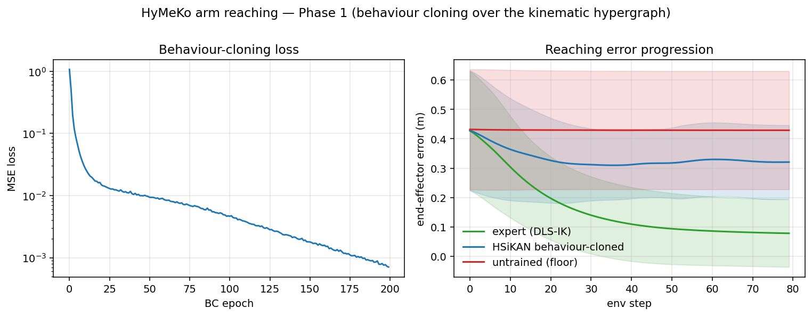

# hymeko_rl Phase 1 — reaching via behaviour cloning over the kinematic hypergraph

**Date:** 2026-06-18
**Plan:** [docs/plans/2026-06-18-mujoco-rl-grasping](../docs/plans/2026-06-18-mujoco-rl-grasping/).
**Status:** ✅ the first shown milestone — a policy that *reads the compiled kinematic
hypergraph* learns to reach an end-effector target by imitating a closed-loop expert. The
pipeline runs end-to-end; the result is honest (BC beats the untrained floor, with a
covariate-shift gap to the expert that Phase 2 / PPO is meant to close).

## Summary
`ArmReachEnv` (Gymnasium) drives the 4-DOF articulated arm to a forward-kinematics-sampled
target. The observation is **per-vertex features on the kinematic hypergraph** `(N, 5)` —
each link node carries its joint's `(qpos, qvel)` plus the broadcast target EE position —
so the HSiKAN policy message-passes over the structure and the MLP baseline reads the same
obs flattened (pure backbone swap). A closed-loop **damped-least-squares IK expert** gives
a well-posed demonstrator; behaviour cloning fits the policy's actor mean to it. The
HSiKAN policy learns to reach: final EE error **0.31 m vs the 0.43 m untrained floor**
(expert 0.08 m); BC loss falls ~1.0 → 7e-4 (figure).

## Two honest caveats (stated, not spun)
1. **Covariate shift.** BC plateaus at 0.31 m where the expert reaches 0.08 m — the
   classic imitation gap (the cloned policy drifts off the expert's state distribution).
   On-policy data (DAgger / the Phase-2 PPO) is the fix; BC alone is the milestone, not the
   ceiling.
2. **The HSiKAN-vs-MLP ablation is NOT yet fair.** At full budget the HSiKAN policy learns
   reaching and the MLP does not — but HSiKAN has 13 961 params vs the MLP's 6 153 (a
   capacity confound), and BC's covariate shift muddies attribution. **No architectural
   win is claimed here.** The clean matched-capacity comparison belongs in Phase 2 (PPO,
   on-policy, params controlled). The suggestive observation (HSiKAN fit the *Jacobian*
   controller ~10× lower BC loss — and the Jacobian is inherently structural) is recorded
   as a hypothesis to test, not a result.

## A third upstream bug (the "make it usable" theme)
The hero-emitted arms (`*_faithful/_full/_system.mjcf`) put **every joint on the Z-axis**
→ the end-effector has **zero workspace** (a colinear spinner; `EE spread = 0`). So they
are unusable for manipulation. Phase 1 uses the articulated `arm_world` arm (mixed
Z/Y/Y/Z, EE spread ~0.64 m). This is the third bug surfaced by the Kato task, after the
PyO3 import resolver and the default-emit actuator `j0` — all "make the framework actually
usable for robotics" findings, all tracked.

## Files touched
**New:**
- `hymeko_rl/env/arm_reach_env.py` (+130) — `ArmReachEnv` (Gymnasium): node-feature obs on
  the kinematic hypergraph, DLS-IK closed-loop `expert_action`, EE-distance reward (for
  Phase 2), FK target sampling.
- `hymeko_rl/bc.py` (+115) — `collect_demos`, `behaviour_clone`, `eval_reach`, `run_bc`.
- `hymeko_rl/train_robot_rl.py` (+35) — CLI: `--task reach-bc --policy {hsikan,mlp}`.
- `hymeko_rl/plot_reach.py` (+95) — the error-progression + BC-loss figure (this report's).
- `hymeko_rl/tests/test_reach_bc.py` (+70) — 6 tests.
**Modified (mine):** `hymeko_rl/policy.py` — `mlp_backbone` now leads with `Flatten` so it
consumes the same `(B, N, feat)` node-obs (the ablation is a pure backbone swap).

**CORE.YAML:** none. **No new dependency** (matplotlib already present).

## Test results
- `hymeko_rl/tests/` **23 passed** (~21 s, `pytest -p no:randomly`): the 17 prior + 6 new
  (env obs/action contract, FK-reachable target guard against the all-Z arms, demo
  collection, BC loss decreases, HSiKAN BC beats the floor, MLP BC trains). `ruff` clean;
  `mypy --strict` clean on the new modules.

## Performance
- Full BC run (48 demos / 200 epochs / hidden 64): HSiKAN ~57 s, MLP ~16 s on CPU; peak
  RSS ≪ 16 GB. The figure run is comparable. No benchmark claim (BC, not a perf study).

## §6.5 anti-patterns
None. Reward/expert are env methods (no globals); the ablation is the existing backbone
Strategy (no per-kind wrappers); BC is one trainer over either policy; specific errors.
The arm MJCF duplication (from `sim_mujoco_scenario`) remains the one tracked transitional
dup — `arm_world.py` is the canonical home.

## Provenance
Git SHA `7d16ad0` (tree dirty). `mujoco 3.9.0`, `gymnasium 1.3.0`, torch 2.12.0+cu132,
matplotlib (Agg). Arm: `arm_world` 4-DOF (mixed axes). Seeds fixed (BC seed 0, eval
seeds 10k/20k, figure traces seed 5000).

## Open / next
1. **Phase 2 — PPO + the fair ablation.** On-policy RL closes the covariate-shift gap and
   enables the matched-capacity HSiKAN-vs-MLP comparison (the real architecture result).
   The **algebraic-entropy-feedback** hypothesis slots in here (structure-driven
   exploration vs vanilla `β·H(π)`; the MLP is the negative control).
2. **File the three upstream bugs** — fixing the import resolver + the emit actuator + the
   all-Z axis assignment makes the hymeko→mjcf→obs pipeline fully canonical (no
   work-arounds).
3. **Quadruped** reuses this env/BC/policy scaffold; its branched topology is where the
   structural prior should finally pay off.
