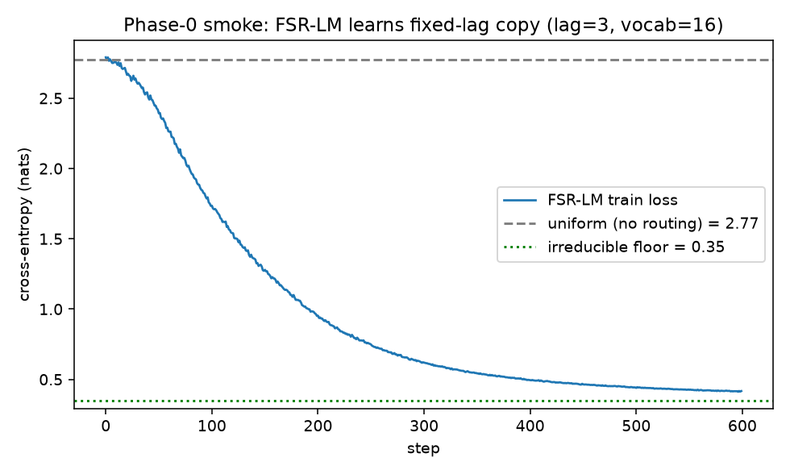
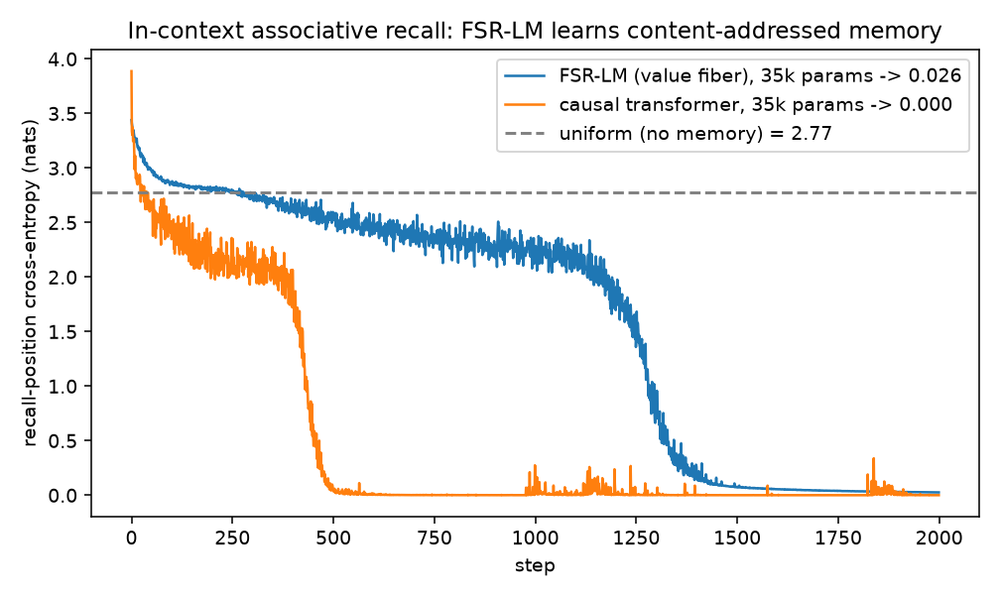

# Report — FSR-LM Phase 0 (toy): mechanism de-risk

**Date:** 2026-06-29 14:36 CEST · **Plan:** `docs/plans/2026-06-29-gomb-hsikan-fsr-llm/` ·
**Backlog:** "LLM architecture (Gömb / HSiKAN / Fiber-Spike-Rotor)".

## Summary

Stood up the new non-core package `hymeko_lm/` — the Gömb / HSiKAN / Fiber-Spike-Rotor language
model — as a composition over existing libraries, and ran the Phase-0 de-risk: a forward/backward
smoke on the **fixed-lag copy** task (the minimal discriminator for the rotor-transported,
spike-gated sequence mixer). **Result: the mechanism works.** At fair capacity the model converges to
the task's irreducible floor, proving the FSR mixer routes by relative offset.

This is the de-risk milestone, **not** the Phase-1 go/no-go (the A/B vs a matched-parameter
transformer on a real byte corpus is the next, separate experiment).

## What was built (files touched — all new, non-core)

| File | LOC | Role |
|---|---|---|
| `hymeko_lm/__init__.py` | 33 | package re-exports |
| `hymeko_lm/config.py` | 50 | `FSRConfig` (frozen dataclass), `Activation` enum (§6.5#7) |
| `hymeko_lm/sphere.py` | 56 | Gömb: `l2_normalize`, `spherical_residual`, `SphereEmbedding` |
| `hymeko_lm/sequence_mixer.py` | 75 | `FiberSpikeRotorMixer` — the novel core |
| `hymeko_lm/channel_mixer.py` | 34 | `HSiKANChannelMixer` (wraps `hymeko_neuro.core` `cr_cheby`) |
| `hymeko_lm/block.py` | 30 | `FSRBlock` |
| `hymeko_lm/model.py` | 50 | `FSRLanguageModel` (AR stack) |
| `hymeko_lm/data.py` | 38 | lag-copy toy |
| `hymeko_lm/smoke.py` | 86 | Phase-0 smoke entry (`--mode smoke\|full`, §6.5#13) |
| `hymeko_lm/tests/test_fsr_lm.py` | 160 | 15 tests |

**Reuse (no duplication, §6.1):** rotor algebra from `hymeko_neuro.graph.embeddings.cayley_rotor`
(`cayley_to_unit_quat`, `quat_rotate`); CR-Chebyshev cell from `hymeko_neuro.core.splines.make_activation('cr_cheby')`
(already existed — the planned "additive ChebyshevActivation hunk" was **unnecessary**); holonomy idiom
mirrored from `hymeko_rl.structural_actor`.

## CORE.YAML items touched

**None.** New package only; torch/numpy/nalgebra pins unchanged; no new dependency.

## Architecture realised (Phase-0 form, walk length 1)

`mixed_i = Σ_{j≤i} gate(i,j)·sign[i−j]·R[i−j]·h_j`, gate normalised by routing mass per query, then a
spherical residual; channel mix = `Linear → cr_cheby → Linear`; embedding + residual on S^{d−1}.
The rotor `R` is the RoPE-generalising connection (identity at init); deeper walks (rotor composition via
`quat_mul`) are Phase 2.

## Findings (the toy earned its keep)

Three issues surfaced and were fixed at Phase 0 — exactly what the de-risk is for:

1. **Bug — rotor broadcast.** `quat_rotate` expands `v` to `u`'s shape, so the per-offset rotor must
   carry the batch dim; broadcasting from leading-1 raised a shape error. Fixed by expanding the rotor.
2. **Bug — wrong normalization.** Dividing the mixed signal by the causal neighbour *count* (`i+1`)
   attenuated a sparsely-routed signal up to 16× at late positions. Replaced with normalization by the
   gate **routing mass** (attention-style). This was the dominant cause of slow learning.
3. **Design finding — the spike gate needs a positional term.** A purely content-based (QK) gate cannot
   route by offset on a content-free task. Added a learned per-offset gate bias (edge existence is
   position-dependent, content-modulated).

## Test results

`uv run python -m pytest hymeko_lm/tests -p no:randomly` — **15 passed in 32.4 s** (CPU).
Layers: contracts of every public component (sphere unit-norm, rotor identity-at-init, seq-len guard,
config/data validation), a **causality** test (logits at ≤k invariant to tokens >k), a forward/backward
**finite-grad** test, and a **learning integration** test (the discriminator).

## Performance / measurements

- **Smoke (`--mode smoke`, CUDA):** final 1.84 < uniform 3.47 (exit 0); **peak GPU 65.8 MB**; wall 17 s;
  16.8 k params. Well under the 16 GB cap.
- **Mechanism validation (n_blocks=8, d=24, 2 layers, batch 64, 600 steps):** converges to
  **0.417** vs irreducible floor **0.347** and uniform **2.773** — the FSR mixer learns the lag-copy
  routing nearly perfectly.

(Numerical + plotted per §9; no animation — Phase 0 has no spatial/temporal policy to render.)

## Static analysis

- `ruff check hymeko_lm` — clean.
- `mypy --strict hymeko_lm` — **clean on all `hymeko_lm` files.** 6 pre-existing errors remain in the
  *reused* `hymeko_neuro/graph/embeddings/cayley_rotor.py` (a file I did not modify; out of scope).
- Suppressions introduced: 3 × `# type: ignore[no-untyped-call]` on `Tensor.backward()` (torch stub
  leaves it untyped), each with an inline reason (§6.3). No complexity-gate waivers.

## Provenance

- Git SHA: working tree dirty (this change + prior session edits); new files under `hymeko_lm/`,
  `reports/2026-06-29-fsr-lm-phase0.*`.
- Env: torch 2.12.0+cu132 (CORE-pinned), CUDA available; Windows 11; uv workspace.
- Seeds: 0 (smoke, tests, diagnostic). RL-style bit-exactness not claimed; this is a supervised toy with
  fixed seed for reproducibility.

## Update (same session) — memory: in-context associative recall

Phase-0 lag-copy only proved *positional* routing. The real "memory" capability is *content-addressed*
recall (induction). Added `make_associative_recall_batch` (a per-sequence-random key→value map, so it
cannot be memorised in weights) and `baselines.py` (`CausalTransformerLM`, the matched control), and ran
the head-to-head. This is systematic diagnosis (CLAUDE.md discriminating-test rule), not tuning:

1. **First result — FSR fails recall.** Original mixer plateaued at recall-loss **2.07** vs uniform 2.77
   (≈ no memory), while a matched-param transformer (35 k) solved it to **0.000** by step 500.
2. **Hypothesis A (gate sharpness) — FALSIFIED.** Made the spike gate a config axis (`GateMode`,
   softmax vs sigmoid) and compared: softmax 2.083 ≈ sigmoid 2.071. Selection mode is *not* the cause.
3. **Root cause (diagnosed, evidenced by the transformer head-to-head) — no value projection.** The mixer
   transported the *raw hidden* `R·h_j`; attention reads a learned `W_V·h_j`. Without a separate value
   subspace the 2-layer induction circuit (bind-then-recall) cannot form.
4. **Fix — value fiber.** Added `to_v` (the rotor now parallel-transports a learned *value fiber*, which
   is also truer to the gauge story). **Result: FSR-LM now solves recall — recall-loss 0.025** (35.1 k
   params) vs transformer 0.000 (35.2 k). It forms the induction circuit slower than softmax attention
   (~step 1250 vs 500) but genuinely acquires content-addressed memory.

**New code (this update):** `baselines.py` (+50), `data.make_associative_recall_batch` (+33),
`config.GateMode` + `gate_mode` field, `sequence_mixer` value-fiber + gate-mode (+~15). Tests: +4
(recall data contract ×2, the recall *learning* discriminator, gate-mode default). **18 tests pass**
(185 s; the recall training test is the long pole). ruff + mypy(my files) clean.

**Honest scope:** recall is solved at *tiny* scale (3–8 pairs). It is slower-to-induct than attention;
whether that costs at depth/scale is open. This is still not the Phase-1 language A/B — it is the memory
*capability* check, now passed.

## Open issues / next

1. **Phase-1 go/no-go** (the real test): byte-level LM (enwik8 default) vs a matched-parameter
   transformer block — `baselines.py` + multi-seed val bits-per-byte + tokens/s + params.
2. **Deeper walks** (walk length > 1): rotor composition via `quat_mul` (non-abelian holonomy).
3. **Hard spikes / sparsity**: the gate is currently a soft sigmoid; top-k for the sub-O(T²) claim.
4. **Chebyshev deploy parity**: exercise `ChebyshevCRActivation.chebyshev_forward` as the deploy path
   and assert tolerance vs the CR train path.
