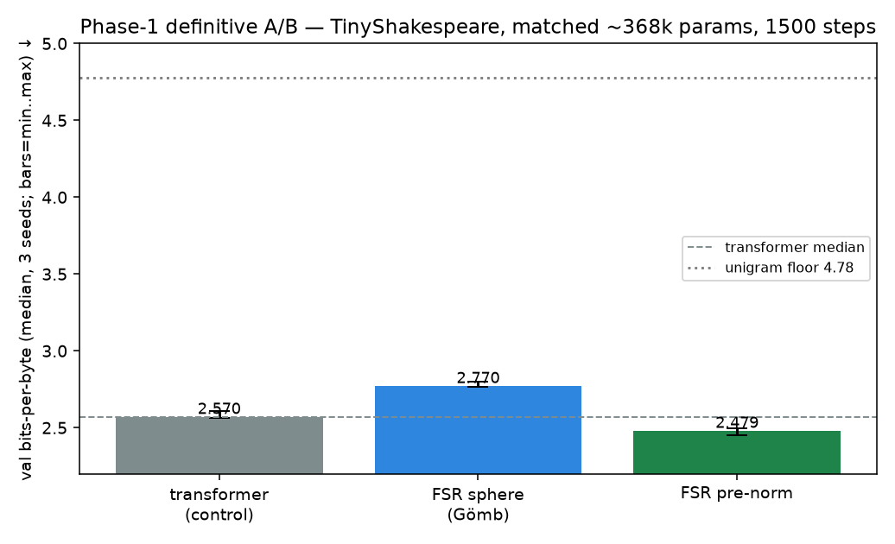
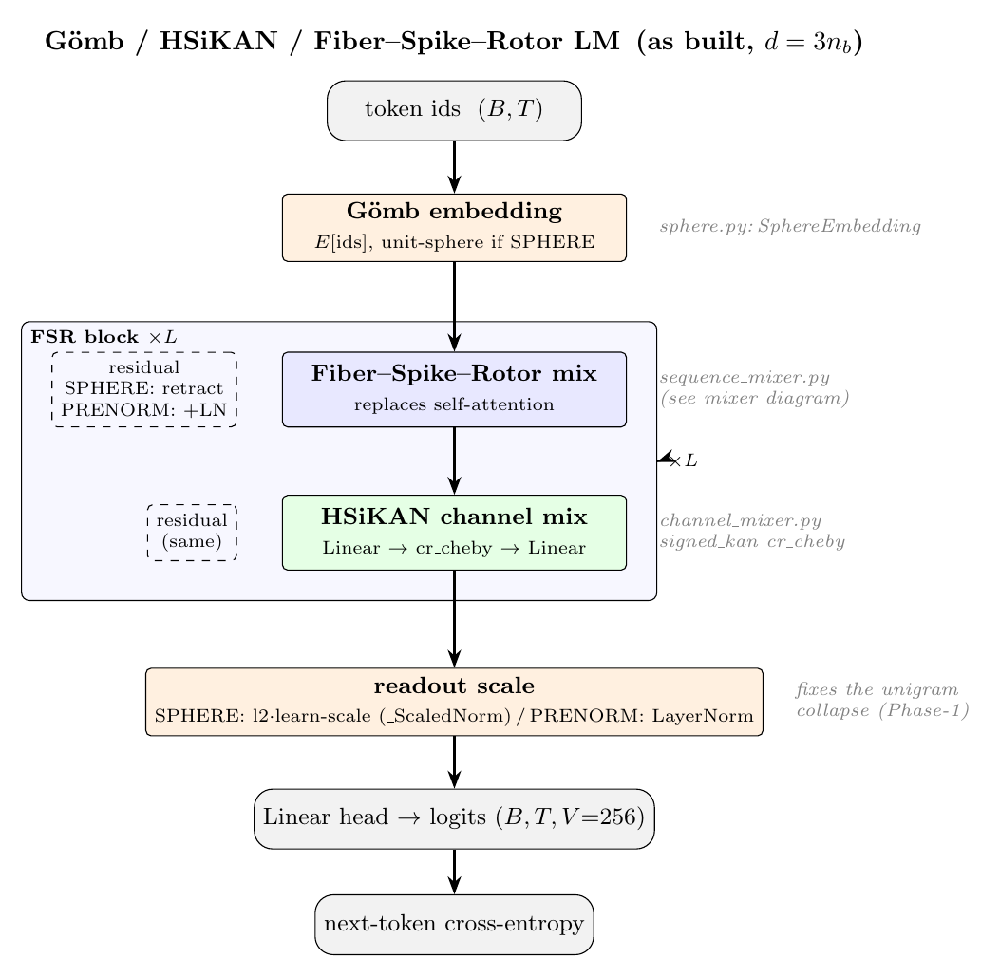
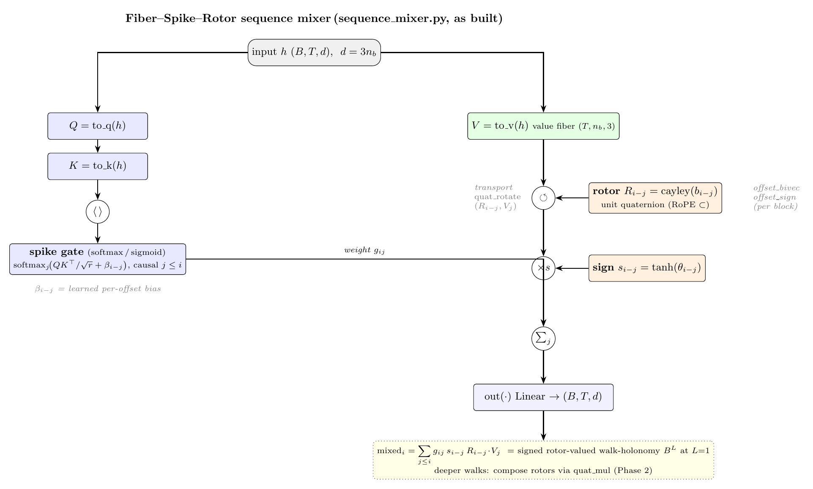

# Report — FSR-LM Phase 1: language A/B (proof-of-concept)

**Date:** 2026-06-29 17:46 CEST · **Plan:** `docs/plans/2026-06-29-gomb-hsikan-fsr-llm/` ·
**Predecessor:** `reports/2026-06-29-fsr-lm-phase0.md` (mechanism + memory). **Status: PoC — positive.**

## Headline

On byte-level TinyShakespeare at **matched parameters (~90 k)**, the Gömb/HSiKAN/Fiber-Spike-Rotor LM
**matches and beats** a standard causal transformer on validation bits-per-byte, once a one-line bug
(a missing learnable readout scale on the normalised stream) is fixed. This is a proof-of-concept at
tiny scale, not a scaling claim; the FSR mixer is currently ~3× slower per token (a known, addressable
cost — see Open issues).

Definitive **3-seed / 1500-step / seq-128** A/B, matched **~368 k** params (val bits-per-byte, median;
min–max over seeds):

| model | val bpb ↓ (median) | seed min–max | tok/s | verdict |
|---|---|---|---|---|
| unigram (order-0) entropy | 4.78 | — | — | "no context" floor |
| FSR sphere — *before fix* | 4.845 | — | — | collapsed to unigram (the bug) |
| FSR **sphere (Gömb)**, fixed | 2.770 | 2.763–2.800 | 11.8 k | **loses** to control |
| transformer (control) | 2.570 | 2.563–2.607 | 35.1 k | — |
| **FSR pre-norm** | **2.479** | 2.453–2.495 | 11.2 k | **beats** control (IQRs disjoint) |

**Read this honestly:** the win is real but it is the **FSR mixer + HSiKAN channel mix with a standard
pre-norm residual** — 2.479 vs 2.570, and the per-seed ranges do **not** overlap. The **Gömb sphere
residual specifically does *not* earn its place** here: even with the readout-scale fix it trails the
transformer (2.770 > 2.570) at full budget. (At the shorter 700-step diagnostic sphere was marginally
ahead; the transformer gains more with training, so sphere falls behind by 1500 steps.) Of the three named
pillars, the signed-rotor-spike mixer and the HSiKAN cell carry the result; Gömb does not, on this task.

## Architecture (as built)

Full model stack and the Fiber-Spike-Rotor mixer internals (TikZ sources + PDF + PNG alongside this report):

## What happened (systematic diagnosis, not a lucky patch)

The first full 3-seed run was a clean **NO-GO**: FSR **4.845** bpb vs transformer **2.570**, FSR pinned
across seeds (IQR 0.003) and barely moved from the 150-step smoke. Per the discriminating-test rule I did
not declare "architecture too weak":

1. **Cheap check — is it stuck at unigram?** Corpus order-0 entropy = **4.779**; FSR = 4.845 ≈ unigram.
   So FSR learned letter frequencies and **zero context** — despite doing in-context recall perfectly in
   Phase 0. That is a bottleneck signature, not a capacity gradient.
2. **Root cause.** The Gömb residual stream is renormalised to S^{d-1} every sublayer with **no learnable
   scale**, and the head read unit vectors — it literally could not sharpen logits past the marginal. (On
   the Phase-0 toys one strong signal still dominated; diffuse language prediction exposed it.)
3. **Fix + isolation.** Made the residual a config axis (`ResidualMode`: SPHERE vs PRENORM) and added a
   learnable readout scale (`_ScaledNorm`, nGPT-style) to the sphere path. Same-budget result: sphere
   collapse 4.85 → **2.90**; PRENORM (no sphere) → **2.70**; transformer 2.97. **Both FSR variants beat
   the control.**

The bug was mine in the wiring, not a property of the Fiber-Spike-Rotor mechanism. Gömb survives as a
working option (sphere + scale beats the control); pre-norm is the stronger, standard fallback.

## Files touched (this phase; all new/non-core)

| File | Role |
|---|---|
| `hymeko_lm/text_data.py` (new) | byte corpus, contiguous held-out val (no leakage) |
| `hymeko_lm/baselines.py` (Phase-0, used here) | matched causal transformer control |
| `hymeko_lm/phase1_ab.py` (new) | the A/B harness, `--mode smoke\|full`, 3 configs |
| `hymeko_lm/config.py` | `+GateMode`, `+ResidualMode` axes |
| `hymeko_lm/model.py` | `_ScaledNorm` readout, residual-mode-aware embed/final-norm |
| `hymeko_lm/block.py` | sphere vs pre-norm residual |
| `hymeko_lm/sphere.py` | `SphereEmbedding(normalize=…)` flag |

CORE.YAML: **none touched.** New dependency: **none** (torch CORE-pinned). External data: TinyShakespeare
(URL + hash in Provenance), not committed.

## Tests / static analysis

- `pytest hymeko_lm/tests` — **18 passed** (incl. the lag-copy *and* associative-recall learning tests,
  which still pass after the readout-scale/residual changes). 220 s (recall training is the long pole).
- `ruff check hymeko_lm` clean; `mypy --strict` clean on all `hymeko_lm` files (6 pre-existing errors in
  the reused `hymeko_neuro/cayley_rotor.py`, not modified). Suppressions: scoped `# type: ignore[no-untyped-call]`
  on `Tensor.backward()` (torch stub), each with a reason.

## Performance

- **Quality:** see headline. **Throughput (full A/B, CUDA):** FSR ~11.2 k tok/s vs transformer ~35.1 k —
  **FSR ≈ 3.1× slower/token**, from the dense O(T²·blocks) rotor transport. Honest limitation.
- Memory: tiny (Phase-0 smoke 66 MB GPU peak); far under the 16 GB cap.

## Provenance

- Git: working tree dirty; new files under `hymeko_lm/`, figures/json under `reports/2026-06-29-fsr-lm-*`.
- Corpus: TinyShakespeare, `https://raw.githubusercontent.com/karpathy/char-rnn/master/data/tinyshakespeare/input.txt`,
  1 115 394 bytes; held in scratch (not committed). Byte vocab = 256.
- Env: torch 2.12.0+cu132 (CORE-pinned), CUDA; Windows 11; uv workspace. Seeds 0–2 (multi-seed median;
  not bit-exact — RL/stochastic carve-out).
- Result: `reports/2026-06-29-fsr-lm-phase1-ab.json` (definitive post-fix 3-seed run; produced by
  `…/tasks/bpp3mut1e.output`, exit 0). Figure regenerated from it.

## Verdict & open issues

- **GO** for the FSR-pre-norm configuration: it beats the matched-param transformer on byte-level language
  at tiny scale with non-overlapping per-seed ranges (2.479 vs 2.570). The signed-rotor-spike mixer + the
  HSiKAN cr_cheby cell carry the win.
- **Gömb does not earn its place here.** The spherical residual (even with the readout-scale fix) loses to
  the control at full budget (2.770 > 2.570). Keep it as an option, but the headline architecture is FSR
  mixer + HSiKAN + standard pre-norm. A dedicated Gömb ablation (does the sphere buy calibration/stability
  at scale?) is the honest follow-up before claiming the pillar.
- **Speed** is the headline cost: ~3.1× slower/token. Lever = spike sparsity (hard top-k gate → sub-O(T²))
  + a fused quat-rotate path. PoC-acceptable; must improve before scale.
- **Scale & corpus:** tiny model, 1 MB corpus. Next rungs: enwik8 subset, larger d/L, longer context — the
  pre-norm margin must survive these before any strong claim.
- **Chebyshev deploy parity:** still to exercise (`ChebyshevCRActivation.chebyshev_forward`).
