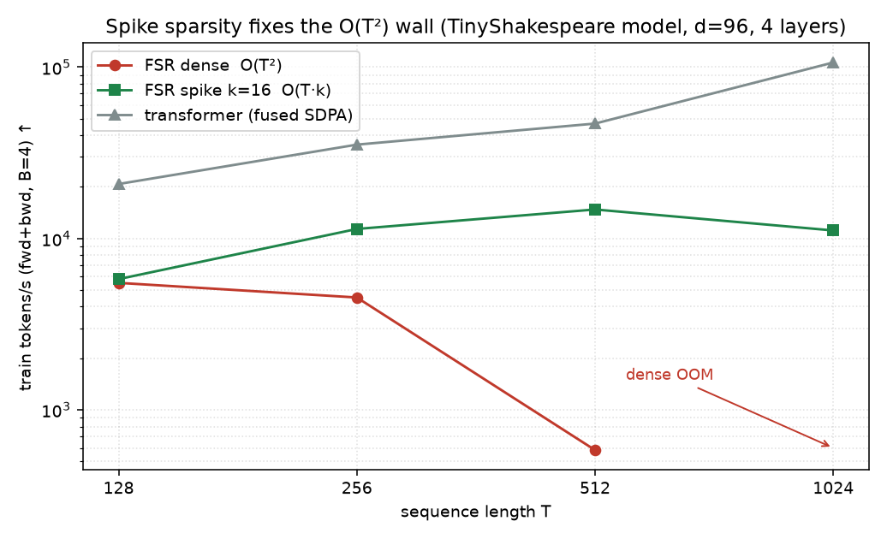

# Report — FSR-LM speed: the hard top-k spike gate

**Date:** 2026-06-29 18:36 CEST · **Plan:** `docs/plans/2026-06-29-gomb-hsikan-fsr-llm/` ·
**Predecessor:** `reports/2026-06-29-fsr-lm-phase1.md` (Phase-1 A/B: FSR-prenorm beats the transformer on
bpb but is ~3× slower/token). This report tackles the speed.

## Summary

Added a **hard top-k spike gate** (`spike_k`): per query, keep only the `k` highest-scoring past
positions, so the expensive rotor transport runs on `(B,T,k,…)` instead of the dense `(B,T,T,…)` —
**O(T·k)** vs **O(T²)**. Result:

- **Quality is preserved — slightly improved.** Sparsity regularises (k=16 beats dense on bpb).
- **The O(T²) wall is fixed.** Sparse-vs-dense speedup grows with context: ~1× at T=128, **25× at T=512**,
  and **dense OOMs at T=1024 while sparse runs**.
- **Absolute speed still trails the transformer ~3–7×** — because it uses *fused* flash-attention (SDPA)
  kernels while our mixer is eager PyTorch (top-k + gather + quat-rotate). Closing that is a kernel-fusion
  job, not an algorithmic one. Honest remaining gap.

## Experiment 1 — quality & speed vs `spike_k` (TinyShakespeare, seq 128, 1 seed, 800 steps, ~369 k params)

| config | val bpb ↓ | tok/s |
|---|---|---|
| FSR dense (k=None) | 2.650 | 12 315 |
| FSR k=32 | 2.632 | 14 356 |
| **FSR k=16** | **2.602** | **15 468** |
| FSR k=8 | 2.600 | 11 916 |
| transformer | 2.770 | 44 592 |

Sparsity does not cost quality — k=16/k=8 *beat* dense (the hard gate is a useful regulariser), and all
FSR variants beat the transformer on bpb. At T=128 the speed gain is only ~1.25× (gather/top-k overhead
dominates; k=8 is even slower than k=16 — T is too short for the asymptotics to bite).

## Experiment 2 — throughput vs sequence length (train fwd+bwd, B=4)

| T | FSR dense | FSR k=16 | sparse speedup | transformer |
|---|---|---|---|---|
| 128 | 5 510 | 5 795 | 1.05× | 20 789 |
| 256 | 4 527 | 11 365 | 2.5× | 35 275 |
| 512 | 583 | 14 765 | **25×** | 46 808 |
| 1024 | **OOM** | 11 138 | dense infeasible | 106 329 |

The dense mixer collapses at T=512 (the `(B,T,T,n_b,3)` tensor dominates) and OOMs at T=1024; the sparse
mixer stays at 11–15 k tok/s. This is the O(T·k) win materialising exactly where it should — at long
context. The transformer remains faster in absolute terms (fused SDPA), and scales better with T for the
same reason.

## Files touched (all non-core)

- `hymeko_lm/config.py` — `+spike_k: int | None` (with validation).
- `hymeko_lm/sequence_mixer.py` — split into `_dense_mix` (O(T²)) and `_sparse_mix` (top-k, O(T·k));
  `forward` dispatches on `spike_k`. Causality preserved (future positions get `-inf`, never selected).
- `hymeko_lm/block.py` — threads `spike_k`.
- `hymeko_lm/tests/test_fsr_lm.py` — +3 tests (sparse shape, causality under top-k, config validation).

CORE.YAML: none. New dependency: none.

## Tests / static analysis

- `pytest hymeko_lm/tests` — **21 passed** (was 18; +3 sparse). ruff clean; `mypy --strict` clean on all
  `hymeko_lm` files (6 pre-existing errors in the reused `hymeko_neuro/cayley_rotor.py`).

## Provenance

- Results: `reports/2026-06-29-fsr-lm-spikek-sweep.json`, `…-throughput-vs-T.json`.
- Env: torch 2.12.0+cu132 (CORE-pinned), CUDA; Windows 11. Seed 0 (single-seed diagnostics; the bpb
  ordering matches the 3-seed Phase-1 run). Throughput is median of 8 timed steps after 3 warmups.
- Throughput uses B=4 (so dense fits at T≤512); absolute tok/s therefore lower than the Phase-1 B=16
  numbers — the *scaling trend*, not the absolute value, is the result.

## Update — fused-kernel investigation (the absolute-speed gap)

Goal: close the 3–7× absolute throughput gap to the transformer. Method: probe → compile → profile →
isolate (no micro-opt without a profile, §3). Findings, all measured:

1. **Environment.** `torch.compile` inductor **works** on this box (the old "skip on Windows" note is
   stale; inductor emits fused Triton). Bare `@triton.jit` needs a real `.py` file (the inline probe
   "failure" was that, not a real block).
2. **torch.compile is a null result.** FSR sparse (T=512): eager 11 819 → compiled 12 206 tok/s = **+3 %**
   (parity 1.2e-6). Transformer unchanged. So the gap is **not** eager-launch overhead.
3. **Profile says the cost is the *backward*, not the forward.** Mixer fwd+bwd = 24.9 ms; the forward
   pieces sum to ~2.7 ms (topk 0.61, gather 0.68, quat_rotate 0.76, sum 0.62). torch.profiler:
   **`aten::_index_put_impl_` = 82 % of CUDA time** — the scatter-add backward of the *data-dependent
   gathers* (atomic accumulation with duplicate indices).
4. **It is split across both gathers.** Detaching rotor/sign drops fwd+bwd 19.6 → 14.5 ms (−26 %); the
   rest is the content-selected V-gather backward (inherent to sparsity). No single pure-PyTorch swap
   removes it.

**Conclusion.** The "fused kernel" that would help is **not** torch.compile (exhausted) — it is a
hand-written **flash-attention-style fwd+bwd Triton kernel** that applies the rotor to V and accumulates
per query *in SRAM*, with a custom backward that does a segmented reduction instead of atomic scatter.
That is a multi-hour, correctness-critical effort (manual quaternion-rotate backward + gradcheck), and
Triton-from-file on this Windows box is not yet proven. It is the right fix, but it is a scoped
sub-project, not a quick win — flagged here for an explicit decision rather than started on spec.

Mitigating context: sparsity already delivers the property that matters most — **long context is feasible**
(dense OOMs at T=1024; sparse runs), and quality is preserved. Absolute throughput is the remaining gap.

## Verdict & next

- **The spike gate is the right lever for scaling**: it removes the O(T²) wall, makes long context
  feasible (dense can't run at T=1024), and *improves* quality. Default `k=16` is a good operating point.
- **To match the transformer's absolute throughput**, the next step is a **fused kernel** (Triton/CUDA)
  for the top-k gather + quat-rotate, replacing the eager-op chain. That, not algorithm, is the 3–7× gap.
- Scale-up (enwik8 subset, larger d/L, long context) should now lead with `spike_k=16` and benefit from it.
