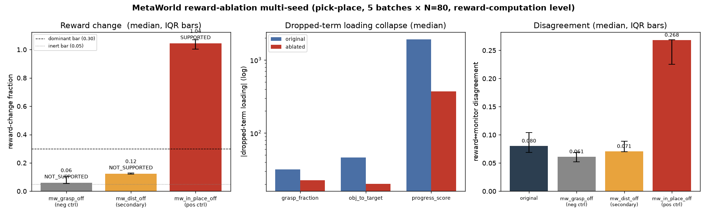

# MetaWorld reward-ablation multi-seed — median/IQR robustness (pick-place)

**Date:** 2026-07-09 · Aiko · branch `hymeko-neuro-migration`
**Status:** done. The single-run reward-ablation comparison, repeated over 5 independent rollout batches and
aggregated to median/IQR. **No training.** **The single-run negative/positive-control conclusions are CONFIRMED.**



---

## Summary

Across 5 independent rollout batches (seeds 0–4, N=80 each), the reward-ablation controls are **stable**:

- `mw_grasp_off` — **NOT_SUPPORTED in 5/5** batches (reward change median 0.061, loading does not collapse). Stable
  inert negative control.
- `mw_in_place_off` — **SUPPORTED in 5/5** batches (reward change median 1.044, `progress_score` loading collapses
  1918 → 373, reward↔monitor disagreement spikes 0.080 → 0.268). Stable dominant-driver positive control.
- `mw_dist_off` — **secondary, task/rollout-dependent** (reward change median 0.124 — consistent — but its
  `obj_to_target` loading collapse is noisy, so its per-variant verdict splits SECONDARY 2 / NOT_SUPPORTED 3). A
  genuine but weak secondary driver; **not overclaimed**.
- **Cross-view verification: 100 %** (25/25 conditions: 5 batches × 5 variants incl. original).
- **Panel verdict (mw_in_place positive control): SUPPORTED in 5/5** batches.

## Exact command

```
python -c "from hymeko_rl.eval.cip.reward_ablation_metaworld import run_reward_ablation_multiseed; \
from pathlib import Path; \
run_reward_ablation_multiseed('pick-place', batches=5, n=80, seed0=0, \
  out_dir=Path('reports/figures/2026_07_09_multiseed_cip_reward_ablation'))"
```

- **Batches × N:** 5 × 80 (400 scripted `SawyerPickPlaceV3Policy` rollouts + action noise; offline reward
  recompute; no env re-stepping between variants).
- **Wall:** ~21 s total.
- **MetaWorld 3.0.0 · MuJoCo 3.10.0 · gymnasium 1.3.0 · numpy 2.4.6 · scipy 1.17.1.**
- **Reward SoT:** `data/robotics/metaworld_reward.hymeko` (unmodified).

## Per-batch results

| seed | fidelity R² | rc grasp | rc in_place | rc dist | panel verdict |
|---:|---:|---:|---:|---:|---|
| 0 | 0.899 | 0.021 | 1.085 | 0.119 | SUPPORTED |
| 1 | 0.894 | 0.129 | 0.999 | 0.158 | SUPPORTED |
| 2 | 0.908 | 0.055 | 1.070 | 0.124 | SUPPORTED |
| 3 | 0.914 | 0.061 | 1.044 | 0.128 | SUPPORTED |
| 4 | 0.887 | 0.102 | 1.004 | 0.121 | SUPPORTED |

(`rc` = reward-change fraction ‖Δreward‖/‖reward‖; all variants cross-view-verify in every batch.)

## Median/IQR aggregate

| variant | reward change (med [IQR]) | dropped-term loading orig → ablated (med) | disagreement (med [IQR]) |
|---|---|---|---|
| original | 0.000 [0.000, 0.000] | — | 0.080 [0.069, 0.104] |
| `mw_grasp_off` | **0.061 [0.055, 0.102]** | grasp_fraction 31.6 → 22.5 (no collapse) | 0.061 [0.052, 0.069] |
| `mw_dist_off` | **0.124 [0.121, 0.128]** | obj_to_target 46.1 → 20.1 (noisy IQR) | 0.071 [0.070, 0.089] |
| `mw_in_place_off` | **1.044 [1.004, 1.070]** | progress_score **1918 → 373** (5.1× collapse) | **0.268 [0.225, 0.269]** |

The reward-change ordering **in_place (1.04) ≫ dist (0.12) > grasp (0.06)** is stable across all 5 batches and
tracks the fitted-weight ordering. The `progress_score` loading collapse (1918 → 373) has a tight IQR
([1890,1920] → [283,391]); the `obj_to_target` collapse is real in the median but its IQR is wide
([10,77] → [17,76]) — hence the split dist verdict.

## Verdict stability (per-variant driver classification across 5 batches)

Per-variant verdict = SUPPORTED (reward change > 0.30 **and** loading collapse) / SECONDARY (> 0.05 **and**
collapse) / NOT_SUPPORTED (inert).

| variant | SUPPORTED | SECONDARY | NOT_SUPPORTED | mode | cross-view pass |
|---|---:|---:|---:|---|---:|
| `mw_grasp_off` | 0 | 0 | **5** | NOT_SUPPORTED | 5/5 |
| `mw_in_place_off` | **5** | 0 | 0 | SUPPORTED | 5/5 |
| `mw_dist_off` | 0 | 2 | 3 | (borderline) | 5/5 |
| panel (in_place pos-ctrl) | **5** | — | 0 | SUPPORTED | — |

## Cross-view verification pass rate

**100 % (25/25 conditions).** Every variant in every batch produced a mechanism hypergraph whose star/clique
cross-view projections agree.

## Decision-rule evaluation

**A. `mw_grasp_off` stable negative control — CONFIRMED.**
Reward change near zero (median 0.061); grasp loading non-collapsing (31.6 → 22.5, within noise); disagreement does
not consistently change (0.061 vs original 0.080 — if anything slightly lower, not a spike); NOT_SUPPORTED in 5/5.

**B. `mw_in_place_off` stable positive control — CONFIRMED.**
progress_score loading collapses sharply (1918 → 373, 5.1×, tight IQR); reward change large (median 1.044,
IQR [1.00,1.07]); reward↔monitor disagreement spikes in the predicted direction (0.080 → 0.268, 3.3×); SUPPORTED in
5/5.

**C. `mw_dist_off` secondary — reported, not overclaimed.**
Reward change is a *consistent* moderate ~0.124 (tight IQR), so `mw_dist` genuinely contributes to the reward. But
its loading-collapse signature is **task/rollout-dependent** (obj_to_target loading collapse median-real but
wide-IQR), so the driver verdict splits SECONDARY 2 / NOT_SUPPORTED 3. Honest conclusion: **a weak secondary
driver whose CIP-loading signature is not robust at N=80** — not promoted to a stable positive control.

## Are the single-run conclusions confirmed, weakened, or rejected?

- **Negative control (`mw_grasp`): CONFIRMED.** 5/5 NOT_SUPPORTED, exactly as the single run.
- **Positive control (`mw_in_place`): CONFIRMED and strengthened.** 5/5 SUPPORTED with tight IQRs; the loading
  collapse and disagreement spike are robust, not single-run artifacts.
- **Secondary (`mw_dist`): partially confirmed / appropriately qualified.** The reward-change side is stable; the
  loading-collapse side is not — so it is a *weak, task-dependent* secondary driver, downgraded from any strong
  claim.

The ablation pipeline is validated with multi-seed statistics: sensitive to the real driver (5/5), inert to the
minor term (5/5), and honestly borderline on the secondary term.

## Tests

+2 tests (`test_median_iqr_and_variant_classification` — pure; `test_multiseed_aggregates_and_stabilizes` —
real-env, skips if `metaworld` absent). Full `test_reward_ablation_metaworld.py` green (10 tests). ruff / radon
(no block ≥ C) / mypy `--strict` (my file) clean. **Pre-existing, unrelated:** `test_quadruped_from_hymeko.py`
has 6 failures on clean HEAD (quadruped_env reward declaration) — untouched, not part of this change.

## What remains (Stage B, training — gated)

The reward-computation-level story is now robust in both directions. The honest next lever is **Stage B — retrain
a policy under the ablated reward** (does a policy trained without `mw_in_place` behave differently?). That requires
training and is **deliberately not run**.

## Constraints honored

No training · no Stage B · FANUC v2 / coin-collab v2b / `CORE.YAML` / `metaworld_reward.hymeko` / `pyproject.toml`
untouched · no existing report/artifact overwritten · quadruped failures left untouched (mentioned only as
pre-existing) · no policy-learning claim.
