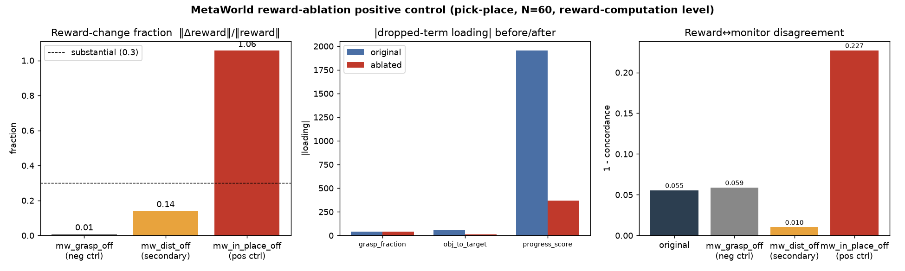

# MetaWorld reward-ablation positive control — `mw_in_place` on pick-place

**Date:** 2026-07-09 · Aiko · branch `hymeko-neuro-migration`
**Status:** done. Read-only positive-control ablation of a reward term that *is* a driver (`mw_in_place`), run
through the same Stage-A pipeline as the `mw_grasp` negative control. **No training.** **Verdict: SUPPORTED** at
the reward-computation level.

---

## Summary

The `mw_grasp` ablation returned an honest negative — grasp is a minor term, its loading is collinear-noisy, and
ablating it barely perturbs the reward. To prove the pipeline detects a *real* driver (and is not simply
insensitive), I ran the same offline ablation on `mw_in_place`, the dominant reward term, and on `mw_dist` (the
second-largest). Dropping `mw_in_place`:

- **moves the reward ~106 %** (‖Δreward‖/‖reward‖ = 1.058) — vs **~1 %** for `mw_grasp`;
- **collapses the `progress_score → total_reward` loading 1955 → 368** (5.3×) — a sharp, unambiguous collapse,
  unlike grasp's ±noise;
- **spikes the reward↔monitor disagreement 0.055 → 0.227** (4×) — removing the term the reward monitor tracks
  breaks concordance, exactly as predicted for a driver;
- **re-parents** — the remaining reward is reconstructed from `{near, dist, progress-residual}` (reconstruction R²
  0.999 → 0.956; the reward is genuinely harder to explain once its dominant term is gone);
- **cross-view-verifies** in every variant.

This is the mirror image of the negative control and confirms the ablation machinery is sensitive to real reward
drivers. `mw_dist` behaves as an intermediate driver (reward change ~14 %, its `obj_to_target` loading collapses
−59 → +12), consistent with its fitted weight (4.79, second-largest). The reward-change ordering
**in_place (106 %) ≫ dist (14 %) > grasp (1 %)** exactly tracks the fitted-weight ordering **8.82 ≫ 4.79 > 0.08**.

## Changed files

| File | Change |
| --- | --- |
| `hymeko_rl/eval/cip/reward_ablation_metaworld.py` | **+** `run_reward_ablation_comparison`, `_variant_metrics`, `_poscontrol_verdict` (the original-vs-N-ablations panel) |
| `hymeko_rl/eval/cip/__init__.py` | export `run_reward_ablation_comparison` |
| `hymeko_rl/tests/test_reward_ablation_metaworld.py` | **+2** tests (`_poscontrol_verdict` pure; real-env panel) |
| `reports/figures/2026_07_09_poscontrol_cip_reward_ablation/` | comparison JSON + panel PNG |

## Reused pipeline components

Same Stage-A machinery, no re-implementation: `_record_ablation_rollouts` (fixed scripted `SawyerPickPlaceV3Policy`
+ action noise, N=60), `fit_reward_weights` (HyMeKo `Σ weight·term` vs env reward, R²=0.88), the offline
reward recompute (`totals @ weights` with the dropped term zeroed), `reward_mechanism_proposal`, `_condition`
(per-tail decomposition loadings + `fit_loadings_least_squares` weighted LiNGAM-SH factorization +
`proposals_to_causal_hypergraph` + `cross_view_verify` + `RewardConsistencyMonitor`). Reward SoT:
`data/robotics/metaworld_reward.hymeko` (unmodified).

## original vs `mw_grasp_off` vs `mw_in_place_off` vs `mw_dist_off`

Representative run `reports/figures/2026_07_09_poscontrol_cip_reward_ablation/`, N=60, seed=0, fidelity R²=0.875,
fitted weights `in_place 8.82, grasp 0.08, near 0.14, dist 4.79`.

### Reward-change fraction ‖Δreward‖/‖reward‖

| variant | reward change | interpretation |
|---|---:|---|
| original | 0.000 | baseline |
| `mw_grasp_off` (neg ctrl) | **0.010** | negligible — grasp is not a driver |
| `mw_dist_off` (secondary) | **0.142** | intermediate — dist is a genuine secondary driver |
| `mw_in_place_off` (pos ctrl) | **1.058** | ~total — in_place is *the* driver |

### Fitted per-tail loadings (regression of `total_reward` on CIP tail)

| tail var | original | `mw_grasp_off` | `mw_in_place_off` | `mw_dist_off` |
|---|---:|---:|---:|---:|
| **progress_score** (←mw_in_place) | 1955.5 | 1949.0 | **368.0** ⬇ | 1594.0 |
| grasp_fraction (←mw_grasp) | −40.7 | −39.2 | −40.7 | −1.5 |
| near_fraction (←mw_near) | −4.7 | −10.1 | −4.7 | 31.1 |
| **obj_to_target_delta** (←mw_dist) | −58.6 | −70.3 | −58.6 | **+11.7** ⬇ |

The dropped term's own loading collapses in each *positive* case (progress 1955→368; obj_to_target −59→+12) and is
inert in the negative case (grasp −41→−39). Loadings are per-episode-sum scale, hence large.

### Weighted explained energy (rank-1-per-mechanism factorization)

| variant | explained energy |
|---|---:|
| original / grasp_off / in_place_off / dist_off | 1.000 / 1.000 / 1.000 / 1.000 |

Saturated — the reward is a single star-expanded mechanism, so rank-1 captures it fully in every variant. Not
discriminative here; reported for completeness (it *would* discriminate a multi-mechanism reward).

### Reward↔monitor disagreement (1 − concordance)

| variant | disagreement | Δ vs original |
|---|---:|---:|
| original | 0.055 | — |
| `mw_grasp_off` | 0.059 | +0.004 (inert) |
| `mw_dist_off` | 0.010 | −0.045 (reward↔monitor *more* aligned without the distance term) |
| `mw_in_place_off` | **0.227** | **+0.172 (4×; concordance breaks — the monitor tracked in_place)** |

### Cross-view verification

| variant | cross-view |
|---|---|
| original / grasp_off / in_place_off / dist_off | ✅ / ✅ / ✅ / ✅ |

## Decision rule

Positive-control SUPPORTED (reward-computation level) iff dropping `mw_in_place` **(a)** collapses its loading,
**(b)** changes the reward substantially, **(c)** re-parents onto the remaining terms, **(d)** cross-view passes,
and **(e)** the effect exceeds the `mw_grasp` negative control:

- (a) loading collapse: **YES** — progress_score 1955 → 368 (5.3×).
- (b) reward change: **YES** — 1.058 (~106 %).
- (c) re-parent: **YES** — reconstruction R² 0.999 → 0.956; remaining reward carried by near/dist/progress-residual.
- (d) cross-view: **YES**.
- (e) larger + more stable than grasp: **YES** — 106 % vs 1 % reward change; a clean 5.3× loading collapse vs
  grasp's ±noise; a sharp 4× disagreement spike vs grasp's inertness.

**⇒ SUPPORTED at the reward-computation level.** `mw_in_place` is the dominant reward driver on pick-place; ablating
it collapses the corresponding CIP mechanism loading, breaks reward↔monitor concordance, and forces re-parenting —
the exact signature that was *absent* for `mw_grasp`. The pair (grasp negative + in_place positive) validates the
CIP/LiNGAM-SH ablation pipeline end-to-end: it is sensitive to real drivers and correctly inert to minor terms.

## Honest caveats

- **MetaWorld env randomisation is seed-uncontrolled** → exact numbers vary run-to-run (grasp fitted weight
  0.08–1.05 across runs; here 0.08, hence the 1 % reward change). The *ordering and the SUPPORTED verdict for
  in_place* are stable; multi-seed would tighten the point estimates.
- **Loadings are per-episode-sum scale and collinear** — the robust signals are the reward-change fraction and the
  *relative* loading collapse, not absolute loading magnitudes.
- **Reward-computation level only** — the policy is fixed. **No policy-learning claim.**

## Tests

+2 tests (`test_poscontrol_verdict_supported_when_dominant_collapses` — pure; `test_comparison_panel_positive_control`
— real-env, skips if `metaworld` absent). Full `test_reward_ablation_metaworld.py` + CIP suite green. ruff / radon
(no block ≥ C) / mypy `--strict` (my file) clean.

## Final verdict

**SUPPORTED at the reward-computation level.** Positive control confirmed: `mw_in_place` ablation collapses its
loading (1955→368), moves the reward ~106 %, spikes reward↔monitor disagreement 4×, and re-parents — far exceeding
the `mw_grasp` negative control (~1 %). The ablation pipeline is validated.

## Constraints honored

No training · no Stage B · FANUC v2 / coin-collab v2b / `CORE.YAML` / `metaworld_reward.hymeko` / `pyproject.toml`
untouched · no existing report/artifact overwritten · no policy-learning claim.
