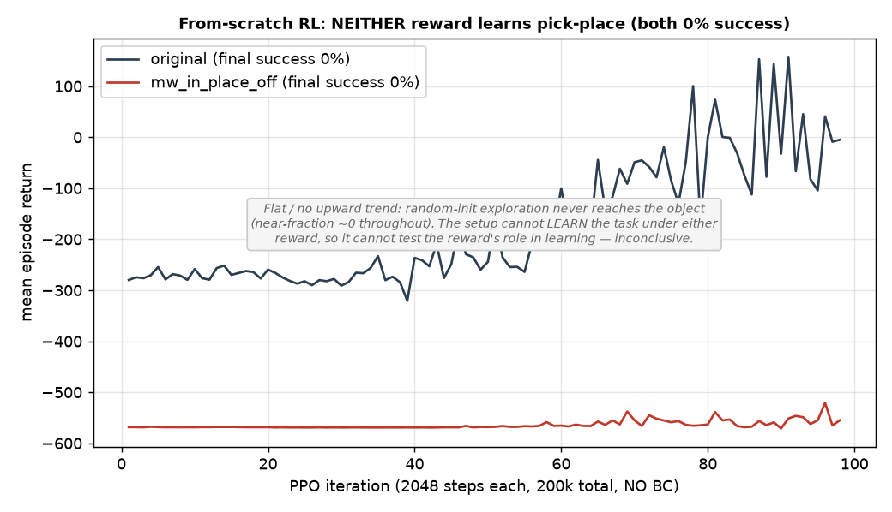

# MetaWorld Stage B — from-scratch RL (no BC): inconclusive by design

**Date:** 2026-07-09 · Aiko · branch `hymeko-neuro-migration`
**Status:** done, and honestly negative-inconclusive. **From-scratch PPO (no BC) does not learn pick-place under
*either* reward** (both 0% success), so it cannot test whether `mw_in_place` is needed to *learn* the task. The
question stays open; this run characterizes the setup, not the reward.



---

## Why this run

The BC-anchored Stage B (REINFORCE + PPO) showed the reward ablation does not change task *success* — because BC
pre-loads the skill. The only framing where `mw_in_place` could show a policy-*learning* effect is training
**from scratch** (no BC), where the reward must actually teach the task. This run tests that.

## Setup (given a fair shot)

To avoid a false negative from a weak optimizer, the from-scratch path added what BC-anchoring had provided for
free: **running observation normalization** (streaming Welford — no demos to fit it), **exploration** (entropy
bonus 0.01, initial action std = 1), and a **larger budget** (200 000 env-steps, PPO rollout 2048 × ~98 iters).
1 seed, both profiles, on the Mac (torch 2.12 CPU, ~2 min).

## Result

| profile | success | grasp | near (approaches object) | final mean return |
|---|---:|---:|---:|---:|
| original | **0.00** | 0.00 | 0.011 | −4.9 |
| `mw_in_place_off` | **0.00** | 0.00 | 0.001 | −555 |
| Δ | 0.00 | 0.00 | — | — |

The return is **flat with no upward trend** and the arm **never approaches the object** (near-fraction ≈ 0
throughout) under either reward. The policy converges to a do-nothing local optimum; random-init exploration never
discovers reach→grasp on a 7-DOF arm — exactly the wall the repo's `pick_place_ppo` docstring names ("from-scratch
PPO on a 7-DOF arm would never discover a grasp by random exploration").

## Why this is inconclusive (not a reward result)

If **neither** reward can learn the task, the run **cannot discriminate** them. A 0%-vs-0% outcome tells us the
*setup* (simple flat-obs PPO, 200k steps, no curriculum, no replay) cannot solve MetaWorld pick-place from scratch
— it says nothing about whether `mw_in_place` is load-bearing for learning. Running a 5-seed sweep would only
reconfirm 0%/0%, so it was **not** run (no discriminating value; CLAUDE.md §3).

The PPO machinery itself is sound — it reached ~100% when BC-anchored (see the PPO multi-seed report). The failure
is the exploration problem, not a bug.

## What a fair from-scratch test would need (gated, research-scale)

Any of these — each a substantial, hours-scale effort, not a bounded run:

1. **SAC + replay buffer** (off-policy, far more sample-efficient for exploration than on-policy PPO), 1–2 M steps.
2. **A curriculum** — start the object in/near the gripper and anneal difficulty, so the reward gradient is
   reachable (the env supports difficulty shaping in the FANUC path; MetaWorld would need a wrapper).
3. **Much larger budget + tuned exploration** (entropy schedule, action-repeat, wider nets).

Only *after* one of these makes at least the **original** reward learn from scratch would ablating `mw_in_place`
become a valid learning-role test. As it stands, the learning-role question is **open**.

## Where this leaves the Stage A→B arc (final, honest)

| level | finding | robust? |
|---|---|---|
| reward-computation (Stage A) | `mw_in_place` load-bearing (loading collapse + disagreement spike) | **yes, 5-seed** |
| policy fine-tune from BC (Stage B) | task success unaffected by ablation (PPO both ~100%) | success: no effect |
| policy fine-tune from BC (Stage B) | reward↔monitor disagreement higher under off (~2.3×) | mostly (4–5/5) |
| policy from-scratch (this run) | neither reward learns → cannot test the learning role | **inconclusive** |

**Net:** the solid, robust claim is the reward-computation one (Stage A) plus the surviving disagreement
signature. The policy-*learning* role of `mw_in_place` is **untested/open** — from-scratch RL at bounded scale
can't reach it.

## Command

```
python -c "from hymeko_rl.experiments.exp_metaworld_reward_stageb import StageBConfig, launch; from pathlib import Path; \
launch(StageBConfig(profiles=('original','mw_in_place_off'), warm_start=False, optimizer='ppo', \
  total_env_steps=200000, ppo_entropy_coef=0.01, out_dir=Path('reports/figures/2026_07_09_metaworld_stageb_fromscratch')), \
  launch_training=True, allow_uncertified=True)"
```

## Artifacts / tests

`reports/figures/2026_07_09_metaworld_stageb_fromscratch/stage_b_train.json` + `from_scratch_returns.png`. Code:
`_RunningNorm` added to `stage_b_ppo.py` (online obs normalization for the from-scratch path; warm-started keeps the
BC-fit norm). 15/15 stage-b + 10/10 reward-ablation tests green; ruff/radon/mypy clean.

## Next decision

The learning-role question needs a **research-scale** from-scratch effort (SAC + replay or a curriculum, 1–2 M
steps). That is a real compute + engineering investment — I will not start it without an explicit go-ahead and a
scoped plan. Otherwise, the Stage A→B arc is complete and the claim set is the honest one above.
