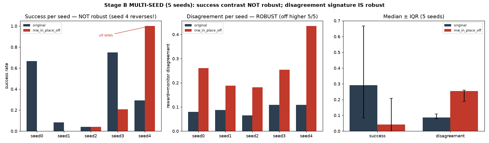

# MetaWorld Stage B — MULTI-SEED result (revises the single-seed headline)

**Date:** 2026-07-09 · Aiko · branch `hymeko-neuro-migration`
**Status:** done, 5 seeds. **The single-seed 62.5%→0% collapse is NOT robust.** The success contrast is
optimizer-variance-dominated; what *is* robust is the reward↔monitor **disagreement** signature (off higher in
5/5 seeds). Honest correction of the prior report.



---

## Headline (corrected)

Repeating the Stage-B protocol (shared BC start per seed, fine-tune under `original` vs `mw_in_place_off`) across 5
seeds: the median still leans toward the original reward (success 0.29 vs 0.04), but **the success contrast is not
robust** — it reverses entirely on seed 4 (`mw_in_place_off` 1.00 vs original 0.29) and ties on seed 2. The
single-seed run I reported earlier (seed 0: 0.67 vs 0.00) was a **favorable seed**, not a representative effect.
The one signal that *is* robust across all 5 seeds is that **reward↔monitor disagreement is higher under
`mw_in_place_off`** (median 0.254 vs 0.087, non-overlapping) — the reward-computation-level signature survives
into training even when the success numbers do not.

## Per-seed (the honest table)

| seed | BC success | original: succ / grasp / disagree | mw_in_place_off: succ / grasp / disagree | contrast (orig−off) |
|---:|---:|---|---|---:|
| 0 | 1.00 | 0.67 / 0.41 / 0.080 | 0.00 / 0.00 / 0.261 | **+0.67** |
| 1 | 0.29 | 0.08 / 0.10 / 0.087 | 0.00 / 0.00 / 0.188 | +0.08 |
| 2 | 1.00 | 0.04 / 0.00 / 0.065 | 0.04 / 0.00 / 0.181 | 0.00 |
| 3 | 1.00 | 0.75 / 0.64 / 0.109 | 0.21 / 0.12 / 0.254 | +0.54 |
| 4 | 0.50 | 0.29 / 0.47 / 0.109 | **1.00 / 0.75 / 0.435** | **−0.71** |

## Aggregate (median [IQR], 5 seeds)

| metric | original | mw_in_place_off | robust? |
|---|---|---|---|
| success rate | 0.292 [0.083, 0.667] | 0.042 [0.000, 0.208] | **no** (IQRs overlap; seed 4 reverses) |
| grasp fraction | 0.413 [0.100, 0.471] | 0.000 [0.000, 0.121] | no (seed 4 off grasps 0.75) |
| **reward↔monitor disagreement** | **0.087 [0.080, 0.109]** | **0.254 [0.188, 0.261]** | **YES** (off higher 5/5, non-overlapping) |
| reward under TRUE reward | 710 [80, 746] | −104 [−134, 205] | leans original, wide IQR |
| cross-view pass rate | 100 % | 100 % | yes |

Per-seed success contrast: **[+0.67, +0.08, 0.00, +0.54, −0.71]** → `all_seeds_original_gt_off = False`.
**Verdict: NOT_ROBUST** for the success contrast.

## Why it is not robust (mechanism)

Two variance sources swamp the reward signal at this budget:

1. **BC base quality is seed-dependent** — BC success ranged 0.29–1.00 across seeds (env randomization is
   seed-uncontrolled). The two arms share a start *within* a seed (fair), but the *starting competence* differs
   wildly *between* seeds.
2. **REINFORCE is high-variance** — even from a perfect BC base (seed 2, BC 1.00), the original-reward fine-tune
   *collapsed* to 0.04. The optimizer itself is unreliable at 6000 steps; on seed 4 it drove `mw_in_place_off` to
   1.00. The fine-tune outcome is dominated by optimizer noise, not the reward composition.

So the success axis cannot discriminate the rewards at this optimizer/budget — the earlier single-seed contrast was
REINFORCE landing well for original and badly for off on that one seed.

## What survives — the robust claim

**Reward↔monitor disagreement is robustly higher under `mw_in_place_off` (5/5 seeds, 0.254 vs 0.087,
non-overlapping IQR).** Even on seed 4, where the off-trained policy *succeeds* (1.00), its reward↔monitor
disagreement is the highest of all (0.435) — the reward is not tracking the task monitor, it just happened to
coincide with success. This is the policy-level echo of the Stage-A finding (ablating `mw_in_place` spikes
disagreement 0.080→0.268), and it is the one part of the Stage-B story that holds up multi-seed.

## Corrected claim discipline

- **REVISED (was tier-B "supported, single-seed") → now:** the **success collapse is NOT a robust claim**. Do not
  say "training without `mw_in_place` collapses the policy to 0%." Say "the median leans original but the success
  contrast is not robust (5-seed), dominated by BC + REINFORCE variance."
- **NEW robust claim (tier A):** under `mw_in_place_off`, **reward↔monitor disagreement is robustly higher**
  (5/5 seeds) — the reward stops tracking the task even when the policy occasionally succeeds.
- **Unchanged:** Stage A reward-computation-level result (`mw_in_place` load-bearing, 5-seed SUPPORTED) stands; it
  never depended on training.

## Honest note on the earlier report

`reports/2026-07-09-metaworld-stageb-training-result.md` reported the single-seed 62.5%→0% as "SUPPORTED at the
policy-learning level." **This multi-seed pass supersedes that success claim** — it was a favorable seed. The
disagreement finding there does replicate. The earlier report is left in place as the seed-0 record, with this
report as the multi-seed correction of record (this is the "single-seed is a point estimate, not a verdict" rule
from CLAUDE.md doing its job).

## Method / command

Same protocol as the single run, 5 seeds (0–4), 24 demos / 150 BC epochs / 6000 fine-tune steps / 24 eval
episodes; GIF rendered for seed 0 only.

```
python -m hymeko_rl.experiments.exp_metaworld_reward_stageb --multiseed 5 \
  --profiles original mw_in_place_off --total-env-steps 6000 --allow-uncertified \
  --out reports/figures/2026_07_09_metaworld_stageb_multiseed
```
(`--allow-uncertified` because the experiment deliberately trains `mw_in_place_off`; `cert_delivers` recorded per
seed in the JSON.)

## Artifacts

- `reports/figures/2026_07_09_metaworld_stageb_multiseed/stage_b_multiseed.json` — per-seed + aggregate + verdict.
- `reports/figures/2026_07_09_metaworld_stageb_multiseed/stage_b_multiseed_panel.png` — the 3-panel figure.
- `reports/figures/2026_07_09_metaworld_stageb_multiseed/seed_0/…` — seed-0 GIFs + mechanisms (representative).

## Tests

+2 tests (`_aggregate_stageb` medians/contrast pure; multiseed gate). 13/13 stage-b + 10/10 reward-ablation green.
ruff / radon (no block ≥ C) / mypy `--strict` (my files) clean.

## Next step

The success axis needs a **stronger optimizer** to be conclusive: swap REINFORCE→PPO (on-policy, corrects
covariate shift; the repo's `pick_place_ppo` pattern) and/or a larger step budget, then re-run multi-seed. Only
then is a policy-level *success* claim defensible. The **disagreement** claim is already robust and needs no more
compute. Both are gated on your go-ahead.
