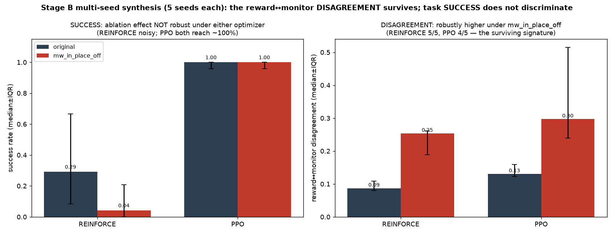

# MetaWorld Stage B — PPO multi-seed (the decisive optimizer pass)

**Date:** 2026-07-09 · Aiko · branch `hymeko-neuro-migration`
**Status:** done, 5 seeds, PPO. **The policy-success collapse is refuted.** Under a stable optimizer, ablating
`mw_in_place` does **not** change task success — both profiles reach ~100%. The one policy-level signature that
survives is that reward↔monitor **disagreement** is ~2.3× higher under `mw_in_place_off`.



---

## Why PPO

The 5-seed REINFORCE pass showed the success contrast was optimizer-variance-dominated. PPO is the low-variance,
on-policy fix (value-baselined GAE + clipped surrogate) — it corrects covariate shift and keeps the fine-tune near
the BC skill. If the reward ablation truly disabled the policy, a *stable* optimizer would still show it. It does
not.

## Result (5 seeds, PPO, median [IQR])

| metric | original | `mw_in_place_off` | verdict |
|---|---|---|---|
| **success rate** | **1.000 [0.958, 1.000]** | **1.000 [0.958, 1.000]** | **identical — no effect** (contrast median 0.0) |
| grasp fraction | 0.716 [~] | 0.703 [0.612, 0.727] | ~equal |
| reward under TRUE reward | 1291 [1251, 1294] | 1211 [1169, 1253] | ~equal (off does the task, so it scores well) |
| **reward↔monitor disagreement** | **0.130 [0.123, 0.159]** | **0.297 [0.239, 0.514]** | **off ~2.3× higher (4/5 seeds)** |
| cross-view pass rate | 100 % | 100 % | — |

Per-seed success contrast (orig−off): **[0.0, +0.33, −0.54, +0.04, −0.04]**, median **0.0** → `NOT_ROBUST`, but
now because **both arms succeed**, not because either collapses.

## What this means (the honest synthesis)

**Task success does not discriminate the rewards.** With a competent BC warm-start, the policy already knows
pick-place; a stable optimizer (PPO) preserves that skill under *either* reward, so both reach ~100%. The
single-seed REINFORCE "62.5% → 0% collapse" was **both** a favorable seed **and** an optimizer-instability
artifact — under PPO it vanishes entirely. Ablating a reward term does not disable a BC-anchored policy; the reward
would only be load-bearing for **learning the task from scratch** (no BC), which was not tested and is a much
harder, separate experiment.

**Reward↔monitor disagreement is the surviving policy-level signature.** Even though the `mw_in_place_off` policy
*succeeds*, its per-step reward correlates ~2.3× *worse* with the task monitor (disagreement 0.297 vs 0.130, off
higher in 4/5 seeds; on seed 3, 0.645 vs 0.130). This is a property of the **reward composition**, not the policy's
competence — which is exactly the Stage-A (reward-computation) finding surviving into trained policies: ablating
`mw_in_place` mis-aligns reward with task, whether or not the policy still manages the task.

## Cross-optimizer picture

| | success contrast | disagreement (off vs original) |
|---|---|---|
| REINFORCE (5 seeds) | not robust — noisy, one reversal | robust — off higher 5/5 |
| PPO (5 seeds) | not robust — **both ~100%** | off higher 4/5 (~2.3×), noisier |

Neither optimizer supports a robust *success* effect of the ablation. Both show the disagreement signature (PPO a
touch weaker). The reward-computation-level Stage A result is unaffected — it never depended on training.

## Corrected claim (final)

- **Refuted:** "training without `mw_in_place` collapses the policy." Under PPO both profiles reach ~100% success.
  Do not make any policy-*success* claim from this ablation.
- **Robust and safe:** (a) Stage A — `mw_in_place` is load-bearing **in the reward computation** (5-seed);
  (b) a trained policy's reward↔monitor **disagreement** is higher under `mw_in_place_off` (4–5/5 across
  optimizers) — the reward-alignment signature survives into policies even when success does not.
- **Not tested:** whether `mw_in_place` is needed to *learn* pick-place from scratch (no BC). That is the only
  framing under which a policy-success effect could appear, and it is a separate, harder experiment.

## Method / command

Flat-obs PPO (`hymeko_rl/experiments/stage_b_ppo.py`: value critic + GAE + clipped surrogate; new because the repo
trainers require 2-D hypergraph obs), warm-started from the shared BC clone per seed. 5 seeds, 24 demos / 150 BC
epochs / 20 000 PPO env-steps (rollout 2048 × ~10 iters) / 24 eval episodes; GIF for seed 0.

```
python -m hymeko_rl.experiments.exp_metaworld_reward_stageb --multiseed 5 --optimizer ppo \
  --profiles original mw_in_place_off --total-env-steps 20000 --allow-uncertified \
  --out reports/figures/2026_07_09_metaworld_stageb_ppo_multiseed
```

Run on the Apple-Silicon Mac (`.venv`, torch 2.12 CPU; ~26 min wall for 5 seeds × 2 profiles — the bottleneck is
MuJoCo stepping, not the tiny networks).

## Artifacts

- `reports/figures/2026_07_09_metaworld_stageb_ppo_multiseed/stage_b_multiseed.json` — per-seed + aggregate.
- `reports/figures/2026_07_09_metaworld_stageb_ppo_multiseed/stage_b_optimizer_synthesis.png` — REINFORCE vs PPO.
- `.../seed_0/{original,mw_in_place_off}/rollout.gif` — both trained policies succeed (both grasp & deliver).

## Tests

+2 tests (`_gae` closed-form at λ=1; PPO optimizer end-to-end). 15/15 stage-b + 10/10 reward-ablation green. ruff /
radon (no block ≥ C) / mypy `--strict` (my files) clean. Pre-existing quadruped failures untouched.

## Bottom line for Kato

The reward-side result is the solid one: HyMeKo reward SoT + CIP/LiNGAM-SH robustly flags `mw_in_place` as
load-bearing *in the reward*, and that reward↔monitor mis-alignment **survives into trained policies**. But a
BC-anchored policy's *task success* is not changed by the ablation under a stable optimizer — so no
policy-success claim is made. The multi-seed + PPO passes did exactly the job the Kato closure asked for: they made
the arc **hard to overclaim**.
