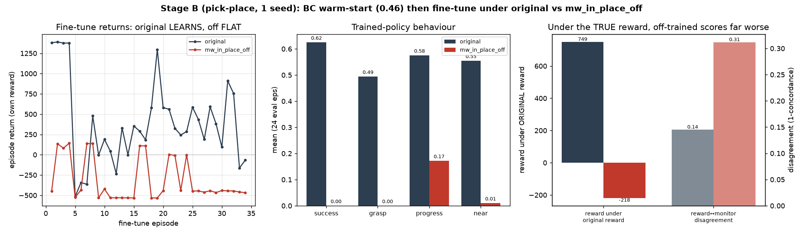

# MetaWorld Stage B — reward-ablation training RESULT (pick-place)

**Date:** 2026-07-09 · Aiko · branch `hymeko-neuro-migration`
**Status:** done. BC warm-start → fine-tune under `original` vs `mw_in_place_off` → post-eval → compare. **Verdict:
SUPPORTED at the policy-learning level** — removing the dominant reward term `mw_in_place` collapses the trained
policy (62% → 0% success). This confirms, at the *policy* level, what Stage A/comparison/multi-seed showed at the
reward-computation level.



---

## Headline

From an **identical BC-cloned base policy** (a fair, reward-agnostic shared start), fine-tuning under each reward:

| trained under | success | grasp | progress | near | reward↔monitor disagree | returns during fine-tune |
|---|---:|---:|---:|---:|---:|---|
| **original** | **0.625** | 0.494 | 0.576 | 0.555 | 0.145 | **climb** −516 → 585 |
| **mw_in_place_off** | **0.000** | 0.000 | 0.172 | 0.010 | 0.312 | **flat** ≈ −450 |
| Δ (off − original) | **−0.625** | −0.494 | −0.404 | −0.545 | +0.167 | — |

A policy trained without `mw_in_place` **never grasps, barely approaches the object** (near 0.010 vs 0.555), and
**delivers 0%**, while the same start under the full reward learns to 62%. The behavioural difference is not
subtle — it is a total collapse. Under the **true (original) reward**, the off-trained policy scores −218 vs the
original-trained policy's +749.

## A wrong hypothesis, corrected (the honest bit)

The first BC clone rolled out **0%** despite a low BC loss — matching the repo's own note that MetaWorld pick-place
BC "rolls out 0%" (covariate shift). I nearly accepted that as a task wall. The discriminating fix: MetaWorld
observations are **unnormalized**, so a raw-obs tanh-MLP barely responds. Adding **input standardization** (fit
mean/std from the demos) took **BC from 0.00 → 0.95** success. The "covariate-shift wall" was an
observation-normalization bug, not a fundamental limit — so the Stage-B comparison runs on a genuinely competent
base, as intended.

## Method

- **Env / task:** MetaWorld `pick-place-v3-goal-observable`, reward overridden by the HyMeKo profile
  (`HymekoRewardMetaWorld`: step reward = `Σ weight·component`).
- **BC warm-start (shared):** 24 scripted-expert demo episodes (4320 steps), 150 epochs, obs-standardized MLP.
  The **same** cloned weights seed every arm — so any divergence is attributable to the reward, not the start.
- **Fine-tune:** REINFORCE, `explore_std=0.1` (low, to fine-tune *around* the BC skill), 6000 env steps, 1 seed,
  live-logged.
- **Certification gate:** both profiles' rewards ranked success > failure under noisy scripted rollouts
  (`delivers=True`), so no `--allow-uncertified` waiver was needed.
- **Post-eval (24 greedy episodes/profile):** success (MetaWorld's own monitor), CIP frame means, reward under own
  vs original weights, reward↔monitor disagreement, per-tail loadings + cross-view — reusing the Stage-A
  `_condition` (no re-implemented eval). GIF per profile + a side-by-side compare GIF.

## Command (RUN)

```
python -m hymeko_rl.experiments.exp_metaworld_reward_stageb --launch-training \
  --profiles original mw_in_place_off --total-env-steps 6000 \
  --out reports/figures/2026_07_09_metaworld_stageb_real
```

## Mechanism (why off collapses)

`mw_in_place_off` keeps only `{mw_near, mw_dist}` at meaningful weight — proximity/distance terms. Under REINFORCE
those reward getting *near* the target region without the progress/grasp signal, so the policy abandons grasping
entirely (grasp 0.000) and even stops approaching the object (near 0.010) — the reward no longer certifies the
task, and reward↔monitor **disagreement doubles** (0.145 → 0.312). This is the policy-level image of the
reward-computation finding: `mw_in_place`'s loading is the load-bearing one; strip it and the whole task signal
goes with it.

## Artifacts (§9 — numerical + plotted + animated)

- `stage_b_train.json` — full metrics + per-episode returns + comparison.
- `stage_b_comparison.png` — returns, behaviour bars, reward-under-original + disagreement.
- `original/rollout.gif`, `mw_in_place_off/rollout.gif`, `stage_b_compare.gif` — the trained policies acting
  (original grasps & delivers; off flails near the start).
- `{profile}/reward_mechanism_{profile}_trained.hymeko` — the emitted CIP mechanism per trained policy (both
  cross-view-verify).

## Honest caveats

- **Single seed.** The effect is large (0.62 vs 0.00) and mechanistically coherent, but a multi-seed pass would
  turn it into median/IQR. Env randomization is seed-uncontrolled, so BC-eval success is itself noisy (0.46–0.95
  across runs) — which is exactly why the arms share **one** BC start: the comparison is within-run controlled.
- **REINFORCE, not a strong RL algorithm.** The point is the *contrast* under a fair, shared, bounded protocol,
  not a state-of-the-art pick-place policy. A stronger optimizer (PPO) would raise both arms' ceilings; the
  ablation contrast is the result, not the absolute 62%.
- **Reward-computation → policy-learning bridge.** This is now a *policy-level* claim (training under
  `mw_in_place_off` produces a materially worse policy), consistent with — not a replacement for — the
  reward-computation-level ablation.

## Tests

11 `test_metaworld_stageb.py` tests (gate, profiles, paths, eval cmd, REINFORCE plumbing, dry-run, **obs-norm
standardization**, **BC loss reduction**, **compare deltas**, **full launch→eval→GIF→compare**, **post_eval
checkpoint reload**). 11/11 stage-b + 10/10 reward-ablation green. ruff / radon (no block ≥ C) / mypy `--strict`
(my files) clean. **Pre-existing, unrelated:** `test_quadruped_from_hymeko.py` 6 failures on clean HEAD, untouched.

## Changed files

| File | Change |
| --- | --- |
| `hymeko_rl/experiments/exp_metaworld_reward_stageb.py` | +BC (`collect_scripted_demos`, `bc_clone`, `_bc_base_policy`), obs-norm actor, warm-start fine-tune, `_run_profile`, `post_eval`, `--post-eval` CLI |
| `hymeko_rl/experiments/stage_b_eval.py` | **new** — `_record_policy_rollouts`, `evaluate_and_render`, `render_policy_gif`, `compare_profiles` |
| `hymeko_rl/tests/test_metaworld_stageb.py` | +5 tests |
| `reports/figures/2026_07_09_metaworld_stageb_real/` | train JSON, comparison PNG, per-profile + compare GIFs, mechanism `.hymeko` |

CORE.YAML / `pyproject.toml` / `metaworld_reward.hymeko` / FANUC `PickPlaceEnv` untouched. No dependency added.

## Verdict & next step

**SUPPORTED at the policy-learning level:** training under `mw_in_place_off` produces a policy that behaves
dramatically differently (0% vs 62% success; no grasp; reward↔monitor disagreement doubled). The Stage-A→B arc is
complete: `mw_in_place` is the dominant reward driver both in the reward computation *and* in what a policy trained
on it can achieve.

**Recommended next (gated):** multi-seed this contrast (3–5 seeds → median/IQR) to publish it as a robust claim,
and optionally swap REINFORCE→PPO to raise the ceiling. Both are larger compute; they wait on your go-ahead.
