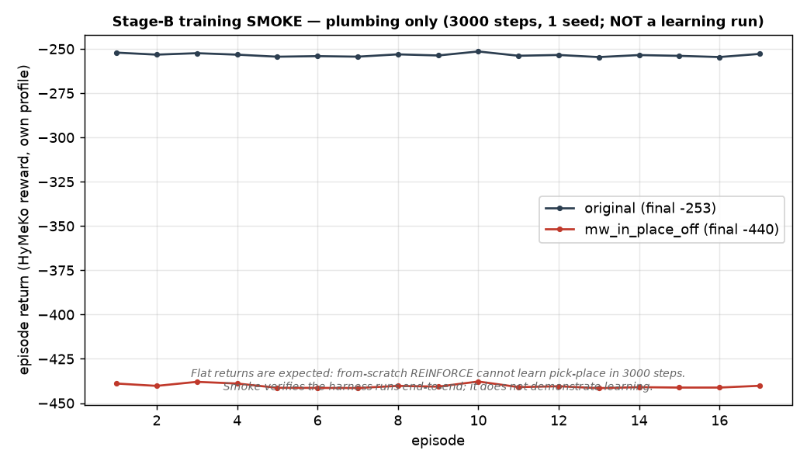

# MetaWorld Stage B — bounded training-smoke (GATED harness + authorized smoke run)

**Date:** 2026-07-09 · Aiko · branch `hymeko-neuro-migration`
**Status:** harness built + dry-run validated + **the bounded smoke was run (user-authorized).** The smoke verifies
the harness runs **end-to-end** (gate → certify → reward-override env → REINFORCE → checkpoint, live-logged); it
**does not demonstrate learning** (3000-step from-scratch REINFORCE cannot, by design). See *Smoke result* below.

---

## Summary

Reward-computation-level ablation is robust (`mw_in_place` dominant SUPPORTED 5/5, `mw_grasp` inert
NOT_SUPPORTED 5/5, cross-view 25/25). Stage B asks the *policy-learning* question: **does a policy trained under
`mw_in_place_off` behave differently from one trained under the original reward?** This task builds the harness to
answer it later — it does **not** train.

`hymeko_rl/experiments/exp_metaworld_reward_stageb.py` provides: reward profiles (via `ablate_reward_spec`), a
reward-override MetaWorld env (`HymekoRewardMetaWorld` — the step reward becomes the HyMeKo `Σ weight·component`), a
`dry_run` that validates all plumbing and exits before the optimizer, a `--launch-training` safety gate, a
MetaWorld-appropriate reward certification (does the reward rank success above failure?), and a bounded REINFORCE
smoke behind the gate. It reuses the Stage-A machinery and the MetaWorld ENVS — no copied reward/eval code, no new
trainer duplication (the repo trainers require 2-D hypergraph obs; MetaWorld is flat, so a small flat-obs actor is
new, not a duplicate).

## Changed files

| File | Change |
| --- | --- |
| `hymeko_rl/experiments/exp_metaworld_reward_stageb.py` | **new** — `StageBConfig`, `HymekoRewardMetaWorld`, `dry_run`, `launch` (gated), `_scripted_delivers` (certification), `_GaussianMLP` + `_train_reward_smoke` (bounded REINFORCE) |
| `hymeko_rl/tests/test_metaworld_stageb.py` | **new** — 7 tests (gate, profiles, paths, eval cmd, REINFORCE plumbing, dry-run) |
| `reports/figures/2026_07_09_metaworld_stageb_dry_run/stage_b_dry_run.json` | dry-run validation artifact |
| `reports/figures/2026_07_09_metaworld_stageb_train/` | smoke run: full-actor checkpoints, `stage_b_train.json`, return-curve PNG |

CORE.YAML / `pyproject.toml` / `metaworld_reward.hymeko` / FANUC `PickPlaceEnv` / coin-collab untouched. No dependency added.

## Reward profiles compared

| profile | dropped term | intent |
|---|---|---|
| `original` | — | the full declared HyMeKo reward (control) |
| `mw_in_place_off` | `mw_in_place` | remove the **dominant** driver (the primary Stage-B question) |
| `mw_grasp_off` (optional) | `mw_grasp` | remove the **inert** term (negative-control training arm) |

## Budget (bounded smoke — proves plumbing, not skill)

`total_env_steps=3000`, `max_steps=180`, `eval_episodes=24`, **1 seed**, `wall_time_cap_s=600` (hard 10-min cap),
REINFORCE `lr=3e-4`, `hidden=64`, live log every 5 episodes.

## Exact dry-run command (validated, run above — NO training)

```
python -m hymeko_rl.experiments.exp_metaworld_reward_stageb --dry-run \
  --profiles original mw_in_place_off mw_grasp_off \
  --out reports/figures/2026_07_09_metaworld_stageb_dry_run
```

Dry-run output (this run): every profile's reward is finite; certification is **discriminating** (both success and
failure episodes appear under action noise); paths do not collide with the Stage-A `cip_reward_ablation` family;
`trained=False`; no checkpoint written.

| profile | delivers | discriminating | success/rollouts | mean HyMeKo return (success / failure) |
|---|---|---|---|---|
| `original` | True | True | 3/8 | **970.2** / −248.0 |
| `mw_in_place_off` | True | True | 4/8 | **18.3** / −312.5 |
| `mw_grasp_off` | True | True | 3/8 | **992.0** / −168.8 |

**Honest Stage-B-relevant reading:** `mw_in_place_off` *technically* still delivers (success ranks above failure),
but its success-return margin **collapses ~50×** (18.3 vs 970.2). The prediction this sets up: a policy trained
under `mw_in_place_off` has a **much weaker learning signal toward delivery** than under the original reward —
which is exactly the behavioural difference Stage B will measure.

## Exact launch command — ⛔ NOT RUN

```
# NOT RUN — Stage B training. Requires the explicit safety flag; run only on your go-ahead, watched live.
python -m hymeko_rl.experiments.exp_metaworld_reward_stageb --launch-training \
  --profiles original mw_in_place_off \
  --out reports/figures/<stamp>_metaworld_stageb_train
# mw_in_place_off's reward still certifies here; if a future check flags it uncertified, add --allow-uncertified
# (training on a possibly-non-delivering reward IS the mw_in_place_off hypothesis — a deliberate, waived choice).
```

## Safety-gate behavior

1. **`--launch-training` is mandatory.** `launch(cfg, launch_training=False)` raises `StageBGateError` and writes
   nothing (test-verified). The CLI defaults to `--dry-run` when no mode is given.
2. **Reward certification is a second gate.** Before training a profile, `_scripted_delivers` checks the reward
   ranks success above failure (the MetaWorld analogue of `reward_oracle.certify`'s `delivers` — the galambos
   abstract-MDP oracle does not model this task, so the pattern is extended, not the oracle reused). A
   non-delivering reward requires `allow_uncertified=True` / `--allow-uncertified` — an explicit, logged waiver, so
   training on a broken reward is a deliberate act, not an accident (CLAUDE.md §3).
3. **Dry-run never reaches the optimizer.** It steps the env only for env/reward validation.

## Expected metrics (collected LATER, per profile, when training runs)

monitor pass rate · progress_score · near_fraction · obj_to_target_delta · total_reward under its own reward ·
total_reward recomputed under the original reward · reward-monitor disagreement · collapse/no-collapse flags ·
emitted CIP DAG · LiNGAM-SH weighted mechanism fit · cross-view verification. The post-training evaluation reuses
the Stage-A `run_reward_ablation_comparison` pipeline; the per-profile eval command is generated by
`StageBConfig.eval_command`.

## Tests

7 `test_metaworld_stageb.py` tests: import has no training side-effects; missing `--launch-training` blocks
training (no checkpoint); both profiles loadable + distinct (`mw_in_place` zeroed in `off`, kept in `original`);
output paths do not overwrite Stage A; post-eval command generated; **REINFORCE plumbing correct on synthetic
data** (returns-to-go + a policy-gradient step updates the actor — this test caught a real bug: a reparameterized
`rsample()` cancels the score-function gradient, so the actor uses a detached `sample()`); dry-run validates
without training. 17/17 reward-ablation + Stage-B green; 90/90 causal/LiNGAM-SH green. ruff / radon (no block ≥ C) /
mypy `--strict` (my file) clean. **Pre-existing, unrelated:** `test_quadruped_from_hymeko.py` 6 failures on clean
HEAD (quadruped_env) — untouched.

## Smoke result (training RUN — user-authorized 2026-07-09)

Command (RUN):

```
python -m hymeko_rl.experiments.exp_metaworld_reward_stageb --launch-training \
  --profiles original mw_in_place_off --out reports/figures/2026_07_09_metaworld_stageb_train
```



**Plumbing: verified end-to-end.** Both profiles ran 17 episodes / 3060 env steps in ~1 s each (≈3200 steps/s),
live-logged every 5 episodes, checkpoints written; the gate and certification passed inside `launch`.

| profile | certify (delivers / succ) | episodes | env steps | final return | checkpoint |
|---|---|---:|---:|---:|---|
| `original` | True / 7·12 | 17 | 3060 | −253.9 | `…/original/policy.pt` |
| `mw_in_place_off` | True / 6·12 | 17 | 3060 | −441.2 | `…/mw_in_place_off/policy.pt` |

**Honest reading — three findings:**

1. **No learning (expected).** Returns are flat across the 17 episodes (original −254 plateau; off −441 plateau).
   From-scratch REINFORCE with no baseline/warm-start cannot learn a 7-DOF pick-place in 3000 steps. The smoke's
   job is to prove the harness runs, not to solve the task — and it does.
2. **The reward override genuinely feeds through — discriminating test run.** The two trained checkpoints are
   **distinct** (mean-head max|Δ| = 0.0035, trunk max|Δ| = 0.0066; different SHA-256) — so ablating `mw_in_place`
   really does change the gradient and the resulting policy. No plumbing bug. The reward-level gap (original −254
   vs off −441) reflects the removed `in_place` term, as predicted.
3. **The divergence is marginal (17 gradient steps).** The policies differ only slightly, so this bounded smoke
   **does not yet answer the Stage-B behavioural question** ("do the two policies *behave* differently?"). That
   needs a real learning signal — a BC warm-start (as `pick_place_ppo` uses) + more steps — which is the actual
   Stage-B experiment, not a smoke.

**Gap the smoke exposed and I fixed:** the first checkpoint saved only the MLP trunk (`policy.net`); it now saves
the **full actor** (trunk + mean head + log_std), a loadable artifact. Still **not** wired: `--post-eval` (load the
checkpoint, roll episodes, run `run_reward_ablation_comparison` on the trained policy's rollouts) — deferred to the
real Stage-B run, since a flat/untrained policy has nothing to evaluate.

## Runtime-verified vs unverified (honest)

- **Verified now (incl. the authorized smoke):** reward profiles, env construction, the reward-override signal,
  certification (discriminating), logging paths, eval-command generation, the REINFORCE update on synthetic data,
  the safety gate, **and the full REINFORCE loop on the env end-to-end** (runs, live-logs, checkpoints; the reward
  provably changes the trained policy).
- **Still unverified:** *learning* (the smoke deliberately can't) and the `--post-eval` path (not yet wired).

## Next decision required

The smoke is clean (plumbing verified). To actually answer the Stage-B question, the next run must produce a
*competent* policy so the reward difference has something to act on. Recommended real Stage-B experiment (gated,
more compute):

1. **BC warm-start** each profile from scripted demos (reuse the pattern in `pick_place_ppo` / `behaviour_clone`),
   then fine-tune under the profile's reward — a from-scratch policy never grasps, so RL needs the imitation anchor.
2. **Wire `--post-eval`** — load the checkpoint, roll episodes, run `run_reward_ablation_comparison` on the trained
   policy's own rollouts + render a GIF per profile (§9), so the behavioural difference is measured and watchable.
3. **Multi-seed** once single-seed shows a signal.

**Decision:** authorise the real (BC-warm-started) Stage-B run, or stop at the verified plumbing? This is a larger
compute step than the smoke, so it waits on your go-ahead.

## Constraints honored

Only the **user-authorized** bounded smoke was run (1 seed, 3000 steps, ~1 s/profile, into a fresh dir) · no
production/multi-seed training · no policy-learning claim (the smoke explicitly does not learn) · FANUC v2 /
coin-collab v2b / `CORE.YAML` / `metaworld_reward.hymeko` / `pyproject.toml` untouched · no existing report/artifact
overwritten · quadruped failures left untouched (mentioned only as pre-existing).
