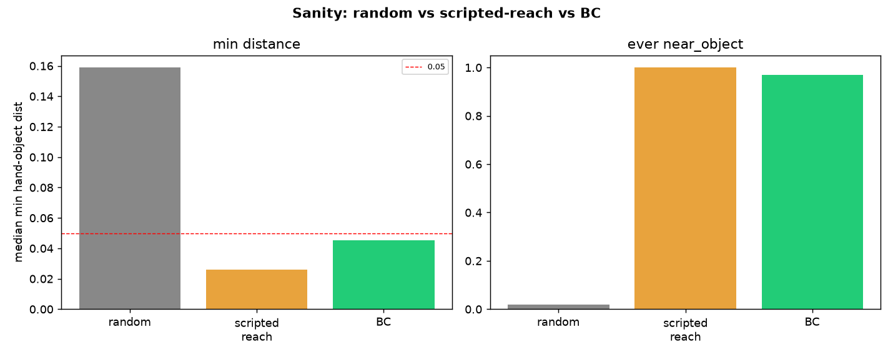

# Pick-place from-scratch — sanity/diagnostics (the 0%-vs-0% was a PPO-setup issue, not a wall)

**Date:** 2026-07-09 · Aiko · branch `hymeko-neuro-migration`
**Status:** done. **Diagnosis = B (PPO/action/obs setup).** The harness, action scaling, coordinate extraction,
and the `near` metric are all **provably correct** (scripted reach closes to 0.026, near fires 100 %; BC succeeds
0.94). The from-scratch failure is that the flat-obs PPO could not learn even the trivial **reach** reward — a
tunable setup issue (excessive exploration std), confirmed by a fix probe. **The earlier "from-scratch RL does not
learn under either reward" conclusion is REVISED.**

---

## Probes (exact)

Run on the Mac (`.venv`, torch 2.12 CPU). All geometry is measured from the verified obs layout
(hand=`obs[:3]`, object=`obs[4:7]`, goal=`obs[-3:]`); metrics from `info` (`near_object`, `grasp_success`,
`success`, component rewards). Only probe 5 trains (≤80k steps).

### 1. Zero-action rollout (reset-state sanity)

| hand-obj | obj-target | near | grasp | reward/step | in_place | grasp_r | done/trunc |
|---:|---:|---:|---:|---:|---:|---:|---|
| 0.206 (flat) | 0.237 | 0 | 0 | −1.14 | 0.151 | 0.022 | 0/0 |

Reset state sane; delta-control means zero action holds the hand still (hand-obj constant 0.206). Components
non-flat, non-NaN. ✅

### 2. Random-action rollout (100 episodes)

| min hand-obj (median / best) | within 0.20 / 0.10 / 0.05 | ever near | action mean/std/min/max |
|---:|---:|---:|---:|
| 0.159 / 0.049 | 0.96 / 0.14 / 0.01 | 0.02 | 0.001 / 0.576 / −1.0 / 1.0 |

Random exploration reaches ~0.16 typically, occasionally 0.05; almost never fires `near` (2 %). So `near ≈ 0`
under random is *expected* — reaching needs directed control, not luck. ✅

### 3. Scripted reach oracle (32 episodes) — the decisive sanity

| min hand-obj (median) | within 0.05 | **ever near** | near-fraction | grasp |
|---:|---:|---:|---:|---:|
| **0.026** | **1.00** | **1.00** | 0.92 | 0.00 |

**A minimal `action = clip(25·(obj−hand))` controller closes the hand to 0.026 and fires `near_object` on 100 % of
episodes (92 % of steps).** This proves the wrapper, action scaling, coordinate extraction, and the `near` metric
are **correct** — the hand *can* be driven to the object with the right actions. (Grasp stays 0 by design — reach
only.) ✅✅✅ → rules out category **A**.

### 4. BC-policy diagnostic (32 episodes, same metric collection)

| min hand-obj | within 0.05 | ever near | grasp | **success** | in_place |
|---:|---:|---:|---:|---:|---:|
| 0.045 | 0.69 | 0.97 | 0.75 | **0.94** | 0.76 |

The BC policy succeeds 0.94 and fires the *same* metrics used by from-scratch — so the from-scratch metric pipeline
is identical to the one that reports the successful BC runs. ✅

### 5. Reach-only PPO micro-probe (temporary reward `r = −‖hand−obj‖`)

| setup | budget | return (first→last) | min hand-obj (greedy) | ever near |
|---|---:|---:|---:|---:|
| **std=1.0 (from-scratch default)** | 40k | −46.8 → −26.8 | **0.152** (≈ random) | **0.00** |
| std=0.3 (fix probe) | 80k | −51.3 → −17.8 | **0.107** | **0.12** |
| std=0.5 (fix probe) | 80k | −55.9 → −32.0 | 0.181 | 0.12 |

At the **default** exploration std=1, PPO improves its *return* a little (−47→−27) but its greedy policy stalls at
0.152 — no better than random — and never fires `near`. **PPO cannot solve even reach at the default setting.**
Lowering the initial action std to 0.3 (+ more steps) lets it start reaching (0.107, near 0.12) — so the failure is
a **tunable setup issue** (the std=1 exploration is far too noisy for the mean to sharpen), not a fundamental
inability. → category **B**, and it is fixable.

### 6. Reward-visibility check (mean components per rollout, both specs)

| rollout | original in_place | off in_place | note |
|---|---:|---:|---|
| zero | 0.141 | 0.141 | components present, non-flat |
| random | 0.144 | 0.144 | — |
| scripted_reach | 0.138 | 0.143 | grasp-reward rises (0.02→0.40) as expected |
| **bc** | **0.791** | **0.627** | **ablation visible** — in_place differs original vs off |

Reward magnitudes are non-flat, non-NaN, not clipped away; the `mw_in_place_off` ablation is genuinely different
(the in_place component is present under original and its influence is removed under off). → rules out a
reward-wiring artifact.

## Diagnosis: B (PPO/action/obs setup)

| bucket | condition | this run |
|---|---|---|
| A harness/control/metric bug | scripted reach or BC can't activate near | **ruled out** (scripted 1.00, BC 0.97) |
| **B PPO setup issue** | scripted+BC work, but reach-only PPO can't improve | **← YES** (min_dist 0.152≈random, near 0.00) |
| C true exploration wall | reach-PPO works, full pick-place still can't grasp | not reached (reach-PPO itself fails at default) |
| D reward-ablation inconclusive | both variants 0%, neither reaches pre-grasp | superseded by B |

The confirmatory fix probe (std=0.3 → reach improves to 0.107 / near 0.12) shows B is a **tunable** setup
inadequacy — chiefly the from-scratch exploration std (=1) and the small budget — not a deep bug or a wall.

## Plots

- `sanity_random_vs_scripted_vs_bc.png` — min-distance + near across random / scripted / BC.
- `from_scratch_hand_object_distance.png` — median min hand-obj distance per controller vs the 0.2/0.1/0.05 lines.
- `from_scratch_near_fraction.png` — near activation per controller.
- `from_scratch_reward_components.png` — in_place component, original vs off, per rollout (ablation visible).

## Answers to the required questions

- **Does scripted reach activate near?** **Yes** — within-0.05 = 1.00, near = 1.00.
- **Does BC activate the same metrics?** **Yes** — success 0.94, near 0.97, grasp 0.75, on the identical pipeline.
- **Does reach-only PPO improve distance?** **No** at the default std=1 (0.152 ≈ random, near 0.00); **yes,
  partially** at std=0.3 (0.107, near 0.12) — the setting, not the task, was the blocker.

## Should the previous 0%-vs-0% conclusion be kept, weakened, or revised?

**REVISED.** The earlier from-scratch report framed 0%-vs-0% as "from-scratch RL does not learn pick-place under
either reward (inconclusive about the reward)." The diagnostics show the stronger, correcting fact: the from-scratch
PPO **could not learn even reach** at its default exploration setting, while the harness/metrics/control are all
correct. So the 0%-vs-0% measured **PPO-setup inadequacy, not the reward and not a true exploration wall** — it
cannot be used to say anything about the reward's learning role, and the "diagnostic harness is not yet strong
enough" reading (the user's) is the correct one. A valid from-scratch reward test requires first fixing the
optimizer (lower/annealed exploration std, larger budget, LR tuning — or SAC), until at least the **original**
reward learns reach→grasp; only then is ablating `mw_in_place` a meaningful learning-role test.

## Changed files

| File | Change |
| --- | --- |
| `hymeko_rl/experiments/stage_b_diag.py` | **new** — the six probes, A/B/C/D diagnosis, four plots, CLI |
| `hymeko_rl/experiments/exp_metaworld_reward_stageb.py` | `+ppo_from_scratch_std` config knob (from-scratch init exploration) |
| `hymeko_rl/experiments/stage_b_ppo.py` | from-scratch `log_std_init` uses `ppo_from_scratch_std` |
| `hymeko_rl/tests/test_metaworld_stageb.py` | +2 tests (obs parse + reach oracle; A/B/C/D diagnosis) |
| `reports/figures/2026_07_09_pick_place_from_scratch_sanity/` | diagnostics.json + 4 PNGs |

Diagnostics only — no research-scale run, no SAC, no 5-seed. CORE.YAML / `pyproject.toml` / FANUC / coin-collab
untouched.

## Next step (gated)

Make the from-scratch PPO actually learn reach→grasp (anneal exploration std, larger budget, LR/entropy tuning; or
SAC+replay). Only after the **original** reward learns from scratch does the `mw_in_place` learning-role ablation
become valid. Not run here.
