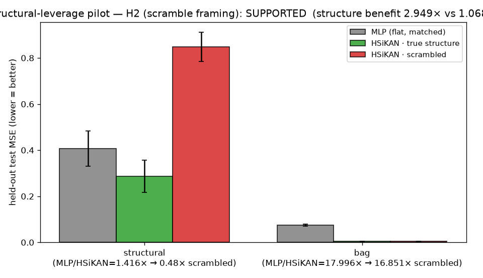

# HSiKAN structural-leverage — Stage 0 (scramble ablation) + Stage 1 (2-rung supervised pilot)

**Date:** 2026-07-10 · Aiko · branch `hymeko-neuro-migration` · CPU (Apple-Silicon, `.venv` torch 2.x CPU).
Builds the missing **H2 causal ablation** (degree/sign-preserving signed-incidence scramble) and runs a cheap
supervised pilot before any RL compute. No RL, no Gömb-Soma RL backbone, no GNN baseline, no MetaWorld folding —
per the standing instruction. Prep doc: `reports/2026-07-10-hsikan-gomb-soma-structural-leverage-hypothesis-prep.md`.

## Headline

> **H2 (causal) SUPPORTED; H1 (2-rung differentiation) SUPPORTED — via the architecture-controlled scramble
> framing.** On a structure-max supervised target, HSiKAN with the **correct** signed structure beats a
> params-matched MLP (MSE 0.287 vs 0.407); scrambling the incidence degree/sign-preservingly drives HSiKAN
> **below** the structure-blind MLP (0.847, **2.95×** worse than true), robustly across 5 independent scrambles.
> On a structure-free target the scramble has no effect (1.07×). **But the naive HSiKAN-vs-MLP framing is
> FALSIFIED and must not be used** — HSiKAN also wins the structure-*free* target 18×, so a raw "HSiKAN > MLP"
> confounds a per-node architecture bias with structure. The scramble is the instrument that separates them.

## Changed / new files

| file | LOC | what |
|---|---:|---|
| `hymeko_rl/experiments/incidence_scramble.py` | 173 | **new** — Stage 0: degree/sign-preserving signed-incidence scramble + stats |
| `hymeko_rl/experiments/exp_structural_leverage_pilot.py` | 292 | **new** — Stage 1: 2-rung pilot, decoupled data/model graph, robustness sweep, two-framing verdict, plot |
| `hymeko_rl/tests/test_incidence_scramble.py` | 119 | **new** — 11 Stage 0 tests |
| `hymeko_rl/tests/test_structural_leverage_pilot.py` | 105 | **new** — 8 Stage 1 tests |
| `reports/figures/2026_07_10_structural_leverage_pilot/{json,png}` | — | pilot result + figure |

Reuses `structural_probe.py` (`build_toy_graph`, `make_dataset`/`_standardised_split`, `build_model`,
`match_mlp_hidden`, `train_eval`) — no new trainer/model (§6.1). **CORE.YAML: none touched** (`hymeko_rl` is not
core). **New dependencies: none.**

## Stage 0 — the scramble algorithm (exactly what it does)

`scramble_signed_incidence(hg, *, seed, swaps_per_edge=20)` on a **symmetric signed graph** (the structural-probe /
undirected form; each undirected edge is stored as two arcs `(a,b),(b,a)` with equal sign):

1. Collapse the two-arc encoding to undirected signed edges `(u,v,sign)`; **reject** any non-symmetric graph
   (kinematic `from_mjcf` graphs, where a joint's arcs carry *opposite* signs, need a directed variant — deferred).
2. Split edges into the `+` and `−` classes.
3. **Signed double-edge swap** within each class: repeatedly pick two edges `(a,b),(c,d)`, rewire to `(a,d),(c,b)`
   iff no self-loop and neither target pair is already used **by any sign** — a single occupancy set is shared
   across both classes, so the result is a *simple* signed graph (no `+`/`−` parallel edge). `swaps_per_edge ×
   |class|` attempts per class. Deterministic in `seed` (`np.random.default_rng(seed)`).
4. Re-expand to arcs; new `HypergraphState` with `topo_hash` suffixed `":scramble:{seed}"`.

**Preserved (exact, verified by tests):** node count; `+`-edge count; `−`-edge count; the per-node **signed degree
sequence** (each node keeps its number of `+` and `−` incident edges — double-edge swap preserves degree); the
symmetric two-arc encoding; simple-graph (no multi/parallel edges).
**Destroyed:** *which* endpoints carry each signed relation — so the frustrated triangle, the second loop, and the
`B²x` two-hop reachability the `structural` target depends on are randomised. Easy marginals held fixed; higher-order
signed structure not.

*Bug found & fixed in my own Stage 0 (before any result):* the first implementation swapped the two sign classes
independently and produced a pair carrying **both** `+1` and `−1` (a parallel signed edge). Fixed with the shared
occupancy set; `test_result_is_a_simple_signed_graph` is the regression guard.

**Scramble stats on the pilot graph (7 vertices, 5 `+` / 3 `−` edges), seed 0:** signed degree preserved = **True**;
edges changed = 3 / 8 (**37.5%**). Across seeds 0–4 the change fraction is 25–75%; **all** preserve the signed
degree sequence exactly.

## Stage 1 — pilot settings

Fixed 7-vertex signed graph (`build_toy_graph`). Two targets on it: **Rung A `structural`** `y = Σ_v tanh(1.5·(B²x)_v)`
(structure-max; exactly HSiKAN's signed 2-hop conv) and **Rung B `bag`** `y = Σ_v tanh(1.5·x_v)` (structure-free).
HSiKAN hidden 32, MLP width binary-searched to match params, 2 layers, 256 train / 1024 test, 300 epochs, Adam 3e-3,
**3 seeds** (mean ± population std). **The H2 lever:** data `(X,y)` is always generated from the **true** graph's
`B`; the HSiKAN backbone is built on **true** or **scrambled** structure. The MLP flattens the per-node obs → it is
structure-blind → one shared baseline across conditions (`test_mlp_baseline_is_structure_blind`). Runtime ≈ 41 s.

### Parameter matching

| model | hidden | params | vs HSiKAN |
|---|---:|---:|---:|
| HSiKAN | 32 | **3713** | — |
| MLP (matched) | 56 | **3697** | −0.4% |

HSiKAN params are **identical** on the true vs scrambled graph (the adjacency is a buffer, not a weight) — asserted
in `run_pilot`, so the scramble condition is a pure structure swap at fixed capacity.

### 3-seed results (held-out test MSE, mean ± std; lower = better)

| target | MLP (matched) | HSiKAN · true | HSiKAN · scrambled |
|---|---:|---:|---:|
| **structural** (Rung A) | 0.407 ± 0.076 | **0.287 ± 0.070** | 0.847 ± 0.063 |
| **bag** (Rung B, flat) | 0.075 ± 0.005 | **0.004 ± 0.001** | 0.004 ± 0.001 |

### Gap / collapse / structure-benefit

| target | MLP/HSiKAN(true) | MLP/HSiKAN(scrambled) | **structure benefit** = HSiKAN(scr)/HSiKAN(true) |
|---|---:|---:|---:|
| structural | 1.42× | 0.48× | **2.95×** (correct structure ≫ scrambled) |
| bag (flat) | 18.0× | 16.9× | **1.07×** (structure irrelevant) |

**H2 robustness — 5 independent scrambles (structural target):** HSiKAN·true 0.287; scrambled per seed
[0.847, 0.712, 0.806, 0.751, 1.101], median **0.806** (IQR 0.096). **Every** scramble degrades HSiKAN, and **every**
scramble is worse than the MLP (0.407). The degradation is not one unlucky rewiring.

## Verdict — two framings (both reported for transparency)

- **Scramble framing (architecture-controlled, PRIMARY): `SUPPORTED`.** Same HSiKAN, only structure differs.
  Structure helps 2.95× on `structural` (≥1.5 bar), is neutral 1.07× on `bag` (≤1.25 bar), and the effect is robust
  across 5 scrambles. This isolates the causal structural effect.
- **MLP-gap framing (naive, pre-registered): `FALSIFIED`.** Failed two checks: (a) HSiKAN's true-structure win over
  the MLP is 1.42× < the pre-registered 1.5× bar; (b) the intended flat control `bag` is **not** a tie — HSiKAN wins
  it 18×. This framing is **confounded** and is reported only to be transparent about the pre-registered rule.

**Why they disagree (the methodological finding):** HSiKAN's per-node + KAN-spline + pool architecture matches a
separable per-node target (`bag`) for reasons unrelated to the graph — so a raw "HSiKAN beats MLP" mixes
*architecture-fit* with *structure*. The scramble holds architecture fixed and moves only structure, so it is the
correct instrument. This is exactly the confound the prep doc warned about (the cart-pole "win" that was a capacity
artifact) surfacing in a new form, and it is why the pilot's remit is H2, not a naive gap.

## H1 / H2 status

- **H2 (structure is causally load-bearing): SUPPORTED** on the structure-max rung — destroying the incidence
  (degree/sign-preserving) degrades HSiKAN 2.95×, below the structure-blind MLP, robustly.
- **H1 (2-rung differentiation): SUPPORTED at the 2 rungs measured** — the *structure-dependent* benefit is present
  on `structural` (2.95×) and absent on the structure-free `bag` (1.07×). The full H1 *scaling* claim (a monotone
  slope over a task ladder) needs Stage 2's ladder — not claimable from 2 rungs.

## Allowed claim (warranted, with the flat-control nuance stated)

> In a supervised structure-rich setting, the HSiKAN advantage is tied to signed incidence structure: it appears on
> the original structure and **collapses under a degree/sign-preserving scramble** (falling below a params-matched
> MLP), while the *structure-dependent* component is absent on a structure-free control.

Nuance recorded so this is not overread: on the structure-free `bag` control HSiKAN still *outperforms* the MLP, but
that component is **structure-independent** (unchanged by the scramble) — it is a per-node architecture bias, not
structural leverage.

## Explicit non-claims

- **Not** "HSiKAN generally beats MLP" — the naive gap is confounded (bag 18×); only the *scramble-isolated*
  structural component is claimed.
- **No** online-RL advantage (no RL run).
- **No** Gömb-Soma RL backbone (does not exist; not built).
- **No** superiority over GNNs (no GNN baseline wired).
- **Not** "all structure destroyed" beyond what the stats justify — node count, per-sign edge counts, and the signed
  degree sequence are **preserved**; only the higher-order incidence pattern is randomised.
- One synthetic graph, 3 seeds — a pilot point estimate, not a multi-seed ladder verdict.

## Test results

| suite | count | result | time |
|---|---:|---|---:|
| `test_incidence_scramble.py` (Stage 0) | 11 | pass | 0.45 s |
| `test_structural_leverage_pilot.py` (Stage 1) | 8 | pass | ~2 s |
| related regression (`structural_probe`, `reach_arch`) | 46 | pass | 6.8 s |

**Static analysis:** `ruff check` clean; `radon cc -nc` reports no function over threshold; `mypy` — **no errors in
the two new files** (the 8 repo-wide errors are pre-existing: mujoco stubs, `reward.py`, `arm_reach_env.py`).
**No §6.5 anti-patterns introduced** (config over Cartesian wrappers; enum-free but Literal-typed target/backbone;
no globals; discovery pass done — no existing signed scramble).

## Recommended next step — is the four-format plan bundle worth generating? **Yes, for Stage 2.**

Stage 1 delivered a clean, robust causal result *and* a methodological correction (use the scramble, not the MLP
gap). That earns the promotion. **Stage 2** (the plan bundle scope): (1) a genuine **task ladder** to test the H1
*scaling* claim — chain-length sweep (already in `structural_probe.run_chain_probe`) + a real **signed-link dataset**
rung (Bitcoin-Alpha, AUC) via `SignedGraphHSiKAN`, each with its structure-benefit under scramble; (2) an
**architecture-neutral flat control** that also neutralises the per-node bias (so the flat end reads a true ≈1×, not
18×); (3) **Gömb** on the signed-link rung; (4) 5-seed median/IQR. RL rungs and a GNN baseline remain gated behind
Stage 2's supervised confirmation.

## Provenance

Working tree: my four files are new/untracked; pre-existing `M` files in `git status` are not mine (unchanged by
this task). Seeds: training 0–2; scramble 0 (canonical) + 0–4 (robustness). Host: Apple-Silicon macOS, `.venv`
(uv, cpython-3.11), torch CPU, `torch.set_num_threads(1)`. Deterministic (seeded); numbers reproduce via
`python -m hymeko_rl.experiments.exp_structural_leverage_pilot --seeds 3`.
