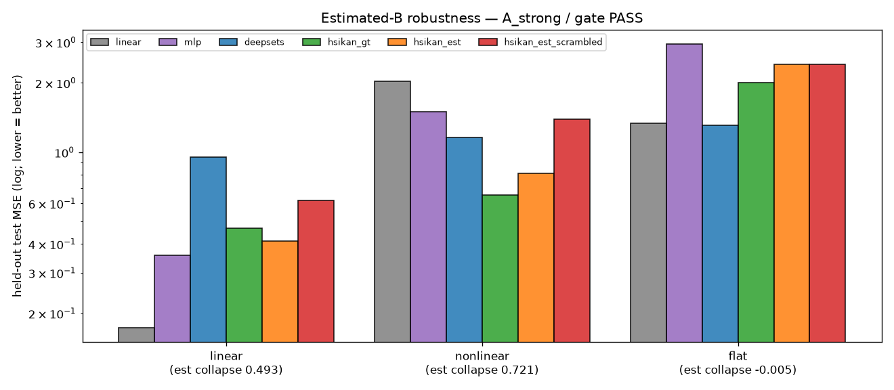

# DirectLiNGAM-estimated-B robustness — does the operator result survive a discovered operator?

**Date:** 2026-07-10 · Aiko · branch `hymeko-neuro-migration` · CPU (`.venv`, torch CPU, 1 thread) · **synthetic
only, no RL, no real MetaWorld, no kato15.** Adds an estimated-operator layer to the ground-truth-B harness: the
signed operator comes from `DirectLiNGAM.fit` instead of the oracle. Bridge and previous harness claims unchanged.
Code `hymeko_rl/eval/causal/lingam_estimated_b_robustness.py`; tests `hymeko_rl/tests/test_lingam_estimated_b_robustness.py`.

## Headline — Case A (strong); coffee-push gate PASS

> DirectLiNGAM recovers a **useful** signed operator, and the H1/H2 result survives the switch from oracle to
> discovered structure. On nonlinear SEMs, HSiKAN over the **estimated** operator (0.811) still beats MLP (1.501)
> and linear (2.033), sits only **24% above** ground-truth-HSiKAN (0.653) — far from scrambled-estimated (1.395) —
> and scrambling the *estimated* operator collapses it. On the flat control the estimated operator injects **no**
> spurious signal (collapse −0.005). Sign recovery is perfect in every condition.

## Changed / new files

| file | what |
|---|---|
| `hymeko_rl/eval/causal/lingam_estimated_b_robustness.py` | **new** — `estimate_b`, `recovery_metrics`, six-model run, verdict/plot |
| `hymeko_rl/tests/test_lingam_estimated_b_robustness.py` | **new** — 10 tests (recovery, six-model run, A/B/C/D case logic) |
| `reports/figures/2026_07_10_hsikan_lingam_estimated_b/` | JSON + PNG |

Reuses the harness end-to-end (SEM, models, scramble) and `DirectLiNGAM`. **Bridge/harness untouched. CORE.YAML:
none. New deps: none.**

## Two claims kept separate

- **A — operator usefulness** (established under oracle `B`): HSiKAN benefits from a meaningful signed operator.
- **B — causal discovery** (this test): DirectLiNGAM can recover a *useful* signed operator from data.

## Operator sources

`(A⁺,A⁻) = split(B)` (ground-truth) · `split(B̂)` where `B̂ = DirectLiNGAM.fit(X_train)` (estimated; significance +
magnitude pruning built in) · degree/sign/weight-preserving **scramble** of the estimated operator. (Optional extra
magnitude threshold on `B̂` is a flag; not needed here.) `B̂` is estimated from the **raw training split only**.

## Structural recovery of B̂ vs B (median over 3 seeds)

| condition | support prec | support rec | F1 | **sign agree** | Pearson | Spearman | top-k overlap | edges (true/hat) |
|---|---:|---:|---:|---:|---:|---:|---:|---:|
| linear | 0.974 | 1.000 | 0.987 | **1.00** | 0.938 | 0.857 | 1.000 | 40 / 42 |
| nonlinear | 0.733 | 0.892 | 0.805 | **1.00** | 0.925 | 0.829 | 0.838 | 40 / 45 |
| flat* | 0.733 | 0.892 | 0.805 | **1.00** | 0.925 | 0.829 | 0.838 | 40 / 45 |

*flat's features are the nonlinear SEM (only the target is shuffled), so its recovery equals nonlinear. On linear
data recovery is near-perfect; on nonlinear the linear estimator adds a few spurious edges and misses a few, but
**signs are perfectly recovered** and weight rank-correlation stays high.

## Model performance (median test MSE / R² over 3 seeds; params matched ~2200)

| condition | linear | MLP | DeepSets | HSiKAN·gt | **HSiKAN·est** | HSiKAN·est-scrambled |
|---|---:|---:|---:|---:|---:|---:|
| **linear** | **0.173** / 0.82 | 0.357 / 0.64 | 0.956 / 0.03 | 0.469 / 0.52 | 0.413 / 0.58 | 0.617 / 0.36 |
| **nonlinear** | 2.033 / 0.34 | 1.501 / 0.30 | 1.160 / 0.09 | **0.653 / 0.50** | **0.811 / 0.38** | 1.395 / 0.15 |
| **flat** | 1.336 | 2.957 | 1.309 | 2.000 | 2.412 | 2.400 |

## Degradation + collapse (estimated operator)

| condition | gap est vs MLP | gap est vs linear | **collapse (est → scrambled-est)** | **degradation (est vs gt)** |
|---|---:|---:|---:|---:|
| linear | −0.056 | −0.240 | +0.49 | −0.12 (est ≈ gt) |
| **nonlinear** | **+0.690** | **+1.222** | **+0.72** | **+0.24** |
| flat | +0.545 | −1.076 | **−0.005** | +0.21 |

## H1 / H2 under estimated B — the four questions

- **Q1 (linear):** DirectLiNGAM recovers `B` near-perfectly (rec 1.0, sign 1.0); the linear path stays strongest
  (0.173), estimated-HSiKAN ≈ ground-truth (0.413 vs 0.469). No fake win. ✓
- **Q2 (nonlinear):** estimated-HSiKAN (0.811) beats MLP (1.501) and linear (2.033), and is much closer to
  ground-truth (0.653) than to scrambled-estimated (1.395). ✓
- **Q3 (scramble):** scrambling the *estimated* operator collapses it (0.811 → 1.395, collapse 0.72). ✓
- **Q4 (flat):** the estimated operator fabricates no structure (collapse −0.005, HSiKAN·est 2.412 ≈ chance). ✓

**Case: A_strong.** `estimated_beats_mlp_on_nonlinear ✓ · scramble_of_estimated_collapses ✓ ·
estimated_close_to_ground_truth ✓ (24%) · no_flat_false_positive ✓`. Both claims hold: **A** (operator usefulness)
reconfirmed with a *discovered* operator; **B** (discovery quality) — DirectLiNGAM yields a useful signed operator
here (perfect signs, ~80% F1 support on nonlinear).

## Does this justify real coffee-push / kato15? — Gate PASS

The decision gate (no flat false positive · nonlinear retains HSiKAN advantage over MLP · scramble of estimated
reduces it) **passes**. Real coffee-push on kato15 is now justified as the next step: build the causal hg from CIP
monitor frames, split to `(A⁺,A⁻)`, and run the same six-model + scramble comparison. Honest caveat carried forward:
the synthetic SEM is *constructed* to be nonlinear-over-structure; whether the real MetaWorld reward is nonlinear
over its causal structure at all is the open empirical question — this result only shows that IF it is, HSiKAN will
exploit even a *discovered* operator and the scramble will catch it.

## Non-claims

- **No** real-MetaWorld validation (synthetic only).
- DirectLiNGAM is **not** claimed sufficient in general — only that on these synthetic SEMs it recovers a useful
  operator (near-perfect linear; partial-but-sign-correct nonlinear).
- **No** unqualified causal-discovery claim on nonlinear data: recovery is partial (F1 0.805, 5 spurious / 4 missed
  edges of 40), carried with that caveat; the value is the *operator for HSiKAN*, not an audited DAG.
- **No** RL advantage; no GNN comparison.

## Limitations

- Synthetic SEMs, 3 seeds, n=16 — a pilot. `B̂` estimated from 800 training rows per replicate.
- On flat, HSiKAN·est's raw gap over MLP is +0.545, but the scramble shows it is not operator-driven (collapse
  −0.005) — the scramble remains the decider, not the gap.
- Estimation uses ground-truth-generated data; real data adds observation noise, confounding, and non-stationarity
  the synthetic SEM does not model.

## Provenance

New/untracked files only; bridge + harness unchanged. Seeds: DAG/data/init 0–2; `B̂` from train split. Host:
Apple-Silicon macOS `.venv`, torch CPU. Deterministic; reproduce via
`python -m hymeko_rl.eval.causal.lingam_estimated_b_robustness --seeds 3 --n 16 --samples 800 --epochs 200`.
Tests: 10 new + 126 causal/harness green. Wall ≈ 1 min 47 s.
