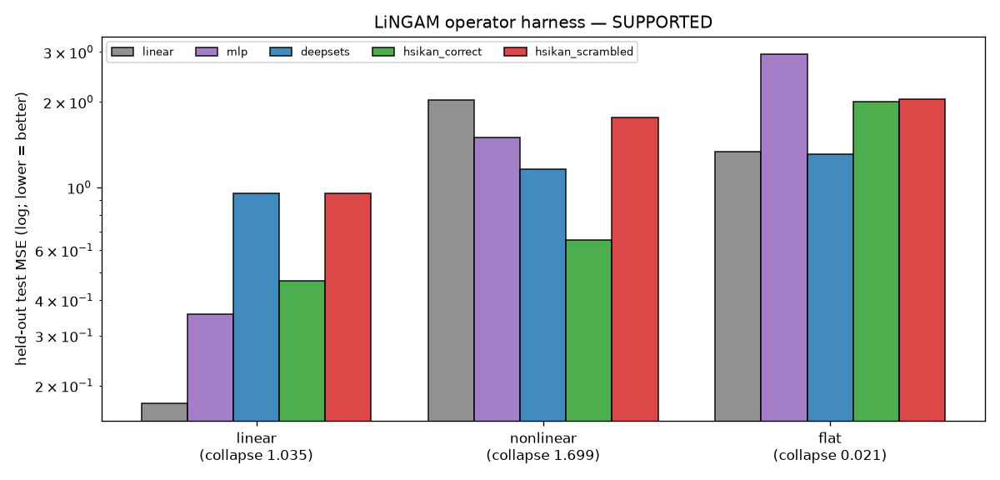

# Synthetic LiNGAM/HSiKAN operator harness — does HSiKAN use the signed operator only when it should?

**Date:** 2026-07-10 · Aiko · branch `hymeko-neuro-migration` · CPU (`.venv`, torch CPU, 1 thread) · **synthetic
only, no RL, no real MetaWorld.** Tests the falsification the operator bridge (`b55bfef`) set up: does HSiKAN benefit
from the LiNGAM-derived signed operator **only** when the data-generating process has structure-rich *nonlinear*
mechanisms (H1), and does a degree/sign/weight-preserving directed scramble of the operator **collapse** that benefit
(H2)? Code `hymeko_rl/eval/causal/lingam_operator_harness.py`; tests `hymeko_rl/tests/test_lingam_operator_harness.py`.

## Headline — H1 and H2 SUPPORTED

> On synthetic **nonlinear** SEMs with a meaningful signed causal structure, HSiKAN over the **correct** signed
> operator beats a params-matched MLP and the linear baseline, and the advantage **collapses under a
> degree/sign/weight-preserving directed scramble** of the operator. On the **linear** control the linear baseline
> wins (no fake HSiKAN win); on the **flat** control (shuffled target) the operator is irrelevant (scramble does
> nothing). The scramble — not the raw gap — is the decider.

## Changed / new files

| file | what |
|---|---|
| `hymeko_rl/eval/causal/lingam_operator_harness.py` | **new** — SEM generator, models, leakage-guarded task, run/verdict/plot |
| `hymeko_rl/tests/test_lingam_operator_harness.py` | **new** — 11 guards (the 12th is the CIP suite still passing) |
| `hymeko_rl/experiments/incidence_scramble.py` | **modified** — `scramble_signed_operator` (weight-carrying directed scramble of `(A⁺,A⁻)`) |
| `reports/figures/2026_07_10_hsikan_lingam_operator_harness/` | JSON + PNG |

Reuses the bridge (`signed_adjacency_split`), the Stage-1/2 models (`ProbeModel`, `mlp_backbone`, `DeepSetsBackbone`),
and the directed scramble. **CORE.YAML: none. New deps: none.**

## SEM definitions

Acyclic signed operator `B` (`B[effect,cause]`, **zero diagonal**, strictly lower-triangular in the causal order
`0…n-1`; controllable density + sign balance). Samples in causal order (`x_i` after its parents), non-Gaussian
(uniform) noise:

- **linear:** `x_i = Σ_j B[i,j] x_j + ε_i`.
- **nonlinear:** `x_i = Σ_j sign(B[i,j]) · g_ij(α·|B[i,j]|·x_j) + ε_i`, per-edge `g_ij ∈ {tanh, sin, signed-square,
  softsign}` fixed by seed. (Optional **multihop** = same rule; deeper order composes more hops.)
- **flat (control):** structured features `x` from the nonlinear SEM but the **target is shuffled** (`y ⊥ x`) — nothing
  can predict it, so the operator must fabricate no signal and the scramble must do nothing.

**Task:** predict the **sink** (node `n-1`, most endogenous) from the others. HSiKAN reads the **sink node's**
message-passed activation (the mechanism readout); MLP/DeepSets/linear predict the sink scalar from the same masked
input.

## Leakage guard (critical)

- The sink is **zeroed** in every model's input (`prepare`): HSiKAN/MLP/DeepSets never see the target value; the
  linear predictor drops the sink column. `B` has zero diagonal (no self-mechanism); HSiKAN's self-channel on the
  sink is `W_self·0 = 0`, so the sink's activation comes only from its parents via `(A⁺,A⁻)`.
- **Explicit leakage probe:** an MLP fed the *unmasked* sink cheats to ~0 MSE, proving masking is load-bearing —
  linear `leaky 0.0008 ≪ masked 0.266`, nonlinear `leaky 0.004 ≪ masked 1.501` (`guard_ok=True`). The guard is only
  asserted on sink-target conditions; on `flat` the sink is irrelevant so masking is vacuous (excluded).

## Model comparison (median test MSE / R² over 3 seeds; lower MSE better)

| condition | linear | MLP | DeepSets | **HSiKAN·correct** | HSiKAN·scrambled |
|---|---:|---:|---:|---:|---:|
| **linear** | **0.173** / 0.82 | 0.357 / 0.64 | 0.956 / 0.03 | 0.469 / 0.52 | 0.953 / 0.01 |
| **nonlinear** | 2.033 / 0.34 | 1.501 / 0.30 | 1.160 / 0.09 | **0.653 / 0.50** | 1.762 / 0.10 |
| **flat** (shuffled) | 1.336 / −0.03 | 2.957 / −1.04 | 1.309 / −0.01 | 2.000 / −0.54 | 2.043 / −0.45 |

### Parameter counts (matched)

| model | params |
|---|---:|
| HSiKAN (correct / scrambled) | 2209 |
| MLP (matched) | 2167 |
| DeepSets (matched) | 2206 |
| linear | 0 (closed-form) |

### Ground-truth operator vs scrambled — the decider

| condition | HSiKAN·correct | HSiKAN·scrambled | **collapse frac** | gap vs MLP | gap vs linear |
|---|---:|---:|---:|---:|---:|
| linear | 0.469 | 0.953 | 1.04 | −0.11 | −0.30 |
| **nonlinear** | **0.653** | **1.762** | **1.70** | **+0.85** | **+1.38** |
| flat | 2.000 | 2.043 | 0.02 | +0.96 | −0.66 |

(The DirectLiNGAM-**estimated**-`B` path is the optional robustness test and was **not** run — the primary
falsification uses ground-truth `B`, as specified.)

## H1 / H2 verdict — SUPPORTED (all six checks)

`linear_baseline_matches_hsikan ✓` · `hsikan_beats_mlp_on_nonlinear ✓` · `hsikan_beats_linear_on_nonlinear ✓` ·
`scramble_collapses_on_nonlinear ✓` (collapse 1.70 ≥ 0.20) · `flat_operator_irrelevant ✓` (collapse 0.02) ·
`leakage_guard_ok ✓`.

- **H1** — advantage ≈ 0 / absent on linear (linear wins) and flat (operator irrelevant); large on nonlinear-
  structured (HSiKAN 0.653 vs MLP 1.501, linear 2.033). **Supported.**
- **H2** — the directed scramble of `(A⁺,A⁻)` raises HSiKAN's nonlinear MSE 0.653 → 1.762 (below the MLP);
  collapse 1.70. **Supported.**

## Allowed claim (warranted)

> On synthetic nonlinear SEMs with meaningful signed causal structure, HSiKAN benefits from the correct signed
> operator, and the advantage collapses under degree/sign-preserving directed scramble; the same advantage is absent
> on linear or flat controls.

## Non-claims

- **Not** "HSiKAN generally beats MLP" — on `flat`, HSiKAN's raw gap over MLP is +0.96, but the scramble shows it is
  **not** operator-driven (collapse 0.02); the decider is the scramble, not the gap (the Stage-2 lesson restated).
- No online-RL advantage; no GNN comparison; no real-MetaWorld validation.
- **No causal-discovery claim** — ground-truth `B` is used; the DirectLiNGAM-estimated-`B` path is not yet run.

## Limitations

- Synthetic SEMs only; **ground-truth** `B` (the estimated-`B` robustness test is unrun). Small pilot (3 seeds,
  n=16, 800 samples, 200 epochs).
- HSiKAN uses a **sink-node readout** (not mean-pool); this is why the flat control had to be *shuffled targets*
  rather than a bag (the sink-readout makes the operator define the receptive field, so a bag target is confounded).
- On linear data HSiKAN still *uses* the operator (scramble collapse 1.04) but is beaten by the linear closed form —
  correct: linear data is optimally linear.

## Recommended next step — does this justify real coffee-push / kato15? **Yes, with one gate first.**

The method works and is falsifiable: HSiKAN's operator benefit appears only on nonlinear-over-structure and dies
under scramble. Two gated follow-ons, in order: (1) the **DirectLiNGAM-estimated-`B`** robustness test on the same
synthetic SEMs (does the advantage survive using the *discovered* operator? — required before any causal-discovery
language); (2) **real MetaWorld coffee-push** on kato15 (`metaworld` is not on this Mac) — build the causal hg from
CIP monitor frames, split to `(A⁺,A⁻)`, and run the same five-model + scramble comparison. The open empirical
question there is whether the real reward is *nonlinear over its causal structure* at all; the synthetic result says
only that IF it is, HSiKAN will exploit it and the scramble will detect it.

## Provenance

New/untracked + one modified file (`incidence_scramble.py`); pre-existing `M` files are not mine. Seeds: DAG/data/
init 0–2. Host: Apple-Silicon macOS `.venv` (uv cpython-3.11), torch CPU, `set_num_threads(1)`. Deterministic;
reproduce via `python -m hymeko_rl.eval.causal.lingam_operator_harness --seeds 3 --n 16 --samples 800 --epochs 200`.
Tests: 11 harness guards green + 116 CIP causal tests green (guard #12). Wall ≈ 1 min 15 s.
