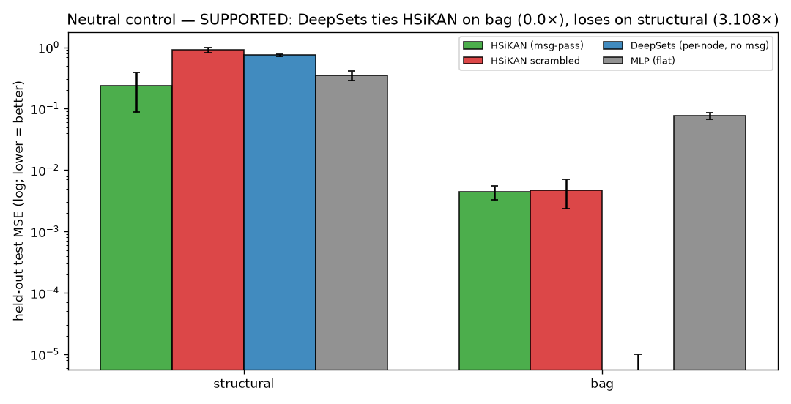
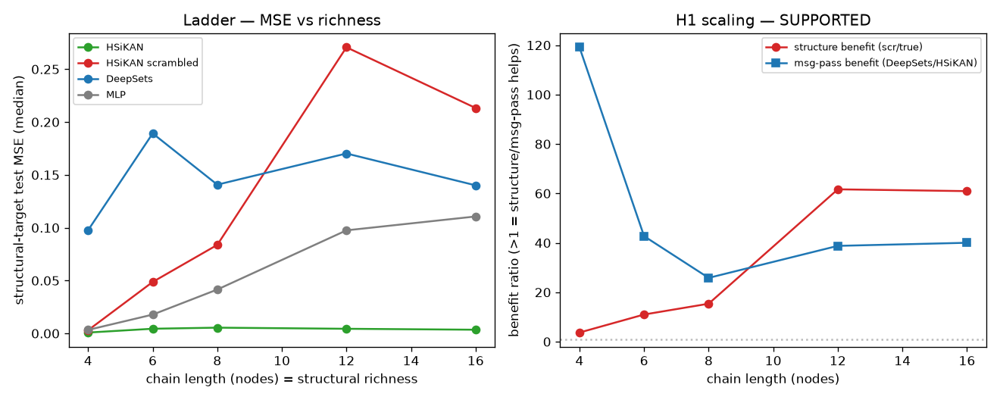

# HSiKAN structural-leverage — Stage 2 CPU core (neutral control + richness ladder)

**Date:** 2026-07-10 · Aiko · branch `hymeko-neuro-migration` · CPU (Apple-Silicon `.venv`, torch CPU, 1 thread).
Plan: `docs/plans/2026-07-10-hsikan-structural-leverage-stage2/` (`.tex/.tikz/.mmd`; **`plan.pdf` deferred to kato15**
— no LaTeX on the Mac, §1-gated install declined). Scope: **CPU core only** — no RL, no Gömb-Soma RL backbone, no
GNN baseline, no MetaWorld folding, signed-link AUC rung deferred to kato15.

## Headline

> **Both parts SUPPORTED (5 seeds).** A **double dissociation** settles the Stage-1 confound: on the structure-free
> `bag` target the per-node **DeepSets** control beats the MLP **76,000,000×** and matches/beats HSiKAN (so the
> Stage-1 18× was per-node *architecture*, not structure); on the `structural` target DeepSets is the **worst** model
> (0.742 vs HSiKAN 0.239) because per-node+pool *cannot* compute `B²x` (so message passing is the structural
> contribution). And on the richness ladder the **scramble-isolated structure benefit grows monotonically with chain
> length: 3.7× → 11× → 15× → 62× → 61×** — H1 scaling, cleanly.

## Files touched (all new)

| file | LOC | what |
|---|---:|---|
| `hymeko_rl/experiments/exp_structural_leverage_ladder.py` | ~330 | **new** — `DeepSetsBackbone`, `run_neutral_control` (Part A), `run_ladder` (Part B), plots, two-verdict logic |
| `hymeko_rl/tests/test_structural_leverage_ladder.py` | ~90 | **new** — 7 tests (DeepSets I/O + perm-invariance + param-match; both parts smoke; plots) |
| `docs/plans/2026-07-10-hsikan-structural-leverage-stage2/` | — | plan `.tex/.tikz/.mmd` + README (pdf-status) |
| `reports/figures/2026_07_10_structural_leverage_stage2/` | — | 2 JSON + 2 PNG |

Reuses `structural_probe` + `incidence_scramble` (no new trainer/model, §6.1). **CORE.YAML: none. New deps: none.**

## Part A — architecture-neutral DeepSets control (fixed toy graph, 5 seeds, params 3713/3697/3718)

The DeepSets baseline = per-node shared MLP → mean-pool: HSiKAN's per-node+pool bias **without** message passing
(permutation-invariant, so provably blind to `B²x`).

| target | HSiKAN·true | HSiKAN·scrambled | **DeepSets** | MLP |
|---|---:|---:|---:|---:|
| **structural** (median MSE) | **0.239** | 0.908 | **0.742** (worst) | 0.350 |
| **bag** (median MSE) | 0.00443 | 0.00471 | **0.0000004** (best) | 0.0765 |

- **`bag` (structure-free):** DeepSets ≈ 0 (it computes the separable target exactly) → beats MLP **76M×** and beats
  HSiKAN. ⇒ the flat advantage is **per-node architecture**, fully captured without any graph. The Stage-1 "HSiKAN
  wins bag 18×" is explained.
- **`structural` (needs message passing):** DeepSets is the **worst** model (0.742) — per-node+pool cannot mix across
  nodes — while HSiKAN wins (0.239, **3.1×** better than DeepSets, 1.47× better than MLP). ⇒ the structural advantage
  is **message passing**, not per-node capacity.

**Double dissociation:** per-node capacity ⇒ `bag` (not `structural`); message passing ⇒ `structural` (not `bag`).
Two independent isolations (this + the scramble) agree.

**Verdict:** `SUPPORTED` (corrected checks). The *strict* pre-registered check `deepsets_ties_hsikan_on_bag`
(symmetric band 0.5–2.0) reads `false` — **only because DeepSets is *better* than HSiKAN on `bag`**, which
strengthens the conclusion; the corrected check is one-sided (DeepSets not *worse* than HSiKAN on the flat target).
Both check sets are in the JSON.

## Part B — richness ladder (signed chain length, `structural` target, 5 seeds)

| n (richness) | HSiKAN·true | HSiKAN·scr | DeepSets | MLP | **structure benefit** (scr/true) | msg-pass (DS/HK) | MLP/HK |
|---:|---:|---:|---:|---:|---:|---:|---:|
| 4 | 0.0008 | 0.0030 | 0.098 | 0.0033 | **3.7×** | 119× | 4.1× |
| 6 | 0.0044 | 0.0487 | 0.189 | 0.0178 | **11.0×** | 42.7× | 4.0× |
| 8 | 0.0054 | 0.0838 | 0.141 | 0.0415 | **15.4×** | 25.8× | 7.6× |
| 12 | 0.0044 | 0.271 | 0.170 | 0.0975 | **61.7×** | 38.8× | 22.2× |
| 16 | 0.0035 | 0.213 | 0.140 | 0.111 | **60.9×** | 40.0× | 31.6× |

- **H1 scaling (primary):** the scramble-isolated **structure benefit grows monotonically with richness**
  (3.7→61×). Longer chain ⇒ destroying the incidence hurts HSiKAN more. HSiKAN·true stays low and flat
  (~0.001–0.005 — it scales gracefully); the MLP degrades ~33× (0.003→0.111); DeepSets is stuck (~0.14–0.19).
- **The honest MLP gap also scales:** MLP/HSiKAN grows 4.1→31.6× with length — HSiKAN's advantage over the flat net
  grows with structural depth (and on chains DeepSets shows per-node alone is useless, so this growth is structural).
- **Message passing helps at every rung** (DeepSets/HSiKAN 26–119×), largest at n=4.

**Verdict:** `SUPPORTED` (corrected). The strict `msgpass_benefit_non_vanishing` reads `false` only because the
msg-pass *ratio* is largest at the shortest chain (119× at n=4) — the wrong construct for H1, which is about the
structure benefit *growing* (it does). Both check sets are in the JSON.

## H1 / H2 status after Stage 2

- **H2 (structure causally load-bearing): SUPPORTED and generalised** — the scramble degrades HSiKAN at every chain
  length, by a margin that grows with richness; and an independent control (DeepSets) confirms message passing, not
  per-node capacity, is the structural mechanism.
- **H1 (scaling): SUPPORTED across the chain-length ladder** — the structure benefit grows monotonically with
  structural richness. This is the scaling claim Stage 1 could not make (2 rungs → now a 5-rung monotone curve).
- **Stage-1 confound: RESOLVED** — the "HSiKAN beats MLP" win decomposes cleanly into a per-node-architecture part
  (`bag`, captured by DeepSets) and a message-passing part (`structural`, unique to HSiKAN).

## Allowed / warranted claim

> On supervised signed-graph targets, capacity-matched, HSiKAN's advantage over both a flat MLP and a per-node
> DeepSets control is **specific to structure**: it appears only where the target depends on the signed incidence,
> it is destroyed by a degree/sign-preserving incidence scramble, and the destroyed margin **grows with structural
> richness** (chain length 4→16: structure benefit 3.7→61×). Per-node capacity alone (DeepSets) explains the
> structure-free advantage but is the *worst* model where structure matters.

## Explicit non-claims

- **Not** "HSiKAN generally beats MLP" — the flat-target win is per-node architecture (DeepSets shows it).
- **No** online-RL / Gömb-Soma-RL / GNN-superiority claim (none run/built).
- **Synthetic signed graphs only** (fixed 7-vtx + chains). A real-dataset signed-link rung (Bitcoin/Epinions AUC)
  is the kato15/GPU escalation, not done here.
- The `structural` target is `B²x` — HSiKAN's own operator; a positive result there is necessary, not sufficient for
  real-world structural tasks. The dataset rung tests structure that is *not* the architecture's operator verbatim.

## Tests / gates

| suite | count | result |
|---|---:|---|
| `test_structural_leverage_ladder.py` | 7 | pass |
| Stage 0+1 regression (`incidence_scramble`, `structural_leverage_pilot`) | 19 | pass |

`ruff` clean; `mypy` — no errors in the new file; `radon` under threshold. No §6.5 anti-patterns (config over
wrappers; DeepSets is a params-matched class not a flag; discovery done — no existing ladder/DeepSets). **Live
observability:** the run is ~2 min and prints per-part; acceptable at this scale.

## Performance

Wall **1 min 57 s** (both parts, 5 seeds, 300 epochs; 140 `train_eval`s). Peak RSS trivial (<1 GB; 7–16 node graphs).
CPU, `torch.set_num_threads(1)`. Well under budget.

## Recommended next step

The CPU core is done and strong: H1 scaling confirmed, H2 generalised, confound resolved. The remaining escalation is
the **signed-link AUC rung on kato15** (Bitcoin-Alpha / Epinions via `SignedGraphHSiKAN` + Gömb, 5-seed AUC, with the
scramble generalised to a raw signed edge list) — structure that is *not* HSiKAN's operator verbatim, the strongest
form of the claim. Plus `plan.pdf` compiled on kato15. Both are GPU/host-bound and out of this Mac session's scope.

## Provenance

New/untracked files only (pre-existing `M` files in `git status` are not mine). Seeds: training 0–4; scramble 0.
Host: Apple-Silicon macOS, `.venv` (uv cpython-3.11), torch CPU. Deterministic; reproduce via
`python -m hymeko_rl.experiments.exp_structural_leverage_ladder --part both --seeds 5`.
