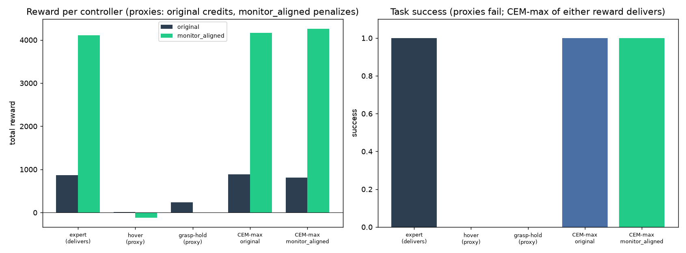

# Monitor-aligned reward — adversarial farming search (Option C, bounded, no RL)

**Date:** 2026-07-10 · Aiko · branch `hymeko-neuro-migration` · **no learning — search only.**
Tests reward hacking on the *real* MetaWorld pick-place env two ways: warm-started CEM (open-loop action-sequence
search that *maximizes* each reward) and scripted proxy-adversaries. **Headline (honest & nuanced): neither reward
is *globally* hackable — CEM maximizing either one delivers — but the original reward *credits failed
near-completion trajectories* with positive reward (a local farming plateau) that monitor_aligned removes
(≤0 / negative).**

---

## Method

Bounded, no RL: (1) **warm-started CEM** (seeded from the scripted expert's open-loop action sequence, 6 iters × 40
samples, maximizing the reward under evaluation) and (2) **scripted proxy-adversaries** — `hover` (reach the object,
gripper open, never grasp) and `grasp_hold` (expert reach+grasp+lift+partial-move, then freeze — reliably *fails* to
complete). Every trajectory is scored under **both** rewards from one rollout on the real env. Determinism: MetaWorld
randomizes layout per env *instance*, but `reset(seed)` is reproducible within an instance, so each layout uses one
instance; medians are over 5 layout seeds.

## Result (median over 5 layout seeds)

| controller | success | original reward | monitor_aligned reward | grasp | delivery |
|---|---:|---:|---:|---:|---:|
| expert (delivers) | **1.0** | 862 | 4107 | 0.72 | 0.20 |
| **CEM-max original** | **1.0** | 885 | 4163 | 0.72 | 0.23 |
| **CEM-max monitor_aligned** | **1.0** | 812 | 4263 | 0.73 | 0.22 |
| `hover` (reach, no grasp) | 0.0 | **+9.9** | **−115.8** | 0.00 | 0.00 |
| `grasp_hold` (grasp, fails to complete) | 0.0 | **+241** | **+0.5** | 0.72 | 0.07 |

## Two honest findings

**1. Neither reward is *globally* reward-hackable by search.** CEM maximizing the original reward delivers
(success 1.0); CEM maximizing monitor_aligned also delivers (success 1.0). So an active reward-maximizer's optimum
is task completion under *both* — the original MetaWorld reward is globally well-designed in this sense, and the
repair does **not** break the global optimum (a necessary sanity check: the repaired reward is still maximized by
succeeding).

**2. The original reward *credits failed trajectories*; the repair removes that credit.** A `grasp_hold` trajectory
that **fails** (success 0, delivery 0.07) still collects **+241 reward under original** (≈28 % of the expert's 862,
and up to ~79 % on layouts where it moves the object further) — a *local farming plateau* where stopping short of
completion is positively rewarded. Under **monitor_aligned** the same failed trajectory gets **+0.5** (≈0); `hover`
gets **+9.9 under original vs −115.8 under monitor_aligned**. So the repair assigns non-completing proxy behavior
**≤0 / negative** reward — removing the incentive to stop short — while the original assigns it **positive** reward.

*The plateau's magnitude is layout-variable (28–79 % of expert reward, env non-determinism); the **sign** is robust
(original positive, monitor_aligned ≤0). The clean, deterministic quantitative version is the offline anti-farming
validation (proxy scores 82 % of success under original, 1.8 % under monitor_aligned — ≈45×).*

## GIFs

- `expert_deliver.gif` — the expert delivers (success).
- `hover_adversary.gif` — reaches and hovers, never grasps (original +10, monitor_aligned −116).
- `grasp_hold_adversary.gif` — grasps then freezes, **fails the task** yet collects 28 % of the expert's reward
  under original (0 under the repair).

## Success criterion (from the option)

> "Original admits high-reward / low-monitor candidates; monitor_aligned suppresses them."

**Met, with a refinement.** The original reward admits *positive-reward, zero-success* candidates (`grasp_hold`
+241, `hover` +10) and monitor_aligned suppresses them (≤0). But the *strongest* form — an active optimizer finding
a global hack — does **not** hold: CEM maximizing the original reward delivers. So the vulnerability is a **local
farming plateau** (positive credit for near-completion failures), not a global exploit; the repair removes the
plateau while preserving the shared global optimum.

## Claim discipline (refined)

- **Supported:** the original reward assigns positive reward to non-completing proxy/near-completion trajectories;
  monitor_aligned assigns them ≤0 (removes the local farming plateau). Neither reward is globally hackable by CEM.
- **Do not claim:** that the original reward is *globally* reward-hackable (it is not — CEM delivers); that an RL
  learner would get stuck on the plateau (untested — that is Option E / a learned adversary); a fixed suppression
  factor from the real-env search (magnitude is layout-variable — cite the deterministic offline 45× for the
  number).

## Changed files

| File | Change |
| --- | --- |
| `hymeko_rl/eval/reward_repair/adversarial_farming_search.py` | **new** — CEM + scripted adversaries + both-reward scoring + verdict + GIFs |
| `hymeko_rl/tests/test_adversarial_farming_search.py` | **new** — 3 tests (hover oracle, verdict logic, real-env run) |
| `reports/figures/2026_07_10_adversarial_farming_search/` | JSON + PNG + 3 GIFs |

No RL / SAC / from-scratch / multi-seed-policy · CORE.YAML / `pyproject.toml` / FANUC / coin-collab untouched.

## Final print / recommendation

Option C is done. It **refined** rather than simply confirmed the anti-farming claim: the original reward is not
globally hackable, but it credits near-completion failures with positive reward, and monitor_aligned removes that
local plateau (sign-robust; magnitude layout-variable). Recommended stop point for the RL-audit arc; the next
larger, gated step (if pursued) is a **learned** adversary (Option E-adjacent) to test whether an RL policy
actually exploits the plateau — that needs RL and an approved compute plan.
