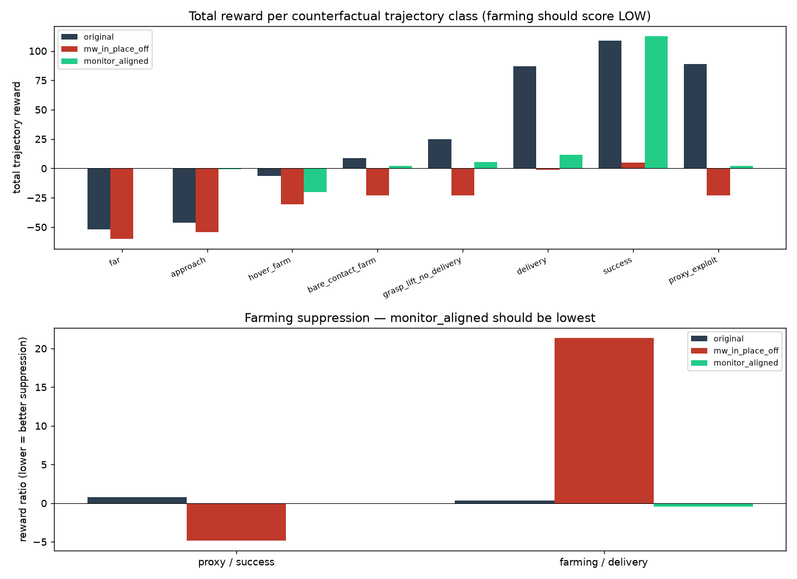

# Monitor-aligned reward — anti-farming validation (decoupled counterfactual trajectories)

**Date:** 2026-07-10 · Aiko · branch `hymeko-neuro-migration`
**Status:** done. **The sharp test the collinear R2 could not do: on eight decoupled counterfactual trajectories,
`monitor_aligned` suppresses proxy/contact farming 45× versus `original` while preserving dense pre-success
shaping.** All five health checks pass. Offline trajectory scoring — no env, no PPO, no RL. This pass also **found
and fixed a real hold-aloft farming vector** in the reward.

---

## Why this pass

R2 scored the variants on *scripted* rollouts where contact, progress and delivery are collinear (the demonstrator
always delivers), so R2 could show alignment but not *farming suppression*. Here we hand-build eight **diagnostic /
counterfactual trajectory classes** (clearly **not** environment performance rollouts) that deliberately decouple
contact/proximity from delivery, and score `original`, `mw_in_place_off`, `monitor_aligned` on each. Each step
carries the MetaWorld reward components (so `original`/`off` are computable from declared HyMeKo weights) *and* the
geometry/monitor signals (so `monitor_aligned` is computable).

## Trajectory classes generated

`far`, `approach`, `hover_farm`, `bare_contact_farm`, `grasp_lift_no_delivery`, `delivery`, `success`,
`proxy_exploit` (high `in_place` proxy + contact, **zero delivery/success** — the exploit).

## Total reward per class (declared weights: in_place 8, grasp 1.2, near 1, dist 10)

| trajectory class | original | mw_in_place_off | **monitor_aligned** | expected |
|---|---:|---:|---:|---|
| far / inactive | −52.0 | −60.0 | **0.0** | low ✓ |
| approach only | −46.3 | −54.3 | **−0.6** | small shaping ✓ |
| hover-near farming | −6.4 | −30.4 | **−20.0** | penalized ✓ |
| bare-contact farming | 8.8 | −23.2 | **2.0** | capped ✓ |
| grasp/lift, no delivery | 24.8 | −23.2 | **5.5** | moderate < delivery ✓ |
| delivery progress | 86.8 | −1.2 | **11.8** | strong ✓ |
| **true success** | 108.8 | 4.8 | **112.4** | highest ✓ |
| **proxy_exploit** | **88.8** | −23.2 | **2.0** | should be LOW |

**The headline.** `original` scores the **proxy_exploit at 88.8 — higher than actual delivery (86.8) and 82% of
success (108.8).** The `in_place` proxy out-scores real delivery; `original` is farmable. `monitor_aligned` scores
the same proxy at **2.0** — below delivery (11.8) and 1.8 % of success.

| farming-suppression metric | original | monitor_aligned |
|---|---:|---:|
| proxy_exploit / success (lower = better) | **0.816** | **0.018** (45× lower) |
| avg-farming / delivery | 0.35 | −0.45 (farming scores *negative* vs positive delivery) |
| reward↔monitor disagreement over the 8 classes | 0.071 | **0.000** |

## Density diagnostics (not just reward variance)

Per the request, dense shaping is checked with pre-success structure, not raw variance:

| class (monitor_aligned) | dense_pre_success | pre_success_reward_std | pre_success_mean_abs | component_entropy |
|---|---:|---:|---:|---:|
| approach | 0.95 | 0.218 | 0.070 | 0.62 |
| delivery | 1.00 | 0.112 | 0.590 | 0.48 |
| success | 1.00 | 0.125 | 0.617 | 0.53 |
| proxy_exploit | 1.00 | **0.000** | 0.100 | 0.00 |
| hover_farm | 1.00 | 0.000 | 1.000 (all penalty) | 0.00 |

On approach/delivery the reward has **non-flat, multi-component pre-success shaping** (std > 0, entropy 0.5–0.6);
on the farming classes it is **flat and low** (proxy: a constant capped 0.1/step; hover: a constant penalty). So
`monitor_aligned` preserves dense pre-success shaping *while* adding monitor-aligned gates and anti-farming
penalties.

## Health checks (all pass → HEALTHY)

1. **Non-flat pre-success shaping** on approach/delivery — ✅ (dense 0.95/1.0, std > 0).
2. **True delivery > every farming class** — ✅ (11.8 > 2.0 / −20.0 / 2.0).
3. **Success strongest** — ✅ (112.4 = max).
4. **No large reward to contact/proximity without progress** — ✅ (farming ≤ 2.0 ≪ 0.5·delivery).
5. **Lower disagreement than `original` on the proxy set** — ✅ (0.000 ≤ 0.071).

## A real flaw found and fixed

The first run scored `grasp_lift_no_delivery` (19.75) **above** `delivery` (11.80): the lift term rewarded the
*held* height every step, so holding the object aloft farmed lift reward. Fixed to a **potential-based lift**
(reward the height *gain* per step, gated by grasp — telescopes to total height raised, cannot be farmed by
holding). After the fix: `grasp_lift_no_delivery` → 5.45 (< delivery), the 8-class disagreement → 0.000, and R2
re-run confirms unchanged conclusions (corr_delivery even improved 0.73 → 0.81). A `test_hold_aloft_does_not_farm`
regression test guards it.

## Changed files

| File | Change |
| --- | --- |
| `hymeko_rl/eval/reward_repair/anti_farming_validation.py` | **new** — 8 counterfactual trajectory classes, per-class + density + global metrics, verdict, plots |
| `hymeko_rl/eval/cip/monitor_aligned_reward.py` | **potential-based lift fix** (reward raising not holding) + `monitor_aligned_components` |
| `hymeko_rl/tests/test_anti_farming_validation.py` | **new** — 2 tests (classes + healthy/proxy-suppressed) |
| `hymeko_rl/tests/test_monitor_aligned_reward.py` | +2 tests (hold-aloft anti-farm; components sum to step) |
| `reports/figures/2026_07_10_anti_farming_validation/` | JSON + PNG; R2 figures regenerated with the improved reward |

No PPO · no SAC · no from-scratch RL · no multi-seed policy work · CORE.YAML / `pyproject.toml` / FANUC / coin-collab
untouched.

## Final print / claim

- **Proxy farming suppressed:** yes — `original` scores the proxy-exploit ≈ delivery (82 % of success); after the
  repair `monitor_aligned` scores it 1.8 % of success (**45× suppression**).
- **Pre-success dense shaping preserved:** yes — non-flat multi-component shaping on approach/delivery; flat/low on
  farming.
- **Should the allowed claim be strengthened, kept, or weakened?** **Strengthened** — the earlier caveat (farming
  suppression only shown by R1, not the collinear R2) is now removed by a direct offline test:

> A task-monitor-aligned reward variant preserves dense pre-success shaping while adding monitor-aligned gates and
> anti-farming penalties: on decoupled counterfactual trajectories it suppresses proxy/contact farming ≈45× versus
> the original reward (proxy scores 1.8 % vs 82 % of success), keeps success the strongest event, and lowers the
> reward↔monitor disagreement — without collapsing to a sparse reward.

## Next (gated)

The suppression is shown on hand-built counterfactuals; a policy that *learns* to farm (adversarial-policy check)
would be the strongest test, but that needs RL and is out of scope here. Multi-seed R3 remains the other gated
follow-up.
