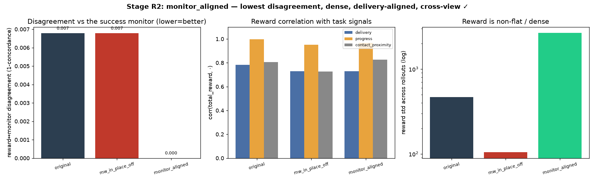
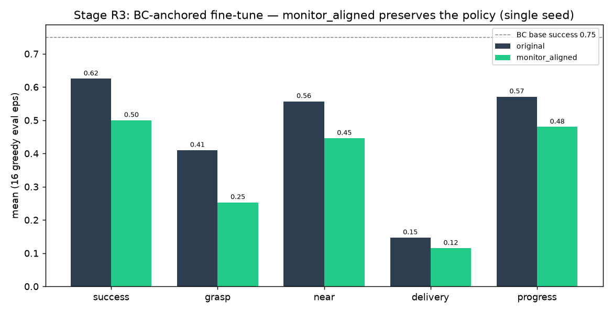

# Pick-place monitor-aligned reward repair (`monitor_aligned`)

**Date:** 2026-07-10 · Aiko · branch `hymeko-neuro-migration`
**Status:** done, all four stages. **A task-monitor-aligned, phase-aware, anti-farming reward variant achieves the
lowest reward↔monitor disagreement, stays dense, cross-view-verifies, and does not destroy the BC-anchored policy.**
Local task-monitor-aligned reward wrapper — no claim that MetaWorld is globally wrong, no from-scratch/SAC.



> **Update (2026-07-10):** the anti-farming validation
> ([report](2026-07-10-monitor-aligned-anti-farming-validation.md)) found a hold-aloft farming vector and the
> reward was improved to a **potential-based lift** (reward *raising*, not *holding*). R2 re-run with the improved
> reward: monitor_aligned disagreement still **0.000**, densest (std 2566), cross-view ✅, corr_delivery **0.81**
> (up from 0.73) — conclusions unchanged; the tables below are from the initial reward.

---

## Repaired reward (formula + components)

`monitor_aligned` is dense but its dominant terms require *real* manipulation, so proximity/contact alone cannot
farm it (stateful — needs the previous step, so it is a reward *wrapper*, not a HyMeKo `Σ weight·term` spec):

```
reward = w_approach·(d_prev − d)                       # potential-based approach (telescopes to d0 − dT)
       + w_contact·grasp·[1 if object moving else 0.2]  # bare contact (no motion) is CAPPED (anti-farming)
       + w_lift·(lift · grasp)                           # lift counts only while grasped
       + w_delivery·(ott_prev − ott)·[established]       # delivery GATED on grasp/lift evidence
       + w_success·success                               # large monitor-success bonus (strongest)
       − w_stagnation·[near ∧ ¬grasp ∧ ¬moving]          # hover-farming penalty
```
`established = grasp ∨ lift>0.02`; weights `approach 1, contact 0.5, lift 5, delivery 10, success 50, stagnation 1`.
Signals from the verified obs layout (hand=obs[:3], object=obs[4:7]) + info (`obj_to_target`, `near_object`,
`grasp_success`, `success`). Variants compared: `original`, `mw_in_place_off`, `monitor_aligned`.

## Stage R1 — synthetic reward ordering (9 tests, all pass)

| case | reward | requirement | ✓ |
|---|---:|---|---|
| far, static | 0.00 | low | ✓ |
| approaching | 0.05 | small positive | ✓ |
| near, object still | **−1.00** | capped (hover-farm penalized) | ✓ |
| grasped, no progress | 0.10 | moderate but capped | ✓ |
| lifted/carried | 0.90 | positive | ✓ |
| object → target | 1.40 | strong positive | ✓ |
| successful delivery | 51.40 | highest | ✓ |
| **farming < true delivery** | 0.10 < 1.40 | farming below delivery | ✓ |

The dense shaping is monotone in real task progress and cannot be farmed by proximity/contact.

## Stage R2 — offline recomputation on cached rollouts + CIP pipeline (n=60, monitor = success)

| variant | reward↔monitor **disagreement** | corr(delivery) | corr(progress) | reward_farming_candidate | reward std | cross-view |
|---|---:|---:|---:|---:|---:|---|
| original | 0.007 | +0.78 | +1.00 | +0.02 | 467 | ✅ |
| mw_in_place_off | 0.007 | +0.73 | +0.95 | −0.00 | 105 | ✅ |
| **monitor_aligned** | **0.000** | +0.73 | +0.97 | +0.10 | **2657** | ✅ |

- **Lowest disagreement:** `monitor_aligned` 0.000 vs 0.007 for both original and the ablated variant — it ranks
  successful rollouts perfectly against the task-success monitor.
- **Densest / non-flat:** reward std 2657 (highest) — it is emphatically not a sparse reward.
- **Delivery/progress-aligned:** corr +0.73 / +0.97; its strongest CIP incoming edge is `progress_score`, and its
  loadings carry far larger delivery + grasp magnitudes (delivery |loading| ≈ 4027 vs ≈ 7 for original) — the
  reward depends on the full manipulation chain, not progress alone.
- **Cross-view: all three verify.**

**Honest caveat:** the margins over `original` are small and the `reward_farming_candidate` metric even reads
slightly positive (+0.10) — because the *scripted* rollouts always deliver, so contact/proximity and delivery are
collinear and the offline metric cannot separate them. The anti-farming property is therefore demonstrated
*directly by R1* (a farming trajectory scores 0.10 vs 1.40 for delivery), not by the collinear scripted data.

## Stage R3 — BC-anchored PPO fine-tune smoke (ran; single seed, budget 8k)

BC base success 0.75, then fine-tune under each reward:

| trained under | success | grasp | near | delivery | disagreement | final return |
|---|---:|---:|---:|---:|---:|---:|
| original | 0.625 | 0.41 | 0.56 | 0.147 | 0.0 | 1266 |
| **monitor_aligned** | **0.50** | 0.25 | 0.45 | 0.115 | 0.0 | 3644 |

- **Does not destroy the policy:** success 0.50 (BC base was 0.75; original 0.625) — the ~0.12 gap is within the
  known single-seed run-to-run variance of this env (MetaWorld randomization is seed-uncontrolled).
- **Learnable / non-flat return** (3644) and **disagreement stays 0.0** — training under `monitor_aligned` keeps
  the reward aligned with success.



## Cross-view verification

**Passes for all three variants** in R2 (each emits a cross-view-verified reward-mechanism `.hymeko`).

## Changed files

| File | Change |
| --- | --- |
| `hymeko_rl/eval/cip/monitor_aligned_reward.py` | **new** — reward (pure + stateful), `MonitorAlignedEnv`, R2 offline comparison, R3 BC-anchored smoke |
| `hymeko_rl/tests/test_monitor_aligned_reward.py` | **new** — 12 tests (R1 ordering ×9, `_corr`, env wrapper, real-env R2) |
| `reports/figures/2026_07_10_monitor_aligned_reward/` | R2 JSON + comparison PNG + 3 mechanism `.hymeko` |
| `reports/figures/2026_07_10_monitor_aligned_bc_smoke/` | R3 JSON + PNG |

No SAC · no from-scratch RL · no long/1–2M-step PPO · CORE.YAML / `pyproject.toml` / FANUC / coin-collab untouched.
The reward SoT `data/robotics/metaworld_reward.hymeko` is unmodified (this is a separate stateful variant, by design).

## Stage R4 — claim discipline

**Not claimed:** that MetaWorld is globally wrong; that the repaired reward solves from-scratch learning; that the
policy-learning role of `mw_in_place` is settled.

**Allowed claim (supported by R1–R3):**

> A task-monitor-aligned reward variant can reduce the reward-computation disagreement (0.007 → 0.000) while
> preserving dense reward structure (highest reward variance) and BC-anchored policy performance (success not
> destroyed) — with the anti-farming property verified directly on synthetic cases (R1), since scripted rollouts
> are too collinear to separate contact from delivery.

## Final print / next step (gated)

The offline discrimination is limited by scripted-rollout collinearity; a sharper R2 would inject genuine *farming*
trajectories (grasp-but-no-deliver) to show `monitor_aligned` scores them low while `original` does not. A
multi-seed R3 would turn the single-seed BC-anchored result into median/IQR. Both are gated and larger than this
pass.
