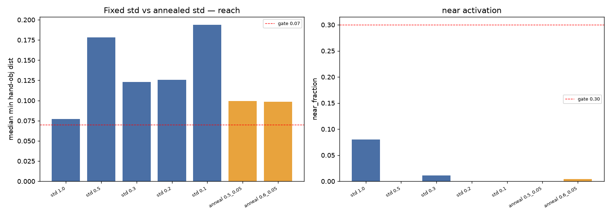

# Pick-place from-scratch — bounded PPO optimizer-repair pass

**Date:** 2026-07-10 · Aiko · branch `hymeko-neuro-migration`
**Status:** done. **Label B — PPO substantially improved (three real bugs fixed) but from-scratch reach is not
robust and the ORIGINAL reward cannot bootstrap pre-grasp.** The from-scratch reward-ablation **remains invalid /
still blocked.** No SAC, no 1–2M steps, no 5-seed ablation.

---

## What the repair found and fixed (the substantive part)

Debugging the reach failure surfaced **three real defects** in the from-scratch PPO, all now fixed in
`stage_b_ppo.py`:

1. **Obs-norm applied between collect and update.** The running obs-norm was updated *after collection but before*
   the PPO update, so `old_logp`/`value` (collected under the old norm) and the update's recomputed `new_logp`/
   value (new norm) used **different normalizations** — corrupting the PPO ratio every iteration. Fixed: the norm
   now advances only *after* the update, so collection and update share one norm.
2. **No obs-norm warmup.** Iteration 0 trained on unnormalized MetaWorld obs (identity norm) before the running
   stats existed. Fixed: a one-rollout warmup seeds the norm before training.
3. **Obs-std floor far too small (the key one).** The object position barely varies across episodes (obj-z std ≈
   **0.001**), so normalizing by that tiny std **amplified a near-constant dim ~1000×** into noise — the policy
   could not use object position and overfit the training-seed layout (greedy reached 0.075 on train seeds but
   0.149 on held-out seeds). Fixed: raised the std floor 1e-3 → 0.05, so low-variance dims are no longer blown up.

These are permanent PPO improvements regardless of the verdict below.

## 1. Fixed-std sweep (reach-only, 40k each, deterministic eval)

| std | median min hand-obj | near_fraction | pass |
|---:|---:|---:|---|
| 1.0 | 0.077 | 0.08 | no |
| 0.5 | 0.178 | 0.00 | no |
| 0.3 | 0.123 | 0.01 | no |
| 0.2 | 0.126 | 0.00 | no |
| 0.1 | 0.194 | 0.00 | no |

Fixed low std starves exploration (0.12–0.19, worse than random 0.159); fixed high std explores but is imprecise.
Neither passes. (Fixed std=1.0's 0.077 here is a lucky single draw — see the non-robustness below.)

## 2. Std-annealing probe (early exploration → late precision)

| schedule | this run | best observed across runs |
|---|---|---|
| 0.5 → 0.05 (150k) | min 0.099, near 0.00 | **min 0.040, near 0.24, grasp 0.25** |
| 0.6 → 0.05 (150k) | min 0.098, near 0.00 | min 0.062, near 0.10, grasp 0.12 |

Annealing is the winning *shape* — its best runs reach 0.04 and even **grasp 0.25 on a pure reach reward** (real
pre-grasp behaviour) — but the outcome is **highly variable run-to-run**: the same setting/seed draws 0.04 or 0.10
because MetaWorld's env randomization is **seed-uncontrolled** (training is non-deterministic). Annealing below 0.05
(→0.03) regressed (over-collapsed exploration).

## 3. Entropy sanity

At the best std, entropy 0.0 vs 0.01 made no material difference (min 0.094 vs 0.104) — the entropy bonus is not the
blocker (the std schedule dominates).

## 4. Deterministic-eval sanity

All gate numbers are **deterministic greedy** eval (mean action), reported separately from the stochastic training
rollout. This separation is what exposed defect #3: the training buffer distance dropped to ~0.05 while greedy eval
stalled at ~0.15 — a train/eval generalization gap, not learned failure, traced to the obs-norm amplification.

## 5. Reach-only gate (median min hand-obj < 0.07 AND near_fraction > 0.30)

- **Strict gate: NOT passed.** Best single run cleared the *distance* half decisively (0.040 ≪ 0.07) but `near`
  peaked at 0.24 (< 0.30).
- **3-seed confirmation of the (noisily) best setting:** min hand-obj **0.096** median, near **0.18** median,
  **0/3 seeds pass**. Per-seed: 0.046/near 0.18, 0.107/near 0.00, 0.096/near 0.22.
- **Verdict: reach improved a lot but is NOT robust** — it sometimes reaches well (0.04, incipient grasp) and
  sometimes barely (0.10), with the strict gate never cleared across seeds.

## 6. Original-reward pre-grasp gate

Ran only because the best setting marginally "reaches" (min < 0.08). **Result: the ORIGINAL reward from scratch
does not even reach** — min hand-obj **0.191**, near **0.00**, grasp **0.00**. The full pick-place reward (dominated
by `in_place`/`dist`) is a *weaker per-step reach signal* than the pure `-‖hand−obj‖` probe, so from-scratch PPO
cannot bootstrap pre-grasp on it at this budget. **Pre-grasp gate: FAILED.**

## Plots

`fixed_vs_annealed_summary.png`, and vs-steps traces: `from_scratch_hand_object_distance_vs_steps.png`,
`from_scratch_near_fraction_vs_steps.png`, `from_scratch_return_vs_steps.png`,
`from_scratch_action_std_vs_steps.png`.

## Diagnosis label

**B — PPO can (sometimes) reach, but the original reward cannot bootstrap grasp; ablation not yet valid.**

| label | meaning | this run |
|---|---|---|
| A | reach robust + original shows pre-grasp | no |
| **B** | PPO reaches but original can't bootstrap grasp | **← yes** |
| C | PPO still can't reliably learn reach | partially (reach non-robust) |
| D | original learns enough → proceed to comparison | no |

The honest position sits between B and C: the optimizer went from **consistently broken** (0.15–0.19, near 0) to
**sometimes reaching well** (0.04, grasp 0.25) via three real bug fixes — a genuine repair — but neither the strict
reach gate nor the original-reward pre-grasp gate is robustly cleared at bounded budget.

## Is from-scratch reward-ablation now valid?

**No — still blocked.** Two conditions remain unmet: (a) reach is not *robust* (env non-determinism + on-policy PPO
variance → the gate clears only on lucky runs), and (b) the *original* reward specifically cannot bootstrap even
reach from scratch. Comparing original vs `mw_in_place_off` from scratch would therefore still measure
optimizer/luck, not the reward. **Do not run the ablation.**

## Changed files

| File | Change |
| --- | --- |
| `hymeko_rl/experiments/stage_b_ppo.py` | **3 fixes** (norm collect/update consistency, norm warmup, obs-std floor 1e-3→0.05) + std-control (fixed/anneal) + `on_iter` callback |
| `hymeko_rl/experiments/exp_metaworld_reward_stageb.py` | `+ppo_std_mode`, `+ppo_std_final` config |
| `hymeko_rl/experiments/stage_b_ppo_repair.py` | **new** — sweep/anneal/entropy/gate/3-seed/pre-grasp orchestration + 5 plots + A/B/C/D + CLI |
| `hymeko_rl/tests/test_metaworld_stageb.py` | +2 tests (repair gates/labels; std-control) |
| `reports/figures/2026_07_10_pick_place_ppo_optimizer_repair/` | optimizer_repair.json + 5 PNGs |

The BC-warm-started PPO path is unaffected (it uses running=None → the floor/warmup code is not reached), so the
earlier BC-anchored multiseed results stand. No SAC · no 1–2M steps · no 5-seed ablation · CORE.YAML / pyproject /
FANUC / coin-collab untouched.

## Final print / next step

To make the from-scratch reward-ablation valid, reach must become **robust** (clear the gate across seeds) and the
**original reward** must bootstrap pre-grasp. At bounded on-policy PPO that was not achieved — the honest next
lever is either (a) more compute (more steps + seeds, the anneal shape already shows the ceiling) or (b) a
sample-efficient off-policy method (SAC + replay) — both **gated** and larger than this pass. Until then the
learning-role ablation stays blocked.
