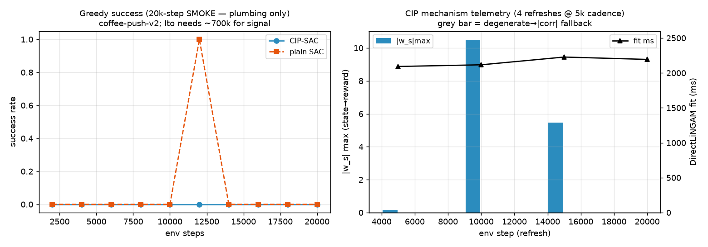

# CIP baseline (Cao/Ito) on the HyMeKo substrate — Phase 1

**Aiko · 2026-07-17 15:13 JST · branch `feat/locomotion-aibo-sac-cip`**

Direction **A** of the CIP-continuation arc: *get the baseline*. Stand up the actual **in-the-loop** CIP
mechanism (Cao et al., ICLR 2025; foregrounded by Ito, Sakuma, Gu, Kato, katolab — `1571304140 paper.pdf`) on
the HyMeKo substrate, so that Directions B/C/D (LLM correction, SignedHyperLiNGAM estimator, monitor-gated dynamic
correction) have a faithful baseline to A/B against. This report is **Phase 1**: the mechanism, its tests, and one
watched production-scale smoke. The reproduced *curve* (8 seeds × ~1M steps) is **Phase 2**, a gated kato15 job.

## What CIP is (verified against both papers)

Base **SAC**. Every ~10k env steps, **DirectLiNGAM** is fit over replay `(s,a,r)` to estimate the reward's causal
parents — state-to-reward `w_s ∈ ℝ^{39}` and action-to-reward `w_r ∈ ℝ^{4}`. After softmax + rescale-by-dims, the
lowest-importance ("uncontrollable") state dim is **swapped between transition pairs** (in `s` and `s'`, keeping
`a,r`) to synthesise extra replay data (Cao's *CDS*). Ito's CIP+LLM adds an LLM correction of `w_r,w_s` before the
softmax — **that is Direction B, out of scope here.**

**Terminology correction (recorded).** The katolab/Cao "CIP" (in-loop CDS augmentation) is *not* the repo's prior
"CIP" (the offline `eval/cip` + `eval/causal` diagnostic where DirectLiNGAM proposes and ablations decide). This
work builds the former, reusing the latter's `DirectLiNGAM`.

**Fidelity note (honest, not a silent omission).** Cao's full CIP also carries an *empowerment* reward term
(reweighting actions by `w_r` in a mutual-information objective). Ito's 2-page description foregrounds the
DirectLiNGAM+CDS core, which is what this reproduces (`cip-cds`). The empowerment term is a **documented deferred
component**; the baseline claim is scoped to the CDS core Ito describes.

## Files touched

| File | LOC | Change |
|---|---|---|
| `hymeko_rl/train/sac.py` | +24 | **additive** `ReplayAugmentor` Protocol + optional `augmentor` param on `train_sac` + one call site. Default `None` ⇒ byte-identical (regression-tested). |
| `hymeko_rl/eval/cip/cip_augment.py` | 229 (new) | `CipReplayAugmentor` + pure helpers `softmax_rescale` / `estimate_cip_weights` / `counterfactual_swap` / `CipAugmentConfig` / `CipWeights`. |
| `hymeko_rl/experiments/exp_metaworld_cip_baseline.py` | 146 (new) | native-reward coffee-push/dial-turn SAC runner, plain-vs-CIP via the seat. Reuses `_ObsNorm`, `_sac_success_eval`, `build_sac`, `train_sac`. |
| `hymeko_rl/experiments/exp_metaworld_sac.py` | +15 | `_sac_success_eval` gains an optional **dedicated `eval_env`** (bug fix — see below). |
| `hymeko_rl/eval/cip/metaworld_generic_cip.py` | +2 | added `coffee-push`/`dial-turn` → V3 scripted policy to the `GENERIC_TASKS` registry (the Ito tasks were missing). |
| `hymeko_rl/tests/test_cip_augment.py` | 255 (new) | 11 tests (unit + integration + perf). |
| `reports/figures/2026-07-17-cip-baseline/` | — | smoke figure + two summary JSONs. |

**CORE.YAML touched: none.** No pinned dependency added (`metaworld`/`mujoco`/`gymnasium` are not in the pinned
list and already import in the Mac venv; `torch==2.12.0`/`numpy`/`scipy` already present).

## Bug found by the smoke (the §3 gate earning its keep)

The first smoke crashed at the first eval boundary:
`ValueError: You must reset the env manually once truncate==True`. Root cause (isolated by a minimal repro, not
guessed): `_sac_success_eval` evaluates on the **shared training env** and its last episode leaves the env
truncated at the 500-step horizon, so `train_sac`'s next `env.step` violates MetaWorld v3's manual-reset contract.
The main training loop's own reset-after-truncation is fine (repro confirmed). Fix: `_sac_success_eval` now accepts
an optional **dedicated `eval_env`** (additive; `None` = legacy shared-env behaviour, fine for cart-pole); the CIP
runner passes a fresh one so eval never perturbs training. This latent bug also affects `exp_metaworld_sac.py`'s
gated SAC path if it is ever run on MetaWorld — noted, not fixed here (out of scope).

## Test results (`pytest -p no:randomly`)

**11 passed in 20.5 s.** Layers:
- **Unit** — `softmax_rescale` (sums to d, uniform→ones); `estimate_cip_weights` recovers a synthetic SEM's reward
  parents + picks the irrelevant dim as the swap target; `counterfactual_swap` touches *only* the target dim (in
  `s` and `s'`), preserves `a,r,done`, permutes the column; **constant/zero-padding column** does not crash the fit
  and is marked uncontrollable (failure case); augmentor cadence (no-op off-cadence, fires on it), cold-buffer
  no-op, non-flat-obs rejection, bounded growth (≤ `sample_n`/refresh).
- **Seam regression** — `train_sac` with a no-op augmentor gives a **byte-identical** curve to `augmentor=None`,
  and the seat is called once per env step (proves wired + harmless).
- **Integration** — end-to-end CIP-SAC on a toy 39-d flat env: augmentor fires ≥1, buffer grows, no NaN.
- **Performance** — DirectLiNGAM fit at CIP scale (d=44, n=1500): **median ≈ 2.46 s/fit** (5 iters), budget < 10 s.
  ⇒ ~100 fits over 1M steps ≈ **≤ 4 min** LiNGAM overhead. Under budget.

Static analysis: **ruff clean**; **mypy --strict clean on the changed files** (pre-existing errors in imported
`ddpg.py`/`env/*` are not introduced here).

## Production-scale smoke (Mac, watched) — plumbing PASS

`coffee-push-v2`, 1 seed, 20 k steps, `refresh_every=5000`, both arms. **Not a skill claim** — Ito's CIP only
shows signal at ~600–700 k steps, so 20 k is far too short (matches the Stage-B "smoke proves plumbing, not skill"
doctrine). What the smoke *verified*, live:

| refresh | step | swap dim | `|w_s|`max | `|w_r|`max | degenerate | fit ms |
|---|---|---|---|---|---|---|
| #1 | 5000 | 0 | 0.162 | 0 | no | 2093 |
| #2 | 10000 | 0 | **10.5** | 0.066 | no | 2117 |
| #3 | 15000 | 0 | 5.46 | 0 | no | 2228 |
| #4 | 20000 | 11 | 0 | 0 | **yes → `|corr|` fallback** | 2194 |

- CIP fires on cadence (4 refreshes), extracts `w_s/w_r`, augments (+1500/refresh, 6000 total).
- `|w_s|max` grows as the buffer accumulates real structure (0.16 → 10.5) — the estimate is *not* static; and at
  step 20 k the reward row came back all-zero (reward ordered without parents), exercising the **degenerate
  `|corr|` fallback** (picked dim 11, no crash).
- `|w_r|max ≈ 0` throughout: DirectLiNGAM found essentially no action→reward edge on early replay. This is raw-CIP
  behaviour — precisely the spurious/implausible estimate Ito's LLM correction targets (Direction B). Faithful.
- SAC losses **finite** post-update (crit 1.2–16, act −28…−41, auto-α annealing) — **no divergence** under the
  default `AUTO` α on this task.
- Both arms complete; success curves ~0 (plain had one lucky greedy 1.0 eval — noise, not a ranking).

**Performance vs budget:** wall **218 s** for both 20 k-step arms incl. obs-norm + 8 LiNGAM fits (budget: <60 min);
peak **RSS 551 MB** (budget <4 GB, cap 16 GB); fit 2.1–2.2 s (budget <10 s). All within budget.

## Honest scope / what is NOT claimed

- **No baseline curve yet.** 20 k steps ≠ Ito's 1 M. No CIP-vs-plain ranking is claimed from the smoke (both ~0).
- **No skill.** From-scratch SAC does not solve coffee-push in 20 k steps; expected.
- **`cip-cds` only** — the empowerment reward term is deferred (see fidelity note).
- **Single seed, Mac CPU.** The curve needs multi-seed on GPU.

## Phase 2 (gated — kato15 RTX 6000)

The reproduced baseline = `{plain, cip} × {coffee-push, dial-turn} × 8 seeds × ~1M steps`, entry point
`python -m hymeko_rl.experiments.exp_metaworld_cip_baseline --task coffee-push --cip --steps 1000000 --seed <s>
--device cuda`. Gated on: (1) this Phase-1 smoke passing (done); (2) a kato15 budget/wall check — extrapolated
~1 h/seed physics+SAC + ≤4 min LiNGAM ⇒ reconcile against a 1-seed kato15 smoke before the 8-seed fan-out (§11
2× rule). MetaWorld is kato15-only for training scale; the Mac is the mechanism/CI runner. **Not launched.**
Add the §9 GIF (the trained policy acting) in Phase 2, where there is a learned policy to render.

## Provenance

Git `a2d28da` (working tree dirty — this change). Env: Python 3.11 `.venv`, torch 2.12.0 (MPS avail, ran CPU),
metaworld 3.0.0 / mujoco 3.10.0 / gymnasium 1.3.0, scipy 1.17.1, numpy 2. macOS Apple-Silicon. Seed 0. Smoke
artifacts: `reports/figures/2026-07-17-cip-baseline/{cip,plain}_coffee-push_seed0.json`, `cip_baseline_smoke.png`.
Plan bundle: `docs/plans/2026-07-17-cip-baseline-metaworld/plan.{tex,pdf,tikz,mmd}`.

## §6.5 anti-pattern sweep
No new trainer (reused `train_sac`); no Cartesian variants (one Protocol seat, cadence in the strategy); algorithm
logic in `eval/`, not behind a binding boundary; ~146-line config-style runner; no globals (RNG/config threaded);
discovery pass done before creating files; no `_v2` files; extended the `GENERIC_TASKS` registry rather than
duplicating a task map. **No anti-patterns introduced; no waivers.**
