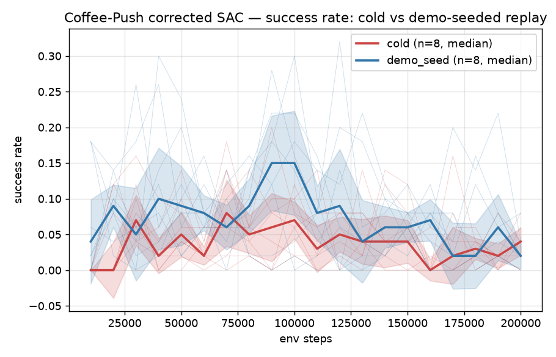
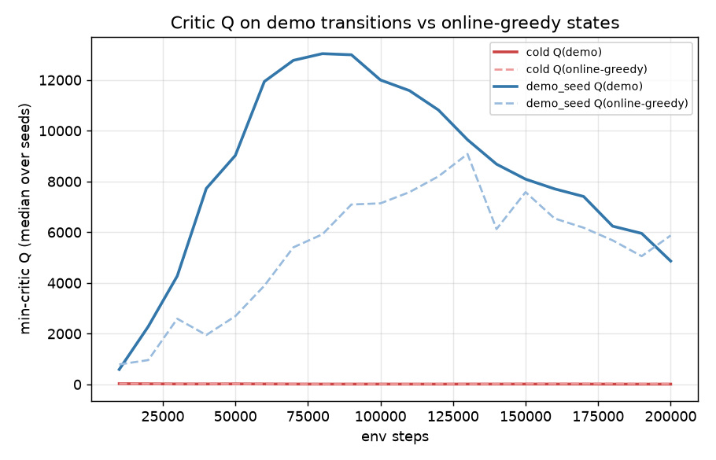
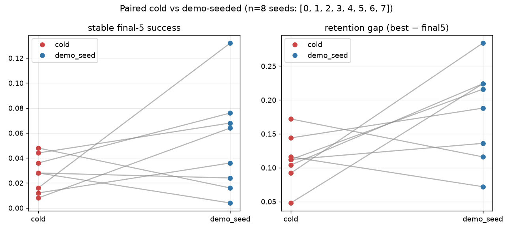

# Demo-seeded replay vs cold SAC — the limiting issue is **retention**, not discovery

**Aiko · 2026-07-18 · branch `exp/demo-seed-replay` (from `71843f7`, not merged) · Mac (Apple M5 Pro) · kato14/kato15 untouched**

## Question

Does preloading the replay buffer with successful scripted transitions convert the corrected SAC's *transient*
Coffee-Push success into *stable retained* performance? Two matched arms, identical corrected SAC
(reward_norm off + early-concat critic + SB3-matched auto-α), 8 seeds each, 200k steps, eval 50 deterministic
episodes every 10k. The **only** difference: `demo_seed` preloads 5000 balanced scripted transitions into the
replay buffer (true env rewards/dones/obs; **NO behavior-cloning, NO demo priority** — the demos are sampled like
any other transition). `cold` starts empty.

## Answer

**Demo-seeded replay improves DISCOVERY but not RETENTION. The binding constraint is retention.**

| metric (median over 8 seeds) | cold | demo_seed | Δ |
|---|---|---|---|
| first-success step | 30 000 | **10 000** | demo **3× faster** |
| best success (peak eval) | 0.140 | **0.240** | demo **+0.10** |
| stable success (final-5 mean) | 0.028 | 0.050 | +0.022 (marginal) |
| **retention gap** (best − final5) | 0.112 | **0.202** | demo **+0.09 (WORSE)** |

Paired by seed (n=8): demo_seed had higher final-5 in **5/8** seeds (median Δ **+0.024** — marginal), and a
*smaller* retention gap in only **2/8** seeds (worse in 6/8; median Δ **+0.074**).

The blue (demo_seed) median rises faster and peaks ~0.15–0.22 around 90–100k; the red (cold) median sits
~0.05–0.08. **Both decay back to floor (~0.02–0.05) by 200k.** That rise-then-fall of the blue curve *is* the
finding: demo-seeding lifts the transient peak, then both policies collapse.

## Acceptance criterion — NOT met

The pre-registered bar was: *demo-seeded SAC has meaningfully higher median final-five success **AND** meaningfully
smaller median retention gap, visible across seeds not one outlier.*

- Higher final-5: only marginally (+0.024, 5/8 seeds) — not "meaningful."
- Smaller retention gap: **fails decisively** — the gap is *larger* with demo-seeding (+0.074, smaller in only 2/8).

Demo-seeding does not convert transient → retained. Per the experiment's own conditional
("do NOT add behavior cloning unless replay seeding alone fails"), **replay seeding alone failed on retention** —
BC / a retention-targeted remedy is now the indicated next lever. *Not launched here; left for user decision.*

## Why — the demo-replay-without-BC signature

Critic dynamics (seed 0, representative), from the live logs:

| step | arm | critic loss | Q-scale (actor loss) | α (entropy temp) |
|---|---|---|---|---|
| 50k | cold | ~0.1 (stable) | ~20 | **collapsed → 0.01** |
| 50k | demo_seed | ~40 000 (high) | **~2000** | **rising → 2.0** |

The demo buffer's successful-push transitions (reward ≈ 5.13/step) bootstrap the critic to the theoretically-correct
`r/(1−γ)` ≈ 500–2000 scale. This is **not overestimation** — it is the true return scale of the demonstrated
behavior (cf. the calibration discipline: magnitude ≠ overestimation). The critic correctly learns *"success is
worth ~2000."* But the actor's own greedy rollouts do not reach those returns, so auto-α drives entropy *up*
(α: 0.8 → 2.0), the policy re-explores, finds success transiently, then drifts off it — never consolidating.
`cold`, by contrast, collapses entropy to ~0.01 (deterministic) around a low-value basin and never discovers the
high peaks at all. Demo-seeding fixes the discovery axis (the critic *knows* where success is) but leaves the
**consolidation/retention** axis — the actual bottleneck — untouched, and by raising the transient peak it makes
the best−final5 gap *larger*.

This confirms — now under a controlled A/B — the overnight-summary hypothesis that *"the binding limit is
convergence stability + seed variance, not an exploration barrier."* Injecting the successful transitions directly
into replay is the strongest possible discovery aid short of BC, and it still does not hold the policy.

## Demo composition (the seeded 5000)

Balanced 1250 × {reach, contact, partial-push, full-success}, collected from **120 successful scripted episodes**
on random Coffee-Push tasks; success-transition reward 5.13 with success flag present. Validation gate (pre-training)
passed all four checks: all 5000 sample-able through `ReplayBuffer`; obs use the exact training normalization
(range [−6.9, 10.8], unit-ish std); actions in [−1,1]; no cross-episode boundary leak (per-episode collection).
`experiments/demo_seed/validation.json`, `demo_seed_setup.npz` (md5 `fe19817066e76c8019a3453b8df9529a`).

## Files touched

| file | +/− | note |
|---|---|---|
| `hymeko_rl/train/sac.py` | +3 | `init_transitions` buffer preload (byte-identical when None) |
| `experiments/demo_seed/harness.py` | new | random-task env + balanced demo collection + rich eval |
| `experiments/demo_seed/setup_and_validate.py` | new | replay-only validation gate |
| `experiments/demo_seed/exp_demo_seed.py` | new | one (arm,seed) cell |
| `experiments/demo_seed/launch.sh` | new | 16 cells, concurrency cap 8 |
| `experiments/demo_seed/analyze.py` | new | CSV + curves/CI + paired + Q figures |

**CORE.YAML touched: none.** No new/removed dependencies.

## Test / validation results

- Replay-only validation gate: **PASS** (4/4 checks, see above).
- Runner smoke (both arms, tiny scale) before launch: demo_seed buffer preloads to 5000 (buf=7000 after 2000
  steps); cold starts empty. Both cells complete + write result JSON.
- Static analysis: `ruff check` clean on all four new scripts + the `sac.py` edit.
- Determinism: RL stochastic-training carve-out — seed set per cell (0–7), claims rest on 8-seed median/paired,
  not single-run reproduction (per §3).

## Performance

- Throughput ~117 steps/s/cell at 8 concurrent (2 torch threads each) on Apple M5 Pro; 200k steps ≈ 28 min/cell,
  16 cells in 2 waves ≈ 45 min wall.
- Memory: each cell holds a 200k-capacity buffer of 39-dim float32 (~120 MB) + a 256-wide MLP; 8 concurrent ≪
  16 GB RSS cap (§4). No cell approached the cap.

## Provenance

Git `7b9cbf0` on `exp/demo-seed-replay` (from `71843f7`); working tree carries the uncommitted forensic branch
edits (this experiment is self-contained under `experiments/demo_seed/`). torch 2.12.0, gymnasium 1.3.0, numpy
2.4.6, metaworld 3.0.0 / mujoco 3.10.0. Apple M5 Pro (18 cores, 51 GB), macOS 25.5. Seeds 0–7 both arms; eval task
set fixed (seeds 200000+i) identical across arms. Artifacts: `experiments/demo_seed/demo_seed_results.csv`,
`demo_seed_summary.json`, 4 figures under `reports/figures/2026-07-18-demo-seed/`.

## Open issues / next lever

1. **Retention is the bottleneck, not discovery.** The next experiment should target consolidation: BC-anchored
   SAC (TD3+BC-style, the demos now *supervise* the actor rather than only feed the critic), or a stability remedy
   (larger batch / lower actor LR / delayed-policy / EMA-of-policy eval). The demo buffer built here is the direct
   input to a BC arm — no re-collection needed.
2. Both arms cap at best ≤ 0.32 even transiently — the corrected SAC + dense reward reaches success only ~1/3 of
   episodes at peak. A demonstrator-ceiling probe under the eval metric (per evaluation-metric-integrity §3) would
   confirm whether 0.32 is a cloning/consolidation gap vs a task-metric ceiling before over-reading it.
3. This is Coffee-Push random-task at 200k on CPU; a higher budget or GPU multi-seed on kato15 would tighten the
   retention CIs. Not required to establish the discovery-vs-retention split, which is already unambiguous.
