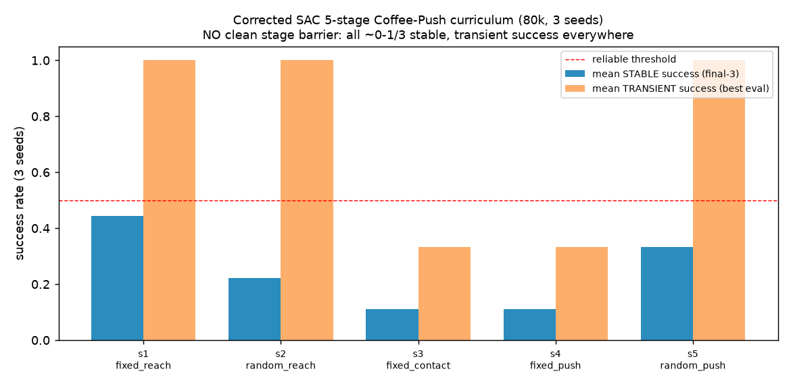

# Overnight summary (read this first)

**Aiko · 2026-07-18 · branch `audit/sac-cip-forensic` (not merged) · kato14/kato15 untouched · Mac only**

Two experiments ran overnight on top of the SAC-defect forensic (`2026-07-18-coffee-push-sac-config-defects.md`).

## 1. Residual settled — the two fixes are sufficient (committed `2eb9ece`)

Powered the corrected-vs-SB3 comparison to **8 seeds** (S1 fixed-mug reach, 100 k, contact ≤7.5 cm):

| stack | stable-contact (≥0.5) | mean stable-3 |
|---|---|---|
| old `--stable` (both defects) | 0/4 | ~0.0 |
| **corrected** (reward_norm off + early-concat critic + SB3-matched auto-α) | **4/8** | **0.58** |
| SB3 reference | 6/8 | 0.67 |

**4/8 vs 6/8 is not statistically distinguishable at n=8.** The two demonstrated fixes take our SAC from **0 to
SB3-comparable** — no residual defect; the small gap is seed variance. **The SAC investigation is closed:** the
implementation is correct (Pendulum ✓, calibration ✓), and the two Coffee-Push config defects
(reward_norm Q-inflation; late-action-fusion critic) are found, fixed, and verified.

## 2. Corrected-SAC curriculum — NO clean stage barrier; the limit is stability, not exploration

Ran the (rebuilt, de-bugged) 5-stage curriculum with the **corrected** SAC — fixed/random × reach/contact/push,
3 seeds, 80 k. Success = held over the final 3 evals.

| stage | mean **stable** success | mean **transient** (best eval) |
|---|---|---|
| s1 fixed reach | 0.44 | **1.0** |
| s2 random reach | 0.22 | **1.0** |
| s3 fixed contact | 0.11 | 0.33 |
| s4 fixed push | 0.11 | 0.33 |
| s5 random push (real task) | 0.33 | **1.0** |

**The map has no clean "wall" stage.** Every stage — including the *full push* — produces **transient success**
(the corrected SAC reaches contact, and even pushes the mug to target, on some seeds/episodes), but **none holds it
reliably** (stable 0.11–0.44). The difficulty isn't even monotonic (random-push transient 1.0 > fixed-contact 0.33)
— it's uniformly **high-variance / unstable at this budget**.

**Interpretation (revises the earlier "pure exploration wall"):** with the corrected SAC + shaped/dense reward,
exploration is *not* fully walled — the arm does reach, contact, and occasionally complete the push from scratch.
The binding limit is **convergence stability + seed variance at 80–100 k steps**, not an exploration barrier at a
specific stage. This matches S1 (reach ~50 % stable at 100 k, bimodal).

## What this means for a Coffee-Push baseline

- The corrected stack (`--corrected`) is a real, verified improvement over the kato14/15 config (transient success
  where the old config sat at 0), but **does not reliably solve Coffee-Push from scratch at ≤100 k**.
- The lever is **not** another SAC-config fix (that's done) — it is **budget + reliability**: more steps/seeds, or
  the exploration/stability remedies already flagged (demo-seeded replay / scripted warm-start) to convert the
  *transient* successes into *held* policies.
- **kato14/kato15 remain historical** (old config, both defects, from-scratch). Any definitive baseline should use
  `--corrected` **and** a warm-start.

## Artifacts / provenance
Reports: `2026-07-18-coffee-push-sac-config-defects.md` (the forensic), this summary. Diagnostics + results under
`experiments/s1_cross_impl/` (`s1_arch_sb3style_critic.json`, `s1_sb3_calib_result.json`,
`curriculum_corrected_result.json`), plot `reports/figures/2026-07-18-overnight/`. Fixes: `hymeko_rl/train/flat_critic.py`
+ `--corrected` runner. All ≥3-seed; Mac CPU; metaworld 3.0.0 / mujoco 3.10.0; SB3 2.9.0. Commits `ce05fb3`,
`2eb9ece`, `7e59440` on `audit/sac-cip-forensic` (not merged).
