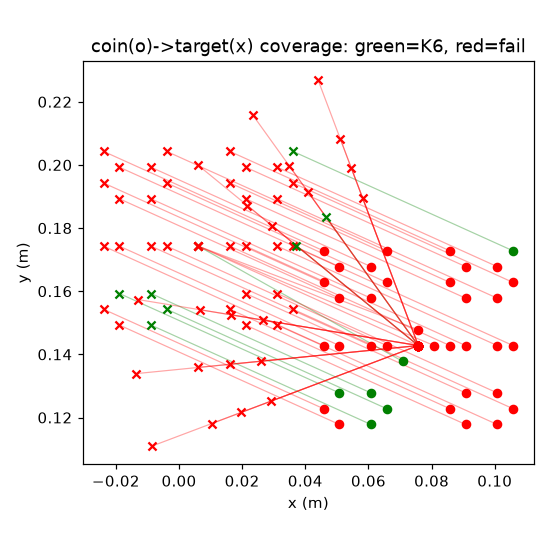
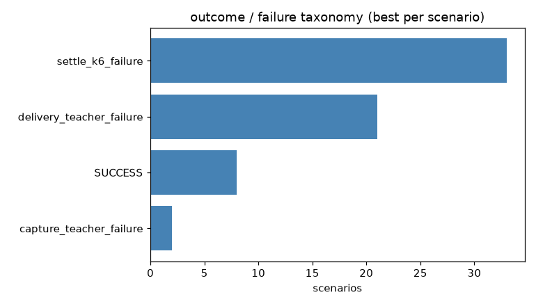
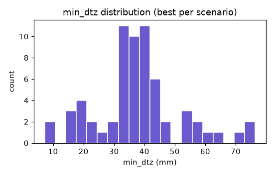
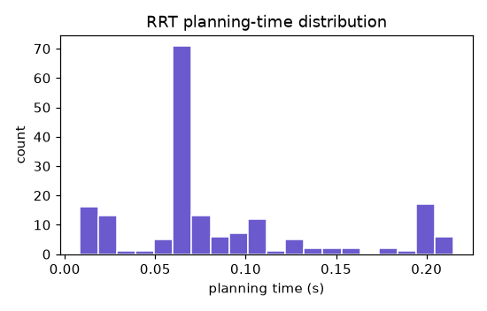
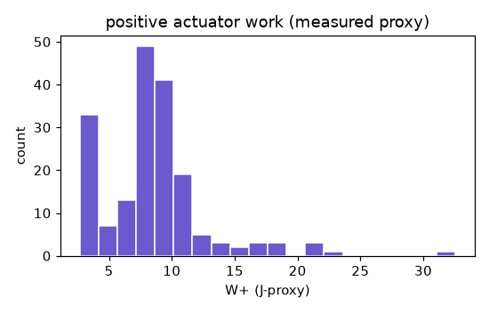

<!-- R11.3 acceptance narrative — prepend to the auto-generated coverage report after the bank completes. -->

# R11.3 — verified coin/target demonstration pipeline + bounded teacher bank

**2026-07-30 · branch `feature/r11-3-coin-target-demo-bank` · parent `fb5b43a2` (R11.2) · generation-only (no BC/RL/refinement) · no CORE.YAML items · no new dependencies (matplotlib already present)**

## Summary

R11.3 builds and validates a **certificate-gated coin/target demonstration-generation pipeline** on top of the R11.2 HyMeKo IR, then generates a **bounded teacher bank**. The pipeline runs, per scenario:
`EXACT_ZERO_HOME → InitialConditionCertificate → InitialDistribution admissibility → deployed RRT-Connect reach → certified precontact handoff → per-instance CEM capture/delivery teacher → strict K6 / classified failure → ModeTrace → MeasuredEnergyLedger → EnergyTransitionCertificates → RolloutProvenance → serialized demonstration record`.

**RRT is the deployed geometric planner; the CEM capture/delivery solver is a training teacher only, recorded as such in every rollout's provenance (`teacher_identity`). No rollout is labelled teacher-free.** Generation only — no BC/RL/policy-assimilation/Hamiltonian-shaping.

## The pilot (Phase 7) — PASS

The 12-admissible + 2-invalid pilot passed **all 14 Phase-7 gates**: exact-zero certificate on every rollout; invalid starts rejected before planning; disjoint train/dev/test IDs; accepted reaches ≤ 1 mm precontact coin motion (measured **0.0 mm**); zero premature contacts; complete mode traces; complete handoff descriptors; complete measured energy ledgers with recorded residuals; every teacher call visible in provenance; successful K6 linked to its provenance hash; serialization round-trip preserved; **replay reproduced the scenario and outcome class**; no teacher-free mislabelling.

**Verdict: `R11_3_COIN_TARGET_DEMONSTRATION_PIPELINE_PASS`.**

Pilot coverage: **2/12 strict-K6** (`c1_diag`, `c3_cw45`), 10 classified failures (8 `delivery_teacher_failure`, 2 `settle_k6_failure`), 2 invalid rejected. **All reaches landed inside the teacher handoff manifold** (`handoff_admissible=True`, 0 `precontact_handoff_invalid`) with the coin engaging the delivery — the failures are the frozen R2 downstream (tuned for the canonical zone) not delivering to *relocated/shifted* zones. This precisely quantifies the R11.5 delivery-generalization gap; it is **not** an RRT failure and **not** yet an RL failure.

## What was built

- **`hymeko_rl/coin_delivery/demo_bank/`** (6 modules): `scenario` (C0–C3 curriculum + bank grids, geometric-cell splits), `failure_class` (14-class taxonomy + stage-ordered classifier), `record` (versioned schema + deterministic content hash + replay), `store` (JSONL bank + success/rejection accounting), `pipeline` (the MuJoCo↔IR generation pipeline), `__init__`.
- **Experiments**: `r11_3_demo_pilot` (gated pilot + 14 gates), `r11_3_bank_generate` (bounded 64×≤3-seed bank), `r11_3_coverage` (coverage report + figures).
- **14-class taxonomy** (never one generic label): `INVALID_INITIAL_CONDITION`, `GOAL_SET_EMPTY`, `RRT_PLANNING_FAILURE`, `RRT_EXECUTION_FAILURE`, `PREMATURE_COIN_MOTION`, `PREMATURE_CONTACT`, `PRECONTACT_HANDOFF_INVALID`, `CAPTURE_TEACHER_FAILURE`, `DELIVERY_TEACHER_FAILURE`, `TARGET_ENTRY_OVERSHOOT`, `SETTLE_K6_FAILURE`, `SAFETY_FAILURE`, `PROVENANCE_FAILURE`, `ENERGY_LEDGER_INCOMPLETE`. The handoff-admissibility (geometric READY predicate) + coin-progress (`entry_dtz − min_dtz`) signals split `PRECONTACT_HANDOFF_INVALID` (reach outside the teacher manifold) from `CAPTURE`/`DELIVERY_TEACHER_FAILURE` (an admissible handoff the teacher failed).

## Two real bugs caught during bring-up (honest)

1. **v1 classifier mislabelled K6 successes.** `contacts` was checked before `k6`, but `contacts` is the *terminal* count and a successful delivery releases the coin (terminal contacts=0). Fixed: `k6` (with the safety gate) is checked before the capture/delivery classes — a 25 mm-off straddle that *did* deliver is SUCCESS, not a capture failure.
2. **Non-deterministic content hash broke replay.** `planning_time_s` (wall-clock) was inside the record's `content_hash`, so a deterministic re-run hashed differently and the replay gate failed. Fixed: timing fields are excluded from the reproducible content hash (`NON_DETERMINISTIC_FIELDS`); a test pins the invariance.

Both fixes touch only read-time/gate logic, not generation.

## Tests & static gates

- **`ruff check` clean · `radon cc -a -nc` no C+ block · `mypy --strict` clean** on the pure demo_bank modules (`scenario`/`failure_class`/`record`/`store`); `pipeline` is the sole MuJoCo↔IR boundary (untyped-dep, like `ir_adapter`).
- **Fast tests: 23 pass** (scenario disjointness, 14-class taxonomy incl. the handoff/capture/delivery split + stage order, record round-trip + hash + timing-invariance, bank denominator/rejection separation, deterministic IDs, curriculum mapping, taxonomy completeness, no teacher-free labels, 64-scenario bank generator).
- **Slow physics tests: 3 pass** (invalid rejected before planning; canonical end-to-end + deterministic replay).

## Energy — claims and non-claims

Measured only: `ENERGY_LEDGER_COMPLETE`, `ENERGY_BALANCE_RESIDUAL_RECORDED`. **No** Hamiltonian-optimality claim, **no** energy-conservation claim (that is R11.8), **no** teacher-free-deployment claim.

---
<!-- The auto-generated coverage analysis (bank headline, stage coverage, failure taxonomy, distributions, figures) follows. -->
# R11.3 coin/target demonstration bank — coverage analysis

**Bank:** `2026-07-30-r11-3-coin-target-demo-bank/bank.jsonl` · generation-only (no BC/RL) · CEM = training teacher.

## Headline
- Admissible scenarios: **64**; teacher attempts: **183**; rejected: **0** ({}).
- Strict-K6 demonstrations: **8/64** (rate **0.125**).
- Precontact coin motion (max): **9.36 mm**; premature contacts: **0**; energy-ledger complete: **1.0**.

## Coverage by curriculum stage
| stage | scenarios | K6 | K6 rate |
|---|---|---|---|
| C0 | 4 | 1 | 0.25 |
| C1 | 16 | 2 | 0.125 |
| C2 | 20 | 3 | 0.15 |
| C3 | 24 | 2 | 0.083 |

## Failure taxonomy (best per scenario)

- `capture_teacher_failure`: 2
- `delivery_teacher_failure`: 21
- `settle_k6_failure`: 33

## Distributions
- min_dtz (mm): {'n': 64, 'min': 7.22, 'median': 36.995, 'max': 76.44}
- planning time (s): {'n': 183, 'min': 0.008, 'median': 0.066, 'max': 0.215}
- W+ (measured proxy): {'n': 183, 'min': 2.663, 'median': 8.487, 'max': 32.569}

## Splits
- {'train': 45, 'dev': 10, 'test': 9}

## Scenarios without a positive demonstration (56)
bank_c0_0, bank_c0_1, bank_c0_2, bank_c1_+0.01_+0.00, bank_c1_+0.01_+0.02, bank_c1_+0.01_+0.03, bank_c1_+0.01_-0.02, bank_c1_+0.03_+0.00, bank_c1_+0.03_+0.02, bank_c1_+0.03_-0.02, bank_c1_-0.01_+0.00, bank_c1_-0.01_+0.02, bank_c1_-0.01_+0.03, bank_c1_-0.03_+0.00, bank_c1_-0.03_+0.02, bank_c1_-0.03_+0.03, bank_c1_-0.03_-0.02, bank_c2_+0.015_+0.000, bank_c2_+0.015_+0.015, bank_c2_+0.015_+0.025, bank_c2_+0.015_-0.015, bank_c2_+0.015_-0.025, bank_c2_+0.025_+0.000, bank_c2_+0.025_+0.015, bank_c2_+0.025_+0.025, bank_c2_+0.025_-0.015, bank_c2_+0.025_-0.025, bank_c2_-0.015_+0.000, bank_c2_-0.015_+0.015, bank_c2_-0.015_+0.025, bank_c2_-0.025_+0.000, bank_c2_-0.025_+0.015, bank_c2_-0.025_+0.025, bank_c2_-0.025_-0.025, bank_c3_r5_a+15, bank_c3_r5_a+30, bank_c3_r5_a+45, bank_c3_r5_a-45, bank_c3_r6_a+15, bank_c3_r6_a+30, bank_c3_r6_a+45, bank_c3_r6_a-15, bank_c3_r6_a-30, bank_c3_r6_a-45, bank_c3_r7_a+15, bank_c3_r7_a+30, bank_c3_r7_a+45, bank_c3_r7_a-15, bank_c3_r7_a-30, bank_c3_r7_a-45, bank_c3_r9_a+15, bank_c3_r9_a+30, bank_c3_r9_a+45, bank_c3_r9_a-15, bank_c3_r9_a-30, bank_c3_r9_a-45

## Visualizations

## Claims / non-claims
- Energy claims: ['ENERGY_LEDGER_COMPLETE', 'ENERGY_BALANCE_RESIDUAL_RECORDED']
- Non-claims: ['NO_HAMILTONIAN_OPTIMALITY_CLAIM', 'NO_ENERGY_CONSERVATION_CLAIM', 'NO_TEACHER_FREE_DEPLOYMENT_CLAIM']
